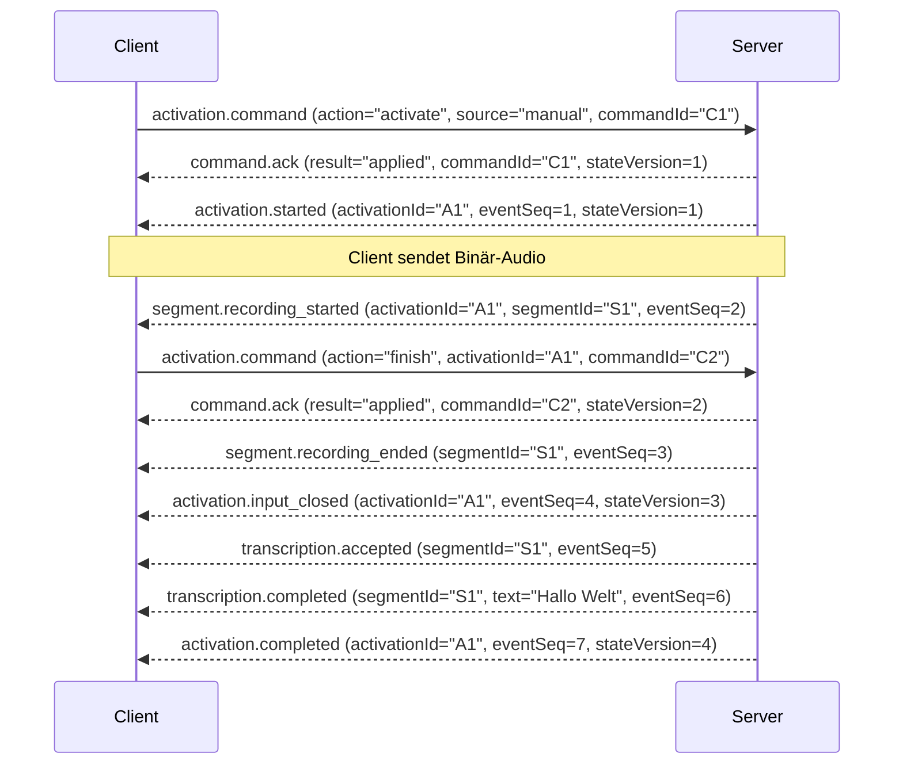
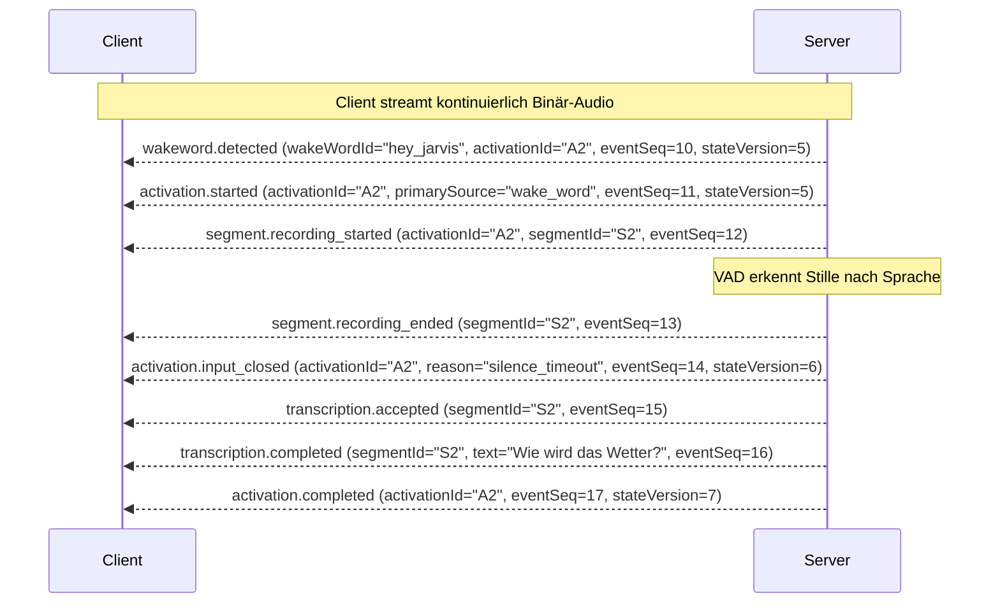
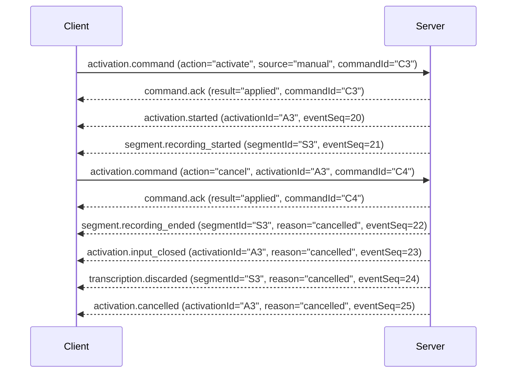

# VoiceSTT V2 Desktop Client Technical Contract Reference

**Document Version:** 1.0.0
**Geprüfte Basis:** `feat/einheitliche-triggerarchitektur-distributed`
**Geprüfter Baseline-SHA:** `f7d2b3ccd07757172a45b371829b04bcedffab4b`
**Tree-SHA:** `731c22d872ab3a3897886bcd6bec582e8332be75`
**Status:** Rekonstruierte Wahrheit (Code-, Schema-, Vector- und Test-basiert)

---

## Inhaltsverzeichnis

1. [Verbindung und Handshake](#1-verbindung-und-handshake)
2. [Identitäts- und ID-Matrix](#2-identitäts--und-id-matrix)
3. [Client -> Server Commands](#3-client---server-commands)
4. [Command Acknowledgements (`command.ack`)](#4-command-acknowledgements-commandack)
5. [Server -> Client Domain Events](#5-server---client-domain-events)
6. [Event Envelope, Ordering & Deduplizierung](#6-event-envelope-ordering--deduplizierung)
7. [Zustandsmodell (Input & Activation)](#7-zustandsmodell-input--activation)
8. [Session Snapshot & Resynchronisierung](#8-session-snapshot--resynchronisierung)
9. [Audio-Pfad und Framing](#9-audio-pfad-und-framing)
10. [Transkriptionslebenszyklus](#10-transkriptionslebenszyklus)
11. [Settings Control Plane](#11-settings-control-plane)
12. [Triggervertrag](#12-triggervertrag)
13. [Wake-Word-Vertrag & Admission](#13-wake-word-vertrag--admission)
14. [HTTP Ergänzungs-APIs](#14-http-ergänzungs-apis)
15. [Authentifizierung & Sicherheit](#15-authentifizierung--sicherheit)
16. [Reconnect, Recovery & Resync](#16-reconnect-recovery--resync)
17. [Fehler- und Close-Code-Referenz](#17-fehler--und-close-code-referenz)
18. [Implementierungsregeln für einen robusten Client](#18-implementierungsregeln-für-einen-robusten-client)
19. [Golden Examples (JSON Schemas)](#19-golden-examples-json-schemas)
20. [Kompakte Nachschlagetabellen](#20-kompakte-nachschlagetabellen)
21. [V2 Client Compliance Checklist](#21-v2-client-compliance-checklist)

---

## 1. Verbindung und Handshake

### 1.1 Verbindung & Endpoint
* **URL/Pfad:** `/ws/v2` (z. B. `ws://127.0.0.1:8000/ws/v2` oder `wss://stt.voice.domain.com/ws/v2`)
* **Transport:** WebSocket over HTTP/1.1 oder HTTP/2 (TLS empfohlen).
* **Handshake Timeout:** 10.0 Sekunden (`DEFAULT_HANDSHAKE_TIMEOUT_SECONDS = 10.0`). Bis zum Empfang einer gültigen `hello`-Nachricht darf die Verbindung silent bleiben. Nach Ablauf schließt der Server die TCP/WS-Verbindung mit Close-Code `4408` (`CLOSE_HANDSHAKE_TIMEOUT`).
* **Session-Zustand vor Handshake:** Nach dem reinen WebSocket Connect existiert **kein** Session-Zustand (`sessionId` ist nicht erzeugt, kein `AudioToTextRecorder` alloziert, kein Worker reserviert, keine Audio-Ingestion möglich). Sendet der Client vor `hello.accepted` Binär-Audio, schließt der Server sofort mit Close Code `4400`.

### 1.2 Client `hello` Format
Die **erste** Textnachricht des Clients muss zwingend den Typ `hello` haben.

```json
{
  "type": "hello",
  "supportedProtocolVersions": [2],
  "clientVersion": "2.0.0-desktop",
  "clientCommit": "a1b2c3d4",
  "clientRunId": "10000000-0000-4000-8000-000000000001",
  "requestedSession": {
    "trigger": {
      "manual": true,
      "wakeWord": true
    },
    "wakeWordIds": ["hey_jarvis"]
  },
  "runtimeSuppression": {
    "manual": false,
    "wakeWord": false
  }
}
```

#### Felddefinitionen & Constraints:
* `type` (*string*, required): Muss exakt `"hello"` sein.
* `supportedProtocolVersions` (*array of int*, required): Liste von Ganzzahlen. Muss mindestens `2` enthalten (`SUPPORTED_PROTOCOL_VERSIONS = (2,)`). Bools oder Floats in der Liste sind ungültig.
* `clientVersion` (*string*, required): Nicht-leere Zeichenfolge (z. B. `"2.0.0-desktop"`).
* `clientCommit` (*string*, required): Nicht-leere Zeichenfolge (z. B. `"a1b2c3d4"` oder `"unknown"`).
* `clientRunId` (*string*, required): Kanonische, kleingeschriebene, bindestrich-getrennte UUIDv4 (36 Zeichen). Bsp.: `"10000000-0000-4000-8000-000000000001"`. Eindeutige Kennung des Client-Prozesslaufs.
* `requestedSession` (*object*, required):
  * `requestedSession.trigger` (*object*, required):
    * `manual` (*boolean*, required): Flag für manuellen PTT/Toggle Trigger.
    * `wakeWord` (*boolean*, required): Flag für Wake-Word-Trigger.
    * *Constraint:* Mindestens eines der beiden Flags muss `true` sein (`activation_trigger_required`).
  * `requestedSession.wakeWordIds` (*array of string*, required):
    * Falls `trigger.wakeWord = true`: Muss eine **nicht-leere Liste kanonischer Wake-Word-IDs** enthalten (z. B. `["hey_jarvis"]`). Kein Alias, kein Displayname, keine leeren Strings.
    * Falls `trigger.wakeWord = false`: Muss ein **leeres Array `[]`** sein. Übergabe von IDs bei deaktiviertem Wake-Word-Trigger führt zur Ablehnung (`wake_word_selection_not_allowed`).
* `runtimeSuppression` (*object*, required):
  * `manual` (*boolean*, required): Initialer Unterdrückungszustand für Manual Trigger.
  * `wakeWord` (*boolean*, required): Initialer Unterdrückungszustand für Wake Word Trigger.

### 1.3 Server-Antworten beim Handshake

#### A. Erfolg (`hello.accepted`)
Der Server sendet `hello.accepted` mit eingebettetem `snapshot` (ohne inneren `"type": "session.snapshot"` Key):

```json
{
  "type": "hello.accepted",
  "protocolVersion": 2,
  "sessionId": "20000000-0000-4000-8000-000000000001",
  "serverVersion": "2.0.0",
  "serverCommit": "f7d2b3ccd07757172a45b371829b04bcedffab4b",
  "snapshot": {
    "protocolVersion": 2,
    "serverVersion": "2.0.0",
    "serverCommit": "f7d2b3ccd07757172a45b371829b04bcedffab4b",
    "sessionId": "20000000-0000-4000-8000-000000000001",
    "stateVersion": 0,
    "lastEventSeq": 0,
    "settingsRevision": 0,
    "input": {
      "phase": "idle",
      "activationId": null,
      "primarySource": null,
      "deadlineAtUnixMs": null,
      "remainingMs": null,
      "closeRequested": false
    },
    "pendingActivations": [],
    "trigger": {
      "configured": {"manual": true, "wakeWord": true},
      "suppressed": {"manual": false, "wakeWord": false},
      "effective": {"manual": true, "wakeWord": true}
    },
    "audioAvailable": true,
    "requestedSettings": {},
    "effectiveSettings": {},
    "wakeWordCapabilities": {
      "catalogRevision": 1,
      "availableWakeWordIds": ["hey_jarvis", "alexa"]
    }
  }
}
```

#### B. Inkompatible Protokollversion (`protocol.incompatible`)
Wird gesendet, wenn `supportedProtocolVersions` Version `2` nicht enthält.
Server sendet Nachricht und schließt mit Close-Code `4406` (`CLOSE_PROTOCOL_INCOMPATIBLE`).

```json
{
  "type": "protocol.incompatible",
  "reason": "no_common_protocol_version",
  "serverVersion": "2.0.0",
  "serverCommit": "f7d2b3ccd07757172a45b371829b04bcedffab4b",
  "supportedProtocolVersions": [2]
}
```

#### C. Session-Ablehnung (`session.rejected`)
Wird gesendet bei fachlichen/Konfigurations-Fehlern der requested Session (z.B. unbekannte Wake-Word-ID, keine Triggermethode, Session-Limit erreicht).
Server sendet Nachricht und schließt mit Close-Code `4409` (`CLOSE_SESSION_REJECTED`).

```json
{
  "type": "session.rejected",
  "reason": "invalid_requested_session",
  "serverVersion": "2.0.0",
  "serverCommit": "f7d2b3ccd07757172a45b371829b04bcedffab4b",
  "supportedProtocolVersions": [2],
  "errors": [
    {
      "field": "requestedSession.wakeWordIds",
      "code": "wake_word_unavailable",
      "message": "Das geforderte Wake-Word 'unknown_id' ist ungültig oder nicht verfuegbar."
    }
  ]
}
```

#### D. Ungültiges Handshake-Envelope
Trifft ein nicht-parsebares JSON oder ein fehlerhaft strukturiertes `hello` ein, wird **keine** JSON-Nachricht gesendet, sondern die Verbindung sofort mit Close-Code `4400` (`CLOSE_INVALID_HANDSHAKE`) geschlossen.

---

## 2. Identitäts- und ID-Matrix

Alle V2-IDs sind **kanonische UUIDv4-Strings** in Kleinschreibung mit Bindestrichen (Länge 36 Zeichen, `[0-9a-f]{8}-[0-9a-f]{4}-4[0-9a-f]{3}-[89ab][0-9a-f]{3}-[0-9a-f]{12}`). Kompakte 32-Zeichen Hex-Strings oder Großbuchstaben werden strikt als ungültig abgelehnt.

| ID | Erzeuger | Format | Scope | Lebensdauer | Reconnect-Verhalten | Wiederverwendung |
| --- | --- | --- | --- | --- | --- | --- |
| `clientRunId` | Client | UUIDv4 (36 Char) | Client-Prozess | Gesamter Laufzeit-Prozess des Clients | Bleibt über Reconnects desselben Client-Prozesses identisch | Darf/soll bei Reconnect wiederverwendet werden |
| `clientId` | Client/Server | String / UUID | Client-Geraet | Anwendungsübergreifend | Bleibt über Reconnects erhalten | Wiederverwendung als Correlation ID erlaubt |
| `sessionId` | Server | UUIDv4 (36 Char) | WebSocket Conn | Einzelne V2 WebSocket-Verbindung | **Verfällt bei Disconnect** | **Niemals wiederverwenden!** Neue Verbindung = Neue `sessionId` |
| `commandId` | Client | UUIDv4 (36 Char) | Session | Replay-Cache der Session | Verfällt mit der Session | **Einmalig pro Command!** Replay desselben `commandId` liefert den gecachten Ack |
| `activationId` | Server | UUIDv4 (36 Char) | Session / Activation | Bis zum finalen Draining / Discard | Verfällt bei Disconnect | Servererzeugt für eine Activation. Darf vom Client nur in Control-Commands (`refresh`, `finish`, `cancel`) referenziert werden |
| `segmentId` | Server | UUIDv4 (36 Char) | Activation / Segment | Lebensdauer des Audiosuche/Transkripts | Verfällt bei Disconnect | Identifiziert ein einzelnes Audiosegment innerhalb einer Activation |
| `eventId` | Server | UUIDv4 (36 Char) | Event | Einzelne Event-Zustellung | - | Identifiziert ein bestimmtes physisches Server-Event |

---

## 3. Client -> Server Commands

Alle V2-Commands erfordern das Feld `protocolVersion: 2` und die aktuell gültige `sessionId`.

### 3.1 `activation.command`

Steuert den Lebenszyklus einer Spracheingabe-Activation.

#### A. `action = "activate"` (Neustart Manual Trigger)
* **Pflichtfelder:** `type`, `protocolVersion`, `sessionId`, `commandId`, `action: "activate"`, `source: "manual"`
* **Verbotene Felder:** `activationId` (darf NIEMALS bei `activate` gesendet werden!), `source: "wake_word"` (Server-intern!)
* **Schema:**
```json
{
  "type": "activation.command",
  "protocolVersion": 2,
  "sessionId": "20000000-0000-4000-8000-000000000001",
  "commandId": "50000000-0000-4000-8000-000000000001",
  "action": "activate",
  "source": "manual"
}
```

#### B. Control Actions (`action = "refresh" | "finish" | "cancel"`)
* **Pflichtfelder:** `type`, `protocolVersion`, `sessionId`, `commandId`, `action`, `activationId` (muss gültige V2 UUID der laufenden Activation sein)
* **Verbotene Felder:** `source` (darf bei Control-Actions NIEMALS enthalten sein!)
* **Aktionen:**
  * `refresh`: Verlängert den Watchdog/Deadline-Timer der laufenden Activation.
  * `finish`: Beendet die Audioaufnahme geordnet ("Push-to-Talk Release" / "Hand hebt sich") und leitet Input-Close und Draining ein.
  * `cancel`: Bricht die laufende Activation sofort ab, verwirft/storniert laufende Segmente und Transkriptionen.

```json
{
  "type": "activation.command",
  "protocolVersion": 2,
  "sessionId": "20000000-0000-4000-8000-000000000001",
  "commandId": "50000000-0000-4000-8000-000000000002",
  "action": "finish",
  "activationId": "30000000-0000-4000-8000-000000000001"
}
```

### 3.2 `trigger_suppression.set`
Setzt die Runtime-Unterdrückung der Triggerquellen live.

```json
{
  "type": "trigger_suppression.set",
  "protocolVersion": 2,
  "sessionId": "20000000-0000-4000-8000-000000000001",
  "commandId": "50000000-0000-4000-8000-000000000003",
  "manual": false,
  "wakeWord": true
}
```

### 3.3 `audio_availability.set`
Meldet die Verfügbarkeit des lokalen Client-Mikrofons an den Server.

```json
{
  "type": "audio_availability.set",
  "protocolVersion": 2,
  "sessionId": "20000000-0000-4000-8000-000000000001",
  "commandId": "50000000-0000-4000-8000-000000000004",
  "audioAvailable": true
}
```

### 3.4 `session_settings.patch`
Übermittelt eine optimistisch gekoppelte Änderung der Session-Einstellungen.

```json
{
  "type": "session_settings.patch",
  "protocolVersion": 2,
  "sessionId": "20000000-0000-4000-8000-000000000001",
  "commandId": "50000000-0000-4000-8000-000000000005",
  "baseSettingsRevision": 0,
  "changes": {
    "activation.followupTimeoutMs": 4000
  }
}
```

### 3.5 `session.snapshot.request`
Fordert eine vollständige, autoritative `session.snapshot`-Antwort vom Server an (z.B. nach Erkennen einer EventSequence-Lücke).

```json
{
  "type": "session.snapshot.request",
  "protocolVersion": 2,
  "sessionId": "20000000-0000-4000-8000-000000000001",
  "commandId": "50000000-0000-4000-8000-000000000006"
}
```

---

## 4. Command Acknowledgements (`command.ack`)

Jeder erkannte V2-Command mit einer gültigen, kanonischen `commandId` erhält **genau ein** `command.ack`.

### 4.1 Schema
```json
{
  "type": "command.ack",
  "protocolVersion": 2,
  "sessionId": "20000000-0000-4000-8000-000000000001",
  "commandId": "50000000-0000-4000-8000-000000000001",
  "accepted": true,
  "result": "applied",
  "activationId": "30000000-0000-4000-8000-000000000001",
  "inputPhase": "waiting_first_speech",
  "stateVersion": 1,
  "settingsRevision": 0
}
```
* `accepted` (*boolean*): Genau dann `true`, wenn `result` in `["applied", "no_change"]` liegt. Für alle anderen Result-Codes ist `accepted` ausnahmslos `false`.

### 4.2 Result-Code Katalog & Client-Reaktion

| Result Code | `accepted` | Ursache / Serverbedeutung | Erwartete Client-Reaktion |
| --- | --- | --- | --- |
| `applied` | `true` | Command erfolgreich ausgeführt, Zustand wurde geändert | Zustand im UI übernehmen, Warten auf folgende Events |
| `no_change` | `true` | Idempotenter Aufruf erfolgreich, keine Zustandsänderung erforderlich | Kein Fehler, UI unverändert lassen |
| `activation_locked` | `false` | Activation blockiert / Lock kann nicht erworben werden | Kurzes Backoff, ggf. Benutzer informieren |
| `not_active` | `false` | Control Action (`refresh`/`finish`/`cancel`) bezog sich auf keine aktive Activation | Lokalen State auf `idle` setzen/synchronisieren |
| `invalid_phase` | `false` | Command in der aktuellen InputPhase unzulässig | Lokalen State via Snapshot resynchronisieren |
| `closing_input` | `false` | Input ist bereits im Schließprozess | Keine weiteren Audios/Commands für diese Activation senden |
| `stale_session` | `false` | `sessionId` im Command weicht von der Verbindungssession ab | Verbindung trennen, Reconnect durchführen |
| `stale_activation` | `false` | `activationId` weicht von der aktuell aktiven Activation ab | Command ignorieren, State korrigieren |
| `command_id_conflict` | `false` | `commandId` wurde bereits für einen **anderen** Command-Inhalt verwendet | Neue, frische `commandId` (UUIDv4) generieren und erneut senden |
| `invalid_payload` | `false` | Envelope-Fehler, unzulässige Felder, falsche Quellangabe (`source="wake_word"`) | Client-Code Bug beheben! Command nicht stur wiederholen |
| `trigger_suppressed` | `false` | Trigger ist zur Laufzeit unterdrückt (`runtimeSuppression`) | PTT/Trigger UI optisch sperren/deaktivieren |
| `audio_unavailable` | `false` | Server/Session akzeptiert kein Audio (`audioAvailable = false`) | Audioeingabe im Client deaktivieren |
| `settings_revision_conflict`| `false` | `baseSettingsRevision` weicht von aktueller Server-Revision ab | Lokale Revision via Snapshot aktualisieren, Patch erneut aufbauen |
| `settings_rejected` | `false` | Invalide Setting-Werte, Typfehler oder Constraint-Verletzung | Eingabe validieren, Fehler-Details im UI anzeigen |
| `internal_error` | `false` | Unerwarteter interner Serverfehler | Fehler loggen, ggf. Resync/Reconnect veranlassen |

### 4.3 Replay-Semantik
Wird ein identischer Command mit derselben `commandId` und exakt identischem Payload erneut an den Server gesendet, antwortet der Server mit dem **exakt gemerkten ursprünglichen `command.ack`** (inklusive ursprünglicher `stateVersion` und `settingsRevision`). Es erfolgt keine zweite Zustandsänderung im Domain-Code (Exactly-once Effect).

---

## 5. Server -> Client Domain Events

Der Server publiziert Domain-Events über den V2-Wire.

### 5.1 Eventkatalog

1. `activation.started`: Neue Activation gestartet.
2. `activation.phase_changed`: Input-Phase hat gewechselt oder Deadline wurde verlängert.
3. `activation.input_closed`: Eingabe-Teil der Activation geschlossen (keine weiteren Audios werden akzeptiert).
4. `activation.completed`: Activation geordnet und vollständig abgearbeitet (Draining beendet).
5. `activation.cancelled`: Activation storniert/abgebrochen.
6. `activation.failed`: Activation aufgrund eines Fehlers abgebrochen.
7. `activation.trigger_suppressed`: Diagnostisches Event: Triggerversuch wurde wegen Unterdrückung abgelehnt. (*Hebt `stateVersion` NICHT an!*)
8. `segment.recording_started`: Neues Sprachsegment gestartet.
9. `segment.recording_ended`: Sprachsegment aufgezeichnet/beendet.
10. `transcription.accepted`: Segment an ASR-Engine zur Transkription übergeben.
11. `transcription.completed`: Finale Transkription für Segment verfügbar (`text`).
12. `transcription.discarded`: Transkription verworfen (z.B. Halluzination, VAD-Discard, Cancel).
13. `transcription.failed`: Transkription aufgrund eines ASR-Fehlers fehlgeschlagen.
14. `watchdog.warning`: Warnung vor bevorstehendem Watchdog-Ablauf. (*Hebt `stateVersion` NICHT an!*)
15. `wakeword.detected`: Wake Word erfolgreich erkannt und Activation ausgelöst.
16. `wakeword.availability_changed`: Katalog-Update: Verfügbare Wake Words oder Revision geändert.
17. `settings.changed`: Bestätigte Änderung von Session-Einstellungen.

---

## 6. Event Envelope, Ordering & Deduplizierung

### 6.1 Gemeinsame Event-Hülle Schema
Jedes Server-Event auf dem `/ws/v2`-Wire besitzt folgendes Hüllen-Schema:

```json
{
  "type": "activation.started",
  "protocolVersion": 2,
  "sessionId": "20000000-0000-4000-8000-000000000001",
  "eventId": "60000000-0000-4000-8000-000000000001",
  "eventSeq": 1,
  "stateVersion": 1,
  "occurredAtUnixMs": 1787616000000,
  "...": "event-spezifische Felder"
}
```

* `eventSeq` (*int*): Streng monoton steigender Sequenzzähler pro Session (`1, 2, 3, ...`). Definiert die **Zustellungs- und Verarbeitungsreihenfolge**.
* `stateVersion` (*int*): Monotoner Zähler der sichtbaren Domain-Zustandsänderungen. Zählt bei jedem fachlichen Zustandswechsel um `+1` hoch. Diagnostische Events (`watchdog.warning`, `activation.trigger_suppressed`) verändern `stateVersion` ausdrücklich **nicht**.

### 6.2 Deduplizierung und Lückenerkennung im Client (Event Reducer Rules)
Der Client-Reducer muss folgende Invarianten durchsetzen:

1. **Deduplizierung:**
   Speichere das zuletzt verarbeitete `eventSeq` (`lastProcessedSeq`).
   Trifft ein Event mit `eventSeq <= lastProcessedSeq` ein, wird es **verworfen** (bereits verarbeitet).
2. **Lückenerkennung (Gap Detection):**
   Trifft ein Event mit `eventSeq > lastProcessedSeq + 1` ein, liegt eine **Zustellungslücke** vor.
   *Reaktion des Clients:*
   - Das ausserordentliche Event vorerst in eine Pufferqueue stellen oder verwerfen.
   - Sofort `session.snapshot.request` an den Server senden.
   - Nach Empfang des autoritativen `session.snapshot` den gesamten lokalen Reducer-State durch den Snapshot ersetzen und `lastProcessedSeq` auf `snapshot.lastEventSeq` setzen.
3. **Exakte Reihenfolge:**
   Events müssen strikt nach aufsteigendem `eventSeq` in die Zustandsmaschine eingespeist werden.

---

## 7. Zustandsmodell (Input & Activation)

### 7.1 Input-Phasen Matrix

Der Server kennt exakt 5 kanonische Foreground Input-Phasen:

```text
       ┌──────────┐
       │   idle   │◄────────────────────────────────────────────────┐
       └────┬─────┘                                                 │
            │ activation.started                                    │
            ▼                                                       │
┌──────────────────────┐                                            │
│ waiting_first_speech │                                            │
└───────────┬──────────┘                                            │
            │ VAD speech start                                      │
            ▼                                                       │
  ┌──────────────────┐  VAD silence / end   ┌────────────────┐      │
  │  segment_active  ├─────────────────────►│ followup_wait  │      │
  └─────────┬────────┘                      └───────┬────────┘      │
            │                                       │               │
            │                PTT finish /           │               │
            │                Watchdog / Cancel      │               │
            └───────────────────┬───────────────────┘               │
                                │                                   │
                                ▼                                   │
                         ┌───────────────┐                          │
                         │ closing_input ├──────────────────────────┘
                         └───────────────┘ activation.input_closed
```

1. `idle`: Keine aktive Vordergrund-Activation.
2. `waiting_first_speech`: Activation gestartet, Warten auf erste Spracheingabe (Timer: `activation.initialSpeechTimeoutMs`).
3. `segment_active`: Sprache erkannt, Aufnahme eines Sprachsegments läuft (Timer: `activation.segmentWatchdogInitialMs`).
4. `followup_wait`: Segment beendet, Warten auf Nachfolge-Sprechen (Timer: `activation.followupTimeoutMs`).
5. `closing_input`: Eingabe schließt geordnet (Timer: `activation.closingRecoveryTimeoutMs`). Kein neues Audio wird mehr verarbeitet.

### 7.2 Entkopplung von Input-Close und Transkription
* `activation.input_closed` bedeutet lediglich, dass der **Eingabe- und Aufnahme-Teil** der Activation beendet ist.
* Nach `input_closed` befinden sich die erfassten Audio-Segmente in der ASR-Inferenz queue ("Draining").
* Die Activation ist erst dann vollständig beendet, wenn das finale Event `activation.completed` (oder `activation.cancelled` / `activation.failed`) eintrifft.
* Parallel kann bereits eine **neue Activation** im Foreground starten, während ältere Activations im Background fertig transkribiert werden (`pendingActivations`).

---

## 8. Session Snapshot & Resynchronisierung

`session.snapshot` liefert das autoritative, vollständige Server-Zustandsbild für den Client.

### 8.1 Schema
```json
{
  "type": "session.snapshot",
  "protocolVersion": 2,
  "serverVersion": "2.0.0",
  "serverCommit": "f7d2b3ccd07757172a45b371829b04bcedffab4b",
  "sessionId": "20000000-0000-4000-8000-000000000001",
  "stateVersion": 8,
  "lastEventSeq": 12,
  "settingsRevision": 3,
  "input": {
    "phase": "idle",
    "activationId": null,
    "primarySource": null,
    "deadlineAtUnixMs": null,
    "remainingMs": null,
    "closeRequested": false
  },
  "pendingActivations": [
    {
      "activationId": "30000000-0000-4000-8000-000000000001",
      "activationSequence": 1,
      "inputClosedReason": "finish_command",
      "processingState": "draining",
      "acceptedSegmentCount": 1,
      "terminalSegmentCount": 0
    }
  ],
  "trigger": {
    "configured": {"manual": true, "wakeWord": true},
    "suppressed": {"manual": false, "wakeWord": false},
    "effective": {"manual": true, "wakeWord": true}
  },
  "audioAvailable": true,
  "requestedSettings": {
    "activation.followupTimeoutMs": 4000
  },
  "effectiveSettings": {
    "activation.followupTimeoutMs": 4000
  },
  "wakeWordCapabilities": {
    "catalogRevision": 1,
    "availableWakeWordIds": ["hey_jarvis", "alexa"]
  }
}
```

### 8.2 Client Resynchronisierungs-Regeln
1. **Autorität:** Der Snapshot ist zu 100% autoritativ.
2. **Lokaler Mirror Reset:** Empfängt der Client einen Snapshot, verwirft er seinen gesamten spekulativ abgeleiteten lokalen Zustand.
3. **State Updates:**
   - `lastProcessedSeq = snapshot.lastEventSeq`
   - `localStateVersion = snapshot.stateVersion`
   - `localSettingsRevision = snapshot.settingsRevision`
4. **Keine Server-Mutation:** Ein Anfordern/Empfangen eines Snapshots verändert den Serverzustand nicht.

---

## 9. Audio-Pfad und Framing

### 9.1 Framing auf `/ws/v2`
Audio wird ausschließlich als **binäre WebSocket Frames** über dieselbe `/ws/v2`-Verbindung übertragen.

* **Binary Frame Layout:**
  - `Header`: Exakt **8 Bytes** Big-Endian Unsigned Integers:
    - Bytes 0..3 (`uint32`): `magic_number` (Exakt `0x56535454`, Ascii `"VSTT"`).
    - Bytes 4..5 (`uint16`): `version` (Exakt `1`).
    - Bytes 6..7 (`uint16`): `flags` (Reserved, standardmäßig `0`).
  - `Payload`: Roh-PCM Audiodaten unmittelbar nach den 8 Header-Bytes.
* **PCM Format:**
  - **Sample Rate:** 16.000 Hz (16 kHz).
  - **Channels:** 1 (Mono).
  - **Sample Format:** 16-bit Signed Integer (Little-Endian PCM, `pcm_s16le`).
* **Frame-Größe:** Typischerweise 20 ms bis 100 ms Chunks (640 Bytes bis 3200 Bytes PCM Payload). Maximum vom Server akzeptiert: 64 KB per Frame.

### 9.2 Regeln zur Audio-Akzeptanz
- Audio vor `hello.accepted`: Verboten! Connection wird sofort mit Close Code `4400` geschlossen.
- Audio bei `audioAvailable = false`: Verworfen (`accepted = false`).
- Audio außerhalb einer Activation: Wenn kontinuierliches Streaming aktiv ist, wird Audio im Server-Pre-Roll-Puffer gehalten. Sobald ein Trigger feuert, wird das Pre-Roll-Audio der neuen Activation vorgeschaltet.

---

## 10. Transkriptionslebenszyklus

### 10.1 Lebenszyklus eines Segments
```text
Activation gestartet
  │
  ├─► segment.recording_started (segmentId)
  │     │
  │     ▼
  ├─► segment.recording_ended (segmentId)
  │     │
  │     ▼
  ├─► transcription.accepted (segmentId)
  │     │
  │     ├──► transcription.completed (segmentId, text)  [Final]
  │     ├──► transcription.discarded (segmentId, reason) [Verworfen]
  │     └──► transcription.failed (segmentId, reason)    [Fehler]
  │
  ▼
activation.completed / activation.cancelled / activation.failed
```

### 10.2 Sequenzdiagramme

#### 1. Erfolgreicher Manual Trigger (PTT)


#### 2. Erfolgreicher Wake-Word-Trigger


#### 3. Abgebrochener Pfad (Cancel)


---

## 11. Settings Control Plane

### 11.1 Settings-Matrix (Öffentlich Client-relevante Schlüssel)

| Setting Key | Typ | Scope | Auth | Default | Apply Policy | Beschreibung |
| --- | --- | --- | --- | --- | --- | --- |
| `activation.initialSpeechTimeoutMs` | int (100..3600000) | session | session | 15000 | `next_activation` | Timeout für erste Spracheingabe (ms) |
| `activation.followupTimeoutMs` | int (100..60000) | session | session | 3000 | `next_activation` | Nachfragefenster nach Segment (ms) |
| `activation.segmentWatchdogInitialMs` | int (60000..3600000) | session | session | 600000 | `next_activation` | Max. Aufnahmedauer Segment (ms) |
| `activation.segmentWatchdogRefreshMs` | int (30000..600000) | session | session | 180000 | `next_activation` | Refresh-Restzeit bei Aktivität (ms) |
| `activation.segmentWatchdogWarningMs` | int (5000..) | session | session | 30000 | `next_activation` | Vorwarnzeit vor Watchdog (Muss < WatchdogFris sein!) |
| `activation.closingRecoveryTimeoutMs` | int (1000..30000) | session | session | 5000 | `next_activation` | Recoveryfrist in `closing_input` |
| `wakeWord.sensitivity` | float (0.0..1.0) | session | session | 0.5 | `next_activation` | Empfindlichkeit der Wake-Word-Erkennung |
| `wakeWord.selection` | string_list | session | session | `[]` | `next_session` | Kanonische IDs gewählter Wake Words |
| `wakeWord.minConsecutivePredictionFrames` | int (>=1) | session | session | 1 | `next_activation` | Mindestanzahl positiver Frames |
| `wakeWord.cooldownMs` | int (>=0) | session | session | 0 | `next_activation` | Cooldown nach Hit (ms) |
| `wakeWord.preRollMs` | int (>=0) | session | session | 0 | `next_activation` | Pre-Roll Audio-Vorlauf (ms) |
| `wakeWord.detectorGain` | float (0.0..3.0) | session | session | 1.0 | `next_activation` | Audio-Gain für Detector |
| `wakeWord.noiseSuppressionEnabled` | bool | session | session | false | `next_session` | Rauschunterdrückung für Detector |
| `wakeWord.vadThreshold` | float (0.0..1.0) | session | session | 0.0 | `next_session` | VAD-Gate Schwelle vor Inferenz |

### 11.2 Definition requested vs. effective vs. latched
- **requested:** Vom Client oder Admin angeforderter Soll-Wert.
- **effective:** Derzeit auf Session-Ebene wirksame Konfiguration.
- **latched (gekoppelt in laufender Activation):** Beim Start einer Activation erzeugt der Server einen **unveränderlichen Snapshot** der Settings für diese Activation. Ein `session_settings.patch` während einer laufenden Activation verändert `effective` für die *nächste* Activation, beeinflusst die *laufende* Activation jedoch nicht.

---

## 12. Triggervertrag

Formula: `effective = configured && !suppressed`

1. **Manual Trigger:** `configured.manual = requestedSession.trigger.manual`, `suppressed.manual = runtimeSuppression.manual`.
2. **Wake Word Trigger:** `configured.wakeWord = requestedSession.trigger.wakeWord`, `suppressed.wakeWord = runtimeSuppression.wakeWord`.
3. **Locking & Kollisionen:**
   - Während eine Activation läuft, ist der Trigger gesperrt (`activation_locked`).
   - Feuert ein Wake-Word während eine PTT-Activation läuft, wird der Wake-Hit ignoriert/verworfen.

---

## 13. Wake-Word-Vertrag & Admission

### 13.1 Kanonische IDs vs. Aliase & Display Names
- Der V2-Wire verwendet **ausschließlich kanonische Wake-Word-IDs** (z.B. `"hey_jarvis"`, `"alexa"`).
- Display-Namen (z.B. `"Hey Jarvis"`) oder Aliase dürfen NIEMALS auf dem V2-Wire (`requestedSession.wakeWordIds` oder `wakeWord.selection`) gesendet werden.
- Eine nicht-kanonische oder unbekannte ID führt zur **sofortigen Ablehnung der gesamten Session** (`session.rejected` mit `wake_word_unavailable`).

### 13.2 Katalog-API (`GET /api/v2/wake-words`)
Liefert das aktuelle Verzeichnis aller auf dem Server verfügbaren Wake-Word-Modelle:

```json
{
  "protocolVersion": 2,
  "serverVersion": "2.0.0",
  "serverCommit": "f7d2b3ccd07757172a45b371829b04bcedffab4b",
  "catalogRevision": 1,
  "wakeWords": [
    {
      "id": "hey_jarvis",
      "displayName": "Hey Jarvis",
      "available": true,
      "unavailableReason": null,
      "aliases": ["jarvis"]
    }
  ]
}
```

---

## 14. HTTP APIs für den Desktop-Client

| Methode | Pfad | Auth | Request Body | Response Body | Beschreibung |
| --- | --- | --- | --- | --- | --- |
| `GET` | `/api/v2/health` | Keine | - | `{status: "ok", protocolVersion: 2}` | Liveliness/Readiness Probe |
| `GET` | `/api/v2/wake-words` | Keine | - | WakeWordCatalog JSON | Ruft verfuegbare Wake Words ab |
| `POST` | `/api/v2/wake-words/refresh` | Admin | - | `catalogRevision` JSON | Erzwingt Neuladen des Kataloges |
| `GET` | `/api/v2/settings/schema` | Keine | - | Settings Schema JSON | Ruft Schema aller Settings-Keys ab |
| `GET` | `/api/v2/settings/server` | Keine | - | Public Server Settings JSON | Ruft Server-Defaults & Effektivwerte ab |
| `PATCH` | `/api/v2/settings/server` | Admin | Patch JSON | Updated Server Settings JSON | Admin-Patch für Server-Defaults |

---

## 15. Authentifizierung & Sicherheit

- Transport über Standard WSS / HTTPS.
- Der `/ws/v2` Endpunkt erwartet derzeit keinen API-Key im Applikations-Code (Zugriffsschutz erfolgt via Reverse Proxy / API Gateway).
- Admin-Endpunkte (wie `POST /api/v2/wake-words/refresh` oder `PATCH /api/v2/settings/server`) erfordern Admin-Autorisierung am Gateway.

---

## 16. Reconnect, Recovery & Resync

### 16.1 Reconnect nach Verbindungsverlust (TCP / WS Close)
Bei Unterbrechung der WebSocket-Verbindung verfällt die serverseitige `sessionId`.

**Pflichtschritte des Clients:**
1. Erzeuge **keine** neue `clientRunId` (laufender Client-Prozess behält seine `clientRunId`).
2. Öffne neue WebSocket-Verbindung zu `/ws/v2`.
3. Sende frische `hello`-Nachricht mit neuer `requestedSession`.
4. Der Server vergibt eine **neue `sessionId`** und antwortet mit `hello.accepted` inklusive neuem `snapshot`.
5. Verwerfe alle alten `commandId` Replay-Memos und den gesamten lokalen State-Mirror.
6. Beginne Event-Verarbeitung mit `eventSeq = snapshot.lastEventSeq`.

---

## 17. Fehler- und Close-Code-Referenz

### 17.1 WebSocket Close Codes (`/ws/v2`)

| Close Code | Symbolischer Name | Ursache / Bedeutung |
| --- | --- | --- |
| `4400` | `CLOSE_INVALID_HANDSHAKE` | Nicht-parsebares JSON vor Handshake, falsches Erstnachrichten-Format oder Binäraudio vor `hello.accepted`. |
| `4406` | `CLOSE_PROTOCOL_INCOMPATIBLE` | Keine gemeinsame Protokollversion in `supportedProtocolVersions`. |
| `4408` | `CLOSE_HANDSHAKE_TIMEOUT` | Kein `hello` innerhalb von 10.0 Sekunden nach WebSocket Connect empfangen. |
| `4409` | `CLOSE_SESSION_REJECTED` | Session-Admission abgelehnt (z.B. ungültige Wake-Word-ID, fehlender Trigger, Session limit). |
| `1011` | `CLOSE_INTERNAL_ERROR` | Unerwarteter interner Serverfehler während des Handshakes oder Aufbaus. |

---

## 18. Implementierungsregeln für einen robusten Client

1. **Strict Handshake First:** Vor dem Senden jeglicher Commands oder Audio-Frames muss zwingend `hello.accepted` abgewartet werden.
2. **Canonical UUID Ownership:** Der Client generiert für jeden Command eine frische, kanonische UUIDv4 in `commandId`. NIEMALS eine `commandId` für zwei unterschiedliche Commands wiederverwenden.
3. **Sequential Event Processing:** Events ausschließlich gemäß aufsteigendem `eventSeq` anwenden. Bei Lücken sofort `session.snapshot.request` ausführen.
4. **Resync via Snapshot:** Snapshots sind autoritativ. Spekulative lokale Zustände bei Snapshot-Empfang verwerten und ersetzen.
5. **No `source="wake_word"`:** Der Client darf bei `activation.command` (action="activate") **ausschließlich** `source="manual"` senden.
6. **No `activationId` on `activate`:** `activation.command` mit `action="activate"` darf **kein** `activationId` Feld enthalten.
7. **`activationId` Required on Control Actions:** `refresh`, `finish` und `cancel` müssen zwingend die gültige `activationId` der laufenden Activation mitsenden und dürfen **kein** `source` Feld enthalten.

---

## 19. Golden Examples (JSON Schemas)

### 19.1 Client `hello`
```json
{
  "type": "hello",
  "supportedProtocolVersions": [2],
  "clientVersion": "2.0.0-desktop",
  "clientCommit": "a1b2c3d4",
  "clientRunId": "10000000-0000-4000-8000-000000000001",
  "requestedSession": {
    "trigger": {
      "manual": true,
      "wakeWord": true
    },
    "wakeWordIds": ["hey_jarvis"]
  },
  "runtimeSuppression": {
    "manual": false,
    "wakeWord": false
  }
}
```

### 19.2 `hello.accepted`
```json
{
  "type": "hello.accepted",
  "protocolVersion": 2,
  "sessionId": "20000000-0000-4000-8000-000000000001",
  "serverVersion": "2.0.0",
  "serverCommit": "f7d2b3ccd07757172a45b371829b04bcedffab4b",
  "snapshot": {
    "protocolVersion": 2,
    "serverVersion": "2.0.0",
    "serverCommit": "f7d2b3ccd07757172a45b371829b04bcedffab4b",
    "sessionId": "20000000-0000-4000-8000-000000000001",
    "stateVersion": 0,
    "lastEventSeq": 0,
    "settingsRevision": 0,
    "input": {
      "phase": "idle",
      "activationId": null,
      "primarySource": null,
      "deadlineAtUnixMs": null,
      "remainingMs": null,
      "closeRequested": false
    },
    "pendingActivations": [],
    "trigger": {
      "configured": {"manual": true, "wakeWord": true},
      "suppressed": {"manual": false, "wakeWord": false},
      "effective": {"manual": true, "wakeWord": true}
    },
    "audioAvailable": true,
    "requestedSettings": {},
    "effectiveSettings": {},
    "wakeWordCapabilities": {
      "catalogRevision": 1,
      "availableWakeWordIds": ["hey_jarvis"]
    }
  }
}
```

### 19.3 Manual `activate` Command
```json
{
  "type": "activation.command",
  "protocolVersion": 2,
  "sessionId": "20000000-0000-4000-8000-000000000001",
  "commandId": "50000000-0000-4000-8000-000000000001",
  "action": "activate",
  "source": "manual"
}
```

### 19.4 Erfolgreiches `command.ack` (`applied`)
```json
{
  "type": "command.ack",
  "protocolVersion": 2,
  "sessionId": "20000000-0000-4000-8000-000000000001",
  "commandId": "50000000-0000-4000-8000-000000000001",
  "accepted": true,
  "result": "applied",
  "activationId": "30000000-0000-4000-8000-000000000001",
  "inputPhase": "waiting_first_speech",
  "stateVersion": 1,
  "settingsRevision": 0
}
```

### 19.5 Abgelehntes `command.ack` (`invalid_payload`)
```json
{
  "type": "command.ack",
  "protocolVersion": 2,
  "sessionId": "20000000-0000-4000-8000-000000000001",
  "commandId": "50000000-0000-4000-8000-000000000002",
  "accepted": false,
  "result": "invalid_payload",
  "activationId": null,
  "inputPhase": "idle",
  "stateVersion": 1,
  "settingsRevision": 0,
  "errors": [
    {
      "field": "source",
      "code": "invalid_source",
      "message": "Client darf nicht source='wake_word' uebergeben."
    }
  ]
}
```

---

## 20. Kompakte Nachschlagetabellen

### Client -> Server Message Types
- `hello`
- `activation.command`
- `trigger_suppression.set`
- `audio_availability.set`
- `session_settings.patch`
- `session.snapshot.request`

### Server -> Client Message Types
- `hello.accepted`
- `protocol.incompatible`
- `session.rejected`
- `command.ack`
- `session.snapshot`
- `activation.started`
- `activation.phase_changed`
- `activation.input_closed`
- `activation.completed`
- `activation.cancelled`
- `activation.failed`
- `activation.trigger_suppressed`
- `segment.recording_started`
- `segment.recording_ended`
- `transcription.accepted`
- `transcription.completed`
- `transcription.discarded`
- `transcription.failed`
- `watchdog.warning`
- `wakeword.detected`
- `wakeword.availability_changed`
- `settings.changed`

---

## 21. V2 Client Compliance Checklist

### MUST (Zwingend erforderlich für V2-Kompatibilität)
- [ ] Implementiert V2 Handshake mit `type: "hello"` als erste Nachricht über `/ws/v2`.
- [ ] Sendet valide kanonische UUIDv4-Strings für `clientRunId` und alle `commandId`s.
- [ ] Verarbeitet `hello.accepted` und initialisiert den State Reducer mit dem eingebetteten `snapshot`.
- [ ] Verarbeitet `command.ack` und verwendet `accepted: true/false` zur Statusrückmeldung.
- [ ] Sendet bei `activation.command` mit `action="activate"` ausschließlich `source="manual"` und **keine** `activationId`.
- [ ] Sendet bei Control-Actions (`refresh`, `finish`, `cancel`) zwingend die `activationId` und **keine** `source`.
- [ ] Implementiert `eventSeq`-basierte In-Order-Verarbeitung und Gap-Detection.
- [ ] Sendet `session.snapshot.request` bei erkannter Event-Lücke und setzt lokalen State autoritativ zurück.
- [ ] Sendet Binär-Audio ausschließlich mit 8-Byte VSTT-Header (`0x56535454`, `version=1`) und PCM 16kHz Mono int16le.

### SHOULD (Empfohlen für hohe Robustheit)
- [ ] Handhabt Reconnects sauber durch Neuerzeugung der `sessionId` und Beibehaltung der `clientRunId`.
- [ ] Implementiert optimistische GUI-Updates für PTT, die bei `accepted: false` im `command.ack` zurückgerollt werden.
- [ ] Berücksichtigt `pendingActivations` im Snapshot für laufende Hintergrund-Transkriptionen.

### OPTIONAL (Zusatzfunktionen)
- [ ] Nutzt `session_settings.patch` für dynamische Laufzeit-Anpassungen von Nachfragefenstern und Timings.
- [ ] Fragt vor Session-Start den Wake-Word-Katalog über `GET /api/v2/wake-words` ab.
