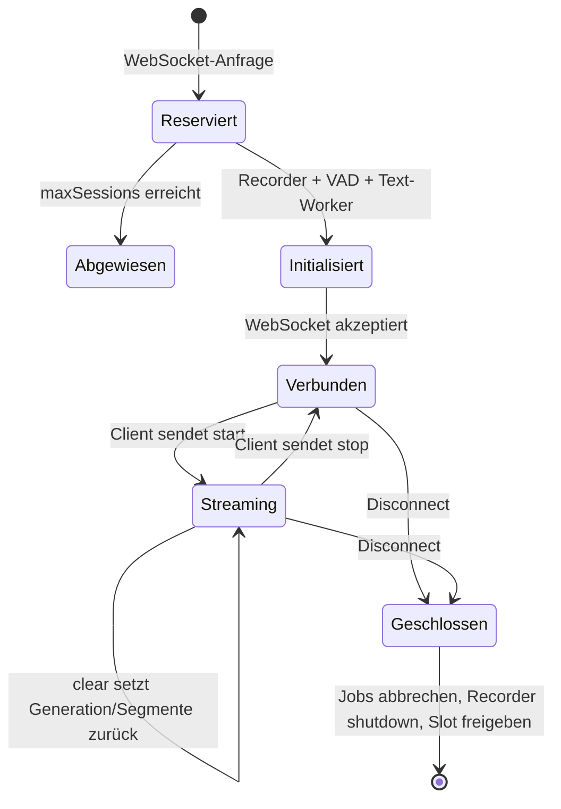
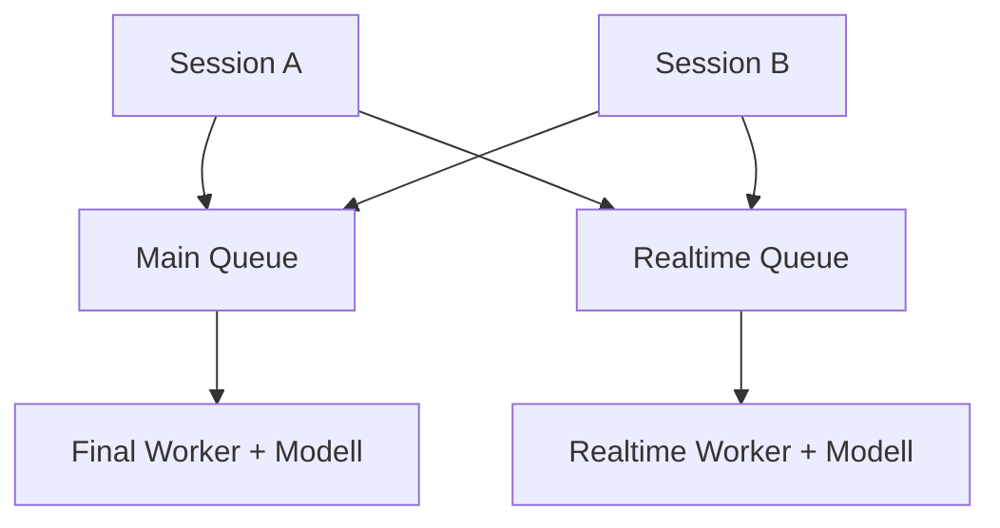
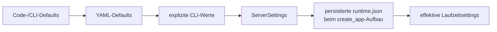

# Session- und Server-Scope

[← Übersicht](README.md) · [WebSocket-Protokoll →](02-websocket-protokoll.md)

## Kurzfassung

Der Server trennt **Stream-Zustand** von **teuren Inferenzressourcen**:

- Jede angenommene WebSocket-Verbindung besitzt einen eigenen Recorder mit
  eigenem VAD-, Wake-Word-, Aufnahme-, Segment- und Pufferzustand.
- ASR-Modelle, Inferenz-Worker, faire Queues, Kapazitätsgrenzen, Modell-Lifecycle,
  Registrys, Logging und Gesamtmetriken werden serverweit geteilt.
- Die Session erhält bei ihrer Erzeugung eine Kopie der für Recorder und
  Stream-Verhalten relevanten Einstellungen. Änderungen an
  `newSessionOnly` gelten daher erst für danach verbundene Sessions.

## Besitz- und Isolationsmatrix

| Ressource / Zustand | Scope | Lebensdauer | Konsequenz für Clients |
| --- | --- | --- | --- |
| `sessionId` | Session | eine WebSocket-Verbindung | Bei Reconnect immer neu; nie zur Fortsetzung alter Segmente verwenden |
| `clientId` | Clientkorrelation | vom Client stabil lieferbar, sonst serverseitig erzeugt | Browser persistiert sie lokal; nicht mit `sessionId` gleichsetzen |
| WebSocket-Verbindung | Session | bis Disconnect | Server sendet Session-Events nur an den Besitzer |
| `AudioToTextRecorder` | Session | Verbindung | Eigene Stream-Zustandsmaschine je Client |
| WebRTC-/Silero-VAD-Zustand | Session | Verbindung bzw. `clear`/Recorder-Reset | Sprache eines Clients beeinflusst keinen anderen Stream |
| Wake-Word-Zustand und Follow-up-Timer | Session | Verbindung / jeweiliger Wake-Zyklus | Erkennung, Timeout und Follow-up sind isoliert |
| Audioeingangsqueue und aufgezeichnete Audioqueue | Session | Verbindung; durch `clear`/Limits beeinflusst | Backlog und Drops werden pro Session gezählt |
| Pre-Recording-Buffer | Session | laufender Stream | Vorlauf-Audio wird nicht zwischen Clients geteilt |
| Aufnahme-/Streamingstatus | Session | Verbindung | `start`, `stop` und `clear` wirken nur auf den Absender |
| Segmentzähler | Session | Verbindung; `clear` springt zum nächsten Wert | `segmentId` ist nur innerhalb einer Session eindeutig |
| Segment-Timeline | Session | Verbindung; `clear` leert sie | Aufnahme-/Wake-Zeitpunkte bleiben sessionlokal |
| Generation / Stale-Result-Schutz | Session | wird bei `clear`/Close erhöht | Ergebnisse einer abgebrochenen Generation werden verworfen |
| Sessionmetriken | Session | Verbindung | Antwort auf Befehl `metrics`; zusätzlich in globalen Metriken eingebettet |
| Text-Worker-Thread | Session | Verbindung | Holt finale Texte aus genau diesem Recorder |
| Aktiver-Sprecher-Slot | global verwaltet, Session zugeordnet | während aktiver Aufnahme | Maximalzahl wird serverweit durchgesetzt |
| Connection Manager | Server | Prozess | Kennt alle verbundenen Session-WebSockets; routet normalerweise gezielt |
| Session Store | Server | Prozess | Reserviert/verwaltert Slots und Gesamtzahlen atomar |
| Finale Inferenzqueue | Server, fair pro Session partitioniert | Modell-/Server-Lifecycle | Finals konkurrieren um gemeinsame Rechenzeit |
| Realtime-Inferenzqueue | Server, fair pro Session partitioniert | Modell-/Server-Lifecycle | Pro Session bleibt höchstens ein wartendes Realtime-Job aktuell |
| Finales ASR-Modell / Worker | Server | bis Unload, Switch oder Shutdown | Nicht pro Client geladen |
| Realtime-ASR-Modell / Worker | Server oder mit finaler Lane geteilt | bis Unload, Switch oder Shutdown | Eine oder zwei Lanes je Konfiguration |
| Modell-Lifecycle und Aktivitätszeit | Server | Prozess | Leerlauf-Entladen und Lazy-Reload betreffen alle Clients |
| Startfehlerliste | Server | Prozess | Kann per `error` an alle Sessions gesendet und neuen Sessions wiederholt werden |
| Public Settings / Runtime-Vertrag | Server | Prozess, teilweise änderbar | In `hello`, `ready` und `/api/config` sichtbar |
| Limits | Server | Prozess, teilweise änderbar | Alle Sessions konkurrieren unter denselben Obergrenzen |
| Modell- und Wake-Word-Registry | Server | Prozess | Gemeinsamer Katalog lokaler Modelle |
| Strukturiertes Event-Logging | Server | Prozess | Vier Channels, SQLite, Kalenderdateien und Live-Fan-out; Sessionevents enthalten ggf. `sessionId` |
| Persistierte Runtime-Konfiguration | Server | über Neustarts | Kann Startwerte aus YAML/CLI beim App-Aufbau überschreiben |
| `/api/metrics` | Server | Prozess | Aggregiert alle aktiven Sessions, Queues und Worker |

## Session-Lebenszyklus



Die Slot-Reservierung passiert **vor** dem Erzeugen des Recorders. So kann eine
Verbindungswelle nicht mehr Recorder erzeugen, als `max_sessions` erlaubt.

Beim Schließen werden Scheduler-Jobs und wartende Recorder-Transkriptionen der
Session abgebrochen, der aktive Sprecher-Slot freigegeben und der Recorder
heruntergefahren.

## Geteilte Modell- und Queue-Architektur

### Zwei-Lane-Modus

Wenn `use_main_model_for_realtime` false ist, existieren zwei unabhängige,
serverweite Worker:



### Gemeinsame Lane

Wenn Final- und Realtime-Engine/-Modell identisch sind, erzwingt die
CPU-Modellrichtlinie `use_main_model_for_realtime: true`. Dann teilen sich beide
Jobarten eine Queue und einen Modell-Worker.

### Fairness- und Prioritätsregeln

- Die Queue rotiert fair über Session-IDs (Round-Robin).
- Innerhalb einer Session wird ein wartendes `final` vor `realtime` entnommen.
- Finale Jobs werden bis `max_final_queue_depth_per_session` aufbewahrt.
- Für Realtime existiert pro Session höchstens ein wartender Job. Ein neuer Job
  ersetzt den alten (`coalesced`).
- Realtime-Jobs, deren Deadline abgelaufen ist, werden als stale verworfen.
- Das globale Queue-Limit gilt über die jeweilige Queue. Bei einer gemeinsamen
  Lane teilen Final und Realtime dasselbe Kontingent.

Das garantiert keine feste Antwortzeit, verhindert aber, dass ein schneller
Client die komplette Queue dauerhaft mit überholten Zwischenergebnissen füllt.

## Einstellungen nach Änderungsscope

Der Server liefert die folgenden drei Listen selbst als `runtimeSettings` aus.
Die Einteilung ist deshalb Teil des aktuell implementierten Verwaltungsvertrags.

### `activeSessionSafe` – ohne Neustart serverweit änderbar

| Einstellung | Bedeutung |
| --- | --- |
| `log_level` | gespeicherter Log-Level-Wert |
| `max_active_speakers` | serverweites Limit gleichzeitiger Aufnahmen |
| `max_audio_packet_bytes` | maximal akzeptierte PCM-Nutzlast pro Binärpaket |
| `max_final_queue_depth_per_session` | maximale finale Jobs pro Session im Scheduler |
| `max_global_inference_queue_depth` | globaler Job-Backlog pro Queue |
| `max_realtime_queue_age_ms` | Deadline wartender Realtime-Jobs |
| `max_sessions` | maximale angenommene WebSocket-Sessions |
| `allow_two_medium_models` | CPU-Memory-Policy erlaubt zwei Medium-äquivalente Lanes |
| `model_idle_timeout_seconds` | Zeit bis zum automatischen Modell-Unload |
| `model_idle_unload_enabled` | automatisches Leerlauf-Entladen |
| `model_memory_policy_enabled` | CPU-Modellgrößenprüfung aktiv |
| `realtime_degradation_threshold_ms` | Schwelle für degradierte Realtime-Planung |
| `request_logging_enabled` | Audit-/Request-Logging aktiv |
| `request_log_stdout` | Audit-Events zusätzlich auf stdout |
| `request_log_transcripts` | Legacy-Schalter für `transcript_log_mode` (`false` = `none`, `true` = `final`) |
| `transcript_log_mode` | Transkripttext `none`, `final` oder `full`; ausschließlich im Transkriptionskanal |
| `request_log_max_bytes` | Rotationsgröße der Audit-Datei |
| `request_log_backup_count` | Legacy-Kompatibilitätswert; löscht keine Kalenderdateien |
| `request_log_retention_days` | Aufbewahrung des Audit-Kanals in Tagen; `0` deaktiviert Löschung |
| `performance_logging_enabled` | Performance-Kanal aktiv |
| `performance_log_stdout` | Performance-Events zusätzlich auf stdout |
| `performance_log_max_bytes` | Rotationsgröße der Performance-Datei |
| `performance_log_backup_count` | Legacy-Kompatibilitätswert; löscht keine Kalenderdateien |
| `performance_log_retention_days` | Aufbewahrung des Performance-Kanals in Tagen; `0` deaktiviert Löschung |
| `transcription_logging_enabled` | transportübergreifender Transkriptionskanal aktiv |
| `transcription_log_stdout` | Transkriptionsereignisse zusätzlich auf stdout |
| `transcription_log_max_bytes` | Rotationsgröße einer Transkriptions-Tagesdatei |
| `transcription_log_backup_count` | Legacy-Kompatibilitätswert; löscht keine Kalenderdateien |
| `transcription_log_retention_days` | Aufbewahrung des Transkriptionskanals in Tagen; `0` deaktiviert Löschung |
| `system_event_logging_enabled` | strukturierter Systemkanal aktiv |
| `system_event_log_stdout` | Systemereignisse zusätzlich auf stdout |
| `system_event_log_max_bytes` | Rotationsgröße einer System-Tagesdatei |
| `system_event_log_backup_count` | Legacy-Kompatibilitätswert; löscht keine Kalenderdateien |
| `system_event_log_retention_days` | Aufbewahrung des Systemkanals in Tagen; `0` deaktiviert Löschung |
| `log_calendar_timezone` | Zeitzone für Monats-/Tagesordner |
| `realtime_log_detail` | Realtime-Messung `off`, `summary` oder `events` |
| `log_live_enabled` | separaten Live-Log-WebSocket aktivieren |
| `save_audio_files` | Upload-/Anfrageaudio archivieren |

### `newSessionOnly` – Kopie beim Session-Aufbau

| Gruppe | Einstellungen |
| --- | --- |
| Audio/Recorder | `audio_queue_size`, `max_audio_queue_seconds_per_session`, `pre_recording_buffer_duration`, `vad_energy_threshold`, `vad_filter` |
| Segmentierung/VAD | `min_length_of_recording`, `min_gap_between_recordings`, `post_speech_silence_duration`, `early_transcription_on_silence`, `silero_sensitivity`, `webrtc_sensitivity` |
| Realtime | `realtime_callback`, `realtime_processing_pause`, `realtime_min_audio_seconds`, `realtime_max_audio_seconds`, `realtime_batch_size`, `realtime_transcription_use_syllable_boundaries`, `realtime_boundary_detector_sensitivity`, `realtime_boundary_followup_delays` |
| Prompts | `initial_prompt`, `initial_prompt_realtime` |
| Wake Word | `wakeword_backend`, `wake_words`, `wake_words_sensitivity`, `wake_word_activation_delay`, `wake_word_timeout`, `wake_word_buffer_duration`, `wake_word_followup_window`, `openwakeword_model_paths`, `openwakeword_inference_framework` |

Die Wake-Word-Werte können zusätzlich beim WebSocket-Aufbau sessionlokal
überschrieben werden. `wakeWordEnabled` entscheidet, ob die Session die
Serverbaseline erbt, Wake Word deaktiviert oder ein OpenWakeWord-Profil
aktiviert. Die Auflösung erfolgt vor Recorder-Erzeugung auf einer Kopie der
Baseline; globale Einstellungen und andere Sessions bleiben unverändert.
Clients senden dabei nur logische Modell-IDs, keine Serverpfade. Siehe
[Betriebsmodi und sessionlokale Wake-Word-Konfiguration](09-betriebsmodi-und-serverkonfiguration.md).

Vollständig und exakt enthält `newSessionOnly`:

```text
audio_queue_size
early_transcription_on_silence
initial_prompt
initial_prompt_realtime
max_audio_queue_seconds_per_session
min_gap_between_recordings
min_length_of_recording
openwakeword_inference_framework
openwakeword_model_paths
post_speech_silence_duration
pre_recording_buffer_duration
realtime_batch_size
realtime_boundary_detector_sensitivity
realtime_boundary_followup_delays
realtime_callback
realtime_max_audio_seconds
realtime_min_audio_seconds
realtime_processing_pause
realtime_transcription_use_syllable_boundaries
silero_sensitivity
vad_energy_threshold
vad_filter
wake_word_activation_delay
wake_word_buffer_duration
wake_word_followup_window
wake_word_timeout
wake_words
wake_words_sensitivity
wakeword_backend
webrtc_sensitivity
```

### `startupOnly` – geteilte Ressourcen / Neustart erforderlich

| Gruppe | Einstellungen |
| --- | --- |
| Netzwerk/Secrets | `host`, `port`, `admin_api_key`, `openai_api_key` |
| Final-Lane | `transcription_engine`, `model`, `transcription_engine_options`, `beam_size`, `batch_size` |
| Realtime-Lane | `realtime_transcription_engine`, `realtime_model`, `realtime_transcription_engine_options`, `beam_size_realtime`, `use_main_model_for_realtime` |
| Gemeinsame Engineparameter | `device`, `compute_type`, `download_root`, `language`, `normalize_audio`, `model_warmup` |
| Tuning | `tuning_profile`, `tuning_description` |
| OpenAI-API | `openai_api_enabled`, `openai_max_file_bytes`, `openai_model_aliases` |
| Persistenz | `data_root_path`; daraus werden alle Logkanäle, Audio, Event-Store und `config/runtime.json` intern abgeleitet |

Modellwechsel sind separat über `PUT /api/models/active` implementiert. Dafür
dürfen keine WebSocket-Sessions und keine aktiven Sprecher existieren. Der
Worker wird neu aufgebaut; bei Fehlschlag versucht der Server, die vorherige
Konfiguration wiederherzustellen.

## Wichtige Scope-Nuancen aus dem Code

### „Active-session-safe“ bedeutet Verwaltungs-Scope

Die API-Kategorie sagt, dass ein Wert ohne Serverneustart geändert werden darf.
Sie garantiert nicht, dass jede bereits erzeugte Sessionkopie rückwirkend
mutiert wird. Beispiele:

- `max_final_queue_depth_per_session` wirkt im gemeinsamen Scheduler sofort;
  die zusätzliche Begrenzung der recorderinternen `recorded_audio_queue` liest
  jedoch den beim Sessionstart kopierten Wert.
- Globale Limits wie `max_sessions`, `max_active_speakers` und
  `max_audio_packet_bytes` werden direkt aus dem geteilten Settings-Objekt
  gelesen und wirken auf laufende Serverlogik.
- `log_level` wird unmittelbar auf Root-, FastAPI-, Uvicorn- und den verwalteten
  VoiceSTT-Console-Logger angewendet.

Für vorhersehbares Verhalten sollte ein Admin-Client nach größeren
Konfigurationsänderungen neue WebSocket-Sessions aufbauen.

### Vertragseintrag und effektiver Produktionspfad sind nicht immer identisch

Die Listen beschreiben den implementierten Adminvertrag. Die Codepfade zeigen
zusätzlich folgende Einschränkungen, die für Betrieb und Clientdiagnose wichtig
sind:

- `realtime_degradation_threshold_ms` wird derzeit in `limits` veröffentlicht,
  aber von der Schedulinglogik nicht als Schwellwert ausgewertet.
- `realtime_min_audio_seconds`, `realtime_max_audio_seconds` und
  `vad_energy_threshold` werden vom alternativen Inline-Sessionpfad verwendet.
  Der produktive `admit_session`-Pfad erzeugt jedoch immer eine
  `RecorderBackedRealtimeSession`; dort steuern diese drei Werte das Verhalten
  aktuell nicht direkt.
- `realtime_batch_size`, `vad_filter`, `initial_prompt` und
  `initial_prompt_realtime` fließen auch in die Konstruktion der geteilten
  Modellworker ein. Eine Runtimeänderung baut einen bereits geladenen Worker
  nicht neu. Der neue Wert wird für neu erzeugte Recorder kopiert und spätestens
  bei einem späteren Worker-Neuladen/Modellwechsel auch für die Shared Engine
  wirksam.
Clientcode sollte diese Werte hauptsächlich zur Diagnose anzeigen und nicht aus
ihnen stärkere Laufzeitgarantien ableiten, als die beobachteten Events liefern.

### Modelle „unloaded“ ist ein gesunder Zustand

Nach dem konfigurierten Idle-Timeout dürfen die Modell-Worker entladen sein.
`ready`/`health` können trotzdem erfolgreich sein. Die nächste Inferenz lädt die
Lanes synchron wieder; der erste Text kann dann deutlich länger dauern.

### Settings in `hello` sind die effektive Sessionkopie

Der Client erhält die für diese Verbindung aufgelösten öffentlichen Settings.
Wake-Word-Queryparameter können sie beim Aufbau sessionlokal beeinflussen;
nach `hello` existiert weiterhin kein Befehl zum Ändern einzelner
Sessionparameter. Serverweite Änderungen laufen über die Admin-HTTP-API und
gelten entsprechend dem Runtime-Vertrag.

## Konfigurationsquellen und Priorität



- Secrets sind in der YAML-Konfiguration ausdrücklich verboten und kommen aus
  CLI/Umgebung.
- Explizite CLI-Parameter überschreiben YAML-Werte.
- Eine konfigurierte persistierte Runtime-Datei wird beim Aufbau der App geladen
  und überschreibt vorhandene nicht geheime Settings.
- Die zuverlässigste Client-Sicht bleibt die live gelieferte Konfiguration.

## Datenschutz- und Isolationsaussage

Transcript-Events und `ready` werden gezielt mit der jeweiligen `sessionId` an
die zugehörige Verbindung gesendet. Bestimmte serverweite Startfehler können
weiterhin für alle Verbindungen relevant sein. Audio wird nicht broadcastet.

Der Transkriptionskanal kann – abhängig von `transcript_log_mode` –
Transkripttext enthalten; Audit- und Performancekanal enthalten keinen
Transkripttext. Bei
`save_audio_files: true` kann außerdem Audio auf dem Server persistiert werden.
Stream-Isolation bedeutet daher nicht automatisch, dass keine serverweite
Protokollierung stattfindet.
