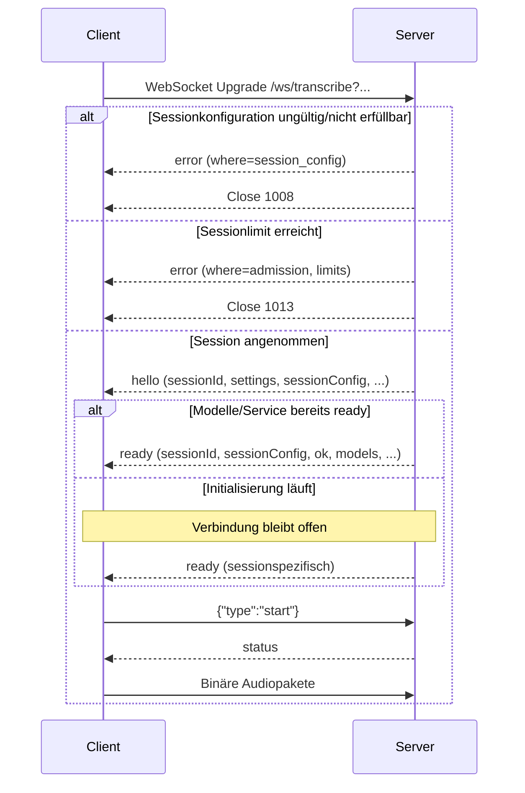
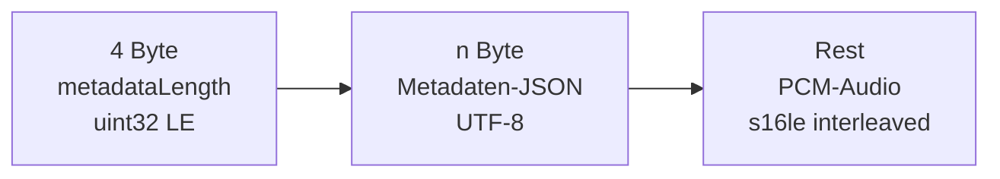

# WebSocket-Protokoll

[← Session- und Server-Scope](01-session-und-server-scope.md) · [Event-Kurzreferenz →](03-server-events-kurzreferenz.md)

## Endpunkt und Transport

```text
WS  /ws/transcribe
WSS wss://stt.voice.marcosudau.com/ws/transcribe
```

Der WebSocket ist die primäre Schnittstelle für kontinuierliches Mikrofon-Audio.
Eine Verbindung entspricht genau einer Session.

| Richtung | WebSocket-Frame | Inhalt |
| --- | --- | --- |
| Client → Server | Text | ein JSON-Objekt als Befehl |
| Client → Server | Binär | Metadatenheader + PCM-Audio |
| Server → Client | Text | ein JSON-Objekt mit diskriminierendem Feld `type` |
| Server → Client | Binär | wird nicht gesendet |

Der implementierte WebSocket-Handler prüft derzeit keinen API-Key und wertet
keine Token-Queryparameter aus. TLS (`wss://`) schützt den Transport, ist aber
keine Nutzungsautorisierung. Ein vorgeschalteter Reverse Proxy kann außerhalb
dieses Codes zusätzliche Regeln anwenden.

## Verbindungs-Handshake



### Handshake-Regeln

- `hello` bestätigt die Aufnahme der Session und liefert die neue `sessionId`
  sowie die separat vom Client übermittelte oder serverseitig erzeugte
  `clientId`. Beide IDs haben unterschiedliche Lebenszyklen.
- `hello.logAccess` liefert einen kurzlebigen, auf diese Session begrenzten
  Zugriff auf `/ws/logs` und `/api/logs/events`. Der Token gehört in Header
  beziehungsweise erste Subscribe-Nachricht, nicht in eine URL. Das Objekt
  enthält `available`, `logProtocolVersion: 2`,
  `deliveryMode: "sqlite_first"`, `replayAvailable`, `serverInstanceId` sowie
  `oldestCursor`/`latestCursor`. Bei `available: false` fehlt der Token.
- `ready` kann direkt nach `hello` oder später eintreffen.
- Jede `ready`-Nachricht ist sessionspezifisch und enthält dieselbe
  `sessionConfig` wie `hello`.
- Startfehler können nach `ready` als `error` folgen und bei später verbundenen
  Clients erneut ausgespielt werden.
- Ein Client sollte erst nach `ready` mit `ok: true` den Audiostart freigeben.
- `models.loaded: false` kann bei absichtlich entladenen Idle-Modellen normal
  sein; die erste Inferenz löst dann einen Lazy-Reload aus.

## Zweite Verbindung: zuverlässiger Eventstream

`/ws/transcribe` bleibt ausschließlich für Audio, Befehle und unmittelbare
Sessionausgaben zuständig. Der getrennte `/ws/logs`-Socket ist kein bloßer
Dateilog-Tail, sondern ein zuverlässiger, replaybarer Eventstream aus dem
kanonischen SQLite-Store:

```text
strukturierter Serverevent
  → SQLite-Commit + globaler Cursor
  → payloadfreies Commit-Wakeup
  → /ws/logs liest committed Events aus SQLite
```

Der Client sendet als erste Nachricht:

```json
{
  "type": "subscribe",
  "accessToken": "<session-token-oder-admin-key>",
  "sessionId": "<nur bei Session-Scope>",
  "channels": ["audit", "transcription", "performance"],
  "afterCursor": 18427
}
```

Danach folgen `log.hello`, `log.subscribed`, null bis viele
`log.event(replay=true)`, `log.replay_completed` und anschließend
`log.event(replay=false)`. `log.subscribed.authorizationScope` unterscheidet
`session` und `admin`; `allSessions`/`allChannels` machen globale Adminsemantik
explizit.

Wichtige Cursorregeln:

- Cursor sind global; Lücken in einem gefilterten Stream sind normal.
- `log.gap(reason=retention)` bedeutet, dass der angeforderte Bereich nicht
  mehr im Store liegt. Ab `oldestCursor` weiterarbeiten und die Lücke sichtbar
  dokumentieren.
- `log.error(code=cursor_ahead)` bedeutet meist Store-/Serverwechsel. Den
  lokalen Cursor anhand `serverInstanceId` und `latestCursor` neu bewerten.
- `log.error(code=event_store_unavailable)` plus Close `1011` ist ein
  vorübergehender Ausfall des zuverlässigen Logpfads. Die Audioverbindung darf
  unabhängig weiterlaufen.
- Ein Commit-Wakeup darf zusammenfallen oder ausbleiben; der Server liest
  selbstständig bis zum committed High-Watermark nach. Der Client muss keine
  flüchtigen Payloadqueues kompensieren.

Ein normaler Token bleibt auf seine Session und die drei erlaubten Channels
begrenzt. Der Admin-Key wird nur im ersten Subscribe-Frame eingesetzt, nie in
der URL. Ohne `sessionId` und ohne Channel-Filter erhält ein authentifizierter
Admin serverweite Events einschließlich `system`.

## Sessionlokale Wake-Word-Parameter

Der gewünschte Wake-Word-Modus wird beim Upgrade festgelegt:

```text
/ws/transcribe?wakeWordEnabled=false
/ws/transcribe?wakeWordEnabled=true&wakeWords=hey_jarvis
```

Unterstützte Queryparameter sind `wakeWordEnabled`, `wakeWordBackend`,
`wakeWords`, `wakeWordInferenceFramework`, `wakeWordSensitivity`, `wakeWordActivationDelay`,
`wakeWordTimeout`, `wakeWordBufferDuration` und
`wakeWordFollowupWindow`. Die vollständigen Regeln, Fallbacks und
Clientabläufe stehen unter
[Betriebsmodi und sessionlokale Wake-Word-Konfiguration](09-betriebsmodi-und-serverkonfiguration.md).

Der Server bestätigt nicht nur die Anfrage, sondern die tatsächlich wirksame
Konfiguration in `hello.sessionConfig` und `ready.sessionConfig`. Interne
Modellpfade werden dabei nicht veröffentlicht.

## Clientbefehle

Jeder Textframe muss als JSON-Objekt dekodierbar sein.

| Befehl | Payload | Wirkung | Direkte Antwort |
| --- | --- | --- | --- |
| Start | `{"type":"start"}` | aktiviert die Audioannahme der Session | ein oder mehrere `status`-Events |
| Stop | `{"type":"stop"}` | stoppt Streaming, flusht gepuffertes Audio und setzt Status `idle` | `status`; ein ausstehendes `final` kann danach noch folgen |
| Clear | `{"type":"clear"}` | erhöht Generation, bricht Sessionjobs ab, abortiert Recorder und leert Segment-Timeline | `clear`, danach `status` |
| Ping | `{"type":"ping"}` | misst Anwendungs-Roundtrip | `pong` |
| Metrics | `{"type":"metrics"}` | fordert Session-Snapshot an | `metrics` |

Für `start` und `stop` gibt es kein separates Ack mit Request-ID. Der neue
Zustand wird über `status` beobachtet. Unbekannte Befehle erzeugen `error` mit
`where: "command"`.

### Reihenfolge beim Start

```json
{"type":"start"}
```

Erst danach:

```text
binary audio packet 1
binary audio packet 2
...
```

Audio vor `start` wird im produktiven Recorderpfad abgelehnt. Der WebSocket
bleibt offen; der Client erhält ein `warning`.

## Binäres Audiopaket

### Byte-Layout

```text
Offset  Länge                 Inhalt
0       4 Byte                metadataLength, unsigned 32-bit, Little Endian
4       metadataLength        UTF-8-kodiertes JSON-Objekt
4+n     restliche Bytes       interleaved PCM signed 16-bit Little Endian
```



Das Diagramm ist schematisch; JSON und Audio haben variable Länge.

### Metadaten

| Feld | Typ | Pflicht | Regel |
| --- | --- | --- | --- |
| `sampleRate` | positive Ganzzahl | ja | Quell-Abtastrate; Server resampelt auf 16 kHz |
| `channels` | positive Ganzzahl | nein | Standard `1`, maximal `8` |
| `format` | String | nein | Standard und einzig unterstützter Wert: `pcm_s16le` |
| `frames` | positive Ganzzahl | nein | Wenn gesetzt, muss `frames × channels × 2` exakt der PCM-Länge entsprechen |

Beispiel:

```json
{
  "sampleRate": 48000,
  "channels": 1,
  "format": "pcm_s16le",
  "frames": 1920
}
```

### Validierungsgrenzen

- Metadaten-JSON: maximal 64 KiB.
- PCM-Nutzlast: `max_audio_packet_bytes`, standardmäßig 512 KiB.
- PCM-Länge muss durch `channels × 2` teilbar sein.
- Mehrkanal-Audio wird durch arithmetisches Mitteln nach Mono konvertiert.
- Audio wird auf 16 kHz resampelt (SciPy Polyphase, mit Interpolations-Fallback).
- Ein leeres, formal korrektes Paket wird ignoriert, nicht als Sprache behandelt.

Fehler in Layout oder Metadaten erzeugen `error` mit
`where: "audio_packet"`; unerwartete Verarbeitungsfehler verwenden
`where: "audio"`.

### Referenzencoder in JavaScript

```js
function encodeAudioPacket(metadata, pcm16) {
  const metadataBytes = new TextEncoder().encode(JSON.stringify(metadata));
  const audioBytes = new Uint8Array(
    pcm16.buffer,
    pcm16.byteOffset,
    pcm16.byteLength,
  );
  const packet = new ArrayBuffer(4 + metadataBytes.byteLength + audioBytes.byteLength);
  const view = new DataView(packet);
  view.setUint32(0, metadataBytes.byteLength, true); // Little Endian
  new Uint8Array(packet, 4, metadataBytes.byteLength).set(metadataBytes);
  new Uint8Array(packet, 4 + metadataBytes.byteLength).set(audioBytes);
  return packet;
}

const pcm = new Int16Array(/* mono PCM samples */);
socket.send(encodeAudioPacket({
  sampleRate: audioContext.sampleRate,
  channels: 1,
  format: "pcm_s16le",
  frames: pcm.length,
}, pcm));
```

Der mitgelieferte Browserclient bündelt ungefähr 40 ms Audio pro Paket. Das ist
eine praktische Referenz, aber keine serverseitig erzwungene Paketdauer.

## Segmentvertrag

### Identität

- Segment-IDs beginnen je Session bei `1`.
- Alle Realtime-Versionen einer laufenden Äußerung verwenden dieselbe
  `segmentId`.
- Das zugehörige `final` verwendet ebenfalls diese `segmentId` und schließt das
  Segment ab.
- Danach beginnt die nächste Äußerung mit der nächsten ID.
- `clear` erhöht die ID und sendet sie als `nextSegmentId`; bereits verwendete
  IDs werden innerhalb derselben Verbindung nicht wiederverwendet.
- Nach Reconnect startet eine neue Session wieder unabhängig bei `1`.

### Empfohlene Merge-Regel

```text
realtime(segmentId=N): upsert N als vorläufig; Text vollständig ersetzen
final(segmentId=N):    upsert N als final; finalen Text vollständig setzen
clear:                 alle Segmente entfernen
```

`stableDelta` ist hilfreich für Animationen oder inkrementelles Rendering, aber
der robuste Primärpfad ist stets der vollständige `displayText` bzw. `text`.

### Realtime-Felder und Stabilisierung

Im produktiven Recorderpfad enthält `realtime` neben dem öffentlichen Text auch
Roh-, Stable-, Unstable- und Consensus-Ansichten. Diese Werte beschreiben
verschiedene Stufen des internen Textstabilisierers:

- `rawText`: aktuelle rohe Modellbeobachtung.
- `displayText`: empfohlener vollständiger UI-Text.
- `stableText` / `committedStableText`: bereits bestätigter Präfix.
- `unstableText`: aktuell revidierbarer Rest.
- `consensusDisplayText`: aus dem Beobachtungskonsens abgeleitete Anzeige.
- `stableDelta`: seit dem letzten Event neu bestätigter Text.
- `internalRevision`, `isOutlier`, `stablePrefixConflict`: Diagnosesignale.

Für einen normalen Client gilt: `displayText ?? text` anzeigen und beim
`final`-Event durch `final.text` ersetzen.

## Zeitstempel

Eventzeiten sind Server-Wallclock-Zeit:

```json
{
  "timestamp": 1784541600.123,
  "timestampIso": "2026-07-20T10:00:00.123Z"
}
```

Sie eignen sich für Anzeige und Timeline-Korrelation, nicht für eine präzise
Roundtripmessung zwischen Rechnern. Dafür sendet der Client `ping`, misst lokal
mit einer monotonen Uhr und beendet die Messung beim zugehörigen nächsten
`pong`. Das Protokoll enthält derzeit keine Ping-ID; parallele Pings sollten
deshalb vermieden werden.

## Verbindungsende und Reconnect

- Bei Sessionüberlast schließt der Server nach dem Admission-Fehler mit Code
  `1013` („Try Again Later“).
- Bei gewöhnlichem Disconnect sendet der Server kein Abschluss-Event mehr.
- Reconnect ist eine neue Session und erfordert erneut `hello` → `ready` →
  `start`.
- Audioframes aus der alten Verbindung dürfen nicht gepuffert und ungeprüft in
  die neue Session übertragen werden; sie würden neue VAD-/Segmentgrenzen
  verfälschen.
- Wenn lokale Audiopuffer über einen Disconnect hinweg erhalten bleiben sollen,
  braucht der Client dafür eine eigene, explizite Produktentscheidung. Das
  Serverprotokoll bietet keine Resume-ID oder Replay-Bestätigung.

## Minimaler Clientablauf

```js
const ws = new WebSocket("wss://stt.voice.marcosudau.com/ws/transcribe");
let ready = false;
let sessionId = null;

ws.onmessage = ({ data }) => {
  const event = JSON.parse(data);
  if (event.type === "hello") sessionId = event.sessionId;
  if (event.type === "ready") ready = event.ok === true;
  dispatchServerEvent(event);
};

async function startMicrophone() {
  if (!ready || ws.readyState !== WebSocket.OPEN) return;
  ws.send(JSON.stringify({ type: "start" }));
  // Danach PCM-Pakete senden.
}

function stopMicrophone() {
  if (ws.readyState === WebSocket.OPEN) {
    ws.send(JSON.stringify({ type: "stop" }));
  }
}
```

Eine vollständige Reducer-Strategie steht unter
[Client-Zustandsmodell](05-client-zustandsmodell.md).
