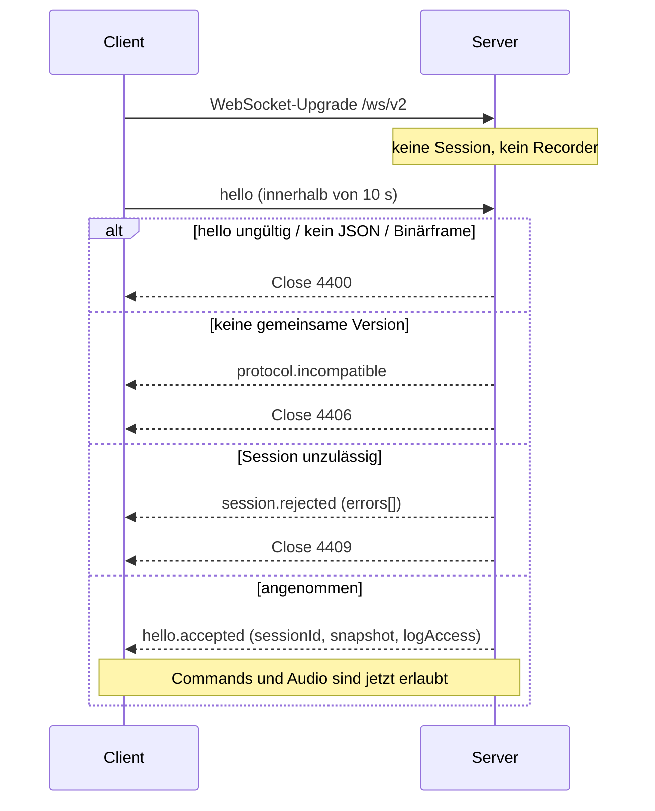

# WebSocket-Protokoll V2 (`/ws/v2`)

[← Session- und Server-Scope](01-session-und-server-scope.md) · [Event-Referenz →](03-server-events-kurzreferenz.md) · [Übersicht](README.md)

Diese Seite ist der normative Teil des V2-Vertrags für Verbindung,
Handshake, Identitäten, Commands, Acks, Audio und Close-Codes. Events stehen in
[03](03-server-events-kurzreferenz.md), Zustand und Resync in
[05](05-client-zustandsmodell.md).

Implementierung: `api_fastapi_server/protocol_v2/` und der `/ws/v2`-Handler in
`api_fastapi_server/server.py`. Maschinenlesbare Vektoren:
[`tests/contracts/protocol-v2-vectors.json`](../../tests/contracts/protocol-v2-vectors.json).

## 1. Endpunkt und Frames

```text
ws://<host>:<port>/ws/v2
wss://<host>/ws/v2
```

| Richtung | Frame | Inhalt |
| --- | --- | --- |
| Client → Server | Text | genau ein JSON-Objekt (`hello` oder ein Command) |
| Client → Server | Binär | ein Audioframe (§7) |
| Server → Client | Text | genau ein JSON-Objekt mit Feld `type` |
| Server → Client | Binär | wird nie gesendet |

Eine Verbindung ist genau eine Session. Optional kann der Client eine
Korrelations-ID mitgeben: Query `?clientId=<id>` oder Header
`X-VoiceSTT-Client-Id` (1–128 Zeichen aus `A–Z a–z 0–9 . _ : -`; sonst
erzeugt der Server `client-<hex>`). Sie dient nur Audit/Logs und erscheint in
keiner V2-Nachricht. Andere Queryparameter werden auf `/ws/v2` ignoriert.

## 2. Handshake


```mermaid
sequenceDiagram
    participant C as Client
    participant S as Server
    C->>S: WebSocket-Upgrade /ws/v2
    Note over S: keine Session, kein Recorder
    C->>S: hello (innerhalb von 10 s)
    alt hello ungültig / kein JSON / Binärframe
        S-->>C: Close 4400
    else keine gemeinsame Version
        S-->>C: protocol.incompatible
        S-->>C: Close 4406
    else Session unzulässig
        S-->>C: session.rejected (errors[])
        S-->>C: Close 4409
    else angenommen
        S-->>C: hello.accepted (sessionId, snapshot, logAccess)
        Note over C,S: Commands und Audio sind jetzt erlaubt
    end
```

Der Server sendet **nichts**, bevor der Client `hello` gesendet hat. Kommt
binnen 10,0 s kein Frame, schließt er mit `4408`.

### 2.1 `hello`

```json
{
  "type": "hello",
  "supportedProtocolVersions": [2],
  "clientVersion": "2.0.0-desktop",
  "clientCommit": "a1b2c3d4",
  "clientRunId": "10000000-0000-4000-8000-000000000001",
  "requestedSession": {
    "trigger": {"manual": true, "wakeWord": true},
    "wakeWordIds": ["hey_jarvis"]
  },
  "runtimeSuppression": {"manual": false, "wakeWord": false}
}
```

| Feld | Typ / Regel |
| --- | --- |
| `supportedProtocolVersions` | nicht leere Liste von Ganzzahlen; muss `2` enthalten |
| `clientVersion`, `clientCommit` | nicht leere Strings (`clientCommit` darf `"unknown"` sein) |
| `clientRunId` | kanonische UUID (§3); identifiziert den Clientprozesslauf, vom Server nur syntaktisch geprüft |
| `requestedSession.trigger.manual` / `.wakeWord` | Bool; mindestens einer `true` |
| `requestedSession.wakeWordIds` | Liste kanonischer Katalog-IDs; nicht leer genau dann, wenn `trigger.wakeWord = true` |
| `runtimeSuppression.manual` / `.wakeWord` | Bool; Anfangszustand der Laufzeit-Unterdrückung |

Zusätzliche Felder werden ignoriert.

### 2.2 `hello.accepted`

```json
{
  "type": "hello.accepted",
  "protocolVersion": 2,
  "sessionId": "20000000-0000-4000-8000-000000000001",
  "serverVersion": "2.0.0",
  "serverCommit": "unknown",
  "snapshot": { "…": "vollständiger session.snapshot ohne type, siehe 05" },
  "logAccess": {
    "available": true,
    "websocketPath": "/ws/logs",
    "historyPath": "/api/logs/events",
    "accessToken": "<session-token>",
    "sessionId": "20000000-0000-4000-8000-000000000001",
    "logProtocolVersion": 2,
    "deliveryMode": "sqlite_first",
    "replayAvailable": true
  }
}
```

Mit dem Senden von `hello.accepted` ist der Audiopfad geöffnet (es gibt kein
`start`) und die `runtimeSuppression` gesetzt. `serverCommit` ist
`VOICESTT_SERVER_COMMIT` oder `"unknown"`. `logAccess` beschreibt den
separaten strukturierten Logpfad. Bei `available: true` ist sein Token auf
`sessionId` sowie `audit`, `transcription` und `performance` begrenzt. Bei
deaktiviertem oder nicht verfügbarem Logstore fehlt `accessToken`; `code` und
`reason` erklären die Ursache. Die Berechtigung ist Bootstrap-Material und
wird deshalb nicht in späteren `session.snapshot`-Antworten wiederholt.

### 2.3 `protocol.incompatible` / `session.rejected`

```json
{"type": "protocol.incompatible", "reason": "no_common_protocol_version",
 "serverVersion": "2.0.0", "serverCommit": "unknown",
 "supportedProtocolVersions": [2]}
```

```json
{"type": "session.rejected", "reason": "invalid_requested_session",
 "serverVersion": "2.0.0", "serverCommit": "unknown",
 "supportedProtocolVersions": [2],
 "errors": [{"field": "requestedSession.wakeWordIds", "code": "wake_word_unavailable",
             "message": "'Hey Jarvis' ist keine kanonische Wake-Word-ID.",
             "reason": "not_canonical", "wakeWordId": "Hey Jarvis"}]}
```

| `reason` | `errors[].code` | Ursache |
| --- | --- | --- |
| `invalid_requested_session` | `activation_trigger_required` | beide Trigger `false` |
| `invalid_requested_session` | `wake_word_selection_required` | Wake Word aktiv, aber keine IDs |
| `invalid_requested_session` | `wake_word_selection_not_allowed` | Wake Word inaktiv, aber IDs gesendet |
| `invalid_requested_session` | `wake_word_unavailable` (+ `reason`, `wakeWordId`) | ID nicht kanonisch, unbekannt, deaktiviert, nicht ladbar oder kein gemeinsames Backend – siehe [09](09-betriebsmodi-und-serverkonfiguration.md#wake-word-admission) |
| `session_limit_reached` | `session_limit_reached` | `max_sessions` erreicht |

Ein `session.rejected` ist eine Konfigurationsablehnung: nicht automatisch mit
unverändertem `hello` wiederholen (Ausnahme `session_limit_reached`, mit
langem Backoff).

## 3. Identitäten

**Kanonische UUID** heißt: 36 Zeichen, Kleinbuchstaben, Bindestriche,
`str(uuid.UUID(x)) == x`. Die Version wird nicht geprüft; Clients erzeugen
UUIDv4. Großbuchstaben, 32-Hex ohne Bindestriche, Klammern oder Leerraum sind
ungültig.

| ID | Erzeuger | Lebensdauer | Hinweise |
| --- | --- | --- | --- |
| `clientRunId` | Client | ein Clientprozesslauf | bei Reconnects desselben Prozesses beibehalten; keine Serverfunktion außer Validierung |
| `sessionId` | Server | eine Verbindung | in jedem Command mitsenden; nach Reconnect neu |
| `commandId` | Client | Replay-Schlüssel dieser Session | pro logischem Command neu; Retries byte-gleich |
| `activationId` | Server | eine Activation bis zu ihrem Terminal | nur in `refresh`/`finish`/`cancel` referenzieren |
| `activationSequence` | Server | Ganzzahl, pro Session steigend | Ordnung von Activations |
| `segmentId` | Server | ein Sprachsegment | Schlüssel für Transkripte |
| `segmentSequence` | Server | Ganzzahl, pro Session steigend | Ordnung von Segmenten |
| `eventId` | Server | ein logisches Event | bleibt bei Transport-Retry gleich |
| `eventSeq` | Server | Ganzzahl ab 1, lückenlos | Ordnung und Lückenerkennung |

## 4. Commands

Gemeinsame Pflichtfelder:

```json
{"type": "<command>", "protocolVersion": 2,
 "sessionId": "<eigene sessionId>", "commandId": "<neue UUID>"}
```

| Eingang | Reaktion |
| --- | --- |
| kein JSON / kein Objekt / unbekannter `type` | ignoriert, **kein Ack** |
| `commandId` fehlt oder nicht kanonisch | ignoriert, **kein Ack** |
| `protocolVersion` ≠ Ganzzahl `2`, `sessionId` nicht kanonisch | Ack `invalid_payload` |
| wohlgeformte fremde `sessionId` | Ack `stale_session` (ohne Wirkung) |
| typspezifischer Feldfehler | Ack `invalid_payload` |
| zweites `hello` | ignoriert |

Kein Command-Fehler schließt die Verbindung.

### 4.1 `activation.command`

```json
{"type": "activation.command", "protocolVersion": 2,
 "sessionId": "20000000-0000-4000-8000-000000000001",
 "commandId": "50000000-0000-4000-8000-000000000001",
 "action": "activate", "source": "manual"}
```

```json
{"type": "activation.command", "protocolVersion": 2,
 "sessionId": "20000000-0000-4000-8000-000000000001",
 "commandId": "50000000-0000-4000-8000-000000000002",
 "action": "finish", "activationId": "30000000-0000-4000-8000-000000000001"}
```

| `action` | Pflicht | verboten | Bedeutung |
| --- | --- | --- | --- |
| `activate` | `source: "manual"` | Schlüssel `activationId` | neue Activation öffnen (z. B. PTT gedrückt) |
| `refresh` | `activationId` | Schlüssel `source` | Frist verlängern |
| `finish` | `activationId` | Schlüssel `source` | Eingabe geordnet schließen; aufgenommene Segmente werden transkribiert (PTT losgelassen) |
| `cancel` | `activationId` | Schlüssel `source` | Eingabe schließen und Ergebnisse verwerfen |

`source: "wake_word"` und `action: "extend"` sind immer `invalid_payload`.

Ergebnisse je Lage:

| Aktion | Lage | `result` |
| --- | --- | --- |
| `activate` | `audioAvailable = false` | `audio_unavailable` |
| `activate` | Vordergrund nicht `idle` | `activation_locked` |
| `activate` | `manual` nicht konfiguriert oder unterdrückt | `trigger_suppressed` (danach Event `activation.trigger_suppressed`) |
| `activate` | sonst | `applied` |
| Control | Vordergrund `idle` | `not_active` |
| Control | andere `activationId` als die offene | `stale_activation` |
| `refresh` | `waiting_first_speech` | `invalid_phase` |
| `refresh` | `segment_active` | `applied` – Frist = max(aktuell, jetzt + `segmentWatchdogRefreshMs`) |
| `refresh` | `followup_wait` | `applied` – Frist = jetzt + `followupTimeoutMs` |
| `refresh` | `closing_input` | `closing_input` |
| `finish`/`cancel` | offene Phase | `applied` (→ `closing_input`) |
| `finish`/`cancel` | `closing_input` | `no_change` |

Ein `refresh`, der eine längere Frist nicht verkürzen würde, ist ebenfalls
`applied`, erzeugt aber kein Event und keinen `stateVersion`-Anstieg.

### 4.2 `trigger_suppression.set`

```json
{"type": "trigger_suppression.set", "protocolVersion": 2,
 "sessionId": "…", "commandId": "…", "manual": false, "wakeWord": true}
```

Beide Bools Pflicht. `applied` bei Änderung, sonst `no_change`. Wirkt auf
künftige Trigger, beendet keine laufende Activation. Eigenes Event gibt es
nicht; der neue Zustand steht im Snapshot unter `trigger`.

### 4.3 `audio_availability.set`

```json
{"type": "audio_availability.set", "protocolVersion": 2,
 "sessionId": "…", "commandId": "…", "audioAvailable": false}
```

Meldet generisch, ob der Client ein Eingabegerät hat. `false` bricht eine
offene Activation ab (`activation.input_closed` mit `reason = "cancelled"`,
`causedByCommandId = null`) und sperrt neue Activations; Audioframes werden
weiterhin angenommen. `applied`/`no_change`.

### 4.4 `session_settings.patch`

```json
{"type": "session_settings.patch", "protocolVersion": 2,
 "sessionId": "…", "commandId": "…",
 "baseSettingsRevision": 0,
 "changes": {"activation.followupTimeoutMs": 4000}}
```

`baseSettingsRevision` Ganzzahl ≥ 0, `changes` nicht leeres Objekt. Semantik,
Schlüssel und Fehlercodes: [09](09-betriebsmodi-und-serverkonfiguration.md#session-settings).

### 4.5 `session.snapshot.request`

```json
{"type": "session.snapshot.request", "protocolVersion": 2,
 "sessionId": "…", "commandId": "…"}
```

Antwort: `command.ack` mit `applied`, danach ein `session.snapshot`
([05](05-client-zustandsmodell.md#2-sessionsnapshot)). Keine Zustandsänderung.

## 5. `command.ack`

```json
{
  "type": "command.ack",
  "protocolVersion": 2,
  "sessionId": "20000000-0000-4000-8000-000000000001",
  "commandId": "50000000-0000-4000-8000-000000000001",
  "accepted": true,
  "result": "applied",
  "activationId": "30000000-0000-4000-8000-000000000001",
  "inputPhase": "waiting_first_speech",
  "stateVersion": 1,
  "settingsRevision": 0
}
```

| Feld | Bedeutung |
| --- | --- |
| `accepted` | `true` genau für `applied` und `no_change` |
| `result` | einer der 15 Codes unten |
| `activationId`, `inputPhase` | Vordergrund-Activation und -Phase beim Beantworten (`null` / `"idle"`) |
| `stateVersion` | Version des vom Command bewirkten Zustands (bei `finish`/`cancel`: Eintritt in `closing_input`) |
| `settingsRevision` | aktuelle Session-Settingsrevision |
| `errors[]` | nur bei `settings_revision_conflict` und `settings_rejected`: `{field, code, message}` |

**Reihenfolge:** Events, die ein Command auslöst, werden **vor** seinem Ack
gesendet; nur `activation.trigger_suppressed` folgt dem Ack. Ein Ack kann daher
eine kleinere `stateVersion` tragen als bereits empfangene Events – das Ack
bestätigt das Command, den aktuellen Zustand liefern Events und Snapshot.

| `result` | `accepted` | Bedeutung | empfohlene Reaktion |
| --- | --- | --- | --- |
| `applied` | ✓ | Wirkung eingetreten | Events abwarten |
| `no_change` | ✓ | Zielzustand bestand schon | nichts |
| `activation_locked` | ✗ | es ist bereits eine Activation offen | UI an Serverzustand angleichen |
| `not_active` | ✗ | Control ohne offene Activation | lokale Activation verwerfen |
| `invalid_phase` | ✗ | `refresh` vor dem ersten Sprechen | später erneut |
| `closing_input` | ✗ | `refresh` während des Schließens | nichts |
| `stale_session` | ✗ | Command mit fremder `sessionId` | Clientfehler: aktuelle `sessionId` verwenden |
| `stale_activation` | ✗ | Control für eine nicht (mehr) offene Activation | Snapshot anfordern |
| `command_id_conflict` | ✗ | `commandId` mit anderem Payload wiederverwendet | Clientfehler: neue `commandId` |
| `invalid_payload` | ✗ | Envelope-/Feldfehler | Clientfehler; nicht wiederholen |
| `trigger_suppressed` | ✗ | Quelle unterdrückt oder nicht konfiguriert | Trigger-UI sperren |
| `audio_unavailable` | ✗ | `activate` ohne Eingabegerät | Gerät melden |
| `settings_revision_conflict` | ✗ | veraltete `baseSettingsRevision` | Snapshot lesen, neu anwenden |
| `settings_rejected` | ✗ | Werte ungültig | `errors[]` anzeigen |
| `internal_error` | ✗ | unerwarteter Serverzustand | loggen, Snapshot/Reconnect |

### 5.1 Replay und Konflikte

* Gleiche `commandId` + gleicher Payload → dasselbe Ack wie beim ersten Mal (mit den damaligen `stateVersion`/`settingsRevision`), keine zweite Wirkung, keine neuen Events. Bei `session.snapshot.request` folgt trotzdem ein neuer Snapshot.
* Gleiche `commandId` + anderer Payload → `command_id_conflict`; das erste Ergebnis bleibt maßgeblich.
* Bei `activation.command` und `audio_availability.set` vergleicht der Server die Semantik (unbekannte Zusatzfelder machen keinen Konflikt); bei den übrigen Typen den ganzen Payload. Clientregel: Retries byte-gleich senden.
* Der Replay-Cache lebt so lange wie die Session.

## 6. Nicht quittierte Eingaben

| Eingabe nach `hello.accepted` | Verhalten |
| --- | --- |
| nicht parsebares JSON | ignoriert |
| unbekannter `type` | ignoriert |
| Command ohne kanonische `commandId` | ignoriert |
| ungültiges Audioframe | verworfen |
| gültiges Audioframe | verarbeitet; nie quittiert |

Ein Client darf deshalb nicht auf eine Fehlermeldung für diese Fälle warten.
Für jedes Command mit kanonischer `commandId` gilt: ausbleibendes Ack =
Verbindungsproblem.

## 7. Audioframe

Identisch mit dem Legacy-V1-Format. Alle Mehrbyte-Zahlen Little-Endian.

```text
┌──────────────────────┬──────────────────────────────┬─────────────────────────────┐
│ uint32 LE: N         │ N Bytes UTF-8 JSON-Objekt    │ PCM, signed 16 bit LE,      │
│ (Metadatenlänge)     │ (Metadaten)                  │ Kanäle interleaved          │
└──────────────────────┴──────────────────────────────┴─────────────────────────────┘
 Byte 0..3             Byte 4..4+N-1                  Byte 4+N..Ende
```

Es gibt **kein** Magic, keine Versionsnummer und keine Flags.

| Metadatum | Pflicht | Regel |
| --- | --- | --- |
| `sampleRate` | ja | positive Ganzzahl; jede Rate, der Server resampelt auf 16 000 Hz |
| `channels` | nein, Standard 1 | Ganzzahl 1–8; der Server mittelt auf Mono |
| `format` | nein, Standard `"pcm_s16le"` | nur `"pcm_s16le"` |
| `frames` | nein | falls vorhanden: `frames × channels × 2` = Nutzlastlänge |

Grenzen: `N` ≤ 65 536 Bytes; Nutzlast ≤ `max_audio_packet_bytes`
(Standard 524 288 Bytes, sichtbar in `GET /api/config`); Nutzlastlänge ist
Vielfaches von `channels × 2`. Weitere Metadatenfelder werden ignoriert.

Referenz-Encoder (Python):

```python
import json, struct

def encode_frame(pcm_s16le: bytes, sample_rate: int, channels: int = 1) -> bytes:
    meta = json.dumps({
        "sampleRate": sample_rate,
        "channels": channels,
        "format": "pcm_s16le",
        "frames": len(pcm_s16le) // (2 * channels),
    }, separators=(",", ":")).encode("utf-8")
    return struct.pack("<I", len(meta)) + meta + pcm_s16le
```

Referenz-Encoder (JavaScript, wie `app_browserclient/client.js`):

```js
const meta = new TextEncoder().encode(JSON.stringify({
  sampleRate, channels: 1, format: "pcm_s16le", frames: pcm.length,
}));
const len = new DataView(new ArrayBuffer(4));
len.setUint32(0, meta.byteLength, true);           // little-endian
socket.send(new Blob([len.buffer, meta, pcm]));  // pcm: Int16Array – die View,
                                                  // nicht pcm.buffer (Subarray-Offset!)
```

Empfehlungen:

* Audio nach `hello.accepted` **kontinuierlich** senden, auch ohne offene Activation – Wake Word und Sprachbeginn werden serverseitig erkannt.
* Float-Samples auf [-1, 1] begrenzen, dann auf Int16 skalieren.
* Gleichmäßige Pakete von 20–100 ms (Browserclient: ~40 ms bei 48 kHz).
* Fällt das Mikrofon aus: `audio_availability.set` mit `false`; kein Audio mehr senden.

## 8. Close-Codes

| Code | Wann | Nachricht davor |
| --- | --- | --- |
| `4400` | erstes Frame kein gültiges `hello`, nicht parsebar oder binär | keine |
| `4406` | keine gemeinsame Protokollversion | `protocol.incompatible` |
| `4408` | kein Frame binnen 10 s nach dem Öffnen | keine |
| `4409` | Sessionadmission abgelehnt | `session.rejected` |
| `1011` | unerwarteter Serverfehler (Handshake oder später), einschließlich terminaler Recovery einer angenommenen Session | keine |

Nach der Annahme schließt der Server nur bei internem Fehler, bei terminaler
Recovery oder beim Herunterfahren. Eine terminale Recovery beendet die
Domain-Session irreparabel und schließt die zugehörige WebSocket-Verbindung
mit `1011`, ohne dass der Client noch etwas senden muss und ohne neue
Wire-Nachricht. Der Session-Slot wird freigegeben; Weiterarbeit erfordert
einen Reconnect mit neuem `hello` (neue `sessionId`). Ein Verbindungsende
beendet die Session vollständig; siehe
[Reconnect](05-client-zustandsmodell.md#5-reconnect).
