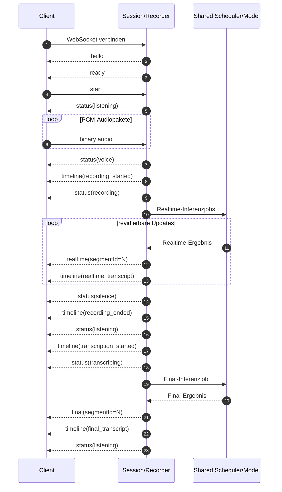
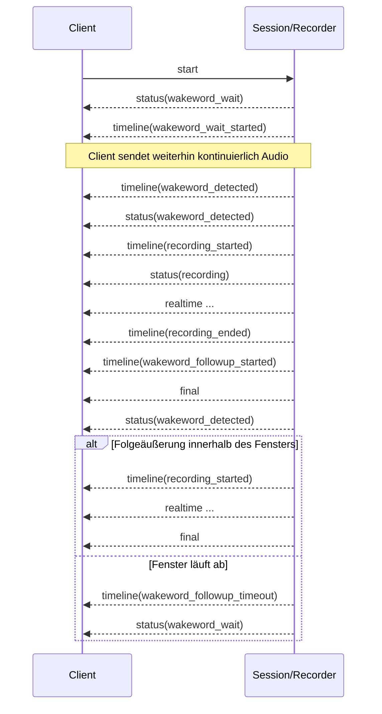

# Server-Events – Katalog und Chronologie

[← Kurzreferenz](03-server-events-kurzreferenz.md) · [Client-Zustandsmodell →](05-client-zustandsmodell.md)

Diese Seite beschreibt jedes Event nach Bedeutung, Trigger, Feldern und
Clientreaktion. Sie bezieht sich auf den produktiven Single-WebSocket-Endpunkt
`/ws/transcribe`.

## Normaler Ablauf ohne Wake Word



Die genaue Reihenfolge eng benachbarter `status`- und `timeline`-Events kann
durch Recorderthreads variieren. Ein Client darf seine Transkriptlogik deshalb
nicht davon abhängig machen, dass jedes Statusereignis exakt einmal oder in
dieser idealisierten Reihenfolge eintrifft.

## Normaler Ablauf mit Wake Word und Follow-up



Wenn nach einer Weckworterkennung keine Sprache beginnt, kann stattdessen
`timeline(wakeword_timeout)` und `status(wakeword_timeout)` eintreffen; danach
kehrt der Recorder wieder in den Wartezustand zurück.

---

## `hello`

**Bedeutung:** Die WebSocket-Verbindung wurde angenommen, ein Session-Slot und
ein sessioneigener Recorder wurden erfolgreich angelegt.

**Trigger:** genau einmal unmittelbar nach dem Accept der Verbindung. Bei
erreichtem Sessionlimit gibt es kein `hello`, sondern einen Admission-Fehler.

| Feld | Typ | Bedeutung |
| --- | --- | --- |
| `type` | `"hello"` | Diskriminator |
| `clientId` | String | identisch mit `sessionId`; Kompatibilitätsname |
| `sessionId` | String | zufällige hexadezimale UUID ohne Bindestriche |
| `settings` | Object | öffentliche effektive Servereinstellungen; Engine-Options und Secrets entfernt |
| `limits` | Object | kompakte Kapazitätsgrenzen |
| `supportedEngines` | Array | Namen der im Code registrierten Transkriptionsengines |
| `runtimeSettings` | Object | Listen `activeSessionSafe`, `newSessionOnly`, `startupOnly` |

`limits` enthält exakt:

| Feld | Bedeutung |
| --- | --- |
| `maxSessions` | maximale offene WebSocket-Sessions |
| `maxActiveSpeakers` | maximale gleichzeitig aufnehmende Sessions |
| `maxAudioQueueSecondsPerSession` | Grenze eines fortlaufenden Segments |
| `maxRealtimeQueueAgeMs` | maximale Wartezeit eines Realtime-Jobs |
| `maxFinalQueueDepthPerSession` | finale Backloggrenze je Session |
| `maxGlobalInferenceQueueDepth` | Queuegrenze (bei zwei Lanes je Queue) |
| `realtimeDegradationThresholdMs` | veröffentlichte Degradationsschwelle; derzeit nicht aktiv ausgewertet |

**Clientreaktion:** Session-ID speichern, Konfigurations-/Featureanzeige
aktualisieren, aber auf `ready` warten.

```json
{
  "type": "hello",
  "clientId": "7cb1…",
  "sessionId": "7cb1…",
  "settings": { "language": "de", "wake_word_enabled": true },
  "limits": { "maxSessions": 8, "maxActiveSpeakers": 4 },
  "supportedEngines": ["faster_whisper", "kroko_onnx"],
  "runtimeSettings": {
    "activeSessionSafe": ["max_sessions"],
    "newSessionOnly": ["wake_words"],
    "startupOnly": ["model"]
  }
}
```

Die gekürzten Arrays im Beispiel sind nicht vollständig.

---

## `ready`

**Bedeutung:** Die Modellworker-Initialisierung ist abgeschlossen oder Modelle
sind bewusst entladen und der Dienst kann sie bei Bedarf laden.

**Trigger:**

1. Direkt nach `hello`, wenn `service.ready` beim Verbindungsaufbau bereits
   gesetzt ist.
2. Als Broadcast an alle offenen Sessions, wenn der asynchrone Ready-Worker die
   Startinitialisierung beendet.

| Feld | Direkt nach `hello` | Später Broadcast | Bedeutung |
| --- | --- | --- | --- |
| `type` | ja | ja | `"ready"` |
| `sessionId` | ja | nein | Besitzer der direkten Variante |
| `settings` | ja | ja | aktuelle öffentliche Settings |
| `limits` | ja | ja | aktuelle Limits |
| `runtimeSettings` | ja | ja | Änderungsscope |
| `ok` | ja | ja | Scheduler gesund bzw. absichtlich unloaded |
| `models` | ja | nein | detaillierter Modell-Lifecycle-Snapshot |

**Clientreaktion:** Bei `ok: true` Audiofunktionen aktivieren. Bei `ok: false`
auf nachfolgende `error`-Events achten und einen sichtbaren Fehlerzustand zeigen.
Das Fehlen von `sessionId` oder `models` ist bei der Broadcast-Variante gültig.
`ready` darf durch ein enges Timing direkt und anschließend als Broadcast
eintreffen; die Verarbeitung muss idempotent sein.

---

## `status`

**Bedeutung:** Momentaufnahme des Session-/Recorderzustands. `status` ist für
UI und Diagnose gedacht, nicht als garantiert lückenloser Eventlog.

**Trigger:** unter anderem `start`, `stop`, `clear`, VAD-Start/-Stop,
Aufnahmebeginn/-ende, Transkriptionsbeginn, finales Ergebnis, Wake-Erkennung und
Timeout.

| Feld | Typ | Bedeutung |
| --- | --- | --- |
| `type` | `"status"` | Diskriminator |
| `sessionId` | String | Session |
| `state` | String | Zustandswert aus der Statuswert-Tabelle |
| `timestamp` / `timestampIso` | Number / String | Erzeugungszeit |
| `activeClientId` | String oder `null` | eigene Session-ID, solange `streaming` true ist |
| `queueDepth` | Integer | Summe von Recorder-Audioqueue und Recorded-Audioqueue; **keine Sekundenangabe** |
| `droppedChunks` | Integer | nicht an Recorder übergebene Audioblöcke |
| `coalescedRealtime` | Integer | durch neuere Realtime-Jobs ersetzte Jobs |
| `staleRealtimeDiscarded` | Integer | wegen Alter/Generation verworfene Realtime-Jobs |
| `activeSessions` | Integer | serverweite aktive WebSocket-Sessions |
| `activeSpeakers` | Integer | serverweit gleichzeitig aktive Aufnahmen |
| `wakeWordEnabled` | Boolean | Wake-Word-Modus dieser Session |
| `wakeWord` | Object | `enabled`, `backend`, `wakeWords`, optionaler Wake-State |

**Clientreaktion:** Letzten Status „last event wins“ speichern. Wiederholungen
tolerieren. `queueDepth` nur als relativen Backlogindikator darstellen.

### Zustandswerte und Auslöser

| Zustand | Typischer Auslöser |
| --- | --- |
| `idle` | neue/gestoppte Session |
| `listening` | `start` ohne Wake Word oder Rückkehr nach Segment |
| `voice` | VAD-Callback meldet Stimme |
| `silence` | VAD-Callback meldet Stille |
| `wakeword_wait` | Wake-Erkennung wartet |
| `wakeword_detected` | Weckwort oder Follow-up-Gate aktiv |
| `wakeword_timeout` | Sprache nach Weckwort blieb aus |
| `recording` | Recorder hat Aufnahme begonnen |
| `transcribing` | Finaltranskription beginnt |
| `closed` | Session wird intern geschlossen; Zustellung nicht garantiert |

---

## `realtime`

**Bedeutung:** Vollständige, noch revidierbare Textansicht eines laufenden
Segments.

**Trigger:** Der Realtime-Executor liefert eine neue Beobachtung und der
Textstabilisierer erzeugt ein nicht leeres Update. Ein Outlier kann diagnostisch
markiert sein; das Event darf trotzdem gesendet werden.

### Identität und Basisfelder

| Feld | Typ | Bedeutung |
| --- | --- | --- |
| `type` | `"realtime"` | Diskriminator |
| `sessionId` | String | Besitzer |
| `segmentId` | Integer | laufendes Segment |
| `recordingId` | Integer/String/`null` | interne Aufnahmeidentität des Stabilisierers |
| `sequence` | Integer/`null` | Reihenfolge innerhalb der Aufnahme |
| `text` | String | öffentliche Textansicht gemäß `realtime_callback` |
| `timestamp` / `timestampIso` | Number / String | Eventzeit |

### Textansichten

| Feld | Bedeutung |
| --- | --- |
| `rawText` | rohe aktuelle Modellbeobachtung |
| `displayText` | empfohlener kompletter UI-Text |
| `stableText` | bestätigter, nicht mehr erwartbar revidierter Präfix |
| `stableDelta` | seit vorherigem Update neu bestätigter Präfixteil |
| `unstableText` | noch revidierbarer Suffix |
| `committedStableText` | expliziter Alias des bestätigten Stable-Textes |
| `committedStableDelta` | expliziter Alias von `stableDelta` |
| `visualStableText` | Stable-Anteil für getrenntes Styling |
| `visualUnstableText` | Unstable-Anteil für getrenntes Styling |
| `consensusText` | bestätigter Text nach Beobachtungskonsens |
| `consensusUnstableText` | unbestätigter Konsenssuffix |
| `consensusDisplayText` | kompletter Konsens-Anzeigetext |

### Diagnostik

| Feld | Typ | Bedeutung |
| --- | --- | --- |
| `publicConsensusAligned` | Boolean | öffentliche Anzeige und Konsens sind ausgerichtet |
| `internalRevision` | Boolean | interner Revisionsschritt |
| `isOutlier` | Boolean | Beobachtung als Ausreißer bewertet |
| `stablePrefixConflict` | Boolean | Beobachtung widerspricht Stable-Präfix |
| `commitReason` | String/`null` | Grund eines Stable-Commits |
| `stableNormalizedOffset` | Number/`null` | normalisierter Offset des Stable-Anteils |
| `timing` | Object, optional | serialisierte Timingdaten des Stabilisierers |
| `segment` | Object, optional | Timeline-Snapshot |
| Segmentfelder auf Top-Level | optional | `durationSeconds`, `endReason`, Prebuffer-, Aufnahme- und Wake-Felder |

Wenn ein benutzerdefinierter `recorder_factory` ohne strukturierten
Stabilisierungscallback eingesetzt wird, darf `realtime` auf die Basisfelder
`type`, `sessionId`, `segmentId`, `text`, `timestamp`, `timestampIso` plus
optional `segment` reduziert sein. Ein externer Client sollte die reichen
Felder deshalb als optional behandeln.

**Clientreaktion:**

```text
display = event.displayText ?? event.text
segments[event.segmentId] = { text: display, final: false }
```

Wenn `sequence` vorhanden ist, sollten ältere Sequenzen für dasselbe Segment
ignoriert werden. Der Server routet normalerweise geordnet über einen Socket;
diese zusätzliche Regel macht den Reducer auch für Replay/Test robust.

---

## `final`

**Bedeutung:** Abgeschlossenes Transkript eines Segments. Dies ist die
maßgebliche Textfassung.

**Trigger:** `recorder.text()` liefert nach Aufnahmeende und finaler Inferenz
einen nicht leeren Text.

| Feld | Typ | Bedeutung |
| --- | --- | --- |
| `type` | `"final"` | Diskriminator |
| `sessionId` | String | Besitzer |
| `segmentId` | Integer | entspricht der Realtime-ID dieser Äußerung |
| `text` | String | finaler, getrimmter Text |
| `timestamp` / `timestampIso` | Number / String | Fertigstellungszeit |
| `segment` | Object, optional | vollständiger Timeline-Snapshot |
| Segmentfelder auf Top-Level | optional | `durationSeconds`, `endReason`, Prebuffer-, Aufnahme- und Wake-Felder |

**Clientreaktion:** Segment vollständig mit `text` überschreiben und als final
markieren. Ein `final` kann ohne vorheriges `realtime` eintreffen. Leere finale
Texte werden im Recorderpfad nicht publiziert.

Nach `stop` kann ein bereits gepuffertes Segment asynchron noch `final` liefern.

---

## `timeline`

**Bedeutung:** Fachlicher Meilenstein für Ablaufanzeige, Diagnose und
Zeitkorrelation. Realtime-/Finaltext wird zusätzlich als eigenes Event gesendet;
`timeline` ist daher kein Ersatz für den Transkriptreducer.

### Basisfelder

| Feld | Typ | Bedeutung |
| --- | --- | --- |
| `type` | `"timeline"` | Diskriminator |
| `sessionId` | String | Session |
| `event` | String | Untertyp |
| `timestamp` / `timestampIso` | Number / String | Meilensteinzeit |
| `segmentId` | Integer, optional | zugehöriges Segment |
| `segment` | Object, optional | Timeline-Snapshot |

### Untertypen im Detail

#### `wakeword_wait_started`

Wake-Word-Erkennung hat ihre Wartephase begonnen. `wakeWord` enthält:

```json
{
  "enabled": true,
  "backend": "openwakeword",
  "wakeWords": "hey_jarvis",
  "state": "waiting_for_wake_word",
  "waitStartedAt": 1784541600.0,
  "waitStartedAtIso": "2026-07-20T10:00:00.000Z"
}
```

#### `wakeword_wait_ended`

Die Erkennung verlässt die Wartephase. `wakeWord` kann `waitStartedAt` und
`waitEndedAt` samt ISO-Feldern enthalten.

#### `wakeword_detected`

Weckwort erkannt, Sprache wird innerhalb von `wake_word_timeout` erwartet.
`wakeWord.state` ist `wake_word_detected_waiting_for_voice` und enthält
`detectedAt`.

#### `wakeword_timeout`

Nach Erkennung begann nicht rechtzeitig eine gültige Aufnahme. `wakeWord`
enthält `timeoutAt` und State `wake_word_timeout`.

#### `wakeword_followup_started`

Nach Aufnahmeende bleibt für `durationSeconds` ein Voice-Gate offen. Innerhalb
dieses Fensters darf eine Folgeäußerung ohne erneutes Weckwort starten.

#### `wakeword_followup_timeout`

Das Folgefenster ist ohne neue laufende Aufnahme abgelaufen. Keine weiteren
Pflichtfelder neben der Timeline-Basis.

#### `recording_started`

Recorderaufnahme beginnt. Enthält `segmentId`, `segment` und denselben
`preRecordingBuffer` zusätzlich auf Top-Level.

#### `recording_ended`

Recorderaufnahme endet. Enthält `segmentId`, `segment`, `durationSeconds` und
`reason` (aus `segment.endReason`). Die finale Inferenz kann danach noch laufen.

#### `transcription_started`

Finale Transkriptionsphase wird begonnen. Enthält `segmentId` und den zu diesem
Zeitpunkt verfügbaren Segment-Snapshot.

#### `realtime_transcript`

Timeline-Spiegel des zugehörigen `realtime`-Events. Enthält `segmentId`, `text`,
optional `sequence` und `segment`. Für Textanzeige weiterhin das originale
`realtime` verwenden.

#### `final_transcript`

Timeline-Spiegel des `final`-Events mit `segmentId`, `text` und optional
`segment`.

---

## `clear`

**Bedeutung:** Der serverseitige Reset der Session wurde ausgeführt.

**Trigger:** gültiger Clientbefehl `{"type":"clear"}`.

| Feld | Typ | Bedeutung |
| --- | --- | --- |
| `type` | `"clear"` | Diskriminator |
| `sessionId` | String | Session |
| `nextSegmentId` | Integer | nächste Segment-ID nach dem Reset |

Der Server erhöht die Sessiongeneration, cancelt Scheduler-/Pending-Jobs,
abortiert den Recorder, setzt Wake-/Timeline-Zustand zurück und gibt einen
aktiven Sprecher-Slot frei. Danach folgt ein `status`.

**Clientreaktion:** Segmente, Realtimeanzeige und lokale Timeline atomar leeren;
`nextSegmentId` nur diagnostisch speichern. `clear` beendet das Streamingflag
nicht grundsätzlich – der resultierende Status hängt vom vorherigen Stream- und
Wake-Zustand ab.

---

## `pong`

**Bedeutung:** Anwendungsebene-Antwort auf `ping`.

| Feld | Typ | Bedeutung |
| --- | --- | --- |
| `type` | `"pong"` | Diskriminator |
| `sessionId` | String | Session |
| `serverTime` | Number | Server-Unixzeit beim Antworten |

Es gibt keine Echo-ID. Nur einen Ping gleichzeitig messen.

---

## `metrics`

**Bedeutung:** Diagnose-Snapshot genau dieser Session.

**Trigger:** Clientbefehl `{"type":"metrics"}`.

| Feld | Typ | Bedeutung |
| --- | --- | --- |
| `type` | `"metrics"` | Diskriminator |
| `sessionId` | String | Session |
| `metrics` | Object | Session-Snapshot |

Der Snapshot enthält:

- `streaming`, `recording`, `state`, `wakeWordEnabled`;
- `currentSegmentId`, optional `currentSegment`;
- `queueDepth`, `recordingSeconds`;
- Audio-/Drop-/Reject-/Coalescing-Zähler;
- eingereichte/abgeschlossene/abgelehnte Realtime- und Finaljobs;
- `forcedFinalizations`, `droppedRecordedSegments`;
- je `realtime`/`final` Statistiken für `queueDelay`,
  `inferenceDuration`, `totalLatency` mit `count`, `avgMs`, `maxMs`, `p50Ms`,
  `p95Ms`.

Metriken sind beobachtend und ändern den Stream nicht.

---

## `warning`

**Bedeutung:** Behebbares oder bewusst degradierendes Problem. Die Verbindung
bleibt normalerweise offen.

| Feld | Typ | Bedeutung |
| --- | --- | --- |
| `type` | `"warning"` | Diskriminator |
| `sessionId` | String | betroffene Session |
| `message` | String | Beschreibung |

Implementierte Auslöser umfassen:

- Audio vor `start`;
- maximale Anzahl aktiver Sprecher erreicht;
- maximale Aufnahmedauer erreicht und Segment zwangsfinalisiert;
- finale Recorded-Audioqueue getrimmt;
- im Inlinepfad verworfenes Realtime-Ergebnis;
- `ingest_audio_packet` lehnt einen Abschnitt ohne Protokollfehler ab.

**Clientreaktion:** sichtbar protokollieren, aber Audio-/WebSocketverbindung nicht
automatisch schließen. Bei wiederholtem „Audio vor start“ den lokalen
Streamingautomaten korrigieren.

---

## `error`

**Bedeutung:** Nicht erfolgreich verarbeiteter Vorgang oder nicht gesunder
Serverteil. Manche Fehler betreffen nur eine Nachricht, andere verhindern die
gesamte Session.

### Feldvarianten

| Feld | Wann |
| --- | --- |
| `type: "error"` | immer |
| `message` | immer in WebSocket-Fehlern |
| `where` | Ursprungsbereich, wenn bekannt |
| `sessionId` | bei angenommener Session; nicht beim Admission-Fehler/Serverbroadcast zwingend |
| `limits` | Admission-Fehler |
| `requestId` | Inferenzfehler im Inlinepfad |

### Behandlung nach `where`

| `where` | Verbindung | Clientmaßnahme |
| --- | --- | --- |
| `admission` | Server schließt mit 1013 | exponentiell verzögert neu versuchen; Limits anzeigen |
| `command` | bleibt offen | Payload/State-Machine korrigieren; kein Reconnect nötig |
| `audio_packet` | bleibt offen | Paketencoder prüfen; fehlerhaftes Paket verwerfen |
| `audio` | meist offen | Fehler loggen; bei Wiederholung Stream stoppen/reinitialisieren |
| `recorder` | offen, Funktion ggf. degradiert | Benutzer informieren; bei Wiederholung reconnecten |
| `main_engine`, `realtime_engine` | serverweit, Broadcast möglich | STT als nicht verfügbar zeigen; Backoff/Healthcheck |
| unbekannt | nicht annehmen | generisch anzeigen/loggen; Socketzustand separat beobachten |

### Admission-Beispiel

```json
{
  "type": "error",
  "where": "admission",
  "message": "Der Server hat das konfigurierte Sitzungslimit erreicht.",
  "limits": {
    "maxSessions": 8,
    "maxActiveSpeakers": 4
  }
}
```

## Forward-Compatibility

Ein langlebiger Client sollte:

1. unbekannte `type`- und `timeline.event`-Werte loggen und ignorieren;
2. unbekannte Felder erhalten/ignorieren, aber nicht als Fehler werten;
3. optionale Broadcastfelder (`sessionId`, `models`) nicht voraussetzen;
4. Statuswiederholungen tolerieren;
5. ausschließlich `final` als endgültige Textzusage behandeln;
6. Text nicht aus `timeline` doppelt in das Transkript einfügen.
