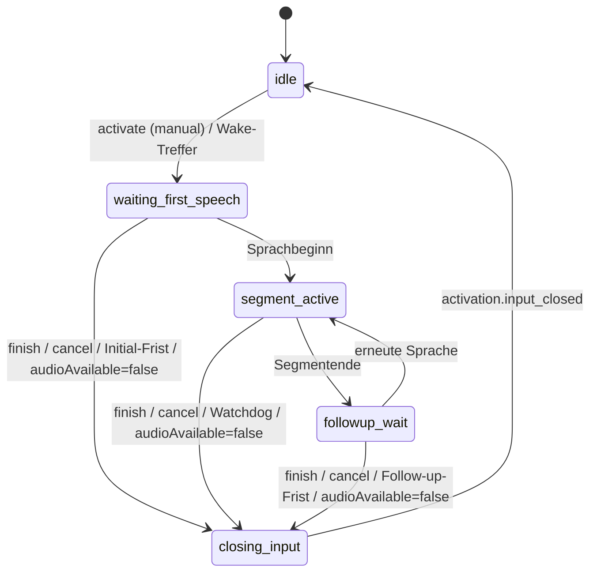

# Lebenszyklen und Chronologie (V2)

[← Event-Referenz](03-server-events-kurzreferenz.md) · [Zustandsmodell & Resync →](05-client-zustandsmodell.md) · [Übersicht](README.md)

## 1. Drei Ebenen

| Ebene | Lebensdauer | Sichtbar über |
| --- | --- | --- |
| **Session** | eine `/ws/v2`-Verbindung | `hello.accepted`, `session.snapshot` |
| **Vordergrund-Activation** | vom Trigger bis zum sicheren Eingabeschluss | `activation.started` … `activation.input_closed`, `input` im Snapshot |
| **Hintergrund-Drain** | vom Eingabeschluss bis alle Segmente terminal sind | Segment-/Transkriptionsevents, `activation.completed`/`.cancelled`/`.failed`, `pendingActivations` |

Es gibt höchstens eine Vordergrund-Activation. Nach `activation.input_closed`
ist der Vordergrund wieder `idle` und eine neue Activation kann starten,
während ältere noch drainen. Segment- und Transkriptionsevents gehören dabei
immer zu der Activation, die das Segment angenommen hat – nicht zum gerade
offenen Vordergrund. `segment.recording_started`, `segment.recording_ended`,
`transcription.accepted` und das Terminal desselben `segmentId` teilen
`activationId` und `segmentSequence`.

## 2. Vordergrundphasen


```mermaid
stateDiagram-v2
    [*] --> idle
    idle --> waiting_first_speech: activate (manual) / Wake-Treffer
    waiting_first_speech --> segment_active: Sprachbeginn
    segment_active --> followup_wait: Segmentende
    followup_wait --> segment_active: erneute Sprache
    waiting_first_speech --> closing_input: finish / cancel / Initial-Frist / audioAvailable=false
    segment_active --> closing_input: finish / cancel / Watchdog / audioAvailable=false
    followup_wait --> closing_input: finish / cancel / Follow-up-Frist / audioAvailable=false
    closing_input --> idle: activation.input_closed
```

| Phase | aktive Frist (Setting) | Ablauf → `input_closed.reason` |
| --- | --- | --- |
| `waiting_first_speech` | `activation.initialSpeechTimeoutMs` (15 s) | `timed_out` |
| `segment_active` | `activation.segmentWatchdogInitialMs` (600 s); `refresh` sichert mind. `segmentWatchdogRefreshMs`; `watchdog.warning` `segmentWatchdogWarningMs` vor Ablauf | `segment_watchdog_timeout` (Aufgenommenes wird regulär transkribiert) |
| `followup_wait` | `activation.followupTimeoutMs` (3 s) | `timed_out` |
| `closing_input` | `activation.closingRecoveryTimeoutMs` (5 s) – interne Recovery, falls der Schluss hängt | – |

Werte in Klammern sind Serverdefaults; die tatsächlichen Werte einer
Activation stehen in `activation.started.effectiveSettings`. Fristen sind im
Snapshot als `deadlineAtUnixMs`/`remainingMs` sichtbar.

Hinweise zur Sichtbarkeit:

* Phasenwechsel ohne eigenes Ereignis werden als `activation.phase_changed` **vor** dem auslösenden Segmentevent gesendet.
* Der Eintritt in `closing_input` erhöht `stateVersion` und ist im Ack (`inputPhase`) und Snapshot sichtbar. Ein `activation.phase_changed` dorthin erscheint nur, wenn in dieser Phase noch ein Segmentevent projiziert wird – nicht zuverlässig.

## 3. Segment- und Transkriptlebenszyklus

```text
segment.recording_started ─┬─► transcription.interim (0..n, ersetzbare Vorschau)
                           │
                           └─► segment.recording_ended ─► transcription.accepted ─► Terminal
                                                                                   Terminal ∈ {
                                                                                     transcription.completed (text)
                                                                                     transcription.discarded (reason)
                                                                                     transcription.failed (reason) }
```

* Schlüssel ist `segmentId`; Reihenfolge der Segmente ist `segmentSequence`.
* Realtime-Jobs laufen asynchron. Interims entstehen typischerweise während der Aufnahme, können aber nahe am Aufnahmeende verzögert eintreffen. Nach einem Terminal darf ein späteres Interim die endgültige Darstellung nicht mehr verändern.
* Genau ein Terminal je Segment. Beim Abbruch kann `transcription.discarded` (`reason = cancelled`) **vor** `recording_ended`/`accepted` desselben Segments eintreffen. Regel: das erste Terminal ist endgültig; spätere nicht-terminale Events dieses Segments nur noch protokollieren.
* `transcription.interim` ist revidierbarer Live-Text und verändert `stateVersion` nicht. Der Client ersetzt die Vorschau desselben `segmentId`; nur `completed` ist endgültig. Ein leerer Recordertext wird `transcription.discarded` mit `reason = empty_final`.
* Das Activation-Terminal (`activation.completed`/`.cancelled`/`.failed`) folgt, wenn alle angenommenen Segmente terminal sind.

## 4. Reihenfolge-Garantien und Nicht-Garantien

| Garantiert | Nicht garantiert |
| --- | --- |
| Events kommen in `eventSeq`-Reihenfolge, lückenlos | `activation.input_closed` vor dem Activation-Terminal – das Terminal kann **zuerst** kommen, wenn beim Schließen schon alle Segmente terminal sind |
| Events eines Commands kommen vor dessen `command.ack` | Segment-interne Reihenfolge bei `cancel` (siehe oben) |
| `activation.started` vor `wakeword.detected` derselben Activation | ein `activation.phase_changed` für `closing_input` |
| genau ein `activation.input_closed` je Activation | lückenlose `stateVersion` im Eventstrom |
| | `activation.input_closed` von A vor `activation.started` von B – der Vordergrund wird intern vor der Publikation von `input_closed` frei, eine neue Activation kann dazwischen starten |

## 5. Beispielabläufe

Die Abläufe 5.1, 5.2 und 5.4 wurden am 2026-09-28 über die echte `/ws/v2`-Route mit
dem Referenz-Recorder der Testsuite aufgezeichnet (IDs gekürzt, `sv` =
`stateVersion`).

### 5.1 Push-to-Talk (manuell)

```text
C→S activation.command activate source=manual              (commandId C1)
S→C activation.started            seq 1  sv 1   A1 primarySource=manual
S→C command.ack C1 applied               sv 1   inputPhase=waiting_first_speech
    … Client streamt Audio …
S→C activation.phase_changed      seq 2  sv 2   waiting_first_speech → segment_active
S→C segment.recording_started     seq 3  sv 3   S1 segmentSequence=1
S→C transcription.interim         seq 4  sv 3   S1 text="vorläufig …"
S→C transcription.interim         seq 5  sv 3   S1 text="korrigiert …"
S→C activation.phase_changed      seq 6  sv 4   segment_active → followup_wait
S→C segment.recording_ended       seq 7  sv 5   S1 reason=recording_stop
S→C transcription.accepted        seq 8  sv 6   S1
S→C transcription.completed       seq 9  sv 7   S1 text="…"
C→S activation.command finish activationId=A1               (commandId C2)
                                          sv 8   (Eintritt closing_input, ohne Event)
S→C activation.completed          seq 10 sv 9   A1 accepted=1 terminal=1
S→C activation.input_closed       seq 11 sv 10  A1 reason=finished causedByCommandId=C2
S→C command.ack C2 applied               sv 8   inputPhase=closing_input
```

### 5.2 Abbruch

```text
S→C activation.phase_changed      seq 4   segment_active → closing_input
S→C transcription.discarded       seq 5   S1 reason=cancelled
S→C segment.recording_ended       seq 6   S1
S→C transcription.accepted        seq 7   S1
S→C activation.cancelled          seq 8   A1 reason=cancelled
S→C activation.input_closed       seq 9   A1 reason=cancelled causedByCommandId=C4
S→C command.ack C4 applied                inputPhase=closing_input
```

### 5.3 Wake Word mit Follow-up (Anfang per Trace bestätigt, Rest schematisch)

```text
    … Client streamt kontinuierlich Audio, Server erkennt "hey_jarvis" …
S→C activation.started            A2 primarySource=wake_word
S→C wakeword.detected             A2 wakeWordId=hey_jarvis score=…
S→C activation.phase_changed      waiting_first_speech → segment_active
S→C segment.recording_started / segment.recording_ended / transcription.* (S2)
S→C activation.phase_changed      segment_active → followup_wait
    … Nutzer spricht weiter → erneut segment_active, neues Segment S3 …
    … Stille bis zum Ablauf von followupTimeoutMs …
S→C activation.input_closed       A2 reason=timed_out causedByCommandId=null
S→C activation.completed          A2  (oder davor, siehe §4)
```

Der Client kann eine Wake-Activation wie jede andere per `refresh`, `finish`
oder `cancel` steuern.

### 5.4 Abgewiesener Trigger

```text
C→S trigger_suppression.set manual=true wakeWord=false
S→C command.ack applied                    (sv steigt, kein Event)
C→S activation.command activate
S→C command.ack trigger_suppressed
S→C activation.trigger_suppressed          source=manual (sv unverändert)
```

## 6. Trigger

* `configured` = `hello.requestedSession.trigger`; `suppressed` = `runtimeSuppression`/`trigger_suppression.set`; `effective = configured && !suppressed` (Snapshot `trigger`).
* Manuelle Trigger sendet der Client (`activate`). Wake-Word-Erkennung läuft **ausschließlich serverseitig** im gestreamten Audio; der Client sendet nie `source = "wake_word"`.
* Ein Wake-Treffer bei offener Activation, bei unterdrückter Quelle oder bei `audioAvailable = false` wird ohne Event verworfen.
* Eine Activation hat genau eine `primarySource`; spätere Trigger anderer Quellen werden nicht „gemischt“.

Weiter: Wake-Word-Katalog und Settings in
[09](09-betriebsmodi-und-serverkonfiguration.md).
