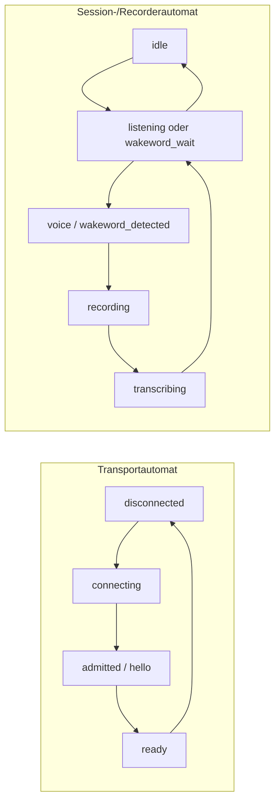
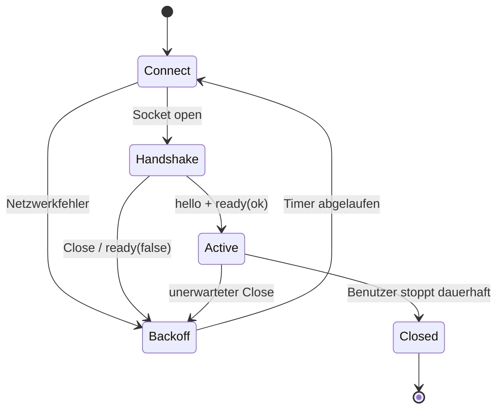

# Empfohlenes Client-Zustandsmodell

[← Event-Katalog](04-server-events-katalog-und-chronologie.md) · [HTTP-API →](06-http-api-und-authentifizierung.md)

Diese Seite übersetzt das Protokoll in ein belastbares Clientdesign. Sie ist
nicht serverseitig vorgeschrieben, passt aber zu den tatsächlich möglichen
Eventfolgen.

## Zwei getrennte Automaten

Ein Client sollte Verbindungs-/Transportzustand und Recorder-/Sprachzustand
getrennt halten. Ein einzelnes `isRecording`-Boolean kann die Serverzustände
nicht korrekt abbilden.



Der Streamautomat ist nur gültig, solange der Transportautomat dieselbe
`sessionId` besitzt.

## Empfohlenes State-Schema

```ts
interface ClientState {
  transport: "disconnected" | "connecting" | "admitted" | "ready" | "error";
  sessionId?: string;
  readyOk: boolean;
  serverStatus: string;
  streamingRequested: boolean;
  settings?: PublicSettings;
  limits?: Limits;
  models?: ModelLifecycle;
  segments: Map<number, TranscriptSegment>;
  segmentOrder: number[];
  timeline: TimelineEvent[];
  lastWarning?: ServerWarning;
  lastError?: ServerError;
  sessionMetrics?: SessionMetrics;
  pingStartedAt?: number;
  roundTripMs?: number;
}

interface TranscriptSegment {
  segmentId: number;
  text: string;
  final: boolean;
  lastSequence?: number;
  rawText?: string;
  stableText?: string;
  unstableText?: string;
  timing?: unknown;
  timeline?: SegmentTimeline;
  updatedAt?: number;
}
```

## Event-Reducer

```ts
function reduce(state: ClientState, event: ServerEvent): ClientState {
  switch (event.type) {
    case "hello":
      return {
        ...freshSessionState(state),
        transport: "admitted",
        sessionId: event.sessionId,
        settings: event.settings,
        limits: event.limits,
      };

    case "ready":
      return {
        ...state,
        transport: event.ok ? "ready" : "error",
        readyOk: event.ok,
        settings: event.settings ?? state.settings,
        limits: event.limits ?? state.limits,
        models: event.models ?? state.models,
      };

    case "status":
      return { ...state, serverStatus: event.state };

    case "realtime":
      return upsertRealtime(state, event);

    case "final":
      return upsertFinal(state, event);

    case "timeline":
      return appendTimeline(state, event);

    case "clear":
      return { ...state, segments: new Map(), segmentOrder: [], timeline: [] };

    case "metrics":
      return { ...state, sessionMetrics: event.metrics };

    case "pong":
      return finishPing(state);

    case "warning":
      return { ...state, lastWarning: event };

    case "error":
      return classifyError(state, event);

    default:
      return state;
  }
}
```

## Realtime-Upsert

```ts
function upsertRealtime(state: ClientState, event: RealtimeEvent): ClientState {
  const previous = state.segments.get(event.segmentId);
  if (previous?.final) return state;

  if (
    event.sequence != null &&
    previous?.lastSequence != null &&
    event.sequence < previous.lastSequence
  ) return state;

  const next = new Map(state.segments);
  next.set(event.segmentId, {
    ...previous,
    segmentId: event.segmentId,
    text: event.displayText ?? event.text,
    final: false,
    lastSequence: event.sequence ?? previous?.lastSequence,
    rawText: event.rawText,
    stableText: event.committedStableText ?? event.stableText,
    unstableText: event.visualUnstableText ?? event.unstableText,
    timing: event.timing,
    timeline: event.segment ?? previous?.timeline,
    updatedAt: event.timestamp,
  });
  return withOrderedSegment(state, next, event.segmentId);
}
```

Warum vollständiges Ersetzen statt Anhängen?

- `text`/`displayText` beschreibt die gesamte aktuelle Segmentansicht.
- Modelle korrigieren Wörter rückwirkend.
- `stableDelta` betrifft nur den bestätigten Präfix und reicht allein nicht aus,
  um den unstabilen Suffix korrekt zu rekonstruieren.

## Final-Upsert

```ts
function upsertFinal(state: ClientState, event: FinalEvent): ClientState {
  const previous = state.segments.get(event.segmentId);
  const next = new Map(state.segments);
  next.set(event.segmentId, {
    ...previous,
    segmentId: event.segmentId,
    text: event.text,
    final: true,
    timeline: event.segment ?? previous?.timeline,
    updatedAt: event.timestamp,
  });
  return withOrderedSegment(state, next, event.segmentId);
}
```

Ein Final ohne Realtime muss ein neues Segment anlegen. Ein Realtime nach Final
für dieselbe ID sollte ignoriert werden.

## Timeline und Transkript nicht vermischen

`timeline(realtime_transcript)` und `timeline(final_transcript)` spiegeln
Textmeilensteine. Würde ein Client sie ebenfalls in `segments` einfügen, entstünden
Duplikate. Empfohlene Trennung:

- `realtime` / `final` → Transkriptmodell;
- `timeline` → Ablauf-/Diagnosehistorie;
- `status` → momentane UI-Zustandsanzeige.

## Start, Stop und Clear

### Start

1. WebSocket offen.
2. `hello` erhalten und aktuelle `sessionId` gespeichert.
3. `ready.ok === true`.
4. Mikrofonzugriff herstellen.
5. `{ "type": "start" }` senden.
6. Erst dann Audiopakete senden.

Der Client kann `streamingRequested = true` sofort setzen, sollte den
bestätigten Serverzustand aber separat aus `status` ableiten.

### Stop

1. Keine neuen Audiopakete mehr erzeugen.
2. Bereits vollständig gebildetes letztes Paket senden.
3. `{ "type": "stop" }` senden.
4. `status(idle)` anzeigen.
5. Nachlaufende `final`-Events weiterhin annehmen.

Den Socket direkt nach `stop` zu schließen kann das letzte finale Ergebnis
verlieren.

### Clear

Der lokale Clear-Button darf die UI sofort optimistisch leeren. Für eine
serverseitig bestätigte Zustandsgrenze sollte der Client zusätzlich auf `clear`
warten. Ein Timeout bedeutet nicht zwingend, dass der Server nicht gelöscht hat;
das Protokoll besitzt keine Request-ID für genau-einmalige Befehlsbestätigung.

## Reconnect-Automat



Empfehlung:

- Exponentielles Backoff mit Jitter, z. B. 0,5 s → 1 s → 2 s → 4 s, gedeckelt.
- Close `1013` mindestens so behandeln wie Überlast, nicht sofort schleifen.
- Nach stabiler Verbindung Backoffzähler zurücksetzen.
- Bei jeder neuen `hello.sessionId` Sessionstate, Segmente und Timeline neu
  initialisieren.
- Mikrofon kann lokal offen bleiben, aber Audio erst nach neuem `start` senden.
- Keine alten Binärpakete replayen, sofern kein bewusstes Offline-Uploadkonzept
  implementiert wurde.

## Statusdarstellung

Eine angenehme UI gruppiert die feinen Serverzustände:

| UI-Gruppe | Serverzustände |
| --- | --- |
| Nicht aktiv | `idle`, `closed` |
| Wartet | `listening`, `wakeword_wait`, `wakeword_detected` |
| Eingang aktiv | `voice`, `silence` |
| Aufnahme | `recording` |
| Verarbeitung | `transcribing` |
| Hinweis/Timeout | `wakeword_timeout` |

`silence` bedeutet nicht automatisch Segmentende. Die konfigurierte
Post-Speech-Pause und weitere Recorderlogik entscheiden über Finalisierung.

## Wake-Word-Verhalten

Auch während `wakeword_wait` muss der Client kontinuierlich Audio senden, sonst
kann der Server das Weckwort nicht erkennen. Der Client sollte nicht versuchen,
die Wake-Word-Erkennung lokal anhand von Statusereignissen nachzubauen.

Nach `wakeword_followup_started` signalisiert `status(wakeword_detected)`, dass
eine Folgeäußerung ohne erneutes Weckwort beginnen kann. Das Fenster endet durch
eine neue Aufnahme oder `wakeword_followup_timeout`.

## Synchronisation und Zeit

- WebSocket-Textframes werden in Sendereihenfolge transportiert.
- Recorder-, Scheduler- und Textworker laufen nebenläufig; fachliche Ereignisse
  können eng verschachtelt sein.
- `timestamp` stammt von der Server-Wallclock.
- Für UI-Sortierung pro Socket ist Empfangsreihenfolge meist zuverlässiger;
  Timestamp ist für Anzeige/Korrelation nützlich.
- `segmentId` ist die primäre Korrelation für Text; nicht der Timestamp.

## Persistenz im Client

Wenn Transkripte über Reconnects hinweg erhalten bleiben sollen, sollte der
Client einen zusammengesetzten Schlüssel verwenden:

```text
serverIdentity + sessionId + segmentId
```

Nur `segmentId` ist nicht global eindeutig. Die serverseitige `sessionId` ist
zudem keine stabile Benutzer- oder Geräteidentität.
