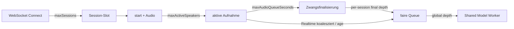

# Robustheit, Grenzen und Sicherheit

[← HTTP-API](06-http-api-und-authentifizierung.md) · [Protokollabgrenzung →](08-protokollabgrenzung.md)

## Belastungsmodell

Der Server schützt sich auf mehreren Ebenen. Ein Client sollte diese Grenzen als
normale Betriebszustände behandeln, nicht nur als Ausnahmefälle.



## Implementierte Limits

| Limit | Standard im Code | Produktionsprofil | Wirkung |
| --- | --- | --- | --- |
| `max_sessions` | 4 | 8 | weitere Verbindung: `error(admission)` + Close 1013 |
| `max_active_speakers` | 4 | 4 | weitere gleichzeitige Aufnahme wird ignoriert, `warning` |
| `audio_queue_size` | 128 | 128 | Recorder-Latenz-/Queuegrenze pro Session |
| `max_audio_packet_bytes` | 524.288 | 524.288 | größeres Binärpaket: `error(audio_packet)` |
| Metadatenlänge | 65.536 | 65.536 | im Protokollmodul fest |
| `max_audio_queue_seconds_per_session` | 30 s | 30 s | lange Aufnahme wird finalisiert, `warning` |
| `max_realtime_queue_age_ms` | 1.500 ms | 1.500 ms | alte Realtime-Jobs werden verworfen |
| `max_final_queue_depth_per_session` | 8 | 8 | weitere Finals abgelehnt/Recorderbacklog getrimmt |
| `max_global_inference_queue_depth` | 64 | 64 | neue Jobs werden abgelehnt |
| `realtime_min_audio_seconds` | 0,25 s | 0,25 s | vor dieser Dauer kein Realtime-Job |
| `realtime_max_audio_seconds` | 20 s | 20 s | Realtime betrachtet begrenztes Audiofenster |
| OpenAI-Dateigröße | 25 MiB | 25 MiB | HTTP 413 |

Die Runtime-Werte können abweichen. `hello.limits` enthält die kompakte
Live-Sicht; `hello.settings` bzw. `/api/config` liefern weitere Werte.

## Überlast und Backpressure

### Realtime

Realtime ist bewusst „latest wins“:

- ein wartendes Update je Session;
- neuere Beobachtung ersetzt ältere;
- überalterte Jobs werden gedroppt;
- Drops erscheinen in `coalescedRealtime` und `staleRealtimeDiscarded`;
- die Verbindung bleibt bestehen.

Ein Client darf daher keine feste Anzahl Realtime-Events pro Sekunde erwarten.
Fehlende Zwischenupdates sind keine Lücke im finalen Transkriptvertrag.

### Final

Finale Jobs werden gegenüber Realtime innerhalb einer Session priorisiert, aber
nicht unbegrenzt gepuffert. Bei dauerhaft schnellerer Audioerzeugung als
Inferenz können Recorded-Segmente verworfen werden. Das ist ein Datenverlust und
wird als `warning` gemeldet.

### Aktive Sprecher

Eine angenommene Session garantiert noch keinen aktiven Sprecher-Slot. Er wird
erst beim Aufnahmebeginn reserviert. Wird das globale Limit erreicht, bleibt die
Session verbunden und kann später erneut Sprache liefern.

## Fehlerstrategie

| Situation | Automatisch reconnecten? | Empfohlene Aktion |
| --- | --- | --- |
| Close 1013 / Admission | ja, mit langem Backoff | Kapazitätshinweis zeigen |
| Netzwerkclose | ja, mit Backoff/Jitter | neue Session vollständig handshaken |
| `error(command)` | nein | Clientbug/Payload korrigieren |
| `error(audio_packet)` | nein | Encoder/Paket verwerfen; bei Serie Aufnahme stoppen |
| `warning` | nein | melden und Ursache klassifizieren |
| `ready(ok=false)` / Enginefehler | später erneut prüfen | Health pollen oder Verbindung mit Backoff neu aufbauen |
| einzelne leere Realtimephase | nein | auf Final warten |
| Pingtimeout | nicht sofort | Socketzustand prüfen; nach mehreren Timeouts reconnecten |

## Timeouts für einen Client

Der Server schreibt keine verbindlichen Clienttimeouts vor. Sinnvolle
Startwerte:

| Phase | Vorschlag | Begründung |
| --- | --- | --- |
| Socket-Verbindung | 10–15 s | Netzwerk/Proxy |
| `hello` nach Open | 5 s | Sessionanlage sollte kurz sein |
| initiales `ready` | deutlich länger, z. B. 180 s | CPU-Modellstart/Healthcheck erlaubt ebenfalls 180 s Startphase |
| Ping | alle 2,5–15 s | Browserreferenz nutzt 2,5 s; Produkt kann sparsamer sein |
| Pong | 2–3 Intervalle | keine Ping-ID, kurzzeitige Last tolerieren |
| finales Ergebnis nach Stop | produktabhängig, mindestens mehrere Sekunden | Queue + Lazy-Modellstart möglich |

Bei entladenen Modellen kann die erste Inferenz deutlich länger als spätere
Anfragen dauern. Ein pauschaler kurzer Finaltimeout wäre daher fehleranfällig.

## Sicherheitslage des implementierten Protokolls

### WebSocket-Autorisierung

`/ws/transcribe` hat im Handler keine Authentifizierung. Konsequenzen:

- Jeder Netzwerkakteur, der den Endpunkt erreicht, kann einen Session-Slot
  belegen und Audio zur Verarbeitung senden.
- Kapazitätsgrenzen reduzieren Ressourcenverbrauch, ersetzen aber keine Auth.
- Ein permanenter Key im Querystring wäre ungünstig, da URLs oft geloggt werden.
- Vor breiter Verteilung empfiehlt sich ein vorgeschalteter Auth-Mechanismus
  oder eine Protokollerweiterung mit kurzlebigem Sessiontoken.

Das gilt auch für sessionlokale Wake-Word-Queryparameter. Sie verändern keine
globale Konfiguration und akzeptieren keine freien Pfade, können aber die
Initialisierung lokaler OpenWakeWord-Modelle und damit Ressourcenverbrauch
auslösen. Reverse Proxy, Sessionlimit, Connection-/Rate-Limits und Monitoring
sind deshalb weiterhin Teil der Produktionshärtung.

Diese Dokumentation erfindet bewusst keinen Tokenparameter: Ein Client darf nur
Felder senden, die der Server tatsächlich auswertet.

### Admin-Secrets

- Admin-Key nie in normale Desktop-/Webclient-Bundles einbetten.
- Web-Frontendcode ist für Endnutzer einsehbar; dort hat ein Admin-Key keinen
  sicheren Speicherort.
- OpenAI- und Admin-Key getrennt halten.
- YAML-Dateien verbieten Secrets bereits durch den Loader; Secrets gehören in
  die Umgebung/Secret-Verwaltung.

### Öffentlich lesbare Betriebsdaten

`/health`, `/api/config` und `/api/metrics` verlangen im Servercode keine
Authentifizierung. Besonders `/api/metrics` enthält aktive Session-IDs und
detaillierte Auslastung. Falls dies nicht öffentlich sein soll, auf Proxy- oder
Netzwerkebene begrenzen.

## Datenschutz und Logging

| Setting | Risiko / Wirkung |
| --- | --- |
| `request_logging_enabled` | erzeugt strukturierte Auditdaten |
| `request_log_transcripts` | kann erkannten Text in Requestlogs speichern |
| `request_log_stdout` | kann Daten in zentrale Containerlogs/Dozzle spiegeln |
| `save_audio_files` | speichert Audio auf Serverdisk |
| `performance_logging_enabled` | schreibt Latenz-/Ressourcendaten, laut Implementierung ohne Transkripttext |
| `transcription_logging_enabled` | schreibt transportübergreifende Transkriptionsereignisse; Finaltext folgt `request_log_transcripts` |
| `event_store_enabled` | persistiert strukturierte Ereignisse zusätzlich in SQLite für Historienabfragen |
| `log_live_enabled` | erlaubt einen separaten, authentifizierten Log-WebSocket |

Im Produktionsprofil sind Requestlogging und Transkriptlogging aktiv,
Audioarchivierung ist deaktiviert. Ein Clientprodukt sollte Nutzer über die
tatsächliche serverseitige Datenverarbeitung informieren und nicht allein aus
`save_audio_files: false` ableiten, dass keine textuellen Inhalte protokolliert
werden.

Ein Sessionclient erhält den Log-Zugriffstoken ausschließlich in `hello`.
Dieser Token darf nur die eigene Session und die Kanäle `audit`,
`transcription` und `performance` lesen. Der Systemkanal und
sessionübergreifende Abfragen bleiben dem Adminzugriff vorbehalten. Tokens
gehören nicht in URLs, damit sie nicht in Proxy- und Accesslogs auftauchen.

## Audioqualität und Paketierung

- PCM vor Quantisierung auf `[-1, 1]` clampen, anschließend auf signed Int16
  skalieren.
- Keine Float32-Samples als `pcm_s16le` deklarieren.
- Kanalzahl und `frames` müssen zur Nutzlast passen.
- Pakete vorzugsweise in gleichmäßiger Kadenz senden; sehr große Bursts erhöhen
  Queue-Latenz.
- 40 ms Mono-Pakete wie im Browserclient sind ein guter Startwert.
- Bei Sample-Rate-Wechsel (z. B. Audiogerät neu geöffnet) `sampleRate` in jedem
  Paket korrekt setzen; der Server validiert pro Paket.
- Audio muss auch in `wakeword_wait` kontinuierlich fließen.

## Race Conditions, die der Client tolerieren muss

1. `status(idle)` kann vor einem nachlaufenden `final` eintreffen.
2. `ready` als Broadcast kann ohne `sessionId` und `models` eintreffen.
3. `error` eines Startworkers kann serverweit ohne `sessionId` eintreffen.
4. `clear` und bereits unterwegs befindliche Events können sehr eng
   aufeinanderfolgen; nach verarbeitetem `clear` sollte der Client ältere lokale
   Arbeit verwerfen.
5. `status` darf denselben State mehrfach melden.
6. Final kann ohne vorheriges Realtime eintreffen.
7. Bei Disconnect gibt es kein letztes garantiertes Status-/Finalevent.

## Abnahmetest-Checkliste für einen neuen Client

### Handshake und Transport

- [ ] `hello` und beide gültigen `ready`-Formen werden akzeptiert.
- [ ] Admission-Fehler vor `hello` wird korrekt angezeigt.
- [ ] Close 1013 führt nicht zu einer aggressiven Reconnect-Schleife.
- [ ] Text- und Binärframes werden strikt getrennt.
- [ ] Little-Endian-Metadatenlänge und UTF-8 JSON sind korrekt.

### Audio

- [ ] 16 kHz und 48 kHz Mono funktionieren.
- [ ] Optionales Mehrkanalformat wird korrekt interleaved gesendet.
- [ ] `frames` stimmt exakt; Randfälle erzeugen verständliche Clientlogs.
- [ ] Audio wird erst nach `start` gesendet.
- [ ] `stop` beendet neue Pakete, lässt aber Finalevents nachlaufen.

### Textmodell

- [ ] Realtime ersetzt statt anzuhängen.
- [ ] Mehrere Segmente bleiben anhand `segmentId` getrennt.
- [ ] Final ohne Realtime wird angelegt.
- [ ] Realtime nach bereits finalem Segment wird ignoriert.
- [ ] `clear` leert Transkript und Timeline.
- [ ] Neue `sessionId` nach Reconnect startet einen frischen Namespace.

### Zustände und Wake Word

- [ ] Statuswiederholungen sind idempotent.
- [ ] Wake-Wartephase sendet weiterhin Audio.
- [ ] Wake-Timeout und Follow-up-Timeout werden unterschieden.
- [ ] Aufnahme-/Timelinefelder werden bei Fehlen tolerant behandelt.
- [ ] `wakeWordEnabled=false`, `true` und Vererbung werden gegen
      `hello.sessionConfig` geprüft.
- [ ] Fallbacks/Warnungen werden sichtbar behandelt; ein
      `session_config`-Fehler mit Close 1008 erzeugt keine Reconnectschleife.

### Fehler und Last

- [ ] `warning` schließt den Socket nicht automatisch.
- [ ] Audio-Paketfehler verwirft nur das Paket.
- [ ] Realtime-Coalescing wird nicht als Finalverlust interpretiert.
- [ ] Modell-Lazy-Reload toleriert hohe erste Latenz.
- [ ] Unbekannte Eventtypen/Felder brechen den Parser nicht.

## Serverseitige Referenztests

Die relevanten automatisierten Tests liegen insbesondere in:

```text
tests/unit/test_fastapi_server_protocol.py
tests/unit/test_fastapi_server_multi_user.py
tests/unit/test_fastapi_server_multi_user_asr_integration.py
tests/unit/test_openai_compatible_endpoint.py
tests/unit/test_server_operations.py
```

Für einen externen Client lohnt sich zusätzlich ein eigener Contract-Test, der
den realen WebSocket startet, `start`/Audio/`stop` sendet und Events bis zum
passenden `final.segmentId` sammelt.
