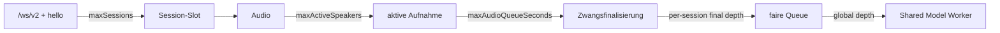

# Robustheit, Grenzen und Sicherheit (V2)

[← HTTP-API](06-http-api-und-authentifizierung.md) · [Protokollabgrenzung →](08-protokollabgrenzung.md) · [Übersicht](README.md)

## Belastungsmodell

Der Server schützt sich auf mehreren Ebenen. Ein Client sollte diese Grenzen als
normale Betriebszustände behandeln, nicht nur als Ausnahmefälle.


```mermaid
flowchart LR
    A["/ws/v2 + hello"] -->|maxSessions| B["Session-Slot"]
    B --> C["Audio"]
    C -->|maxActiveSpeakers| D["aktive Aufnahme"]
    D -->|maxAudioQueueSeconds| E["Zwangsfinalisierung"]
    E -->|per-session final depth| F["faire Queue"]
    F -->|global depth| G["Shared Model Worker"]
```

## Implementierte Limits

| Limit | Standard im Code | Wirkung auf einen V2-Client |
| --- | --- | --- |
| `max_sessions` | 4 (Produktionsprofil 8) | weitere Verbindung: `session.rejected` (`session_limit_reached`) + Close `4409` |
| `max_active_speakers` | 4 | weitere gleichzeitige Aufnahmen anderer Sessions starten nicht; die Session bleibt verbunden |
| `max_audio_packet_bytes` | 524 288 | größeres Audioframe wird still verworfen |
| Metadatenlänge | 65 536 (fest) | größeres Audioframe wird still verworfen |
| `max_audio_queue_seconds_per_session` | 30 s | lange Aufnahme wird finalisiert |
| `max_final_queue_depth_per_session` | 8 | weitere Final-Jobs abgelehnt / Recorderbacklog getrimmt |
| `max_global_inference_queue_depth` | 64 | neue Jobs werden abgelehnt |
| OpenAI-Dateigröße | 25 MiB | HTTP 413 |

Aktuelle Werte: `GET /api/config` (`settings`, `limits`). V2 sendet keine
`warning`-Nachrichten; Überlast zeigt sich an ausbleibenden oder
fehlgeschlagenen Segmentterminals (`transcription.failed`,
`activation.failed`) und in `GET /api/metrics`.

## Überlast und Backpressure

* **Final:** Finale Jobs sind priorisiert, aber begrenzt. Bei dauerhaft
  schnellerer Audioerzeugung als Inferenz können aufgezeichnete Segmente
  verloren gehen.
* **Aktive Sprecher:** Eine angenommene Session garantiert noch keinen
  Sprecher-Slot; er wird beim Aufnahmebeginn reserviert.
* **Modelle:** Nach Idle-Unload lädt die erste Inferenz die Modelle
  synchron nach; das erste `transcription.completed` kann deutlich länger
  dauern.

## Fehlerstrategie

| Situation | Automatisch reconnecten? | Empfohlene Aktion |
| --- | --- | --- |
| Close `4409` `session_limit_reached` | ja, langer Backoff | Kapazitätshinweis |
| Close `4409` sonst, `4406`, `4400` | nein | Konfiguration/Clientbug beheben |
| Close `4408` | einmal | wiederholt → Clientbug (kein `hello` gesendet) |
| Close `1011` / Netzwerkabbruch | ja, Backoff + Jitter | neue Session, Settings neu patchen |
| Ack `invalid_payload`, `stale_session`, `command_id_conflict` | nein | Clientbug |
| Ack `activation_locked`, `not_active`, `stale_activation`, `invalid_phase` | nein | Spiegel per Snapshot abgleichen |
| Ack `internal_error` | nein | loggen; bei Häufung neu verbinden |
| Ack bleibt aus | – | Verbindung prüfen; nach Timeout neu verbinden |
| `eventSeq`-Lücke | nein | `session.snapshot.request` |

## Timeouts für einen Client

| Phase | Vorschlag | Begründung |
| --- | --- | --- |
| Socket-Verbindung | 10–15 s | Netzwerk/Proxy |
| `hello` senden | sofort nach Open | Server schließt nach 10 s mit `4408` |
| `hello.accepted` | 10–30 s | Sessionaufbau erzeugt einen Recorder |
| `command.ack` | einige Sekunden | Acks sind synchron; Ausbleiben = Transportproblem |
| `transcription.completed` nach `finish` | produktabhängig, mindestens mehrere Sekunden | Queue + Lazy-Modellstart |
| Keepalive | WebSocket-Ping der Clientbibliothek | V2 hat kein `ping`-Command |

## Sicherheitslage des implementierten Protokolls

### WebSocket-Autorisierung

`/ws/v2` (wie `/ws/transcribe`) hat im Handler keine Authentifizierung:

- Jeder, der den Endpunkt erreicht, kann einen Session-Slot belegen und Audio
  senden.
- Kapazitätsgrenzen reduzieren Ressourcenverbrauch, ersetzen aber keine Auth.
- Ein vorgeschalteter Auth-Mechanismus (Reverse Proxy, Netzwerkgrenze) ist
  eine Deploymententscheidung außerhalb dieses Repositories.

Diese Dokumentation erfindet bewusst keinen Tokenparameter: Ein Client darf nur
Felder senden, die der Server tatsächlich auswertet.

### Admin-Secrets

- Admin-Key nie in normale Desktop-/Webclient-Bundles einbetten.
- Web-Frontendcode ist für Endnutzer einsehbar; dort hat ein Admin-Key keinen
  dauerhaften sicheren Speicherort. Die mitgelieferte Adminoberfläche hält
  einen manuell eingegebenen Key deshalb nur im Passwortfeld der aktuellen
  Seite und schreibt ihn weder in URL noch Browserstorage.
- OpenAI- und Admin-Key getrennt halten.
- YAML-Dateien verbieten Secrets bereits durch den Loader; Secrets gehören in
  die Umgebung/Secret-Verwaltung.

### Öffentlich lesbare Betriebsdaten

`/health`, `/api/config` und `/api/metrics` verlangen im Servercode keine
Authentifizierung. Besonders `/api/metrics` enthält aktive Session-IDs und
detaillierte Auslastung. Falls dies nicht öffentlich sein soll, auf Proxy- oder
Netzwerkebene begrenzen.

## Datenschutz und Logging

| Setting | Risiko / Wirkung |
| --- | --- |
| `request_logging_enabled` | aktiviert den Audit-Kalender-/stdout-Spiegel; kanonische Events bleiben SQLite-first |
| `request_log_transcripts` | Legacy-Schalter für `transcript_log_mode` |
| `transcript_log_mode` | kann finalen oder vollständigen Text ausschließlich im Transkriptionskanal speichern |
| `request_log_stdout` | kann Daten in zentrale Containerlogs/Dozzle spiegeln |
| `save_audio_files` | speichert Audio auf Serverdisk |
| `performance_logging_enabled` | Quellschalter: `false` verhindert die Erzeugung von Performanceevents vollständig |
| `performance_log_mirror_enabled` | aktiviert nur den optionalen Performance-Kalender-/stdout-Spiegel; SQLite-first bleibt für erzeugte Events verbindlich |
| `transcription_logging_enabled` | aktiviert den Transkriptions-Kalender-/stdout-Spiegel; Text folgt `transcript_log_mode` |
| `event_store_enabled` | aktiviert den kanonischen SQLite-Commit für alle strukturierten Events |
| `log_live_enabled` | erlaubt den separaten, authentifizierten SQLite-first Log-WebSocket; benötigt den Eventstore |

Im Produktionsprofil sind Requestlogging und Transkriptlogging aktiv,
Audioarchivierung ist deaktiviert. Ein Clientprodukt sollte Nutzer über die
tatsächliche serverseitige Datenverarbeitung informieren und nicht allein aus
`save_audio_files: false` ableiten, dass keine textuellen Inhalte protokolliert
werden.

Ein Legacy-V1-Sessionclient erhält den Log-Zugriffstoken ausschließlich in
`hello` (V2 erhält keinen, siehe [06](06-http-api-und-authentifizierung.md#strukturierter-logzugriff)).
Dieser Token darf nur die eigene Session und die Kanäle `audit`,
`transcription` und `performance` lesen. Der Systemkanal und
sessionübergreifende Abfragen bleiben dem Adminzugriff vorbehalten. Tokens
gehören nicht in URLs, damit sie nicht in Proxy- und Accesslogs auftauchen.

Optional langsame oder volle JSONL-/stdout-Queues dürfen Events aus ihrem
Spiegel verlieren, nicht aber aus SQLite oder `/ws/logs`. Live-Subscriber
transportieren keine kanonischen Payloads in einer Best-Effort-Queue, sondern
werden nur aufgeweckt und lesen den committed Bereich aus SQLite nach. Deshalb
sind gefilterte Cursorsprünge normal; nur `log.gap(reason=retention)` bezeichnet
eine nicht mehr replaybare Spanne. Persistente Retention-Watermarks werden pro
Channel und Session geführt, sodass die Löschung eines Transkriptionsereignisses
auch dann erkannt wird, wenn ein älteres Event eines anderen Channels den
globalen `oldestCursor` unverändert lässt.

## Audioqualität und Paketierung

- PCM vor Quantisierung auf `[-1, 1]` clampen, anschließend auf signed Int16
  skalieren.
- Keine Float32-Samples als `pcm_s16le` deklarieren.
- `channels` und `frames` müssen zur Nutzlast passen; sonst wird das Frame
  still verworfen.
- Pakete in gleichmäßiger Kadenz senden (20–100 ms); große Bursts erhöhen die
  Latenz.
- Bei Wechsel des Audiogeräts `sampleRate` in jedem Paket korrekt setzen.
- Audio auch ohne offene Activation kontinuierlich senden (Wake Word,
  Sprachbeginn).

## Race Conditions, die der Client tolerieren muss

1. Das Activation-Terminal kann vor `activation.input_closed` eintreffen.
2. Beim Abbruch kann `transcription.discarded` vor `segment.recording_ended`
   desselben Segments kommen.
3. Events eines Commands kommen vor seinem Ack; das Ack trägt ggf. eine
   ältere `stateVersion`.
4. Ein Wake-Treffer kann eine Activation öffnen, während der Client gerade
   `activate` sendet → `activation_locked`.
5. `transcription.completed` älterer Activations kann nach
   `activation.started` einer neuen Activation eintreffen.
6. Bei Disconnect gibt es kein garantiertes letztes Event.
7. Audio- und Log-WebSocket fallen unabhängig aus.

## Abnahmetest-Checkliste für einen neuen V2-Client

### Handshake und Transport

- [ ] `hello` als erstes Frame; nichts vor `hello.accepted`.
- [ ] `protocol.incompatible`/`session.rejected` werden angezeigt, ohne
      Reconnect-Schleife.
- [ ] Close-Codes `4400`, `4406`, `4408`, `4409`, `1011` werden unterschieden.
- [ ] Zustand wird aus `hello.accepted.snapshot` initialisiert.

### Commands

- [ ] Jede `commandId` ist eine neue kanonische UUID; Retries byte-gleich.
- [ ] Alle 15 Result-Codes werden behandelt.
- [ ] `activate` ohne `activationId`, Controls ohne `source`.

### Events und Zustand

- [ ] Duplikate (`eventSeq ≤ last`) werden verworfen, Lücken lösen einen
      Snapshot aus, gepufferte Events werden nachgezogen.
- [ ] Terminal vor `input_closed` wird korrekt dargestellt.
- [ ] Erstes Segmentterminal ist endgültig.
- [ ] Unbekannte Eventtypen/Felder brechen den Parser nicht.

### Audio

- [ ] Längenpräfix Little-Endian, UTF-8-JSON mit `sampleRate`, `pcm_s16le`.
- [ ] 16 kHz und 48 kHz Mono funktionieren.
- [ ] Audio fließt kontinuierlich; Geräteverlust → `audio_availability.set`.

### Wake Words und Settings

- [ ] Katalog wird geladen, nur kanonische IDs gesendet.
- [ ] `settings_revision_conflict` führt zu Snapshot + erneutem Patch.
- [ ] Nach Reconnect werden Settings erneut gesetzt.

## Serverseitige Referenztests

```text
tests/unit/test_protocol_v2_contract.py      Vektoren, Envelope, Ack-Projektion
tests/unit/test_protocol_v2_e2e.py           echte /ws/v2-Route Ende-zu-Ende
tests/unit/test_protocol_v2_state_version.py stateVersion-Regeln
tests/unit/test_protocol_v2_races.py         Nebenläufigkeit, Linearisierung
tests/unit/test_protocol_v2_settings.py      session_settings.patch, REST-v2-Settings
tests/unit/test_protocol_v1_v2_boundary.py   Trennung V1/V2
tests/unit/test_wakeword_session_e2e.py      Wake-Admission und -Events über /ws/v2
tests/contracts/protocol-v2-vectors.json     maschinenlesbare Vertragsvektoren
```
