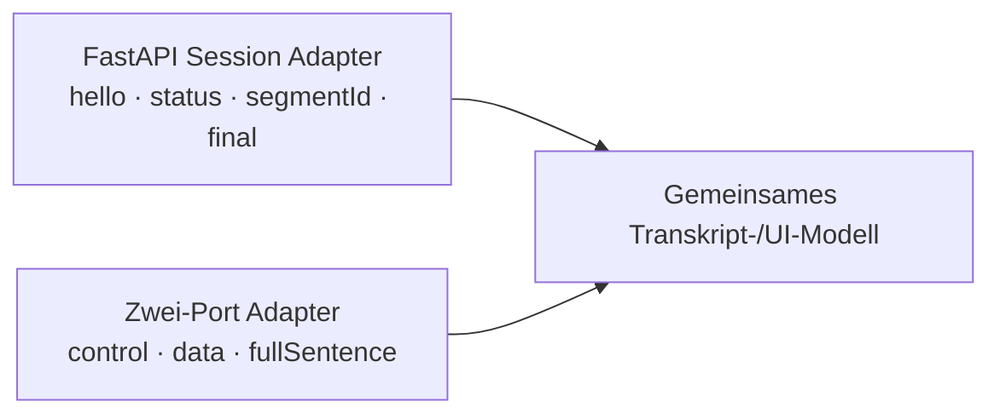

# Abgrenzung der Serverprotokolle im Repository

[← Robustheit & Sicherheit](07-robustheit-grenzen-und-sicherheit.md) · [Betriebsmodi & Serverkonfiguration →](09-betriebsmodi-und-serverkonfiguration.md) · [Zur Übersicht](README.md)

## Entscheidung für neue Clients

Für die Neuentwicklung eines Clients für den aktuellen Produktionsserver gilt:

```text
VoiceSTT_server.server
        ↓ re-exportiert
api_fastapi_server.server
        ↓
WS /ws/transcribe auf einem HTTP-/HTTPS-Port
```

Dieses Single-WebSocket-Protokoll ist auf den vorherigen Seiten vollständig
dokumentiert und ist die primäre Live-Schnittstelle.

## Warum die Abgrenzung nötig ist

Zusätzlich existiert mit `VoiceSTT_server/stt_server.py` eine eigenständige
WebSocket-Serverimplementierung. Sie verwendet ein anderes Transportmodell:

| Merkmal | Produktiver FastAPI-Server | Separate Zwei-Port-Implementierung |
| --- | --- | --- |
| Einstiegspunkt | `VoiceSTT_server.server` | `VoiceSTT_server.stt_server` |
| Verbindung | ein WebSocket | Control- und Data-WebSocket getrennt |
| Standardports | HTTP-Port 8010 | Control 8011, Data 8012 |
| Livepfad | `/ws/transcribe` | Portbasierte Handler ohne FastAPI-Pfad |
| Sessionmodell | unabhängiger Recorder je Verbindung | gemeinsamer Recorder-/Broadcastansatz |
| Clientbefehle | `start`, `stop`, `clear`, `ping`, `metrics` | `set_parameter`, `get_parameter`, `call_method` |
| Audioframe | identischer Grundaufbau mit Metadatenlänge + JSON + PCM | ebenfalls Metadatenheader + Audio, aber separater Datakanal |
| Serverevents | `hello`, `ready`, `status`, `timeline`, `realtime`, `final`, … | Recordercallback-Nachrichten wie `realtime`, `fullSentence`, VAD-/Wake-Callbacks |
| Multiuser-Isolation | explizit pro Session | Broadcast an Data-Verbindungen |
| HTTP-/OpenAI-API | vorhanden | nicht Teil dieses Servers |

Beide verwenden WebSockets. Die Unterscheidung ist keine Wertung des
WebSocket-Ansatzes, sondern verhindert, dass ein Client Befehle, Ports oder
Eventnamen zweier nicht protokollkompatibler Server mischt.

## Erkennungsregel

Ein Client für `/ws/transcribe` sollte nach Verbindungsaufbau `hello` erwarten.
Erhält ein Client stattdessen direkt Recordercallback-Events und nutzt getrennte
Control-/Data-URLs, arbeitet er mit der Zwei-Port-Implementierung und benötigt
einen anderen Adapter.

## Keine automatische Protokollverhandlung

Es gibt aktuell:

- kein gemeinsames Protokollversionsfeld im Handshake;
- keine automatische Umschaltung zwischen Single- und Zwei-Port-Modus;
- keine Übersetzung von `fullSentence` zu `final` im FastAPI-Handler;
- keine gemeinsame Session-ID über beide Implementierungen.

Ein Client sollte den Servermodus daher explizit konfigurieren. Für den
Produktionshost `stt.voice.marcosudau.com` ist der dokumentierte Modus:

```text
wss://stt.voice.marcosudau.com/ws/transcribe
```

## Empfehlung für eine gemeinsame Clientcodebasis

Wenn beide Implementierungen unterstützt werden sollen, trennt eine
Adaptergrenze die Protokolle sauber:



Das gemeinsame Domänenmodell kann `interim`, `final`, `state`, `warning` und
`error` enthalten. Verbindung, Befehle, Ack-Semantik und Segmentidentität
bleiben adapterspezifisch.
