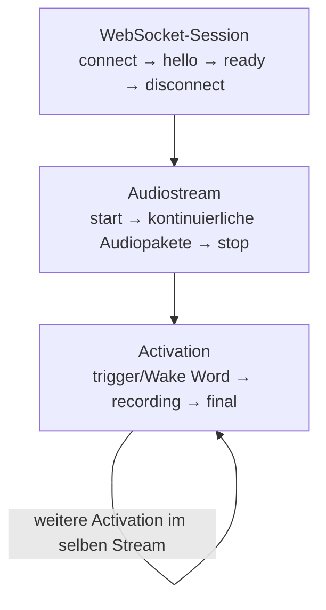

# Triggerquellen und sessionlokale Wake-Word-Konfiguration

[← Protokollabgrenzung](08-protokollabgrenzung.md) · [Zur Übersicht](README.md)

> **Diese Datei hieß früher „Betriebsmodi und sessionlokale
> Wake-Word-Konfiguration".** Der Begriff *Betriebsmodus* hat keine aktive
> fachliche Bedeutung mehr: es gibt keinen Hotkey-Modus und keinen
> Wake-Word-Modus, sondern **eine** Session mit **zwei unabhängig
> aktivierbaren Triggerquellen**. Der Abschnitt
> [Legacy-Verhalten](#legacy-verhalten) beschreibt, was für alte Clients
> weiterhin gilt.
>
> Die vollständige Architektur steht in
> [`docs/einheitliche-triggerarchitektur.md`](../einheitliche-triggerarchitektur.md).

## Zweck und aktueller Stand

Eine Clientverbindung besitzt:

- genau **eine** Session,
- genau **einen** kontinuierlichen Audiostream,
- genau **eine** serverseitige Aktivierungszustandsmaschine,
- genau **eine** Recorder-/VAD-/Transkriptionspipeline,
- und **zwei unabhängig aktivierbare Triggerquellen**: `manual` und
  `wake_word`.

Beide Quellen öffnen dieselbe Art von Activation und teilen sich danach
denselben Aufnahme-, Timer- und Transkriptionspfad.

Version 1 des sessionlokalen Wake-Word-Contracts unterstützt ausschließlich
OpenWakeWord. Clients übergeben logische Modell-IDs, niemals Serverpfade.

## Lebenszyklen

`start` und `stop` sind **ausschließlich Streambefehle**. Ein Trigger wird
niemals auf sie abgebildet.



Der Stream wird **einmal** gestartet und läuft weiter, während mehrere
Activations nacheinander stattfinden. Ein `finish` beendet die Activation,
nicht den Stream.

Sessioneinstellungen werden vor dem Erzeugen des Recorders aus einem atomaren
Snapshot der Serverkonfiguration aufgelöst und bleiben für die gesamte
Verbindung unverändert. Eine Änderung der Triggerkonfiguration benötigt daher
einen Reconnect; `start` oder `stop` lösen keine neue Konfigurationsauflösung
aus.

## Die drei gültigen Triggerkombinationen

| `manualTriggerEnabled` | `wakeWordTriggerEnabled` | Bedeutung |
| --- | --- | --- |
| `true` | `false` | nur der Hotkey öffnet eine Activation |
| `false` | `true` | nur das Wake Word öffnet eine Activation |
| `true` | `true` | beide Quellen öffnen **dieselbe** Activation |
| `false` | `false` | **ungültig**, wird bei der Admission abgelehnt |

In allen drei gültigen Kombinationen gilt dasselbe Streamverhalten: der Client
sendet nach `ready` einmal `start` und danach **kontinuierlich** Audio. Der
Server entscheidet über das Activation Gate, ob daraus eine Aufnahme wird.

### Manualtrigger

```text
wss://SERVER/ws/transcribe?manualTriggerEnabled=true&wakeWordTriggerEnabled=false
```

Der Hotkeydruck ist zunächst nur eine lokale Absicht. Der Client sendet ein
`trigger`-Kommando und darf erst nach einem `trigger_ack` mit
`accepted: true` fachliches Feedback auslösen. Details in
[WebSocket-Protokoll](02-websocket-protokoll.md#triggerkommandos).

### Wake-Word-Trigger

```text
wss://SERVER/ws/transcribe?manualTriggerEnabled=false&wakeWordTriggerEnabled=true&wakeWordEnabled=true
```

`wakeWordTriggerEnabled` erlaubt einem erkannten Wake Word, eine Activation zu
öffnen. Ob überhaupt erkannt wird, regelt weiterhin das Wake-Word-Profil über
`wakeWordEnabled` und die zugehörigen Tuningparameter. Ist das Wake Word die
**einzige** Triggerquelle und kein Profil aktiv, lehnt der Server die Session
mit `activation_wake_word_unavailable` ab, statt taub zu laufen.

### Beide Quellen

```text
wss://SERVER/ws/transcribe?manualTriggerEnabled=true&wakeWordTriggerEnabled=true&wakeWordEnabled=true
```

Der erste Trigger eröffnet die Activation und wird deren `primarySource`. Jeder
weitere `activate`-Versuch — derselben oder der anderen Quelle — wird
deterministisch mit `activation_locked` abgelehnt und lässt die laufende
Activation vollständig unverändert. Es entsteht keine zweite Activation, kein
zweites Segment und kein zweites Final.

## Legacy-Verhalten

Eine Session, die **weder** `manualTriggerEnabled` **noch**
`wakeWordTriggerEnabled` sendet, verhält sich **exakt wie bisher**:

- `activationConfig.mode` ist `legacy`,
- es wird kein `ActivationController` angelegt,
- das Recorder-Gate bleibt in der `legacy`-Policy,
- der bisherige Wake-Word-Follow-up läuft unverändert,
- ein `trigger`-Kommando würde mit `controlled_activation_disabled` abgelehnt.

Das ist der Pfad, auf dem alte Desktop- und Browserclients weiterlaufen. Er
ist bewusst erhalten und wird nicht entfernt.

Die frühere Gegenüberstellung „Hotkey-Modus gegen Wake-Word-Modus" beschreibt
genau dieses Legacy-Verhalten und ist deshalb **kein** aktueller
Architekturzustand mehr.

## Session-Create-Contract


Alle Werte werden als Queryparameter am WebSocket-Upgrade übergeben. Der
Contract ist versioniert und wird in `hello.sessionCapabilities` sowie
`ready.sessionCapabilities` beschrieben.

| Queryparameter | Typ/Werte | Bedeutung |
| --- | --- | --- |
| `wakeWordEnabled` | `true`, `false`, `null`, `inherit` | entscheidender Tri-State-Schalter |
| `wakeWordBackend` | `openwakeword` | optionaler Backendwunsch |
| `wakeWords` | kommaseparierte Modell-IDs | gewünschte Wake Words aus dem Serverkatalog |
| `wakeWordInferenceFramework` | `onnx`, `tflite` | gewünschtes lokal verfügbares Modellformat |
| `wakeWordSensitivity` | `0.0`–`1.0` | Erkennungsschwelle |
| `wakeWordActivationDelay` | `0.0`–`3600.0` s | Verzögerung bis zum Wake-Word-Gate |
| `wakeWordTimeout` | `0.0`–`3600.0` s | Sprach-Timeout nach Erkennung |
| `wakeWordBufferDuration` | `0.0`–`60.0` s | Wake-Word-Puffer |
| `wakeWordFollowupWindow` | `0.0`–`3600.0` s | Follow-up-Fenster |

Querywerte müssen URL-kodiert werden. `wakeWordEnabled` darf unabhängig vom
Modus höchstens einmal vorkommen. Bei `wakeWordEnabled=true` dürfen auch die
übrigen Wake-Word-Felder nicht mehrfach vorkommen; mehrdeutige Angaben führen
vor der Sessionaufnahme zu einem Konfigurationsfehler. Im Modus `inherit` oder
`false` werden zusätzliche Wake-Word-Felder nicht angewendet und als ignoriert
bestätigt.

### `wakeWordEnabled` fehlt, ist `null` oder `inherit`

Die vollständige Wake-Word-Konfiguration wird aus der Serverbaseline kopiert.
Mitgesendete Wake-Word-Felder werden absichtlich ignoriert und erscheinen in
`sessionConfig.ignoredFields`.

Ein ungültiger Wert wie `flase` wird sicherheitshalber ebenfalls als
„Baseline übernehmen“ behandelt. Der Handshake meldet dafür einen sichtbaren
Fallback und eine Warnung, damit ein Clientfehler nicht unbemerkt bleibt.

### `wakeWordEnabled=false`

Wake Word wird nur für diese Session deaktiviert. Backend, Wörter und interne
Modellpfade werden in der Sessionkopie geleert. Weitere Wake-Word-Parameter
werden ohne Fehler ignoriert und in `ignoredFields` zurückgemeldet.

### `wakeWordEnabled=true`

Die Auflösung folgt diesen Regeln:

1. Ohne weitere Angaben wird ein bereits vollständiges serverweites
   OpenWakeWord-Profil übernommen.
2. Ist keine verwendbare Baseline aktiv und werden keine `wakeWords`
   angegeben, lehnt der Server ab (`wake_word_default_unavailable`). Seit
   AP-SRV-070/W1B gibt es kein Manifest-Standardmodell mehr, auf das
   zurückgefallen werden könnte.
3. `wakeWordBackend=openwakeword` ohne `wakeWords` folgt derselben Regel 2.
4. Angegebene Modell-IDs werden ohne Beachtung der Groß-/Kleinschreibung gegen
   den einen kanonischen Wake-Word-Katalog aufgelöst (dieselbe Manifestquelle
   wie der v2-Pfad).
5. Gültige Tuningwerte überschreiben die entsprechenden Baselinewerte.

Ungültige optionale Werte erzeugen keinen Abbruch, solange ein vollständiges
Fallback-Profil gebildet werden kann:

- ungültiges Backend: OpenWakeWord bzw. Baseline;
- unbekanntes Wake Word: aktives OpenWakeWord-Baselineprofil, sonst
  Ablehnung (kein Manifest-Standardmodell mehr);
- ungültiger Tuningwert: entsprechender Wert der Serverbaseline.

Jeder Fallback wird in `sessionConfig.fallbacks` und
`sessionConfig.warnings` offengelegt. Kann `wakeWordEnabled=true` auch nach
Fallback nicht mit einem lokalen Modell erfüllt werden, sendet der Server
`error` mit `where: "session_config"` und schließt mit Code `1008`.

## Effektive Konfiguration im Handshake

`hello` und `ready` liefern dieselbe effektive Sessionkonfiguration:

```json
{
  "type": "hello",
  "sessionId": "…",
  "settings": {
    "wake_word_enabled": true,
    "wakeword_backend": "openwakeword",
    "wake_words": "hey_jarvis",
    "wake_words_sensitivity": 0.42
  },
  "sessionConfig": {
    "version": 1,
    "requestedWakeWordEnabled": true,
    "effectiveWakeWordEnabled": true,
    "effectiveWakeWordBackend": "openwakeword",
    "effectiveWakeWords": ["hey_jarvis"],
    "source": "session",
    "fallbacks": [],
    "ignoredFields": [],
    "warnings": [],
    "requestedFields": ["wakeWords"]
  },
  "sessionCapabilities": {
    "version": 1,
    "wakeWord": {
      "supported": true,
      "backends": ["openwakeword"],
      "availableWakeWords": [
        {
          "id": "hey_jarvis",
          "label": "Hey Jarvis",
          "availableFormats": ["onnx"],
          "default": false
        }
      ]
    }
  }
}
```

`settings` enthält keine lokalen Modellpfade. Auch
`sessionCapabilities.availableWakeWords` veröffentlicht nur logische IDs,
Formate und Anzeigenamen. Pfade bleiben ein internes Serverdetail.

Der Client muss seinen gewünschten Modus immer gegen
`sessionConfig.effectiveWakeWordEnabled` prüfen. Nicht die lokal konstruierte
URL, sondern der Handshake ist die maßgebliche Bestätigung.

## `models.json` als Modellkatalog

Der v1-Pfad liest seit AP-SRV-070/W1B dieselbe eine kanonische
`models.json` wie der v2-Katalog (`VoiceSTT/assets/wakeword_models/`, Override
per `VOICESTT_WAKEWORD_ASSET_ROOT`). Es gibt keinen separaten Suchpfad, kein
Verzeichnis-Scan-Fallback und keinen `openwakeword_model_paths`-Manifestpfad
mehr; `openwakeword_model_paths` akzeptiert nur noch explizite, direkt
verwendete `.onnx`/`.tflite`-Klassifikatordateien.

Relevanter Ausschnitt der kanonischen Struktur:

```json
{
  "pipeline": {
    "onnx": {
      "melspectrogram": {"file": "melspectrogram.onnx", "sha256": "…", "bytes": 0},
      "embedding": {"file": "embedding_model.onnx", "sha256": "…", "bytes": 0}
    }
  },
  "wakeWords": [
    {
      "id": "alexa",
      "displayName": "Alexa",
      "aliases": [],
      "artifactVersion": "1",
      "artifacts": {
        "onnx": {"file": "alexa.onnx", "sha256": "…", "bytes": 0}
      }
    }
  ]
}
```

Modell-IDs werden ausschließlich gegen `id`, `displayName` und `aliases`
aufgelöst, case-insensitiv. Nur Einträge, deren Artefakte die reale
Ladbarkeitsprüfung bestehen, gelten als verfügbar; Pipeline- und
Supportmodelle wie `embedding_model`, `melspectrogram` und `silero_vad`
erscheinen nicht als auswählbare Wake Words.

Es gibt kein `default_model` mehr. Eine Aktivierung ohne auflösbares Wake
Word wird abgelehnt statt ein Modell zu erraten. Das Manifest wird zur
Laufzeit ausschließlich gelesen; VoiceSTT lädt keine Modelle aus dem Netz.

## Serverbaseline und Admin-API

Die folgenden Endpunkte benötigen bei konfiguriertem Adminschlüssel
`X-VoiceSTT-Admin-Key`:

| Endpunkt | Zweck | Wirkung |
| --- | --- | --- |
| `GET /api/wake-word` | Baseline und verfügbaren Katalog lesen | keine |
| `PUT /api/wake-word` | Baseline aktivieren/deaktivieren und abstimmen | nur neue Sessions |
| `PATCH /api/config` | generische Laufzeitkonfiguration | gemäß `appliesTo` |
| `GET /api/logging` | Spiegelkonfiguration, Protokollversion und Eventstorezustand lesen | keine |
| `PUT /api/logging` | Laufzeitfähige Logging-/Livewerte ändern | gemäß `applied`/`rejected` |
| `GET /api/logs/events` | serverweite retained Eventhistorie mit Filtern lesen | keine |

`PUT /api/wake-word` akzeptiert für Aktivierung nur OpenWakeWord. `words`
enthält logische IDs; ist der Wert leer und ist auch keine bestehende
Baseline auflösbar, lehnt der Endpunkt die Anfrage ab (kein
Manifest-Standardmodell mehr seit AP-SRV-070/W1B). Optional kann
`openwakewordModelPaths` als Suchquelle einen Modellpfad, einen Modellordner
oder `models.json` angeben. Persistiert werden die aufgelösten lokalen
Klassifikatorpfade.

Sessionlokale Queryparameter ändern die Baseline nicht und benötigen im
aktuellen Protokoll keinen Admin-Key. Der Audio-WebSocket `/ws/transcribe`
selbst besitzt derzeit keine eingebaute Authentifizierung. `/ws/logs` ist davon
getrennt und authentifiziert im ersten Subscribe-Frame entweder einen
Sessiontoken oder den Admin-Key. Bei externer Erreichbarkeit müssen
TLS, Zugriffsschutz, Connection-/Rate-Limits und gegebenenfalls Authentisierung
am Reverse Proxy umgesetzt werden.

## Empfohlene Clientstruktur

Der Desktop-Client sollte drei getrennte Bereiche führen:

1. **Aufnahmemodus:** Hotkey oder Wake Word; erzeugt ausschließlich
   sessionlokale Queryparameter.
2. **Wake-Word-Profil:** Modell-ID und optionale Tuningwerte aus
   `sessionCapabilities`.
3. **Serveradministration:** Baseline, serverweite retained Historie und
   globaler Liveeventstream; getrennt, ausdrücklich global und mit Admin-Key.

Der Admin-Key gehört in den Secret Store des Betriebssystems, nicht in
Konfigurationsdateien, Logs, URLs oder Telemetrie. Für den normalen
Moduswechsel wird er nicht benötigt.

Für Adminlogs wird der Key bei HTTP als `X-VoiceSTT-Admin-Key` und bei
`/ws/logs` als `accessToken` in der ersten Nachricht gesendet. `sessionId` und
Channels dürfen im Adminmodus fehlen; der Server bestätigt dann
`authorizationScope: "admin"`, `allSessions: true` und `allChannels: true`.
Der mitgelieferte Browserbereich kann globale Historie begrenzt/seitig laden
und anschließend ab dem committed High-Watermark live folgen. Er persistiert
den eingegebenen Key nicht.

Minimaler Verbindungsalgorithmus:

1. Modus und optionale Wake-Werte lokal festlegen.
2. WebSocket-URL mit `URLSearchParams` erzeugen.
3. Verbindung öffnen und `hello` abwarten.
4. `fallbacks`, `warnings` und `ignoredFields` auswerten.
5. Effektiven Modus und Modell-IDs gegen die Benutzerwahl prüfen.
6. `ready.ok === true` abwarten.
7. Einmal `start` senden und danach kontinuierlich Audio streamen; der
   Server entscheidet über das Activation Gate, wann aufgenommen wird.
8. Bei geänderter Triggerkonfiguration die alte Session sauber stoppen und
   eine neue Verbindung aufbauen.

## Fehler- und Reconnect-Regeln

| Situation | Serververhalten | Clientreaktion |
| --- | --- | --- |
| kein lokales Fallbackmodell | `error`, `where=session_config`, Close `1008` | Konfiguration anzeigen, nicht blind wiederholen |
| doppelter Queryparameter | `error`, Close `1008` | URL-Erzeugung korrigieren |
| Sessionlimit | `error`, `where=admission`, Close `1013` | begrenztes Backoff |
| Warnung/Fallback | normale Session mit `hello` | effektiv aufgelösten Wert anzeigen |
| Verbindungsabbruch | Session wird verworfen | neue Session mit denselben gewünschten Parametern |

Ein Client darf bei einem deterministischen `1008`-Fehler keine schnelle
Reconnectschleife starten. Fallbacks sollten in der UI mindestens als
Statushinweis sichtbar sein, weil die Session zwar verwendbar ist, aber nicht
exakt der angeforderten Konfiguration entspricht.

## Abnahmecheckliste

- Sessions mit unterschiedlichen Triggerkombinationen können gleichzeitig mit
  unterschiedlichen effektiven Profilen laufen.
- Das Öffnen oder Schließen einer Session verändert `GET /api/wake-word`
  nicht.
- `false` deaktiviert Wake Word auch bei aktivierter Serverbaseline.
- fehlend/`null`/`inherit` übernimmt die Baseline unverändert.
- `true` ohne weitere Werte nutzt die Baseline; ohne verwendbare Baseline und
  ohne `wakeWords` lehnt der Server ab (kein `default_model` mehr).
- logische Modell-IDs werden case-insensitiv aufgelöst.
- unbekannte IDs und ungültige Tuningwerte erzeugen sichtbare Fallbacks.
- ein fehlendes Fallbackmodell wird vor der eigentlichen Session abgelehnt.
- `hello` und `ready` melden identische Sessionkonfiguration.
- keine Modellpfade erscheinen im öffentlichen WebSocket-Handshake.
- parallele Adminänderungen erzeugen keinen gemischten Settings-Snapshot.
- Reconnect und Konfigurationswechsel hinterlassen keine alte aktive Session
  und beleben keine alte Activation wieder.

## Zusammenfassung

Der Desktop-Client muss für einen Moduswechsel keine serverweite Einstellung
mehr umschalten. `wakeWordEnabled` ist der verbindliche sessionlokale
Schalter, alle weiteren Wake-Word-Werte sind optionale Overrides. Die
Serverbaseline bleibt Default und Fallback, `models.json` liefert die sicheren
logischen Modell-IDs und internen Pfade, und der Handshake bestätigt stets die
tatsächlich wirksame Konfiguration.
