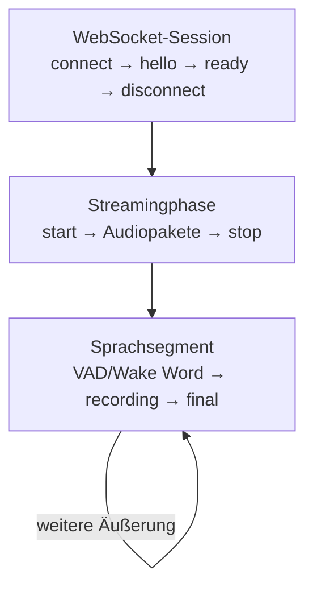
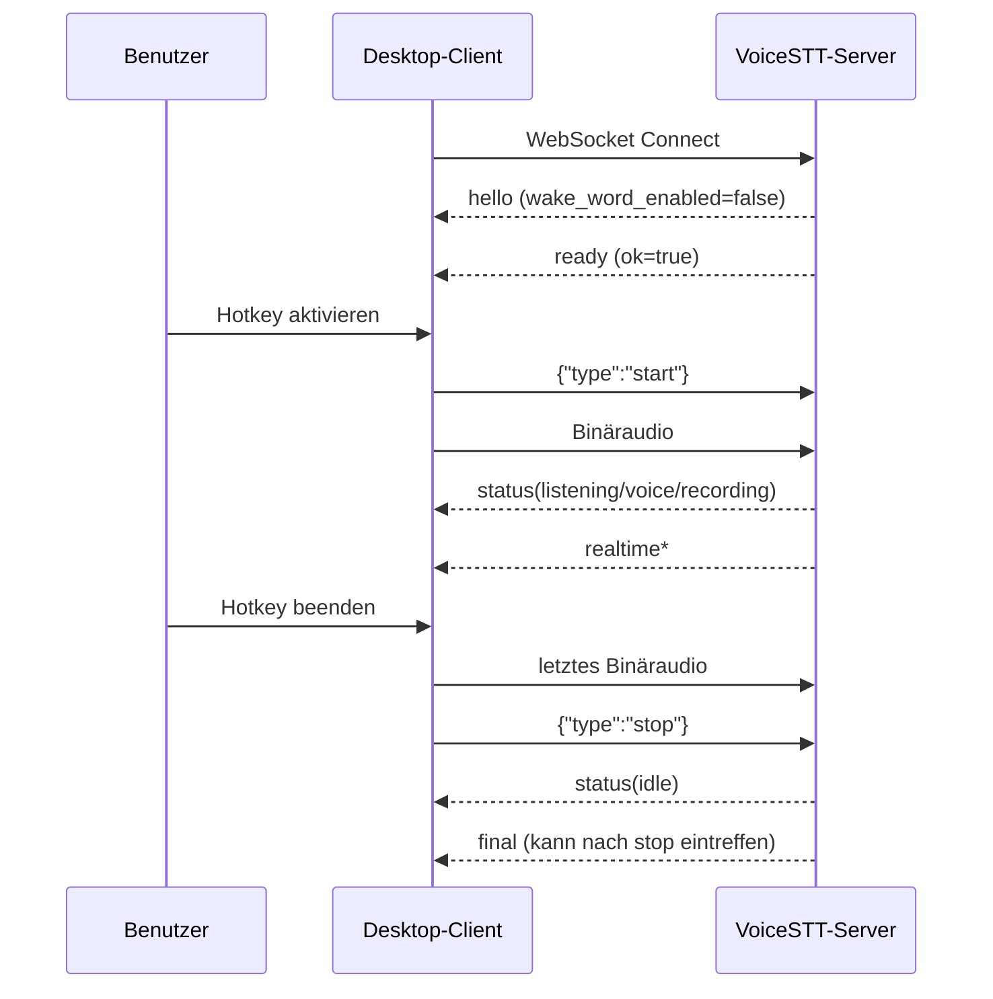
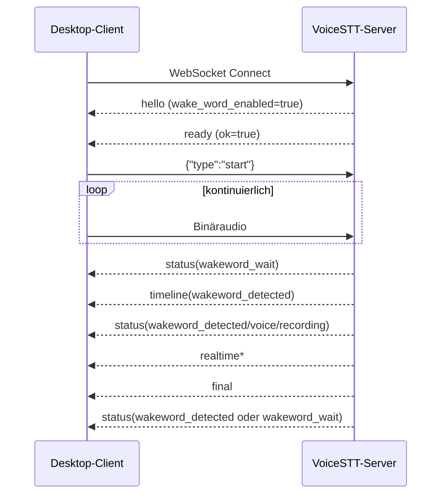
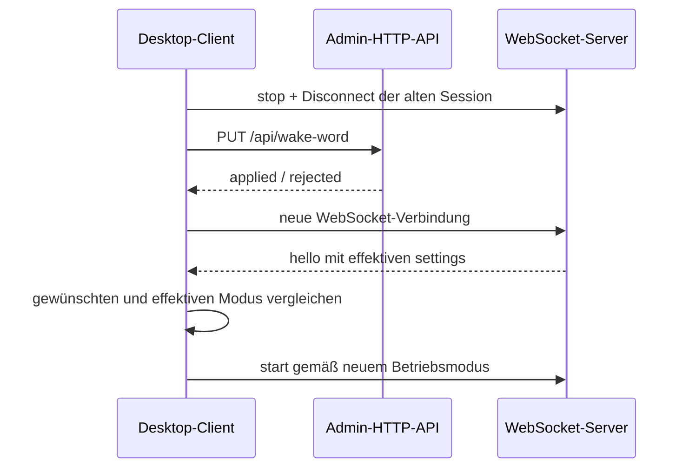

# Betriebsmodi und serverweite Konfiguration

[← Protokollabgrenzung](08-protokollabgrenzung.md) · [Zur Übersicht](README.md)

## Zweck dieser Seite

Diese Seite beschreibt, wie ein Desktop-Client mit dem **heute implementierten**
Server zwei unterschiedliche Bedienkonzepte abbilden kann:

- direkte, durch einen Hotkey gesteuerte Aufnahme;
- länger laufender Betrieb mit serverseitigem Wake Word.

Beide Modi verwenden dasselbe WebSocket-Protokoll. Sie unterscheiden sich vor
allem darin, wann der Client `start` und `stop` sendet und wie lange er
Mikrofonaudio überträgt.

Der Wake-Word-Zustand kann gegenwärtig nicht für eine einzelne WebSocket-Session
ausgewählt werden. Er ist eine **serverweite Einstellung für danach erzeugte
Sessions**. Ein Client mit Adminberechtigung kann ihn jedoch vor dem Aufbau
seiner nächsten Session über die HTTP-API passend setzen.

Diese Seite dokumentiert diesen pragmatischen Betriebsablauf. Sie beschreibt
keine noch nicht implementierten Sessionprofile.

## Drei getrennte Lebenszyklen

Für einen korrekten Client müssen drei Ebenen unterschieden werden:



### WebSocket-Session

Die Session beginnt mit dem Aufbau von `WS /ws/transcribe`. Der Server:

- reserviert einen Sessionplatz;
- erzeugt einen sessioneigenen Recorder;
- kopiert die zu diesem Zeitpunkt gültigen `newSessionOnly`-Einstellungen;
- vergibt eine neue `sessionId`;
- sendet `hello` und anschließend `ready`.

`start` erzeugt keine neue Session. `stop` beendet die Session ebenfalls nicht.
Die Verbindung kann über viele Aufnahmephasen hinweg bestehen bleiben.

### Streamingphase

Die Streamingphase wird durch Clientbefehle gesteuert:

```json
{"type":"start"}
```

beziehungsweise:

```json
{"type":"stop"}
```

Vor `start` lehnt der Recorder Audiopakete ab. Nach `stop` darf ein bereits
begonnenes Segment noch asynchron ein `final` erzeugen.

### Sprachsegment

Ein Segment ist eine einzelne vom Recorder abgegrenzte Äußerung. Es entsteht
automatisch durch:

- Wake-Word-Gate, sofern aktiviert;
- Voice Activity Detection;
- Mindestaufnahmedauer;
- Post-Speech-Stille;
- Aufnahme- und Queuegrenzen.

Ein dauerhaft gestarteter Stream kann viele Segmente mit fortlaufenden
`segmentId`-Werten erzeugen.

## Die zwei empfohlenen Betriebsmodi

| Merkmal | Hotkey-Modus | Wake-Word-Modus |
| --- | --- | --- |
| Wake Word im Server | deaktiviert | aktiviert |
| WebSocket | vorzugsweise dauerhaft offen | dauerhaft offen |
| Mikrofon | nur während Hotkeyaktivierung | dauerhaft geöffnet |
| `start` | bei Hotkeyaktivierung | einmal beim Aktivieren des Modus |
| Audioübertragung | nur während Hotkeyphase | kontinuierlich |
| `stop` | bei Hotkeyende | nur beim Pausieren/Beenden |
| Aufnahmetrigger | Client/Hotkey | serverseitiges Wake Word + VAD |
| Segmentierung | VAD nach `start` | Wake Word, Follow-up und VAD |
| typische Warteanzeige | `idle` oder `listening` | `wakeword_wait` |

Der Client sollte den gewählten Bedienmodus getrennt vom tatsächlich vom Server
gemeldeten Zustand speichern:

```ts
type DesiredActivationMode = "hotkey" | "wake_word";

interface ActivationState {
  desiredMode: DesiredActivationMode;
  effectiveWakeWordEnabled?: boolean;
  configurationVerified: boolean;
}
```

`desiredMode` ist die Benutzerentscheidung. `effectiveWakeWordEnabled` wird aus
der Serverantwort abgeleitet. Erst wenn beides zusammenpasst, darf der Client
den jeweiligen Aufnahmeautomaten freigeben.

## Hotkey-Modus

### Zielverhalten

Der Benutzer steuert Beginn und Ende der Audioübertragung bewusst. Nach
`start` darf Sprache ohne vorheriges Wake Word aufgenommen werden.

Der Hotkey kann als Push-to-Talk oder als Umschalter implementiert werden. Für
den Server ist nur die resultierende Folge aus `start`, Audiopaketen und `stop`
relevant.

### Initialisierung

1. Wake Word bei Bedarf über die Admin-API deaktivieren.
2. WebSocket öffnen.
3. `hello` abwarten und `sessionId` speichern.
4. `hello.settings.wake_word_enabled === false` prüfen.
5. `ready.ok === true` abwarten.
6. Session verbunden, Mikrofon und Streaming zunächst inaktiv halten.

### Hotkey aktivieren

Empfohlene Reihenfolge:

1. Mikrofon öffnen beziehungsweise Capture-Pipeline aktivieren.
2. `{ "type": "start" }` senden.
3. Erst danach vollständige Audiopakete senden.
4. `status` als tatsächlichen Serverzustand anzeigen.

Ein Client sollte Key-Repeat-Ereignisse entprellen und pro lokaler
Zustandsänderung höchstens ein `start` senden.

### Hotkey beenden

1. Keine neuen Mikrofondaten mehr annehmen.
2. Ein bereits angebrochenes Clientpaket vollständig bilden und senden.
3. `{ "type": "stop" }` senden.
4. Lokalen Streamingzustand deaktivieren.
5. Nachlaufende `realtime`, `timeline` und besonders `final` weiter annehmen.
6. WebSocket für die nächste Hotkeyphase offen lassen.

Die Verbindung direkt nach `stop` zu schließen kann das letzte finale Ergebnis
verlieren.

### Erwartete Ereignisfolge



## Wake-Word-Modus

### Zielverhalten

Die Anwendung bleibt über längere Zeit aktiv. Der Client überträgt fortlaufend
Audio; der sessioneigene Serverrecorder wartet auf das Wake Word und öffnet erst
danach das Sprach-Gate.

### Initialisierung

1. Vollständige Wake-Word-Konfiguration über die Admin-API setzen.
2. WebSocket öffnen.
3. `hello.settings.wake_word_enabled === true` prüfen.
4. `ready.ok === true` abwarten.
5. Mikrofon und Capture-Pipeline öffnen.
6. einmalig `{ "type": "start" }` senden;
7. kontinuierlich Audio übertragen.

Mit der aktuellen produktionsnahen Konfiguration und einer
`wake_word_activation_delay` von `0` meldet die Session anschließend
`wakeword_wait`.

### Laufender Betrieb

Während `wakeword_wait` muss Audio ohne Unterbrechung weitergesendet werden.
Andernfalls kann der Server das Wake Word nicht erkennen.

Der Client sollte die Wake-Word-Logik nicht lokal nachbauen. Maßgeblich sind die
Serverereignisse:

```text
wakeword_wait_started
wakeword_detected
recording_started
recording_ended
final_transcript
wakeword_followup_started
wakeword_followup_timeout
wakeword_timeout
```

Nach einer Äußerung entscheidet der Server:

- direkt zurück zu `wakeword_wait`; oder
- zunächst in das konfigurierte Follow-up-Fenster.

Innerhalb des Follow-up-Fensters kann eine weitere Äußerung ohne erneutes Wake
Word beginnen.

### Pausieren oder beenden

`stop` wird im Wake-Word-Modus nicht nach jeder Äußerung gesendet. Der Befehl
bedeutet hier:

- dauerhafte Erkennung pausieren;
- Mikrofonübertragung beenden;
- Betriebsmodus wechseln;
- Anwendung kontrolliert schließen.

Empfohlene Reihenfolge:

1. Audiocapture stoppen und letztes Paket senden.
2. `{ "type": "stop" }` senden.
3. ausstehendes `final` noch annehmen.
4. je nach Aktion WebSocket offen lassen oder schließen.

### Erwartete Ereignisfolge



## Warum ein Moduswechsel einen Reconnect benötigt

Der Server kopiert Wake-, VAD-, Segmentierungs- und Recorderwerte bei der
Erzeugung der WebSocket-Session. Eine spätere Adminänderung mutiert den bereits
existierenden Recorder nicht.

Deshalb gilt:

```text
Adminänderung
    ├─ bestehende Session: behält alte Konfiguration
    └─ danach erzeugte Session: erhält neue Konfiguration
```

Ein korrekter Moduswechsel läuft so:



Die alte Session darf alternativ während der Adminänderung noch offen bleiben.
Sie wird dadurch nicht verändert. Vor Aktivierung des neuen Automaten muss sie
aber geschlossen und durch eine neue Session ersetzt werden.

### Grenze der aktuellen Verifikation

`hello.settings` wird im aktuellen Handler aus den zu diesem Zeitpunkt globalen
öffentlichen Serversettings serialisiert und nicht aus einem ausdrücklich
sessionbezogenen Configobjekt. Bei einem einzelnen Admin entspricht das dem
unmittelbar zuvor gesetzten Zustand.

Ändert jedoch ein anderer Admin die Konfiguration genau zwischen Admission und
`hello`, ist die Rückmeldung keine atomare Bestätigung der Recorderkopie. Der
globale Ansatz besitzt weder Konfigurationsversion noch Sessionbindung. Für den
persönlichen Ein-Client-Betrieb ist der Vergleich eine sinnvolle
Plausibilitätsprüfung; bei konkurrierenden Adminclients wäre er keine harte
Isolationsgarantie.

## Serverweite Admin-Konfiguration

### Vertrauensbereich

Die Admin-API verändert den Serverprozess und damit potenziell alle Benutzer.
Sie ist nicht Bestandteil der normalen WebSocket-Authentifizierung.

Bevorzugter Header:

```http
X-VoiceSTT-Admin-Key: <admin-key>
```

Alternativ:

```http
Authorization: Bearer <admin-key>
```

Wenn kein Admin-Key konfiguriert ist, akzeptiert der Server Adminaufrufe nur
von Loopbackadressen. Remotezugriffe werden dann mit HTTP 403 abgelehnt.

Ein Desktop-Client sollte den Key:

- im Betriebssystem-Credential-Store speichern;
- nie in normalem YAML, Diagnoseexport oder Log ablegen;
- ausschließlich über TLS an den Server senden;
- im UI nur maskiert und bewusst löschbar darstellen.

Unter Windows ist der Windows Credential Manager die passende Ablage.

### Globaler Wirkungsbereich

Die Adminänderung ist kein Lock oder Lease für den aufrufenden Client:

- jeder danach verbundene Client erhält dieselben globalen Defaults;
- parallele Adminclients können einander überschreiben;
- die letzte erfolgreiche Änderung gewinnt;
- es gibt keine Konfigurationsversion und kein Compare-and-Swap;
- ein Clientabsturz stellt keinen vorherigen Zustand automatisch wieder her.

Für einen persönlichen Server mit einem primären Desktop-Client ist dieses
Modell praktikabel. Für mehrere unabhängige Benutzer ist es keine
Sessionisolation.

## Wake-Word-Endpunkt

### Zustand lesen

```http
GET /api/wake-word
X-VoiceSTT-Admin-Key: <admin-key>
```

Die Antwort enthält:

```text
enabled
backend
words
sensitivity
timeout
bufferDuration
followupWindow
openwakewordModelPaths
availableModels
appliesTo
```

`appliesTo` ist gegenwärtig `new_sessions`.

### Für Hotkey deaktivieren

```http
PUT /api/wake-word
Content-Type: application/json
X-VoiceSTT-Admin-Key: <admin-key>
```

```json
{
  "enabled": false
}
```

Der Server setzt dabei intern sowohl `wakeword_backend` als auch `wake_words`
auf leere Strings.

### Für Wake Word aktivieren

```json
{
  "enabled": true,
  "backend": "openwakeword",
  "words": "hey_jarvis",
  "sensitivity": 0.5,
  "timeout": 7.0,
  "bufferDuration": 0.1,
  "followupWindow": 7.0
}
```

Zulässige Backendfamilien:

```text
openwakeword / oww
pvporcupine / porcupine / pvp
```

Beim Aktivieren ist `words` im aktuellen Endpunkt verpflichtend.

### Nicht abgedeckte Wake-Felder

Der spezialisierte Endpunkt ändert nicht:

- `wake_word_activation_delay`;
- `openwakeword_inference_framework`.

Falls ein Admin-Client auch diese Werte anbietet, müssen sie über
`PATCH /api/config` mit den internen Feldnamen gesetzt werden.

### Wiederaktivierung nach Deaktivierung

Weil `enabled: false` Backend und Wörter leert, muss der Client beim späteren
Aktivieren eine vollständige gewünschte Wake-Konfiguration mitsenden. Er sollte
sich nicht darauf verlassen, dass der Server die vorherigen Werte rekonstruiert.

Geeignete Strategie:

- Wake-Konfiguration als nicht geheime Clientpräferenz speichern;
- bei `wake_word` vollständig senden;
- Modellpfade nach Möglichkeit auf dem Server vorkonfigurieren und nicht frei
  im normalen Modusdialog bearbeiten.

## Generisches Config-Interface

### Konfiguration und Scope lesen

```http
GET /api/config
```

Dieser Leseendpunkt benötigt aktuell keinen Admin-Key. Relevant für einen
Admin-Client sind:

```json
{
  "settings": {},
  "limits": {},
  "supportedEngines": [],
  "runtimeSettings": {
    "activeSessionSafe": [],
    "newSessionOnly": [],
    "startupOnly": []
  },
  "adminAuthRequired": true
}
```

Die drei Scopegruppen bedeuten:

| Gruppe | Wirkung |
| --- | --- |
| `activeSessionSafe` | Änderung ist bei verbundenen Sessions zulässig |
| `newSessionOnly` | nur danach erzeugte Recorder erhalten den Wert |
| `startupOnly` | generisches Runtime-PATCH lehnt den Wert ab |

`activeSessionSafe` bedeutet nicht zwingend, dass bereits bestehende Objekte
rückwirkend neu aufgebaut werden. Beispielsweise beendet ein niedrigeres
`max_sessions` keine vorhandene Verbindung.

### Generisch ändern

```http
PATCH /api/config
Content-Type: application/json
X-VoiceSTT-Admin-Key: <admin-key>
```

```json
{
  "settings": {
    "post_speech_silence_duration": 0.7,
    "realtime_processing_pause": 0.05,
    "max_sessions": 8
  }
}
```

Alternativ darf das Settingsobjekt direkt der Requestbody sein.

Die Antwort muss vollständig ausgewertet werden:

```json
{
  "applied": {
    "post_speech_silence_duration": {
      "value": 0.7,
      "appliesTo": "new_sessions"
    }
  },
  "rejected": {},
  "settings": {},
  "runtimeSettings": {}
}
```

### Kein atomarer Sammelrequest

`PATCH /api/config` ist nicht transaktional. Wenn ein Request gültige und
ungültige Werte mischt, können gültige Werte bereits angewendet sein, obwohl die
Gesamtantwort HTTP 400 lautet.

Beispiel:

```json
{
  "settings": {
    "max_sessions": 8,
    "device": "cuda"
  }
}
```

Mögliches Ergebnis:

- `max_sessions` steht in `applied` und ist bereits wirksam;
- `device` steht in `rejected`;
- HTTP-Status ist 400.

Ein Client darf aus HTTP 400 deshalb nicht schließen, dass nichts verändert
wurde. Er muss immer `applied` und `rejected` prüfen und seinen lokalen Zustand
anschließend durch einen neuen GET synchronisieren.

`POST /api/config/validate` kann vorab grob prüfen, bildet aber keine atomare
Transaktion mit dem folgenden PATCH und validiert nicht jede fachliche
Querbedingung vollständig.

## Konfigurationsbereiche und Endpunkte

Die vollständigen HTTP-Verträge stehen unter
[HTTP-API und Authentifizierung](06-http-api-und-authentifizierung.md). Für die
Gestaltung einer Adminoberfläche ist folgende Wirkungsübersicht maßgeblich:

| Bereich | Primärer Endpunkt | Wirkung |
| --- | --- | --- |
| Wake Word | `GET/PUT /api/wake-word` | neue Sessions |
| Sprache | `GET/PUT /api/language` | neue Sessions und neue Datei-Requests |
| Logging | `GET/PUT /api/logging` | laufender Server |
| Kapazität/Queues | `PATCH /api/config` | laufender Server bzw. neue Admissions |
| Recorder/VAD/Realtime | `PATCH /api/config` | neue Sessions |
| Modell-Lifecycle | `GET/PUT /api/models/lifecycle` | laufender Server |
| Modelle laden/entladen | `POST /api/models/load|unload` | globaler Modellzustand |
| Engine-/Modellwechsel | `GET/PUT /api/models/active` | nur ohne WebSocket-Sessions |
| Host, Port, Keys, Device | YAML/CLI/Environment | Serverneustart |

### `activeSessionSafe`

Diese Werte akzeptiert das generische PATCH bei laufenden Sessions:

```text
allow_two_medium_models
audio_log_dir
log_level
max_active_speakers
max_audio_packet_bytes
max_final_queue_depth_per_session
max_global_inference_queue_depth
max_realtime_queue_age_ms
max_sessions
model_idle_timeout_seconds
model_idle_unload_enabled
model_memory_policy_enabled
performance_log_backup_count
performance_log_max_bytes
performance_log_path
performance_log_stdout
performance_logging_enabled
realtime_degradation_threshold_ms
request_log_backup_count
request_log_max_bytes
request_log_path
request_log_stdout
request_log_transcripts
request_logging_enabled
save_audio_files
```

### `newSessionOnly`

Diese Werte gelten nur für danach erzeugte Sessionrecorder:

```text
audio_queue_size
early_transcription_on_silence
initial_prompt
initial_prompt_realtime
max_audio_queue_seconds_per_session
min_gap_between_recordings
min_length_of_recording
openwakeword_inference_framework
openwakeword_model_paths
post_speech_silence_duration
pre_recording_buffer_duration
realtime_batch_size
realtime_boundary_detector_sensitivity
realtime_boundary_followup_delays
realtime_callback
realtime_max_audio_seconds
realtime_min_audio_seconds
realtime_processing_pause
realtime_transcription_use_syllable_boundaries
silero_sensitivity
vad_energy_threshold
vad_filter
wake_word_activation_delay
wake_word_buffer_duration
wake_word_followup_window
wake_word_timeout
wake_words
wake_words_sensitivity
wakeword_backend
webrtc_sensitivity
```

Für den aktuellen Betriebsmoduswechsel sind daraus vor allem die Wake-Werte
relevant.

### `startupOnly`

Das generische PATCH lehnt folgende Werte ab:

```text
admin_api_key
batch_size
beam_size
beam_size_realtime
compute_type
device
download_root
host
language
model
model_warmup
normalize_audio
openai_api_enabled
openai_api_key
openai_max_file_bytes
openai_model_aliases
port
realtime_model
realtime_transcription_engine
realtime_transcription_engine_options
runtime_config_path
transcription_engine
transcription_engine_options
tuning_description
tuning_profile
use_main_model_for_realtime
```

Ein Teil davon besitzt spezialisierte Verwaltungsoperationen:

- Sprache: `PUT /api/language`;
- Modelle, Engines und Engine-Options: `PUT /api/models/active`.

Ein Modellwechsel ist nur zulässig, wenn **keine WebSocket-Session verbunden**
ist. Bereits eine offene, untätige Session blockiert den Wechsel.

Die übrigen Startupwerte erfordern YAML-, CLI- oder Environmentkonfiguration
und einen Serverneustart.

## Empfohlene Struktur der Desktop-Oberfläche

Die häufige Bedienung und die vollständige Administration sollten getrennt
werden.

### Bereich „Aufnahmemodus“

Nur die fachliche Auswahl:

```text
(•) Hotkey
( ) Wake Word
```

Zusätzliche Anzeige:

```text
Gewünscht: Hotkey
Server: Wake Word aktiv
Aktion: Server konfigurieren und neu verbinden
```

Der Modusdialog sollte nicht mit Modellpfaden, Queuegrößen oder Logrotation
überladen werden.

### Bereich „Wake Word“

Sinnvolle Felder:

- Backend;
- Wort/Modell-ID;
- Sensitivität;
- Voice-Timeout;
- Pufferdauer;
- Follow-up-Fenster.

Die UI muss darauf hinweisen, dass Änderungen serverweit und erst ab der
nächsten Session gelten.

### Bereich „Serveradministration“

Nach Wirkung gruppieren:

1. **Sofort beziehungsweise bei laufendem Server**
   - Kapazitätsgrenzen;
   - Logging;
   - Modell-Lifecycle.
2. **Ab nächster Verbindung**
   - Wake Word;
   - Sprache;
   - VAD;
   - Segmentierung;
   - Realtime-Taktung.
3. **Nur ohne verbundene Sessions**
   - ASR-Engine und Modelle.
4. **Serverneustart erforderlich**
   - Netzwerk;
   - Keys;
   - Device/Compute-Type;
   - übrige Startupwerte.

Jedes Formularfeld sollte einen sichtbaren Wirkungshinweis tragen:

```text
Sofort
Ab nächster Verbindung
Nur bei getrennten Clients
Serverneustart erforderlich
```

Die API liefert über `runtimeSettings` die Gruppenzuordnung, aber kein
vollständiges UI-Schema mit Beschreibungen, Einheiten, Enumwerten und
Min-/Maxgrenzen. Diese Metadaten muss der Desktop-Client versioniert pflegen.

## Empfohlene lokale Clientkonfiguration

Beispiel ohne Klartext-Admin-Key:

```yaml
server:
  url: https://stt.voice.marcosudau.com
  admin_credential: windows-credential-manager:voicestt-production

activation:
  mode: hotkey
  configure_server_before_connect: true

wake_word:
  backend: openwakeword
  words: hey_jarvis
  sensitivity: 0.5
  timeout_seconds: 7.0
  buffer_duration_seconds: 0.1
  followup_window_seconds: 7.0
```

`admin_credential` ist hierbei nur eine Referenz auf den Secretstore, nicht der
Key selbst.

Eine sinnvolle Alternative ist ein Beobachtungsmodus:

```yaml
activation:
  configure_server_before_connect: false
```

Dann verändert der Client den Server nicht. Er liest den effektiven Zustand aus
`hello.settings.wake_word_enabled` und warnt bei einer Abweichung.

## Robuster Verbindungsalgorithmus

```ts
async function connectWithDesiredMode(config: ClientConfig) {
  const desiredWake = config.activation.mode === "wake_word";

  if (config.activation.configureServerBeforeConnect) {
    const current = await adminApi.getWakeWord();
    const differs =
      current.enabled !== desiredWake ||
      (desiredWake && wakeDetailsDiffer(current, config));

    if (differs) {
      const result = desiredWake
        ? await adminApi.enableWakeWord(config.wakeWord)
        : await adminApi.disableWakeWord();

      assertNothingRejected(result);
    }
  }

  const socket = await openTranscriptionSocket();
  const hello = await waitForHello(socket);

  if (Boolean(hello.settings?.wake_word_enabled) !== desiredWake) {
    socket.close();
    throw new Error("Der effektive Servermodus entspricht nicht der Clientkonfiguration.");
  }

  await waitForReady(socket);

  if (desiredWake) {
    await microphone.start();
    socket.send(JSON.stringify({ type: "start" }));
    microphone.pipeTo(socket);
  }

  return socket;
}
```

Produktionscode sollte zusätzlich behandeln:

- Admin-Key fehlt oder ist abgelaufen;
- Admin-API nicht erreichbar, WebSocket aber erreichbar;
- HTTP 400 mit teilweise gefülltem `applied`;
- Konfiguration wurde zwischen PUT und WebSocket-Verbindung von einem anderen
  Admin geändert;
- `hello` oder `ready` läuft in einen Timeout;
- Wake-Backend oder Modell kann beim Erzeugen der Session nicht geladen werden;
- Reconnect während eines laufenden Hotkey- oder Wake-Modus.

## Reconnect-Regeln

### Hotkey

- Nach unerwartetem Disconnect Hotkey-/Streamingzustand lokal beenden.
- Keine alten Audiopakete replayen.
- Neu verbinden und effektiven Wake-Zustand erneut prüfen.
- Erst nach `ready` einen neuen Hotkeystart erlauben.

### Wake Word

- Dauerhafte Audioübertragung sofort stoppen.
- Reconnect mit Backoff durchführen.
- Adminzustand nicht bei jedem kurzen Netzwerkfehler blind neu schreiben;
  zunächst lesen und nur bei Abweichung ändern.
- Nach neuem `hello` und `ready` Mikrofon öffnen, einmal `start` senden und
  kontinuierliche Übertragung wieder aufnehmen.

Jeder Reconnect erzeugt eine neue `sessionId`; offene Segmente der alten
Verbindung werden nicht fortgesetzt.

## Persistenz und Rücksetzen

Die Adminänderungen werden durch den Server in der konfigurierten
Runtime-Konfiguration persistiert. Sie können damit einen Serverneustart
überleben.

Der Desktop-Client sollte den Servermodus beim Programmende **nicht automatisch
zurücksetzen**. Ein automatischer Restore ist fehleranfällig:

- Absturz vor dem Restore;
- Browser oder zweiter Client verwendet inzwischen den neuen Zustand;
- konkurrierende Instanzen besitzen unterschiedliche Ausgangssnapshots;
- der letzte beendete Client überschreibt eine bewusst spätere Änderung.

Besser ist, den gewählten Modus als persistente Serverentscheidung zu behandeln
und ihn beim nächsten Verbindungsaufbau lediglich zu verifizieren.

## Browserbetrieb

Der eingebaute Browserclient verbindet sich ohne eigene Modusauswahl. Er erhält
deshalb den globalen Zustand, den der Desktop-Client oder eine andere
Adminoberfläche zuletzt gesetzt hat.

Konsequenzen:

- Nach Desktopauswahl `hotkey` startet auch eine neue Browsersession ohne Wake
  Word.
- Nach Desktopauswahl `wake_word` wartet auch eine neue Browsersession auf das
  Wake Word.
- Eine bereits offene Browsersession behält ihre vorherige Recorderkonfiguration.

Für einen persönlichen Server ist das meist akzeptabel. Die Oberfläche sollte
den effektiven Zustand aus `hello.settings` anzeigen, damit die globale Wirkung
nicht unsichtbar bleibt.

## Fehler- und UI-Meldungen

Empfohlene fachliche Meldungen:

| Situation | Clientreaktion |
| --- | --- |
| Admin-Key fehlt | Modus nur beobachten; Konfigurationsaktion deaktivieren |
| HTTP 401 | Key erneut anfordern oder Secretstore korrigieren |
| HTTP 403 ohne Server-Key | Remoteadministration ist serverseitig deaktiviert |
| `rejected` nicht leer | alle Einzelgründe anzeigen, Zustand neu laden |
| effektives `hello` widerspricht Wunsch | Aufnahme nicht starten, Reconnect/Retry anbieten |
| Wake-Modell nicht verfügbar | Wake-Modus nicht aktivieren; Hotkey als bewusste Alternative anbieten |
| WebSocket 1013 | Kapazitäts-Backoff, keine aggressive Reconnectschleife |
| Audio vor `start` | lokalen Streamingautomaten korrigieren |

Ein Fallback von Wake Word auf Hotkey sollte nicht still erfolgen. Der Benutzer
muss erkennen können, dass sich Datenschutz- und Aktivierungsverhalten geändert
haben.

## Sicherheits- und Datenschutzfolgen

Der Wake-Word-Modus überträgt im gestarteten Zustand kontinuierlich
Mikrofonaudio an den Server, auch wenn noch kein Wake Word erkannt wurde. Der
Serverrecorder benötigt diese Daten für die Erkennung.

Der Client sollte deshalb:

- einen unübersehbaren Daueraktivitätsindikator anzeigen;
- eine sofort erreichbare Pausefunktion anbieten;
- Betriebssystem-Mikrofonstatus respektieren;
- den Modus nach Sperren/Standby bewusst pausieren oder neu initialisieren;
- in Diagnoseexporten keine Admin-Keys, Prompts oder Modellpfade ausgeben;
- erklären, dass serverseitiges Request-/Audiologging separat konfigurierbar ist.

Der Hotkey-Modus minimiert die übertragene Audiomenge, weil Audio nur während
der bewussten Aktivierung gesendet wird.

## Abnahmetests

### Hotkey

- [ ] Wake Word wird vor der neuen Session deaktiviert.
- [ ] `hello.settings.wake_word_enabled` ist `false`.
- [ ] Audio vor Hotkey/`start` wird nicht gesendet.
- [ ] Hotkeystart sendet genau ein `start`.
- [ ] Sprache erzeugt ohne Wake Word `realtime` und `final`.
- [ ] Hotkeyende sendet letztes Paket und anschließend `stop`.
- [ ] ein nachlaufendes `final` wird noch verarbeitet.
- [ ] zweite Hotkeyphase verwendet dieselbe WebSocket-Session.

### Wake Word

- [ ] vollständige Wake-Konfiguration wird vor der Session gesetzt.
- [ ] `hello.settings.wake_word_enabled` ist `true`.
- [ ] nach `ready` werden Mikrofon, `start` und kontinuierliches Audio aktiviert.
- [ ] `wakeword_wait` unterbricht die Audioübertragung nicht.
- [ ] Sprache ohne Wake Word erzeugt kein normales Sprachsegment.
- [ ] Wake-Erkennung führt zu Aufnahme und `final`.
- [ ] Follow-up-Fenster funktioniert ohne lokales Nachbauen.
- [ ] `stop` wird erst beim Pausieren/Beenden gesendet.

### Moduswechsel und Administration

- [ ] alte Session behält ihren bisherigen Modus bis zum Disconnect.
- [ ] neue Session übernimmt den geänderten Modus.
- [ ] HTTP 400 wird auf teilweise angewendete Werte geprüft.
- [ ] fehlender/falscher Admin-Key erzeugt keine unbemerkte Fallbackaufnahme.
- [ ] Browser und Desktop zeigen den jeweils effektiven globalen Zustand.
- [ ] Reconnect erzeugt neue `sessionId` und startet den passenden Automaten neu.
- [ ] Admin-Key erscheint weder in Log noch Konfigurationsdatei oder Diagnoseexport.

## Zusammenfassung

Der aktuelle Server unterstützt die beiden gewünschten Bedienkonzepte ohne
Änderung des WebSocket-Protokolls:

```text
Hotkey:
Wake global aus → Session verbinden → pro Hotkey start/audio/stop

Wake Word:
Wake global an → Session verbinden → einmal start → Audio dauerhaft senden
```

Der globale Wake-Zustand wird vor der Session über die Admin-HTTP-API gesetzt.
Die neue Session bestätigt den effektiven Zustand über
`hello.settings.wake_word_enabled`.

Dieses Modell ist für einen persönlichen Server mit einem primären
Desktop-Client praktikabel. Seine Grenze ist klar: Die Einstellung gehört dem
Server, nicht dem Client. Werden später mehrere unabhängige Benutzer oder
gleichzeitig unterschiedliche Betriebsmodi benötigt, reicht dieser globale
Ansatz nicht mehr aus.
