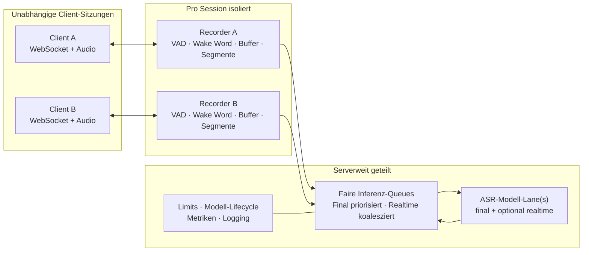

# VoiceSTT – Leitfaden für die Client-Entwicklung

> **Status:** aus dem implementierten Code abgeleitet · **Stand:** 1. August 2026
> **Primäre Live-Schnittstelle:** `WS /ws/transcribe` · **Serverversion:** `2.0.0`

Diese Dokumentation beschreibt den Server so, wie er im Repository tatsächlich
implementiert ist. Maßgeblich ist der produktive Einstiegspunkt
`VoiceSTT_server.server`; er verwendet dieselbe Implementierung wie
`api_fastapi_server.server`.

Die Seiten sind für die Neuentwicklung eines Web-, Desktop- oder Mobile-Clients
gedacht. Sie erklären nicht nur das Nachrichtenformat, sondern auch Besitz,
Lebensdauer, Zustandswechsel, Backpressure und die Stellen, an denen ein robuster
Client bewusst tolerant sein sollte.

## Dokumentationspaket

| Seite | Inhalt | Besonders nützlich für |
| --- | --- | --- |
| [Session- und Server-Scope](01-session-und-server-scope.md) | Was pro Verbindung isoliert ist, was alle Clients teilen, vollständiger Einstellungs-Scope und Modell-/Scheduler-Architektur | Architektur, Datenschutz, Kapazitätsplanung |
| [WebSocket-Protokoll](02-websocket-protokoll.md) | Verbindung, Handshake, Clientbefehle, binäres Audioformat und Segmentregeln | Implementierung des Transport-Layers |
| [Server-Events – Kurzreferenz](03-server-events-kurzreferenz.md) | Alle vom Server sendbaren Eventtypen und ihre Felder in kompakter Form | Nachschlagen beim Implementieren |
| [Server-Events – Katalog & Chronologie](04-server-events-katalog-und-chronologie.md) | Auslöser, Semantik und Felder jedes Events sowie normale Abläufe mit und ohne Weckwort | Event-Reducer, UI und Fehlersuche |
| [Client-Zustandsmodell](05-client-zustandsmodell.md) | Empfohlener Reducer, Segment-Merging, Statusautomat und Reconnect-Verhalten | Anwendungsarchitektur |
| [HTTP-API & Authentifizierung](06-http-api-und-authentifizierung.md) | Health, Konfiguration, Metriken, Log-Historie, Admin-API und OpenAI-kompatible Datei-Transkription | Administration, Logs und Datei-Uploads |
| [Robustheit, Grenzen & Sicherheit](07-robustheit-grenzen-und-sicherheit.md) | Fehlerklassen, Überlast, Timeouts, Datenschutz und Abnahmetests | Produktionsreife Clients |
| [Abgrenzung der Serverprotokolle](08-protokollabgrenzung.md) | Klare Unterscheidung des produktiven Single-WebSocket-Protokolls von der separaten Zwei-Port-Implementierung | Auswahl des richtigen Einstiegspunkts |
| [Betriebsmodi & sessionlokale Wake-Word-Konfiguration](09-betriebsmodi-und-serverkonfiguration.md) | Hotkey- und Wake-Word-Betrieb, Session-Create-Contract, `models.json`, Fallbacks, Admin-Baseline und UI-Konzept | Desktop-Client, Aufnahmeautomation und Administration |

## Architektur in einem Bild

## Die wichtigsten Integrationsregeln

1. **`hello` bedeutet zugelassen, `ready` bedeutet betriebsbereit.** Ein Client
   sollte den Audiostart erst nach einem erfolgreichen `ready` freigeben.
2. **Vor dem ersten Audiopaket muss `{ "type": "start" }` gesendet werden.**
   Andernfalls lehnt die Session Audio mit einem `warning`-Event ab.
3. **Audio ist binär, Befehle und Server-Events sind JSON-Textframes.** Das
   Binärpaket beginnt mit einer Little-Endian-Metadatenlänge, gefolgt von UTF-8
   JSON und PCM-Samples.
4. **Realtime ist revidierbar.** Alle `realtime`-Events eines `segmentId` ersetzen
   die bisherige Zwischenanzeige. Erst `final` ist das abgeschlossene Ergebnis.
5. **Eine neue WebSocket-Verbindung ist eine neue Session.** Nach Reconnect gibt
   es eine neue `sessionId`; alte Segmente und Befehle werden nicht fortgesetzt.
6. **Der Wake-Word-Modus wird beim Verbindungsaufbau festgelegt.**
   `hello.sessionConfig` ist die verbindliche Bestätigung der effektiven
   sessionlokalen Konfiguration.
7. **Logs verwenden einen getrennten Zugriffskanal.** `hello.logAccess` liefert
   den Sessiontoken; er gehört in `X-VoiceSTT-Log-Token` beziehungsweise die
   erste `/ws/logs`-Subscribe-Nachricht, nie in eine URL. Beim Reconnect wird
   mit dem letzten verarbeiteten Cursor fortgesetzt.

## Aktuelle versionierte Repository-Baseline

Eine zusammenhängende Architektur-, Migrations- und Betriebsbeschreibung der
Session-Wake-Word-Erweiterung einschließlich eines ausführbaren
PowerShell-Nachweises steht unter
[`docs/session-wakeword-erweiterung.md`](../session-wakeword-erweiterung.md).

Das zentrale Entwicklungs- und Deploymentprofil `config.yaml` konfiguriert:

| Bereich | Wert |
| --- | --- |
| Sprache / Ausführung | Deutsch (`de`), CPU, `int8` |
| Final | `faster_whisper`, `faster-whisper-large-v3-turbo` |
| Realtime | `kroko_onnx`, `Kroko-DE-Community-64-L-Streaming-001.data` |
| Modellfreigabe | getrennte Modell-Lanes (`use_main_model_for_realtime: false`) |
| Wake Word | OpenWakeWord, `hey_jarvis`, Timeout 7 s, Follow-up 7 s |
| Kapazität | 8 Sessions, 4 gleichzeitig aktive Sprecher |
| Aufnahmegrenze | 30 s pro fortlaufendem Segment |
| Modell-Lifecycle | automatisches Entladen nach 3600 s Inaktivität |

Diese Werte sind eine versionierte Ausgangskonfiguration, **kein fest
verdrahteter Protokollvertrag und kein garantierter Live-VPS-Zustand**. Ein
Deployment kann eine eigene YAML-Datei verwenden; zusätzlich kann eine
persistierte Runtime-Konfiguration die Startwerte überschreiben. Für einen
Client sind deshalb `hello.settings`, `ready.settings` oder `GET /api/config`
die maßgebliche Laufzeitauskunft.

## Dokumentationskonventionen

- Feldnamen werden exakt in der vom Server gesendeten Schreibweise gezeigt.
- „Pro Session“ meint die Lebensdauer genau einer angenommenen WebSocket-Verbindung.
- „Serverweit“ meint einen gemeinsam laufenden Serverprozess.
- Zeitstempel ohne Suffix sind Unix-Sekunden als Zahl; `...Iso` ist derselbe
  Zeitpunkt als UTC-ISO-8601-Zeichenfolge.
- Felder mit `null` oder als „optional“ markierte Felder dürfen fehlen. Ein Client
  sollte zusätzliche unbekannte Felder ignorieren.

## Geprüfte Codequellen

Die Aussagen wurden gegen folgende Implementierungsstellen und Referenztests
geprüft:

| Quelle | Verwendet für |
| --- | --- |
| `VoiceSTT_server/server.py` | produktiver Einstiegspunkt und Re-Export |
| `api_fastapi_server/server.py` | Settings, Sessions, Scheduler, Events, Endpunkte und Lifecycle |
| `api_fastapi_server/protocol.py` | binäres Audiopaket und Validierung |
| `VoiceSTT_server/openai_compat.py` | Multipartparameter, Antwort- und Fehlerformate |
| `VoiceSTT_server/operations.py` | Modellregistrys, Runtime-Persistenz und Logging-Fassaden |
| `VoiceSTT_server/event_logging.py` | Event-Envelope, Redaction, Queues, Kalenderdateien, SQLite und Live-Fan-out |
| `api_fastapi_server/static/index.html` | tatsächlich genutzter Browser-Clientablauf |
| `config.yaml` | zentrale versionierte Laufzeitkonfiguration |
| `tests/unit/test_fastapi_server_*.py` | Protokoll-, Isolation-, Event- und Integrationsverhalten |
| `tests/unit/test_openai_compatible_endpoint.py` | OpenAI-/Admin-HTTP-Vertrag |
| `tests/unit/test_server_operations.py` | Registry-, Logging- und Persistenzverhalten |

Bei Änderungen an `ServerSettings`, `_publish_timeline_event`, dem
WebSocket-Handler oder `openai_compat.py` sollte dieses Paket zusammen mit den
Contract-Tests aktualisiert werden.
