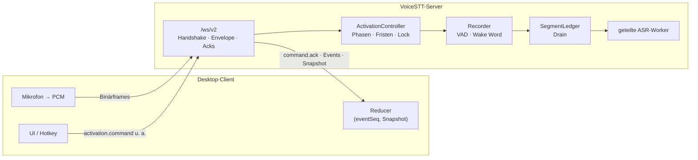

# VoiceSTT – Client-Entwicklung (Protokoll V2)

> **Status:** kanonische Client-Dokumentation für **Protokoll V2 auf `/ws/v2`**.
> Aus dem Code abgeleitet und am 2026-09-28 gegen
> `f7d2b3ccd07757172a45b371829b04bcedffab4b` geprüft
> ([Prüfbericht](../audits/v2-client-contract-review/INDEPENDENT_REVIEW.md)).
> **Serverversion:** `2.0.0`

Diese Seiten sind die maßgebliche Grundlage für neue Clients, insbesondere den
VoiceSTT-Desktop-Client V2. Sie beschreiben das Verhalten so, wie es in
`api_fastapi_server/protocol_v2/` und `api_fastapi_server/server.py`
implementiert ist – ohne dass dafür Servercode gelesen werden muss.

> **Legacy V1 (`/ws/transcribe`)** wird vom Server weiter betrieben, ist aber
> nicht für neue Clients gedacht. Seine Beschreibung liegt getrennt unter
> [`legacy-v1/`](legacy-v1/README.md). Umstieg:
> [V1 → V2 Migrationsmatrix](../audits/v2-client-contract/V1_TO_V2_CLIENT_MIGRATION_MATRIX.md).

## Dokumentationspaket

| Seite | Inhalt |
| --- | --- |
| [01 – Session- und Server-Scope](01-session-und-server-scope.md) | Was pro Verbindung isoliert und was serverweit geteilt ist; Admin-Runtime-Settings |
| [02 – WebSocket-Protokoll V2](02-websocket-protokoll.md) | **Normativ:** Endpunkt, Handshake, Identitäten, Commands, `command.ack`, Replay, Audioframe, Close-Codes |
| [03 – Server-Nachrichten](03-server-events-kurzreferenz.md) | **Normativ:** Event-Hülle und alle 17 Events mit Feldern |
| [04 – Lebenszyklen & Chronologie](04-server-events-katalog-und-chronologie.md) | Phasen, Fristen, Segment-/Transkriptlebenszyklus, Reihenfolge-Garantien, Beispielabläufe, Trigger |
| [05 – Zustandsmodell, Snapshot, Reconnect](05-client-zustandsmodell.md) | **Normativ:** `session.snapshot`; Reducer, Lückenbehandlung, Reconnect |
| [06 – HTTP-API & Authentifizierung](06-http-api-und-authentifizierung.md) | `/health`, `/api/v2/*`, Admin-/OpenAI-API, Log-Zugriff |
| [07 – Robustheit, Grenzen & Sicherheit](07-robustheit-grenzen-und-sicherheit.md) | Limits, Fehlerstrategie, Timeouts, Datenschutz, Abnahme-Checkliste |
| [08 – Protokollabgrenzung](08-protokollabgrenzung.md) | V2 vs. Legacy V1 vs. Zwei-Port-Server vs. `/ws/logs` |
| [09 – Triggerquellen, Wake Words & Settings](09-betriebsmodi-und-serverkonfiguration.md) | Triggerkombinationen, Wake-Word-Katalog und -Admission, `session_settings.patch` |

Maschinenlesbare Vertragsvektoren:
[`tests/contracts/protocol-v2-vectors.json`](../../tests/contracts/protocol-v2-vectors.json).
Server-Architektur hinter dem Protokoll:
[`docs/einheitliche-triggerarchitektur.md`](../einheitliche-triggerarchitektur.md) §12–14.

## Architektur in einem Bild


```mermaid
flowchart LR
    subgraph Client["Desktop-Client"]
        MIC["Mikrofon → PCM"]
        UI["UI / Hotkey"]
        RED["Reducer\n(eventSeq, Snapshot)"]
    end
    subgraph Server["VoiceSTT-Server"]
        WS["/ws/v2\nHandshake · Envelope · Acks"]
        AC["ActivationController\nPhasen · Fristen · Lock"]
        REC["Recorder\nVAD · Wake Word"]
        LED["SegmentLedger\nDrain"]
        ASR["geteilte ASR-Worker"]
    end
    MIC -- "Binärframes" --> WS
    UI -- "activation.command u. a." --> WS
    WS -- "command.ack · Events · Snapshot" --> RED
    WS --> AC --> REC --> LED --> ASR
```

## Minimaler Ablauf

```text
1. GET /api/v2/wake-words                          (falls Wake Word genutzt wird)
2. WS  /ws/v2 öffnen
3. →  hello {supportedProtocolVersions:[2], clientRunId, requestedSession, runtimeSuppression}
4. ←  hello.accepted {sessionId, snapshot}         → Spiegel aus snapshot bauen
5. →  (optional) session_settings.patch            → Timings/Sensitivität
6. →  Binärframes kontinuierlich (uint32-LE-Länge + JSON{sampleRate} + PCM s16le)
7. →  activation.command activate (PTT) … finish   ← Events, command.ack
8. ←  transcription.completed {segmentId, text}    → Text anzeigen
9. Lücke in eventSeq → session.snapshot.request → session.snapshot
10. Verbindungsverlust → neue Session ab Schritt 2
```

## Die wichtigsten Regeln

1. **Der Client spricht zuerst.** Erstes Frame ist `hello`, spätestens nach 10 s; vorher kein Audio, keine Commands.
2. **Alle IDs sind kanonische UUID-Strings** (klein, mit Bindestrichen); jede neue `commandId` ist eine neue UUID, Retries sind byte-gleich.
3. **`activate` nur mit `source: "manual"` und ohne `activationId`; `refresh`/`finish`/`cancel` nur mit `activationId` und ohne `source`.** Wake-Word-Activations entstehen ausschließlich serverseitig.
4. **Jedes Command mit kanonischer `commandId` bekommt genau ein `command.ack`;** `accepted` ist nur für `applied`/`no_change` wahr. Die ausgelösten Events kommen vor dem Ack.
5. **Events strikt nach `eventSeq`;** Lücke → Snapshot anfordern. Der Snapshot ist autoritativ.
6. **Audio ist ein Längenpräfix-Format**, kein Header mit Magic: `uint32` LE Metadatenlänge, UTF-8-JSON mit `sampleRate`, PCM `pcm_s16le`. Kontinuierlich senden.
7. **Es gibt keine Zwischentranskripte.** Text kommt nur mit `transcription.completed` je `segmentId`.
8. **`activation.input_closed` ≠ fertig.** Die Hintergrundtranskription endet mit `activation.completed`/`.cancelled`/`.failed` – das auch vor `input_closed` eintreffen kann.
9. **Wake-Word-IDs sind kanonische Katalog-IDs** (`hey_jarvis`), nie Anzeigenamen oder Aliase.
10. **Eine neue Verbindung ist eine neue Session** ohne Wiederaufnahme; Settings danach neu setzen.

## Dokumentationskonventionen

- Feldnamen exakt wie auf dem Wire.
- „Session“ = eine angenommene `/ws/v2`-Verbindung.
- Zeitwerte auf dem Wire sind Millisekunden (`…Ms`, `…UnixMs`).
- Unbekannte Nachrichtentypen und Felder muss ein Client ignorieren.
- Beispiele verwenden die IDs der Vertragsvektoren (`10000000-…` = `clientRunId`, `20000000-…` = `sessionId`, `30000000-…` = `activationId`, `40000000-…` = `segmentId`, `50000000-…` = `commandId`, `60000000-…` = `eventId`).

## Geprüfte Codequellen

| Quelle | Verwendet für |
| --- | --- |
| `api_fastapi_server/protocol_v2/schema.py` | Nachrichtentypen, Result-Codes, Close-Codes, UUID-Regel |
| `api_fastapi_server/protocol_v2/handshake.py` | `hello`-Validierung, Admission |
| `api_fastapi_server/protocol_v2/commands.py` | Command-Envelope, Result-Projektion |
| `api_fastapi_server/protocol_v2/connection.py` | Ack, Replay, Event-Dispatch, Snapshot-Anfrage |
| `api_fastapi_server/protocol_v2/events.py`, `session.py`, `snapshot.py` | Event-Projektion, `eventSeq`/`stateVersion`, Snapshot |
| `api_fastapi_server/protocol.py` | Audioframe |
| `api_fastapi_server/activation.py` | Phasen, Fristen, Command-Ergebnisse |
| `api_fastapi_server/settings_control.py` | Settings-Registry und Patch |
| `VoiceSTT/core/wakeword_catalog.py` | Katalog und Admission |
| `api_fastapi_server/server.py` | `/ws/v2`-Handler, HTTP-Routen, Session |

Bei Änderungen an diesen Dateien ist diese Dokumentation mitzuziehen.
