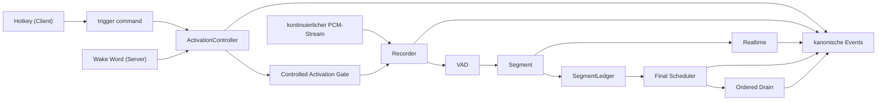
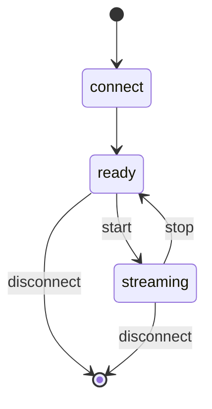
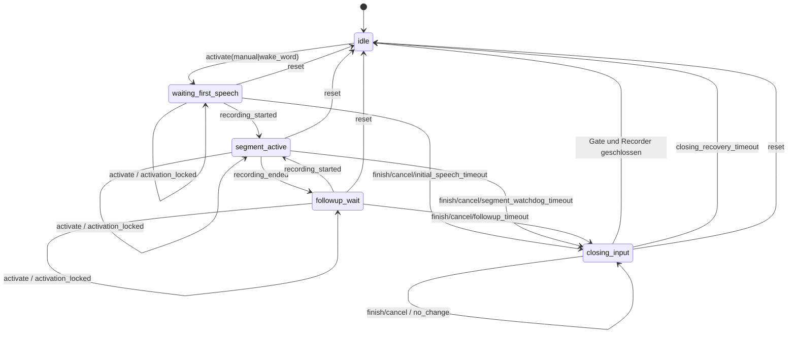
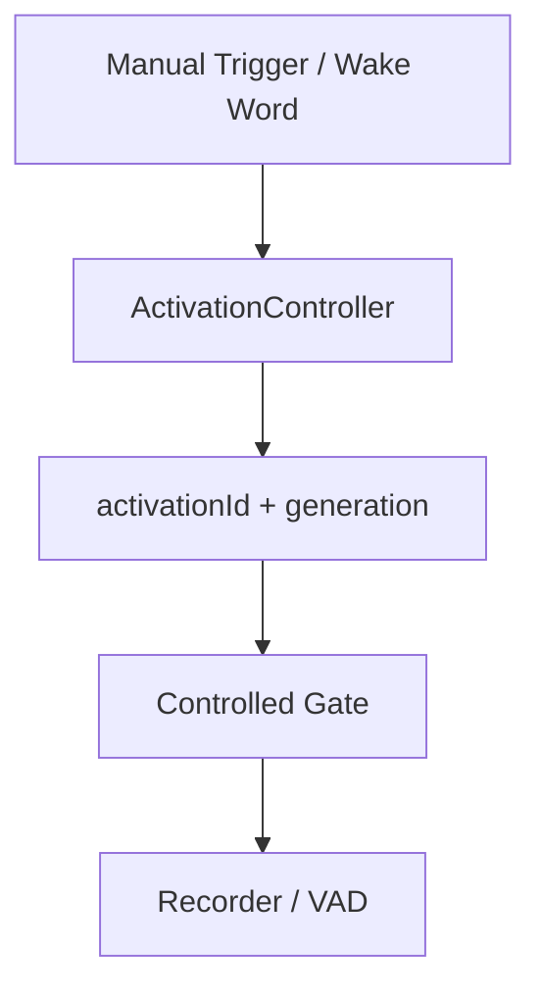

# Einheitliche serverseitige Triggerarchitektur – Activation, Commands, Timer und Segmentledger

Diese Datei beschreibt den mit AP-SRV-010, AP-SRV-020 und AP-SRV-030
implementierten serverautoritativen Vordergrund-Lifecycle, die Command- und
Timerpolitik sowie den Hintergrund-Drain. Eine Session besitzt genau eine
Activation-State-Machine, genau einen Command-Replaycache und ein
threadsicheres Segmentledger. Nach sicherem Schließen des Eingabepfads ist der
Vordergrund wieder `idle`, auch wenn Finalarbeit älterer Segmente im
Hintergrund läuft.

> Ergänzende Dokumente: [`docs/client-development/`](client-development/README.md)
> für den Client-Vertrag, [`docs/fastapi-server.md`](fastapi-server.md) für den
> Serverbetrieb.

## 0. Paketgrenze

AP-SRV-010 liefert die fünf kanonischen Vordergrundphasen; AP-SRV-020 ergänzt
immutable Finaljobkontexte, Segmentterminale und sessionweit geordnete
Nutzresultate; AP-SRV-030 ersetzt die geerbte Extend-Semantik durch den
eingefrorenen Command- und Timervertrag. Folgende Semantiken bleiben bewusst
Folgepaketen zugeordnet:

- Der Controller erlaubt mehrere serielle Segmente derselben Activation. Das
  Segmentledger korreliert Audio, Schedulerjob und Ergebnis unabhängig vom
  aktuellen Vordergrund und veröffentlicht Nutzresultate strikt nach
  `segmentSequence`.
- Early-Final darf während der Aufnahme anlaufen. Sein Job übernimmt denselben
  unveränderlichen Segmentkontext wie der spätere Recorderabschluss.
- Die öffentlichen Activation-Nachrichten und Snapshots sind geerbte
  Baselineformen; der eingefrorene Wire-Vertrag (`hello`-Handshake,
  `activation.command`/`command.ack`, `eventSeq`, `session.snapshot`) wird erst
  mit AP-SRV-040 hergestellt. Die serverinterne Command-, Timer- und
  Recoverypolitik aus AP-SRV-030 ist davon unabhängig und vollständig.
- Die Timerwerte sind Sessionparameter der bestehenden Query-Admission. Die
  vollständige Settings-Control-Plane mit Scope, Auth, Constraints und
  Apply-Policy folgt in AP-SRV-050.
- Wake-Word-Katalog, Detection, Domain-Latch und Evidence sind mit AP-SRV-060 gehärtet:
  Katalogautorität (OpenWakeWordCatalog) mit versioniertem öffentlichen v2-Katalog (ohne lokale Pfade),
  strikte atomare v2-Sessionadmission (kein stiller Fallback, maschinenlesbare Problem-IDs),
  selected-only Modellinitialisierung,
  server-autoritativer `WakeAdmissionCoordinator` mit fachlichem Domain-Latch (Freigabe gebunden an SRV-030 safe input close),
  Pre-Roll-Audiogrenzenselektion (Ausschluss des Wake-Words bei Erhalt des Sprachbeginns, 0ms-Support),
  und reproduzierbares Ressourcen- und Startzeit-Evidence-Harness.

Die Legacy-Sessionauflösung bleibt in dieser Baseline erhalten. Ihre
Zielmodellierung beginnt in AP-SRV-010; die endgültige Entfernung der alten
Mode-Autorität ist AP-SRV-070 zugeordnet.

---

## 1. Zielbild

Eine Clientverbindung besitzt:

- genau **eine** STT-Session,
- genau **einen** kontinuierlichen Audiostream,
- genau **eine** Aktivierungszustandsmaschine (`ActivationController`),
- genau **eine** Recorder-/VAD-/Transkriptionspipeline,
- und **zwei unabhängig aktivierbare Triggerquellen**: `manual` und
  `wake_word`.

| `manualTriggerEnabled` | `wakeWordTriggerEnabled` | zulässig |
| --- | --- | --- |
| true | false | ja |
| false | true | ja |
| true | true | ja |
| false | false | **nein** – wird bei der Session-Admission abgelehnt |



---

## 2. Zwei getrennte Lebenszyklen

`start` und `stop` bleiben **ausschließlich Streambefehle**. Ein Manualtrigger
wird niemals auf sie abgebildet.

### Stream-Lifecycle



### Activation-Lifecycle



Die drei Phasen `waiting_first_speech`, `segment_active` und `followup_wait`
bilden zusammen das **offene Aktivierungsfenster**. Genau in diesen Phasen ist
das Recorder-Gate offen (`windowOpen == true`).

`closing_input` ist eine kurze Eingabebarriere. Zuerst wird das Recorder-Gate
geschlossen, eine laufende Aufnahme gestoppt und an den bestehenden Finalpfad
übergeben; erst danach wird `idle` veröffentlicht. Finaltranskription ist keine
Vordergrundphase. Eine neue Activation darf deshalb nach `idle` beginnen,
während ältere Finalarbeit im Hintergrund weiterläuft.

Scheitert das Schließen von Gate oder Recorder, bleibt der Vordergrund
zunächst in `closing_input`. Genau dafür existiert der Recoverytimeout aus
Abschnitt 4: er schließt den Eingabepfad defensiv, terminalisiert nicht mehr
einreihbares Audio und erreicht `idle`. `closing_input` kann dadurch nicht
dauerhaft hängen.

### Hintergrund-Lifecycle

Bei Aufnahmebeginn registriert das Ledger genau einen unveränderlichen
`SegmentContext`. Er enthält `sessionId`, `activationId`,
`activationSequence`, `segmentId`, die sessionsweit streng steigende
`segmentSequence`, den eingefrorenen Activation-Settings-Snapshot und die
`requestId` des Finaljobs. Der Kontext wird zusammen mit dem aufgenommenen
Audio durch Recorder, Scheduler und Worker getragen; der aktuelle
Foreground-Zeiger wird zur Ergebniskorrelation nicht mehr verwendet.

Jedes angenommene Segment endet genau einmal als `completed`, `discarded`,
`cancelled` oder `failed`. Leeres Audio, Empty-Final, Queue-Trim,
Scheduler-Ablehnung/-Drop, Workerfehler, Cancel und Session-Close erzeugen
damit explizite Ledgerterminale. Ein nicht publizierbares Terminal schließt
eine Sequenzlücke, sodass ein bereits fertiges späteres Nutzresultat freikommt.

Eine Activation erhält genau ein Hintergrundterminal, sobald ihr Input
geschlossen ist und alle angenommenen Segmente terminal und aus dem
sessionweiten Reorder-Buffer ausgetragen sind. Dieses Hintergrundterminal ist
vom früheren Vordergrundereignis `activation.closed` getrennt.

---

## 3. Activation-Daten

Jede Activation trägt mindestens:

| Feld | Bedeutung |
| --- | --- |
| `activationId` | eindeutige ID der Activation |
| `activationSequence` | steigt pro Session bei jeder akzeptierten neuen Activation |
| `generation` | Kompatibilitätsfeld für die Gate-Bindung; entspricht derzeit `activationSequence` |
| `version` | steigt bei **jeder** Zustandsänderung |
| `timerRevision` | steigt bei **jeder wirksamen Timeränderung**; bindet geplante Callbacks |
| `segmentToken` | steigt bei jedem neu begonnenen Segment; bindet den Watchdog |
| `primarySource` | die Quelle des **ersten** Triggers, unveränderlich |
| `sources` | kompatible Listenform der einen gelatchten `primarySource` |
| `effectiveSettings` | defensiv kopierter, für diese Activation unveränderlicher Settings-Snapshot |
| `phase` | siehe Zustandsdiagramm |
| `deadline` | monotone Deadline (`time.monotonic`) oder `None` |
| `deadlineKind` | `initial_speech`, `followup`, `segment_watchdog` oder `closing_recovery` |
| `warningDeadline` | Zeitpunkt der Watchdog-Vorwarnung, `None` sobald sie ausgelöst wurde |
| `segments` | Anzahl der in dieser Activation gestarteten Aufnahmen |

### Zähler und Timerbindung

`activationSequence` identifiziert die Reihenfolge akzeptierter Activations in
der Session. `generation` bindet bis zur Wire-v2-Migration das Gate an dieselbe
Identität. `version` beschreibt jede sichtbare Zustandsänderung.

Geplante Timer hängen dagegen an einem vollständigen **Timer-Token** aus
`activationId`, `activationSequence`, `timerRevision`, `phase`, `deadlineKind`
und `segmentToken`. Ein Callback muss genau dieses Token vorlegen; jedes andere
ist wirkungslos (`reason = "stale_timer"`). Die `timerRevision` allein würde
nicht genügen, weil ihre Bedeutung mit jeder Activation neu beginnt — ein alter
Callback von A könnte sonst zufällig auf eine Revision von B passen.

Pro armierter Deadline existiert genau **ein** Workerthread. Eine Vorwarnung
verschiebt keine Deadline und erhält deshalb bewusst keine neue
`timerRevision`; dasselbe Token bleibt für den darauffolgenden Ablauf
zuständig. Abgelehnte Commands ändern weder `version` noch `timerRevision`.

### Monotone Zeit

Alle internen Deadlines benutzen `time.monotonic`. Eine Änderung der
Systemuhrzeit kann eine Activation dadurch weder vorzeitig beenden noch
verlängern. Wallclock-Zeit wird nur für Logs und öffentliche Zeitstempel
verwendet.

---

## 3a. Command- und Timervertrag (AP-SRV-030)

### Semantische Aktionen

Es gibt genau vier: `activate`, `refresh`, `finish`, `cancel`.

| Phase | `activate` | `refresh` | `finish` / `cancel` |
| --- | --- | --- | --- |
| `idle` | gemäß effektiver Triggerquelle | `not_active` | `not_active` |
| `waiting_first_speech` | `activation_locked` | `invalid_phase` | zulässig |
| `segment_active` | `activation_locked` | Watchdog-Refresh | zulässig |
| `followup_wait` | `activation_locked` | Follow-up-Reset | zulässig |
| `closing_input` | `activation_locked` | `closing_input` | `no_change` (idempotent) |

`refresh`, `finish` und `cancel` dürfen die vom Client beobachtete
`activationId` mitführen. Passt sie nicht zur laufenden Activation, lautet die
Antwort `stale_activation` und es entsteht **keine** Zustandsänderung. Bei
`activate` ist das Feld verboten (`invalid_payload`).

### Timer

| Deadline | Default | Regel |
| --- | ---: | --- |
| Initial Speech | 15 s | `now + initialSpeechTimeout` bei der Admission; nicht refreshbar |
| Follow-up | 3 s | `now + followupTimeout` nach Segmentende **und** bei jedem `refresh` |
| Segment-Watchdog | 600 s | `now + segmentWatchdogInitial` bei Segmentstart |
| Watchdog-Refresh | 180 s | `refresh` setzt `max(currentDeadline, now + segmentWatchdogRefresh)` |
| Watchdog-Warnung | 30 s | Vorwarnung vor dem Ablauf, genau einmal je Deadline |
| Closing Recovery | 5 s | armiert beim Eintritt in `closing_input` |

Daraus folgt ausdrücklich:

- **Kein** `extensionSeconds`, **kein** `pending_extension`, **kein**
  Zeitguthaben. Dreimal `refresh` heißt dreimal „ab jetzt neu setzen", nicht
  dreimal zusätzliche Zeit.
- Ein **früher** Watchdog-Refresh verkürzt eine noch längere Restfrist nicht
  und armiert keinen neuen Timer.
- Ein **später** Watchdog-Refresh sichert mindestens 180 Sekunden ab der
  Interaktion.
- **VAD-Aktivität setzt den Watchdog nicht zurück.** Fortgesetzte Sprache
  innerhalb desselben Segments ist keine Interaktion.
- Beim **Watchdog-Ablauf** wird das erfasste Audio regulär verarbeitet, die
  gesamte Activation geschlossen und **kein** Follow-up geöffnet.

### Command-Idempotenz

Der Replaycache ist an die Session gebunden und wird währenddessen **nicht**
getrimmt; er wird erst beim Sessionabbau freigegeben.

- gleiche `commandId`, semantisch gleicher Payload (`action`, `source`,
  `activationId`): **exakt dasselbe Ack**, keine zweite Wirkung — keine zweite
  Transition, kein zweiter Timerreset, kein zweites Cancel/Finish, keine zweite
  Activation und kein zweites Ledgerereignis;
- gleiche `commandId`, abweichender Payload: `command_id_conflict`, die
  laufende Activation bleibt unberührt;
- ein syntaktisch abgelehntes Kommando belegt seine `commandId` **nicht**.

Der Cache liefert ausschließlich die ursprüngliche Antwort zurück; er ruft
nichts erneut auf. Ein alter Replay kann dadurch nicht gegen eine neuere
Activation wirksam werden.

### Recovery und Audioverfügbarkeit

- Läuft der Recoverytimeout in `closing_input` ab, wird das Gate bedingungslos
  abgebrochen, der Recorder defensiv gestoppt, ein nicht mehr einreihbares
  Segment als `failed` mit Grund `closing_recovery_timeout` terminalisiert und
  die Activation im Ledger geschlossen. Bereits veröffentlichter Text wird
  **niemals** zurückgenommen.
- `audioAvailable=false` cancelt die offene Activation mit
  `closeCause = audio_unavailable` und beendet **nicht** die Session. Solange
  kein Audio verfügbar ist, wird `activate` mit `audio_unavailable` abgelehnt.
- Stream-Stop, `clear` und Sessionverlust verwerfen die offene Activation wie
  bisher; eine neue Session beginnt in `idle` ohne Fortsetzung.

### Ownership

| Verantwortung | Ort |
| --- | --- |
| Payloadprüfung, `commandId`, Replaycache | `api_fastapi_server/activation_commands.py` |
| Phasenmatrix, Activation-ID-Prüfung, Deadlines, `timerRevision` | `api_fastapi_server/activation.py` |
| Gate-, Recorder-, Ledger- und Eventwirkung, Timerthread | `api_fastapi_server/server.py` |

Der Replaycode hat bewusst **keine** Nebenwirkung: er entscheidet nur
„gesehen / Konflikt / neu". Alles, was einen Zustand ändert, liegt hinter dem
Vordergrundlock des Controllers.

---

## 4. Lock-Semantik

Der **erste** Trigger eröffnet die Activation und wird deren `primarySource`.
Jeder weitere `activate`-Versuch derselben oder der anderen Quelle in einer
nicht-idle Phase wird deterministisch mit `activation_locked` abgelehnt.

```text
Manual                       Wake Word
  ↓                             ↓
Activation A42 (primarySource = manual, sources = [manual])
  ↓  + activate(wake_word)
Ack: accepted=false, reason=activation_locked, activationId=A42
```

ID, Sequenz, Quelle und effektive Settings von A42 bleiben unverändert. Dabei
entsteht **nicht**:

- eine zweite Activation,
- ein zweiter Recorderpfad,
- ein zweites Segment,
- ein zweites Final,
- eine zweite Schedulerbelegung,
- ein paralleler Follow-up-Timer.

In umgekehrter Reihenfolge gilt dasselbe.

Ein expliziter `refresh`-Befehl bleibt von `activate` getrennt; seine Semantik
steht in Abschnitt 3a.

`ActivationController` synchronisiert sich selbst über ein `RLock`. Das ist
notwendig, weil er aus der WebSocket-Coroutine, aus Recorder-Callbackthreads
und aus dem Timeoutthread erreicht wird.

---

## 5. Recorder Activation Gate

Der Recorder kennt im Controlled-Modus die Triggerquelle **nicht**. Er kennt
ausschließlich „Gate offen" oder „Gate geschlossen".



### Policies

| Policy | Verhalten |
| --- | --- |
| `legacy` | unverändertes Altverhalten: VAD startet über `start_recording_on_voice_activity`, ein erkanntes Wake Word öffnet direkt |
| `controlled` | ausschließlich das Gate entscheidet; `recorder.wakeword_detected` wird **nicht** ausgewertet |

### Operationen

| Methode auf `AudioToTextRecorder` | Wirkung |
| --- | --- |
| `set_activation_policy(policy)` | wählt `legacy` oder `controlled` |
| `open_controlled_activation(id, replace=…, generation=…)` | öffnet das Gate für eine Activation |
| `close_controlled_activation(id=…, generation=…)` | schließt, wenn der Aufrufer das Gate noch besitzt |
| `abort_controlled_activation()` | schließt bedingungslos, deterministischer Zustand |
| `controlled_activation_state()` | konsistenter Snapshot |

`abort()` und `shutdown()` des Recorders schließen das Gate mit. Nach
`shutdown()` wird jedes weitere `open` abgelehnt, damit ein während des
Herunterfahrens eintreffender Trigger das Gate nicht wieder öffnet.

### Generationsbindung

`open` und `close` sind an `(activationId, generation)` gebunden:

- ein spätes `close(A)` schließt die inzwischen laufende Activation `B` nicht;
- ein `close(generation=alt)` ohne ID schließt `B` ebenfalls nicht;
- ein spätes `open(A, replace=True)` mit älterer Generation ersetzt `B` nicht.

Wenn die Gate-Prüfung einen Recording-Start zulässt, latcht der Recorder das
zugehörige Paar `(activationId, generation)` bis zum Start-Callback. Schließt A
in diesem kurzen Race-Fenster und B öffnet bereits, wird der verspätete Start
von A nicht B zugerechnet, sondern sofort gestoppt. Damit sind Gate-Admission
und Controllerübergang auch über die Callback-Grenze gebunden.

Die VAD-Startbedingung wird ausschließlich im Zweig „es wird gerade **nicht**
aufgenommen" ausgewertet. Ein zusätzlicher Trigger während einer laufenden
Aufnahme kann deshalb strukturell keine zweite Aufnahme starten.

---

## 6. WebSocket-Vertrag

### Verbindung

```text
GET /ws/transcribe?<Queryparameter>
```

#### Queryparameter der Triggerarchitektur

| Parameter | Typ | Default | Bedeutung |
| --- | --- | --- | --- |
| `manualTriggerEnabled` | Bool | – | Manualtrigger zulässig |
| `wakeWordTriggerEnabled` | Bool | – | Wake Word darf eine Activation öffnen |
| `initialSpeechTimeout` | Zahl 0.01–3600 | `15` | Wartezeit auf die erste Sprache |
| `followupTimeout` | Zahl 0.01–3600 | `3` | Nachfragefenster nach einem Segment |
| `segmentWatchdogInitialSeconds` | Zahl 0.01–3600 | `600` | Daueraufnahme-Watchdog beim Segmentstart |
| `segmentWatchdogRefreshSeconds` | Zahl 0.01–3600 | `180` | Mindestrestzeit, die ein `refresh` sichert |
| `segmentWatchdogWarningSeconds` | Zahl 0.01–3600 | `30` | Vorwarnung vor dem Watchdog-Ablauf |
| `closingRecoveryTimeoutSeconds` | Zahl 0.01–3600 | `5` | Recoveryfrist in `closing_input` |

Zulässige Wahrheitswerte: `true/1/yes/on` und `false/0/no/off`. Ein nicht
interpretierbarer Wert wird **abgelehnt**, nicht als `false` gedeutet — sonst
könnte ein Tippfehler eine gültige Anforderung unbemerkt in die verbotene
Kombination `false/false` kippen.

Die Bereiche sind hier bewusst weit, damit deterministische Tests kurze
Deadlines durch den Produktionspfad treiben können. Die verbindlichen
Contractbereiche (`60000–3600000` ms für den Watchdog und so weiter) gehören
zur Settings-Control-Plane aus AP-SRV-050.

**Entfallen mit AP-SRV-030:** `extensionSeconds`. Die additive Extend-Semantik
ist kein gültiges Soll mehr. Ein alter Client, der den Parameter noch sendet,
wird nicht abgelehnt — der Wert wird ignoriert. Die Capability nennt ihn unter
`retiredQueryParameters`.

#### Modusauflösung

```text
weder manualTriggerEnabled noch wakeWordTriggerEnabled gesetzt
    → mode = "legacy"   (unverändertes Altverhalten)

mindestens einer gesetzt
    → mode = "controlled"
    → der weggelassene Wert gilt als false (explizites Opt-in)
```

#### Ablehnungen bei der Admission

| Code | Anlass | Close |
| --- | --- | --- |
| `activation_trigger_required` | beide Trigger `false` | 1008 |
| `activation_wake_word_unavailable` | Wake Word ist einzige Quelle, aber kein Wake-Word-Profil aktiv | 1008 |
| `invalid_activation_flag` | Flag ist kein Wahrheitswert | 1008 |
| `invalid_activation_timing` | Zeitwert keine Zahl oder außerhalb des Bereichs | 1008 |

### `hello` und `ready`

Beide Nachrichten enthalten zusätzlich `activationConfig`:

```json
{
  "version": 2,
  "mode": "controlled",
  "manualTriggerEnabled": true,
  "wakeWordTriggerEnabled": false,
  "wakeWordProfileEnabled": false,
  "initialSpeechTimeout": 15.0,
  "followupTimeout": 3.0,
  "segmentWatchdogInitialSeconds": 600.0,
  "segmentWatchdogRefreshSeconds": 180.0,
  "segmentWatchdogWarningSeconds": 30.0,
  "closingRecoveryTimeoutSeconds": 5.0
}
```

`wakeWordProfileEnabled` sagt, ob für diese Sitzung tatsächlich
Wake-Word-**Erkennung** läuft. Ein Client, der den Wake-Word-Trigger aktiviert,
ohne dass ein Profil aktiv ist, sieht hier, dass keine Erkennungen eintreffen
werden.

### Capability

```json
"activationTriggers": {
  "supported": true,
  "version": 2,
  "sources": ["manual", "wake_word"],
  "actions": ["activate", "refresh", "finish", "cancel"],
  "deprecatedActionAliases": ["extend"],
  "commandType": "trigger",
  "ackType": "trigger_ack",
  "commandIdRequired": true,
  "commandIdIdempotent": true,
  "commandHistory": "session",
  "activationIdValidated": true,
  "audioAvailabilityCommandType": "audio_availability",
  "audioAvailabilityAckType": "audio_availability_ack",
  "queryParameters": ["manualTriggerEnabled", "wakeWordTriggerEnabled",
                      "initialSpeechTimeout", "followupTimeout",
                      "segmentWatchdogInitialSeconds",
                      "segmentWatchdogRefreshSeconds",
                      "segmentWatchdogWarningSeconds",
                      "closingRecoveryTimeoutSeconds"],
  "retiredQueryParameters": ["extensionSeconds"],
  "activationEvents": ["activation.started", "activation.refreshed",
                       "activation.closed", "watchdog.warning"]
}
```

Diese Capability wird nur gemeldet, weil der gesamte Vertrag dahinter
funktioniert. Ein Client **muss** sie prüfen, bevor er `trigger` sendet.

### Befehl `trigger`

```json
{ "type": "trigger", "action": "activate", "source": "manual",
  "commandId": "6f1c..." }
```

```json
{ "type": "trigger", "action": "refresh", "source": "manual",
  "commandId": "9a2d...", "activationId": "a42..." }
```

`action` ist eines von `activate`, `refresh`, `finish`, `cancel`.
`extend` bleibt als veraltete Schreibweise für `refresh` zulässig und entfällt
mit AP-SRV-070; es trägt die neue, nicht kumulative Semantik.
`source` ist `manual` oder `wake_word`. `commandId` ist ein nicht leerer String.
Bei `refresh`, `finish` und `cancel` darf zusätzlich die beobachtete
`activationId` mitgesendet werden; sie wird gegen die laufende Activation
geprüft. Bei `activate` ist sie verboten.

### Befehl `audio_availability`

```json
{ "type": "audio_availability", "commandId": "3f0e...",
  "audioAvailable": false }
```

Die Antwort ist ein `audio_availability_ack` mit `accepted`, `reason`
(`applied`, `no_change` oder eine Ablehnung), `audioAvailable`, `activationId`,
`phase` und `sessionId`. Der Server erfährt bewusst **nicht**, welches Gerät
betroffen ist; Gerät, ReSpeaker und Mute bleiben Clientverantwortung. Die
endgültige v2-Form (`audio_availability.set`) gehört zu AP-SRV-040.

### Antwort `trigger_ack`

```json
{ "type": "trigger_ack", "commandId": "6f1c...", "accepted": true,
  "reason": "activated", "activationId": "a42...",
  "phase": "waiting_first_speech", "sessionId": "s..." }
```

Jeder Befehl erhält **genau eine** Antwort — auch jede Ablehnung, damit sie
korrelierbar bleibt. Läuft bereits eine Activation, trägt auch eine Ablehnung
deren `activationId`. `phase` ist die nach dem Ack beobachtete
Vordergrundphase.

#### Werte von `reason`

| `reason` | `accepted` | Bedeutung |
| --- | --- | --- |
| `activated` | true | neue Activation eröffnet |
| `refreshed` | true | Follow-up- beziehungsweise Watchdog-Deadline neu gesetzt |
| `finished` | true | Turn kontrolliert beendet |
| `cancelled` | true | Turn verworfen |
| `no_change` | true | idempotente Zustandsantwort; der gewünschte Zustand liegt bereits an |
| `activation_locked` | false | `activate` traf eine nicht-idle Vordergrundphase; laufende Activation bleibt unverändert |
| `invalid_phase` | false | `refresh` in `waiting_first_speech` |
| `closing_input` | false | `refresh` während der Eingabebarriere |
| `not_active` | false | keine Activation offen |
| `stale_activation` | false | mitgeschickte `activationId` ist nicht die laufende |
| `audio_unavailable` | false | `activate` bei `audioAvailable=false` |
| `trigger_disabled` | false | diese Quelle ist für die Sitzung nicht aktiviert |
| `invalid_payload` | false | Befehl ist kein Objekt, oder `activate` trug eine `activationId` |
| `missing_command_id` | false | `commandId` fehlt oder ist leer |
| `invalid_command_id` | false | `commandId` ist kein String |
| `invalid_action` | false | `action` unbekannt oder falscher Typ |
| `invalid_source` | false | `source` unbekannt oder falscher Typ |
| `command_id_conflict` | false | bekannte `commandId` mit abweichendem Payload |
| `controlled_activation_disabled` | false | Sitzung läuft im Legacy-Modus |
| `stream_not_started` | false | Trigger vor `start` oder nach `stop` |
| `session_closed` | false | Sitzung ist bereits geschlossen |

`timed_out`, `segment_watchdog_timeout` und `closing_recovery_timeout`
erscheinen nicht als Ack, sondern als `reason` beziehungsweise `cause` des
Events `activation.closed`.

### Idempotenz von `commandId`

Der Replaycache gilt für die **gesamte Sitzung**; siehe Abschnitt 3a.

---

## 7. IDs und Korrelation

| ID | Producer | Scope | Lebensdauer | Reconnect |
| --- | --- | --- | --- | --- |
| `sessionId` | Server | eine WebSocket-Verbindung | Verbindung | neue ID |
| `activationId` | Server | eine Activation | bis zum sicheren Input-Close/Reset | **wird nie wiederbelebt** |
| `activationSequence` | Server | Session | steigt je akzeptierter Activation | neue Sessionfolge |
| `generation` | Server | eine Activation | entspricht derzeit `activationSequence` | neu |
| `segmentId` | Server | eine Aufnahme | Segment | fortlaufend |
| `segmentSequence` | Server | Session | steigt je angenommenem Segment streng | neue Sessionfolge |
| `requestId` | Server | ein Finaljob | bis Segmentterminal | neu |
| `commandId` | Client | ein Triggerkommando | gesamte Sitzung | bleibt offen |
| `timerRevision` | Server | eine armierte Deadline | bis zur nächsten wirksamen Timeränderung | neu |
| `segmentToken` | Server | ein aktives Segment | bis zum Segmentende | neu |
| `eventId` / `cursor` | Server | Eventstream | dauerhaft | fortgesetzt |

Activation- und Recording-Ereignisse tragen im Controlled-Modus zusätzlich
`activationId`, `activationSequence`, `primarySource` und `sources`.
Nachlaufende Final- und Terminalereignisse verwenden den gespeicherten
Segmentkontext und tragen additiv `activationId`, `activationSequence`,
`segmentSequence` und `requestId`.

---

## 8. Events

Neu hinzugekommen:

```text
activation.started     eine Activation wurde eröffnet
activation.refreshed   Follow-up- oder Watchdog-Deadline neu gesetzt
activation.closed      Eingabepfad der Activation ist geschlossen
activation.drained     Hintergrundledger der Activation terminal
watchdog.warning       Vorwarnung vor dem Daueraufnahme-Ablauf
```

`activation.closed` trägt ein `reason` aus `finished`, `cancelled`,
`timed_out`, `segment_watchdog_timeout`, `stream_stopped`, `session_closed`
oder `client_clear` und zusätzlich ein feineres `cause` aus `finish`, `cancel`,
`audio_unavailable`, `initial_speech_timeout`, `followup_timeout`,
`segment_watchdog_timeout` oder `closing_recovery_timeout`. Wurde der
Eingabeschluss durch ein Kommando ausgelöst, trägt es außerdem
`causedByCommandId`; bei Timer-, Watchdog-, Geräte- und Recoveryabschlüssen
ist das Feld `null`.

`activation.closed` entsteht **genau einmal** je Activation und erst dann, wenn
der Eingabepfad tatsächlich geschlossen ist. Scheitert das Schließen, gibt es
kein Ereignis, bis die Recovery den Abschluss herstellt — nicht zwei.

`watchdog.warning` trägt `activationId`, `activationSequence`, `segmentId`,
`segmentSequence`, `phase`, `timerRevision` und `remainingSeconds` und wird pro
armierter Watchdog-Deadline höchstens einmal ausgelöst.

Als Timeline-Nachricht heißen die Events `activation_started`,
`activation_refreshed`, `activation_closed`, `activation_drained` und
`watchdog_warning`; im strukturierten Eventstream `activation.*` beziehungsweise
`watchdog.warning`.

Nicht publizierbare Segmentterminale heißen intern/timelinebasiert
`final_transcript_discarded`, `final_transcript_cancelled` und
`final_transcript_failed`. `activation_drained` und diese Zusatzfelder sind
Observability des AP-SRV-020; das endgültige öffentliche Wire-v2 bleibt
AP-SRV-040 vorbehalten.

Bestehende Eventnamen wurden **nicht** verändert. Das bestehende
Wakeword-Event bleibt erhalten.

---

## 9. Legacykompatibilität und Rollout

- Eine Sitzung ohne die neuen Queryparameter verhält sich **exakt wie bisher**.
  Es wird kein `ActivationController` angelegt, das Recorder-Gate bleibt in der
  `legacy`-Policy, und der Wakeword-Follow-up läuft unverändert.
- `start` und `stop` bleiben reine Streambefehle. Ein Manualtrigger wird nicht
  auf sie abgebildet.
- `trigger` ist additiv. Ein Legacyclient sendet es nie; täte er es, bekäme er
  `controlled_activation_disabled`.
- `hello` und `ready` wurden nur um `activationConfig` **ergänzt**.

### Migration der Clientkonfiguration

```text
mode = hotkey     ->  manualTriggerEnabled = true,  wakeWordTriggerEnabled = false
mode = wake_word  ->  manualTriggerEnabled = false, wakeWordTriggerEnabled = true
```

Eine stillschweigende Migration nach `true / true` findet **nicht** statt.

### Rollback

Der Umbau ist serverseitig vollständig additiv. Ein Rollback besteht darin,
dass Clients die neuen Queryparameter nicht mehr senden; die Sitzungen fallen
dann automatisch in den Legacy-Modus zurück. Ein Serverdowngrade ist dafür nicht
erforderlich.

---

## 10. Privacy: kontinuierliches Streaming

Im Controlled-Modus sendet der Client **durchgehend** Audio, auch außerhalb
einer Activation. Das ist die Voraussetzung dafür, dass ein Trigger sofort
greifen kann, hat aber Folgen, die bewusst zu tragen sind:

- Audio verlässt das Gerät auch dann, wenn keine Aufnahme läuft.
- Der Server verwirft Audio außerhalb einer offenen Activation, statt daraus
  ein Segment zu machen; es wird nicht transkribiert und nicht archiviert.
- Wer das nicht möchte, betreibt die Sitzung weiterhin im Legacy-Modus oder
  nutzt die Stummschaltung des Clients, die den Stream unterbricht.

---

## 11. Troubleshooting

| Symptom | Wahrscheinliche Ursache |
| --- | --- |
| `trigger_ack` mit `controlled_activation_disabled` | Sitzung wurde ohne Triggerparameter aufgebaut, läuft also legacy |
| `trigger_ack` mit `stream_not_started` | `start` wurde nicht gesendet, oder `stop` kam dazwischen |
| Close 1008 mit `activation_trigger_required` | beide Triggerflags waren `false` |
| Close 1008 mit `activation_wake_word_unavailable` | Wake Word ist einzige Quelle, aber kein Wake-Word-Modell installiert |
| Wake Word löst nichts aus | `wakeWordProfileEnabled` in `activationConfig` prüfen |
| Aufnahme startet nie | prüfen, ob ein `trigger_ack` mit `accepted: true` eintraf |
| Aufnahme endet nie | `activation.closed` im Eventstream prüfen; fehlt es, ist der Timeout nicht gefeuert |
| `trigger_ack` mit `invalid_phase` | `refresh` traf `waiting_first_speech`; das Erstsprachfenster ist nicht refreshbar |
| `trigger_ack` mit `stale_activation` | die mitgesendete `activationId` ist nicht mehr die laufende; aktuellen Zustand abwarten statt erneut zu senden |
| `trigger_ack` mit `command_id_conflict` | dieselbe `commandId` wurde mit anderem Payload wiederverwendet; je logischem Kommando eine neue UUID erzeugen |
| `trigger_ack` mit `audio_unavailable` | zuletzt wurde `audioAvailable=false` gemeldet; erst `true` senden |
| Refresh scheint nichts zu bewirken | in `segment_active` ist das korrekt, solange die Restzeit größer als `segmentWatchdogRefreshSeconds` ist (`max()`-Semantik) |
| `activation.closed` mit `cause: closing_recovery_timeout` | Gate oder Recorder ließen sich nicht schließen; die Recovery hat den Vordergrund freigegeben, das betroffene Segment steht als `final_transcript_failed` im Ledger |
| `watchdog.warning` kommt sofort | `segmentWatchdogWarningSeconds` ist größer als die wirksame Frist; die Warnung wird dann sofort fällig statt verworfen |
