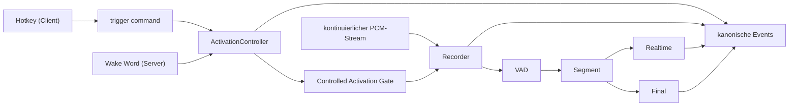
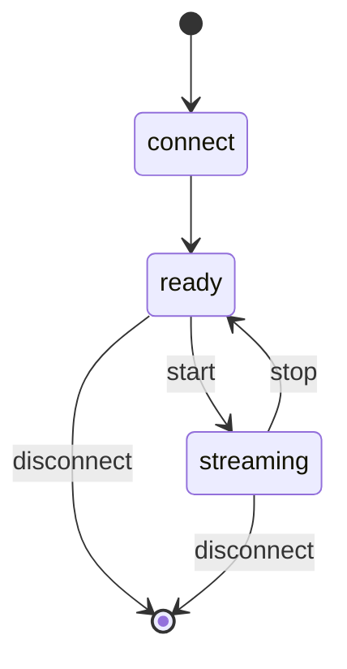
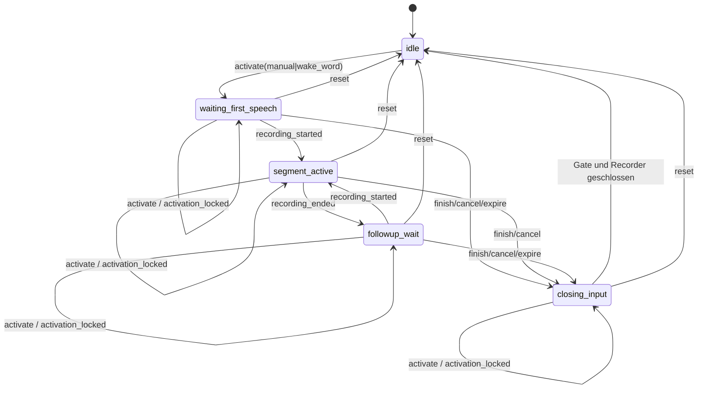
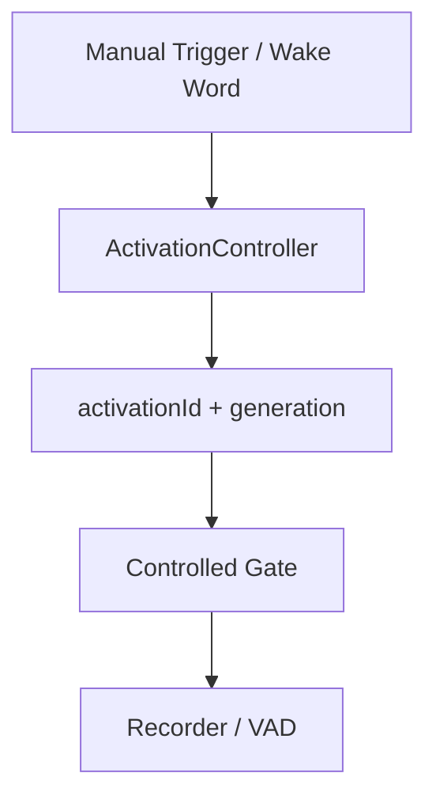

# Einheitliche serverseitige Triggerarchitektur – Activation-State-Machine

Diese Datei beschreibt den mit AP-SRV-010 implementierten serverautoritativen
Vordergrund-Lifecycle. Eine Session besitzt genau eine Activation-State-
Machine. Nach sicherem Schließen des Eingabepfads ist sie wieder `idle`, auch
wenn Finalarbeit eines älteren Segments noch im Hintergrund läuft.

> Ergänzende Dokumente: [`docs/client-development/`](client-development/README.md)
> für den Client-Vertrag, [`docs/fastapi-server.md`](fastapi-server.md) für den
> Serverbetrieb.

## 0. Paketgrenze

AP-SRV-010 liefert die fünf kanonischen Vordergrundphasen, stabile Activation-
Identität, eine gelatchte erste Triggerquelle, den eingefrorenen effektiven
Settings-Snapshot und den sicheren Close-Pfad. Folgende Semantiken bleiben
bewusst Folgepaketen zugeordnet:

- Wiederholte `extend`-Befehle addieren heute jeweils `extensionSeconds` auf
  die bestehende Deadline; AP-SRV-030 führt die eingefrorene Refresh- und
  Watchdog-Semantik ein.
- Der Controller erlaubt mehrere serielle Segmente derselben Activation,
  besitzt aber noch kein Segment-Ledger. Terminalzustände, strikte
  `segmentSequence`-Publikation, definitive segmentbezogene Korrelation und
  paralleles Final-Draining folgen in AP-SRV-020.
- Early-Final wird im Recorder bereits während der laufenden Aufnahme
  angestoßen. Die definitive segmentbezogene Publikations- und
  Drain-Semantik ist noch nicht vorhanden und gehört zu AP-SRV-020.
- Die öffentlichen Activation-Nachrichten und Snapshots sind geerbte
  Baselineformen; der eingefrorene Wire-Vertrag wird erst mit AP-SRV-040
  hergestellt.
- Wake-Word-Erkennung verwendet heute den letzten OpenWakeWord-Score gegen die
  konfigurierte Sensitivität. Es existiert kein belastbarer Score-/Audio-
  Evidence-Harness für Cooldown, ausgewähltes Modell und die exakte
  Pre-Roll-Grenze; Katalog/Settings folgen in AP-SRV-050, Detection/Latch und
  Evidence in AP-SRV-060. AP-SRV-000 erfindet dafür keine Kalibrierwerte.

Die Legacy-Sessionauflösung bleibt in dieser Baseline erhalten. Ihre
Zielmodellierung beginnt in AP-SRV-010; die endgültige Entfernung der alten
Mode-Autorität ist AP-SRV-070 zugeordnet.

---

## 1. Zielbild

Eine Clientverbindung besitzt:

- genau **eine** STT-Session,
- genau **einen** kontinuierlichen Audiostream,
- genau **eine** Aktivierungszustandsmaschine (`ActivationController`),
- genau **eine** Recorder-/VAD-/Transkriptionspipeline,
- und **zwei unabhängig aktivierbare Triggerquellen**: `manual` und
  `wake_word`.

| `manualTriggerEnabled` | `wakeWordTriggerEnabled` | zulässig |
| --- | --- | --- |
| true | false | ja |
| false | true | ja |
| true | true | ja |
| false | false | **nein** – wird bei der Session-Admission abgelehnt |



---

## 2. Zwei getrennte Lebenszyklen

`start` und `stop` bleiben **ausschließlich Streambefehle**. Ein Manualtrigger
wird niemals auf sie abgebildet.

### Stream-Lifecycle



### Activation-Lifecycle



Die drei Phasen `waiting_first_speech`, `segment_active` und `followup_wait`
bilden zusammen das **offene Aktivierungsfenster**. Genau in diesen Phasen ist
das Recorder-Gate offen (`windowOpen == true`).

`closing_input` ist eine kurze Eingabebarriere. Zuerst wird das Recorder-Gate
geschlossen, eine laufende Aufnahme gestoppt und an den bestehenden Finalpfad
übergeben; erst danach wird `idle` veröffentlicht. Finaltranskription ist keine
Vordergrundphase. Eine neue Activation darf deshalb nach `idle` beginnen,
während ältere Finalarbeit im Hintergrund weiterläuft.

---

## 3. Activation-Daten

Jede Activation trägt mindestens:

| Feld | Bedeutung |
| --- | --- |
| `activationId` | eindeutige ID der Activation |
| `activationSequence` | steigt pro Session bei jeder akzeptierten neuen Activation |
| `generation` | Kompatibilitätsfeld für die Gate-Bindung; entspricht derzeit `activationSequence` |
| `version` | steigt bei **jeder** Zustandsänderung; bindet geplante Timeouts |
| `primarySource` | die Quelle des **ersten** Triggers, unveränderlich |
| `sources` | kompatible Listenform der einen gelatchten `primarySource` |
| `effectiveSettings` | defensiv kopierter, für diese Activation unveränderlicher Settings-Snapshot |
| `phase` | siehe Zustandsdiagramm |
| `deadline` | monotone Deadline (`time.monotonic`), `None` während einer Aufnahme |
| `segments` | Anzahl der in dieser Activation gestarteten Aufnahmen |

### Warum zwei Zähler

`activationSequence` identifiziert die Reihenfolge akzeptierter Activations in
der Session. `generation` bindet bis zur Wire-v2-Migration das Gate an dieselbe
Identität. `version` gehört an geplante Timeouts: jede Zustandsänderung erhöht
sie, sodass ein früher gestellter Timer beim Feuern erkennt, dass er nicht mehr
zuständig ist (`reason = "stale_timer"`). Abgelehnte `activate`-Versuche ändern
keinen dieser Werte.

### Monotone Zeit

Alle internen Deadlines benutzen `time.monotonic`. Eine Änderung der
Systemuhrzeit kann eine Activation dadurch weder vorzeitig beenden noch
verlängern. Wallclock-Zeit wird nur für Logs und öffentliche Zeitstempel
verwendet.

---

## 4. Lock-Semantik

Der **erste** Trigger eröffnet die Activation und wird deren `primarySource`.
Jeder weitere `activate`-Versuch derselben oder der anderen Quelle in einer
nicht-idle Phase wird deterministisch mit `activation_locked` abgelehnt.

```text
Manual                       Wake Word
  ↓                             ↓
Activation A42 (primarySource = manual, sources = [manual])
  ↓  + activate(wake_word)
Ack: accepted=false, reason=activation_locked, activationId=A42
```

ID, Sequenz, Quelle und effektive Settings von A42 bleiben unverändert. Dabei
entsteht **nicht**:

- eine zweite Activation,
- ein zweiter Recorderpfad,
- ein zweites Segment,
- ein zweites Final,
- eine zweite Schedulerbelegung,
- ein paralleler Follow-up-Timer.

In umgekehrter Reihenfolge gilt dasselbe.

Ein expliziter `extend`-Befehl bleibt von `activate` getrennt. Seine endgültige
Refresh-/Watchdog-Semantik folgt in AP-SRV-030.

`ActivationController` synchronisiert sich selbst über ein `RLock`. Das ist
notwendig, weil er aus der WebSocket-Coroutine, aus Recorder-Callbackthreads
und aus dem Timeoutthread erreicht wird.

---

## 5. Recorder Activation Gate

Der Recorder kennt im Controlled-Modus die Triggerquelle **nicht**. Er kennt
ausschließlich „Gate offen" oder „Gate geschlossen".



### Policies

| Policy | Verhalten |
| --- | --- |
| `legacy` | unverändertes Altverhalten: VAD startet über `start_recording_on_voice_activity`, ein erkanntes Wake Word öffnet direkt |
| `controlled` | ausschließlich das Gate entscheidet; `recorder.wakeword_detected` wird **nicht** ausgewertet |

### Operationen

| Methode auf `AudioToTextRecorder` | Wirkung |
| --- | --- |
| `set_activation_policy(policy)` | wählt `legacy` oder `controlled` |
| `open_controlled_activation(id, replace=…, generation=…)` | öffnet das Gate für eine Activation |
| `close_controlled_activation(id=…, generation=…)` | schließt, wenn der Aufrufer das Gate noch besitzt |
| `abort_controlled_activation()` | schließt bedingungslos, deterministischer Zustand |
| `controlled_activation_state()` | konsistenter Snapshot |

`abort()` und `shutdown()` des Recorders schließen das Gate mit. Nach
`shutdown()` wird jedes weitere `open` abgelehnt, damit ein während des
Herunterfahrens eintreffender Trigger das Gate nicht wieder öffnet.

### Generationsbindung

`open` und `close` sind an `(activationId, generation)` gebunden:

- ein spätes `close(A)` schließt die inzwischen laufende Activation `B` nicht;
- ein `close(generation=alt)` ohne ID schließt `B` ebenfalls nicht;
- ein spätes `open(A, replace=True)` mit älterer Generation ersetzt `B` nicht.

Wenn die Gate-Prüfung einen Recording-Start zulässt, latcht der Recorder das
zugehörige Paar `(activationId, generation)` bis zum Start-Callback. Schließt A
in diesem kurzen Race-Fenster und B öffnet bereits, wird der verspätete Start
von A nicht B zugerechnet, sondern sofort gestoppt. Damit sind Gate-Admission
und Controllerübergang auch über die Callback-Grenze gebunden.

Die VAD-Startbedingung wird ausschließlich im Zweig „es wird gerade **nicht**
aufgenommen" ausgewertet. Ein zusätzlicher Trigger während einer laufenden
Aufnahme kann deshalb strukturell keine zweite Aufnahme starten.

---

## 6. WebSocket-Vertrag

### Verbindung

```text
GET /ws/transcribe?<Queryparameter>
```

#### Queryparameter der Triggerarchitektur

| Parameter | Typ | Default | Bedeutung |
| --- | --- | --- | --- |
| `manualTriggerEnabled` | Bool | – | Manualtrigger zulässig |
| `wakeWordTriggerEnabled` | Bool | – | Wake Word darf eine Activation öffnen |
| `initialSpeechTimeout` | Zahl 0.1–3600 | `15` | Wartezeit auf die erste Sprache |
| `followupTimeout` | Zahl 0.1–3600 | `3` | Nachfragefenster nach einem Segment |
| `extensionSeconds` | Zahl 0.1–3600 | `5` | Verlängerung je `extend` |

Zulässige Wahrheitswerte: `true/1/yes/on` und `false/0/no/off`. Ein nicht
interpretierbarer Wert wird **abgelehnt**, nicht als `false` gedeutet — sonst
könnte ein Tippfehler eine gültige Anforderung unbemerkt in die verbotene
Kombination `false/false` kippen.

#### Modusauflösung

```text
weder manualTriggerEnabled noch wakeWordTriggerEnabled gesetzt
    → mode = "legacy"   (unverändertes Altverhalten)

mindestens einer gesetzt
    → mode = "controlled"
    → der weggelassene Wert gilt als false (explizites Opt-in)
```

#### Ablehnungen bei der Admission

| Code | Anlass | Close |
| --- | --- | --- |
| `activation_trigger_required` | beide Trigger `false` | 1008 |
| `activation_wake_word_unavailable` | Wake Word ist einzige Quelle, aber kein Wake-Word-Profil aktiv | 1008 |
| `invalid_activation_flag` | Flag ist kein Wahrheitswert | 1008 |
| `invalid_activation_timing` | Zeitwert keine Zahl oder außerhalb des Bereichs | 1008 |

### `hello` und `ready`

Beide Nachrichten enthalten zusätzlich `activationConfig`:

```json
{
  "version": 1,
  "mode": "controlled",
  "manualTriggerEnabled": true,
  "wakeWordTriggerEnabled": false,
  "wakeWordProfileEnabled": false,
  "initialSpeechTimeout": 15.0,
  "followupTimeout": 3.0,
  "extensionSeconds": 5.0
}
```

`wakeWordProfileEnabled` sagt, ob für diese Sitzung tatsächlich
Wake-Word-**Erkennung** läuft. Ein Client, der den Wake-Word-Trigger aktiviert,
ohne dass ein Profil aktiv ist, sieht hier, dass keine Erkennungen eintreffen
werden.

### Capability

```json
"activationTriggers": {
  "supported": true,
  "version": 1,
  "sources": ["manual", "wake_word"],
  "actions": ["activate", "extend", "finish", "cancel"],
  "commandType": "trigger",
  "ackType": "trigger_ack",
  "commandIdRequired": true,
  "commandIdIdempotent": true,
  "commandHistory": 200,
  "queryParameters": ["manualTriggerEnabled", "wakeWordTriggerEnabled",
                      "initialSpeechTimeout", "followupTimeout",
                      "extensionSeconds"],
  "activationEvents": ["activation.started", "activation.extended",
                       "activation.closed"]
}
```

Diese Capability wird nur gemeldet, weil der gesamte Vertrag dahinter
funktioniert. Ein Client **muss** sie prüfen, bevor er `trigger` sendet.

### Befehl `trigger`

```json
{ "type": "trigger", "action": "activate", "source": "manual",
  "commandId": "6f1c..." }
```

`action` ist eines von `activate`, `extend`, `finish`, `cancel`.
`source` ist `manual` oder `wake_word`. `commandId` ist ein nicht leerer String.

### Antwort `trigger_ack`

```json
{ "type": "trigger_ack", "commandId": "6f1c...", "accepted": true,
  "reason": "activated", "activationId": "a42...", "sessionId": "s..." }
```

Jeder Befehl erhält **genau eine** Antwort — auch jede Ablehnung, damit sie
korrelierbar bleibt. Läuft bereits eine Activation, trägt auch eine Ablehnung
deren `activationId`.

#### Werte von `reason`

| `reason` | `accepted` | Bedeutung |
| --- | --- | --- |
| `activated` | true | neue Activation eröffnet |
| `activation_locked` | false | `activate` traf eine nicht-idle Vordergrundphase; laufende Activation bleibt unverändert |
| `extended` | true | Fenster verlängert |
| `finished` | true | Turn kontrolliert beendet |
| `cancelled` | true | Turn verworfen |
| `not_active` | false | keine Activation offen |
| `trigger_disabled` | false | diese Quelle ist für die Sitzung nicht aktiviert |
| `invalid_payload` | false | Befehl ist kein Objekt |
| `missing_command_id` | false | `commandId` fehlt oder ist leer |
| `invalid_command_id` | false | `commandId` ist kein String |
| `invalid_action` | false | `action` unbekannt oder falscher Typ |
| `invalid_source` | false | `source` unbekannt oder falscher Typ |
| `command_id_conflict` | false | bekannte `commandId` mit abweichendem Payload |
| `controlled_activation_disabled` | false | Sitzung läuft im Legacy-Modus |
| `stream_not_started` | false | Trigger vor `start` oder nach `stop` |
| `session_closed` | false | Sitzung ist bereits geschlossen |

`timed_out` erscheint nicht als Ack, sondern als `reason` des Events
`activation.closed`.

### Idempotenz von `commandId`

Eine Sitzung merkt sich die letzten 200 `commandId`-Ergebnisse.

- gleiche `commandId`, gleicher Payload: **exakt dasselbe Ack**, keine zweite
  Wirkung — kein neuer Timer, kein neues Event, kein zweites Segment;
- gleiche `commandId`, anderer Payload: `command_id_conflict`, die laufende
  Activation bleibt unberührt.

---

## 7. IDs und Korrelation

| ID | Producer | Scope | Lebensdauer | Reconnect |
| --- | --- | --- | --- | --- |
| `sessionId` | Server | eine WebSocket-Verbindung | Verbindung | neue ID |
| `activationId` | Server | eine Activation | bis zum sicheren Input-Close/Reset | **wird nie wiederbelebt** |
| `activationSequence` | Server | Session | steigt je akzeptierter Activation | neue Sessionfolge |
| `generation` | Server | eine Activation | entspricht derzeit `activationSequence` | neu |
| `segmentId` | Server | eine Aufnahme | Segment | fortlaufend |
| `commandId` | Client | ein Triggerkommando | Sitzungshistorie (200) | bleibt offen |
| `eventId` / `cursor` | Server | Eventstream | dauerhaft | fortgesetzt |

Activation- und Recording-Ereignisse tragen im Controlled-Modus zusätzlich
`activationId`, `activationSequence`, `primarySource` und `sources`. Die
definitive segmentbezogene Korrelation nachlaufender Transkriptionsereignisse
wird mit dem Ledger in AP-SRV-020 hergestellt.

---

## 8. Events

Neu hinzugekommen:

```text
activation.started     eine Activation wurde eröffnet
activation.extended    Fenster explizit verlängert
activation.closed      Activation beendet
```

`activation.closed` trägt ein `reason` aus `finished`, `cancelled`,
`timed_out`, `stream_stopped`, `session_closed` oder `client_clear`.

Als Timeline-Nachricht heißen die Events `activation_started`,
`activation_extended` und `activation_closed`; im strukturierten Eventstream
`activation.*`.

Bestehende Eventnamen wurden **nicht** verändert. Das bestehende
Wakeword-Event bleibt erhalten.

---

## 9. Legacykompatibilität und Rollout

- Eine Sitzung ohne die neuen Queryparameter verhält sich **exakt wie bisher**.
  Es wird kein `ActivationController` angelegt, das Recorder-Gate bleibt in der
  `legacy`-Policy, und der Wakeword-Follow-up läuft unverändert.
- `start` und `stop` bleiben reine Streambefehle. Ein Manualtrigger wird nicht
  auf sie abgebildet.
- `trigger` ist additiv. Ein Legacyclient sendet es nie; täte er es, bekäme er
  `controlled_activation_disabled`.
- `hello` und `ready` wurden nur um `activationConfig` **ergänzt**.

### Migration der Clientkonfiguration

```text
mode = hotkey     ->  manualTriggerEnabled = true,  wakeWordTriggerEnabled = false
mode = wake_word  ->  manualTriggerEnabled = false, wakeWordTriggerEnabled = true
```

Eine stillschweigende Migration nach `true / true` findet **nicht** statt.

### Rollback

Der Umbau ist serverseitig vollständig additiv. Ein Rollback besteht darin,
dass Clients die neuen Queryparameter nicht mehr senden; die Sitzungen fallen
dann automatisch in den Legacy-Modus zurück. Ein Serverdowngrade ist dafür nicht
erforderlich.

---

## 10. Privacy: kontinuierliches Streaming

Im Controlled-Modus sendet der Client **durchgehend** Audio, auch außerhalb
einer Activation. Das ist die Voraussetzung dafür, dass ein Trigger sofort
greifen kann, hat aber Folgen, die bewusst zu tragen sind:

- Audio verlässt das Gerät auch dann, wenn keine Aufnahme läuft.
- Der Server verwirft Audio außerhalb einer offenen Activation, statt daraus
  ein Segment zu machen; es wird nicht transkribiert und nicht archiviert.
- Wer das nicht möchte, betreibt die Sitzung weiterhin im Legacy-Modus oder
  nutzt die Stummschaltung des Clients, die den Stream unterbricht.

---

## 11. Troubleshooting

| Symptom | Wahrscheinliche Ursache |
| --- | --- |
| `trigger_ack` mit `controlled_activation_disabled` | Sitzung wurde ohne Triggerparameter aufgebaut, läuft also legacy |
| `trigger_ack` mit `stream_not_started` | `start` wurde nicht gesendet, oder `stop` kam dazwischen |
| Close 1008 mit `activation_trigger_required` | beide Triggerflags waren `false` |
| Close 1008 mit `activation_wake_word_unavailable` | Wake Word ist einzige Quelle, aber kein Wake-Word-Modell installiert |
| Wake Word löst nichts aus | `wakeWordProfileEnabled` in `activationConfig` prüfen |
| Aufnahme startet nie | prüfen, ob ein `trigger_ack` mit `accepted: true` eintraf |
| Aufnahme endet nie | `activation.closed` im Eventstream prüfen; fehlt es, ist der Timeout nicht gefeuert |
