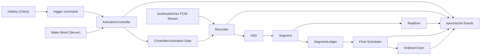
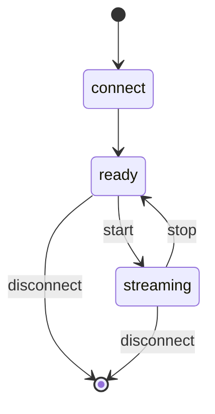
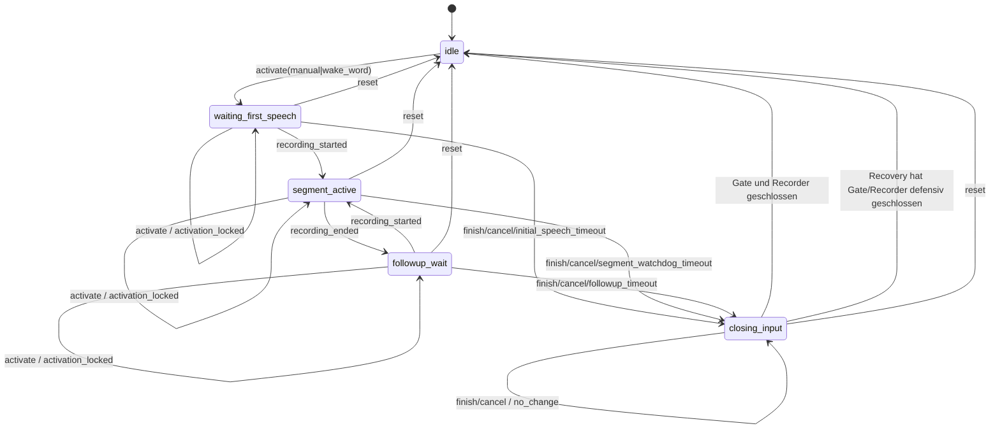
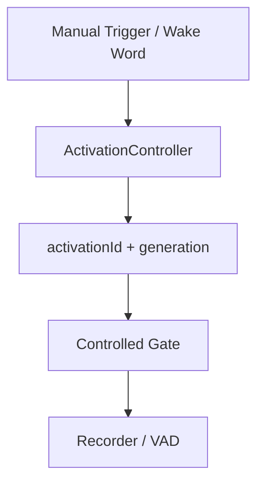

# Einheitliche serverseitige Triggerarchitektur – Activation, Commands, Timer und Segmentledger

Diese Datei beschreibt den mit AP-SRV-010, AP-SRV-020 und AP-SRV-030
implementierten serverautoritativen Vordergrund-Lifecycle, die Command- und
Timerpolitik sowie den Hintergrund-Drain, und seit AP-SRV-040 den darüber
liegenden Protokoll-v2-Vertrag. Eine Session besitzt genau eine
Activation-State-Machine, genau einen Command-Replaycache und ein
threadsicheres Segmentledger. Nach sicherem Schließen des Eingabepfads ist der
Vordergrund wieder `idle`, auch wenn Finalarbeit älterer Segmente im
Hintergrund läuft.

Die Abschnitte 1 bis 11 beschreiben die Domainautoritäten und den geerbten
v1-Transport auf `/ws/transcribe`. Abschnitt 12 beschreibt den eingefrorenen
Protokoll-v2-Vertrag auf `/ws/v2`, der dieselben Autoritäten benutzt und keine
eigenen besitzt.

> Ergänzende Dokumente: [`docs/client-development/`](client-development/README.md)
> für den Client-Vertrag, [`docs/fastapi-server.md`](fastapi-server.md) für den
> Serverbetrieb.

## 0. Paketgrenze

AP-SRV-010 liefert die fünf kanonischen Vordergrundphasen; AP-SRV-020 ergänzt
immutable Finaljobkontexte, Segmentterminale und sessionweit geordnete
Nutzresultate; AP-SRV-030 ersetzt die geerbte Extend-Semantik durch den
eingefrorenen Command- und Timervertrag. Folgende Semantiken bleiben bewusst
Folgepaketen zugeordnet:

- Der Controller erlaubt mehrere serielle Segmente derselben Activation. Das
  Segmentledger korreliert Audio, Schedulerjob und Ergebnis unabhängig vom
  aktuellen Vordergrund und veröffentlicht Nutzresultate strikt nach
  `segmentSequence`.
- Early-Final darf während der Aufnahme anlaufen. Sein Job übernimmt denselben
  unveränderlichen Segmentkontext wie der spätere Recorderabschluss.
- Der eingefrorene Wire-Vertrag (`hello`-Handshake,
  `activation.command`/`command.ack`, `eventSeq`, `session.snapshot`) ist seit
  AP-SRV-040 auf dem eigenen Endpunkt `/ws/v2` verfügbar; siehe Abschnitt 12.
  Die hier beschriebenen `trigger`-/`trigger_ack`-Formen sind der geerbte
  v1-Pfad auf `/ws/transcribe`. AP-SRV-070 hat gezielt toten v1-Code entfernt
  (siehe Abschnitt 14.11), den v1-Transport selbst aber als erforderlichen
  Kompatibilitätspfad bestätigt und nicht abgebaut.
- Die Timerwerte sind Sessionparameter der bestehenden Query-Admission. Die
  vollständige Settings-Control-Plane mit Scope, Auth, Constraints und
  Apply-Policy folgt in AP-SRV-050. Protokoll v2 veröffentlicht sie bereits als
  `effectiveSettings` und führt `settingsRevision` mit, lehnt einen
  `session_settings.patch` aber ausdrücklich ab
  (`REQUIRES_AP_SRV_050_BINDING`).
- Wake-Word-Erkennung arbeitet seit AP-SRV-060 C3 auf zusammenhängenden
  Trefferbereichen echter Prediction-Frames gegen die
  konfigurierte Sensitivität. Es existiert kein belastbarer Score-/Audio-
  Evidence-Harness für Cooldown, ausgewähltes Modell und die exakte
  Pre-Roll-Grenze; Katalog/Settings folgen in AP-SRV-050, Detection/Latch und
  Evidence in AP-SRV-060. AP-SRV-000 erfindet dafür keine Kalibrierwerte.

Die Legacy-Sessionauflösung bleibt in dieser Baseline erhalten. Ihre
Zielmodellierung beginnt in AP-SRV-010. AP-SRV-070 hat die alte
`activation_config.mode == "legacy"`-Autorität geprüft und als
`KEEP_REQUIRED` bestätigt, solange der v1-Transport aktiv ist; eine
Entfernung ist nicht vorgesehen.

---

## 1. Zielbild

Eine Clientverbindung besitzt:

- genau **eine** STT-Session,
- genau **einen** kontinuierlichen Audiostream,
- genau **eine** Aktivierungszustandsmaschine (`ActivationController`),
- genau **eine** Recorder-/VAD-/Transkriptionspipeline,
- und **zwei unabhängig aktivierbare Triggerquellen**: `manual` und
  `wake_word`.

| `manualTriggerEnabled` | `wakeWordTriggerEnabled` | zulässig |
| --- | --- | --- |
| true | false | ja |
| false | true | ja |
| true | true | ja |
| false | false | **nein** – wird bei der Session-Admission abgelehnt |



---

## 2. Zwei getrennte Lebenszyklen

`start` und `stop` bleiben **ausschließlich Streambefehle**. Ein Manualtrigger
wird niemals auf sie abgebildet.

### Stream-Lifecycle



### Activation-Lifecycle



Die drei Phasen `waiting_first_speech`, `segment_active` und `followup_wait`
bilden zusammen das **offene Aktivierungsfenster**. Genau in diesen Phasen ist
das Recorder-Gate offen (`windowOpen == true`).

`closing_input` ist eine kurze Eingabebarriere. Zuerst wird das Recorder-Gate
geschlossen, eine laufende Aufnahme gestoppt und an den bestehenden Finalpfad
übergeben; erst danach wird `idle` veröffentlicht. Finaltranskription ist keine
Vordergrundphase. Eine neue Activation darf deshalb nach `idle` beginnen,
während ältere Finalarbeit im Hintergrund weiterläuft.

Scheitert das Schließen von Gate oder Recorder, bleibt der Vordergrund
zunächst in `closing_input`. Genau dafür existiert der Recoverytimeout aus
Abschnitt 4: er schließt den Eingabepfad defensiv, terminalisiert nicht mehr
einreihbares Audio und erreicht `idle`. `closing_input` kann dadurch nicht
dauerhaft hängen.

### Hintergrund-Lifecycle

Bei Aufnahmebeginn registriert das Ledger genau einen unveränderlichen
`SegmentContext`. Er enthält `sessionId`, `activationId`,
`activationSequence`, `segmentId`, die sessionsweit streng steigende
`segmentSequence`, den eingefrorenen Activation-Settings-Snapshot und die
`requestId` des Finaljobs. Der Kontext wird zusammen mit dem aufgenommenen
Audio durch Recorder, Scheduler und Worker getragen; der aktuelle
Foreground-Zeiger wird zur Ergebniskorrelation nicht mehr verwendet.

Jedes angenommene Segment endet genau einmal als `completed`, `discarded`,
`cancelled` oder `failed`. Leeres Audio, Empty-Final, Queue-Trim,
Scheduler-Ablehnung/-Drop, Workerfehler, Cancel und Session-Close erzeugen
damit explizite Ledgerterminale. Ein nicht publizierbares Terminal schließt
eine Sequenzlücke, sodass ein bereits fertiges späteres Nutzresultat freikommt.

Eine Activation erhält genau ein Hintergrundterminal, sobald ihr Input
geschlossen ist und alle angenommenen Segmente terminal und aus dem
sessionweiten Reorder-Buffer ausgetragen sind. Dieses Hintergrundterminal ist
vom früheren Vordergrundereignis `activation.closed` getrennt.

---

## 3. Activation-Daten

Jede Activation trägt mindestens:

| Feld | Bedeutung |
| --- | --- |
| `activationId` | eindeutige ID der Activation |
| `activationSequence` | steigt pro Session bei jeder akzeptierten neuen Activation |
| `generation` | Kompatibilitätsfeld für die Gate-Bindung; entspricht derzeit `activationSequence` |
| `version` | steigt bei **jeder** Zustandsänderung |
| `timerRevision` | steigt bei **jeder wirksamen Timeränderung**; bindet geplante Callbacks |
| `segmentToken` | steigt bei jedem neu begonnenen Segment; bindet den Watchdog |
| `primarySource` | die Quelle des **ersten** Triggers, unveränderlich |
| `sources` | kompatible Listenform der einen gelatchten `primarySource` |
| `effectiveSettings` | defensiv kopierter, für diese Activation unveränderlicher Settings-Snapshot |
| `phase` | siehe Zustandsdiagramm |
| `deadline` | monotone Deadline (`time.monotonic`) oder `None` |
| `deadlineKind` | `initial_speech`, `followup`, `segment_watchdog` oder `closing_recovery` |
| `warningDeadline` | Zeitpunkt der Watchdog-Vorwarnung, `None` sobald sie ausgelöst wurde |
| `segments` | Anzahl der in dieser Activation gestarteten Aufnahmen |

### Zähler und Timerbindung

`activationSequence` identifiziert die Reihenfolge akzeptierter Activations in
der Session. `generation` bindet bis zur Wire-v2-Migration das Gate an dieselbe
Identität. `version` beschreibt jede sichtbare Zustandsänderung.

Geplante Timer hängen dagegen an einem vollständigen **Timer-Token** aus
`activationId`, `activationSequence`, `timerRevision`, `phase`, `deadlineKind`
und `segmentToken`. Ein Callback muss genau dieses Token vorlegen; jedes andere
ist wirkungslos (`reason = "stale_timer"`). Die `timerRevision` allein würde
nicht genügen, weil ihre Bedeutung mit jeder Activation neu beginnt — ein alter
Callback von A könnte sonst zufällig auf eine Revision von B passen.

Pro armierter Deadline existiert genau **ein** Workerthread. Eine Vorwarnung
verschiebt keine Deadline und erhält deshalb bewusst keine neue
`timerRevision`; dasselbe Token bleibt für den darauffolgenden Ablauf
zuständig. Abgelehnte Commands ändern weder `version` noch `timerRevision`.

### Monotone Zeit

Alle internen Deadlines benutzen `time.monotonic`. Eine Änderung der
Systemuhrzeit kann eine Activation dadurch weder vorzeitig beenden noch
verlängern. Wallclock-Zeit wird nur für Logs und öffentliche Zeitstempel
verwendet.

---

## 3a. Command- und Timervertrag (AP-SRV-030)

### Semantische Aktionen

Es gibt genau vier: `activate`, `refresh`, `finish`, `cancel`.

| Phase | `activate` | `refresh` | `finish` / `cancel` |
| --- | --- | --- | --- |
| `idle` | gemäß effektiver Triggerquelle | `not_active` | `not_active` |
| `waiting_first_speech` | `activation_locked` | `invalid_phase` | zulässig |
| `segment_active` | `activation_locked` | Watchdog-Refresh | zulässig |
| `followup_wait` | `activation_locked` | Follow-up-Reset | zulässig |
| `closing_input` | `activation_locked` | `closing_input` | `no_change` (idempotent) |

`refresh`, `finish` und `cancel` **müssen** die vom Client beobachtete
`activationId` mitführen (AP-SRV-030 C2, F5). Eine fehlende oder leere ID wird
als `invalid_payload` abgelehnt; eine ID, die nicht zur laufenden Activation
passt, liefert `stale_activation` und erzeugt **keine** Zustandsänderung. Die
drei Control-Aktionen sind **source-neutral** (F6): `source` ist kein
fachliches Feld eines Controls und wird im v1-Übergang allenfalls als
Legacyfeld toleriert und ignoriert - niemals als Berechtigung oder als Teil der
Replay-Identität. Bei `activate` ist `activationId` verboten
(`invalid_payload`); `activate` prüft als einzige Aktion die effektive
Triggerquelle.

### Timer

| Deadline | Default | Regel |
| --- | ---: | --- |
| Initial Speech | 15 s | `now + initialSpeechTimeout` bei der Admission; nicht refreshbar |
| Follow-up | 3 s | `now + followupTimeout` nach Segmentende **und** bei jedem `refresh` |
| Segment-Watchdog | 600 s | `now + segmentWatchdogInitial` bei Segmentstart |
| Watchdog-Refresh | 180 s | `refresh` setzt `max(currentDeadline, now + segmentWatchdogRefresh)` |
| Watchdog-Warnung | 30 s | Vorwarnung vor dem Ablauf, genau einmal je Deadline |
| Closing Recovery | 5 s | armiert beim Eintritt in `closing_input` |

Daraus folgt ausdrücklich:

- **Kein** `extensionSeconds`, **kein** `pending_extension`, **kein**
  Zeitguthaben. Dreimal `refresh` heißt dreimal „ab jetzt neu setzen", nicht
  dreimal zusätzliche Zeit.
- Ein **früher** Watchdog-Refresh verkürzt eine noch längere Restfrist nicht
  und armiert keinen neuen Timer.
- Ein **später** Watchdog-Refresh sichert mindestens 180 Sekunden ab der
  Interaktion.
- **VAD-Aktivität setzt den Watchdog nicht zurück.** Fortgesetzte Sprache
  innerhalb desselben Segments ist keine Interaktion.
- Beim **Watchdog-Ablauf** wird das erfasste Audio regulär verarbeitet, die
  gesamte Activation geschlossen und **kein** Follow-up geöffnet.

### Command-Idempotenz

Der Replaycache ist an die Session gebunden und wird währenddessen **nicht**
getrimmt; er wird erst beim Sessionabbau freigegeben.

- gleiche `commandId`, semantisch gleicher Payload (`action`, `source`,
  `activationId`): **exakt dasselbe Ack**, keine zweite Wirkung — keine zweite
  Transition, kein zweiter Timerreset, kein zweites Cancel/Finish, keine zweite
  Activation und kein zweites Ledgerereignis. Für `activate` zählt
  `(action, source)`, für Control-Aktionen `(action, activationId)` als
  Semantik; `source` eines Controls ist kein Replaykriterium (F6);
- gleiche `commandId`, abweichender Payload: `command_id_conflict`, die
  laufende Activation bleibt unberührt;
- ein fachlich abgelehntes Kommando **mit verwendbarer `commandId` belegt**
  seinen Replayeintrag (F3): ein späteres identisches Kommando erhält exakt
  dieselbe Antwort, eine Wiederverwendung mit anderem Payload erhält
  `command_id_conflict`. Nur Kommandos **ohne** verwendbare `commandId`
  (fehlend oder ungültig) bleiben keyless und belegen keinen Cache.

Der Cache liefert ausschließlich die ursprüngliche Antwort zurück; er ruft
nichts erneut auf. Ein alter Replay kann dadurch nicht gegen eine neuere
Activation wirksam werden.

### Recovery und Audioverfügbarkeit

Der Input-Close ist seit AP-SRV-030 C2 **zweiphasig**:

1. **Phase A (fachliche Annahme)** - unter dem Vordergrundlock (bzw. bei
   cancel-artigen Abschlüssen unter `_ledger_dispatch_lock` und dann
   `self.lock`) wird der Controller nach `closing_input` bewegt und ein
   unveränderlicher `CloseContext` mit Abschlussgrund, -ursache und
   gegebenenfalls der kommandierenden `commandId` gebildet. Es entsteht ein
   unveränderlicher `InputClosePlan`.
2. **Phase B (physischer Input-Close)** - läuft **außerhalb** beider Locks:
   Gate schließen, Recorder stoppen/flushen, Ledger-Input-Close registrieren
   und das genau-einmal Lifecycle-Ereignis **logisch registrieren**. Erst
   danach wird die noch aktuelle identische Activation identitätsgebunden mit
   `input_closed()` auf `idle` gesetzt. Die Transportpublikation des bereits
   registrierten Events folgt nach Lockfreigabe.

F1/F5/F10:

- Kein Abschluss räumt den Controller früher auf `idle`, als Gate und Recorder
  tatsächlich defensiv geschlossen sind. Der Recoverytimeout konsumiert
  lediglich seine Deadline, hält die Phase `closing_input` und übergibt die
  physische Bereinigung derselben Orchestrierung.
- Ein verspäteter `input_closed()`-Aufruf mit alter Activation-Identität wird
  verworfen (`stale_activation`) und beendet **nie** eine neuere Activation.
- Kann selbst der harte Recorder-Abbruch keinen sicheren Zustand herstellen,
  bleibt die Session **nicht** dauerhaft in `closing_input`: sie wird über den
  bestehenden Session-Close-Pfad technisch beendet. Es wird kein wieder
  benutzbares `idle` behauptet; offene Ledgerarbeit wird cancel-/terminalisiert
  und eine neue Session muss aufgebaut werden.

- Läuft der Recoverytimeout in `closing_input` ordentlich ab, wird das Gate
  abgebrochen, der Recorder defensiv gestoppt, ein nicht mehr einreihbares
  Segment als `failed` mit Grund `closing_recovery_timeout` terminalisiert und
  die Activation im Ledger geschlossen. Bereits veröffentlichter Text wird
  **niemals** zurückgenommen. Die `causedByCommandId`-Korrelation eines
  Recoveryabschlusses ist `null`, auch wenn die ursprüngliche Finish-Identität
  intern bis zum Abschluss erhalten bleibt (F2).
- `audioAvailable=false` cancelt die offene Activation mit
  `closeCause = audio_unavailable` und beendet **nicht** die Session. Solange
  kein Audio verfügbar ist, wird `activate` mit `audio_unavailable` abgelehnt.
  Die Availability-`commandId` bleibt reine Ack-/Replay-Identität und erscheint
  **nicht** als `causedByCommandId` des Close-Events (F7).
- Stream-Stop, `clear` und Sessionverlust verwerfen die offene Activation wie
  bisher; eine neue Session beginnt in `idle` ohne Fortsetzung.

### Cancel-Publikationsbarriere

Explizites `cancel` (und ein verbundenes `audioAvailable=false`) setzt bei der
fachlichen Annahme eine Per-Activation-Cancelbarriere im Segmentledger, die mit
jeder späteren sichtbaren Finalpublikation derselben Activation total
geordnet wird:

```text
_ledger_dispatch_lock
  → self.lock
  → Controller-Entscheidung → closing_input
  → SegmentLedger.mark_cancel_requested(...)
  → Ack erzeugen und Replay speichern
  → self.lock freigeben
  → LedgerUpdate der Cancelbarriere sichtbar anwenden
  → _ledger_dispatch_lock freigeben
  → physischer Input-Close (Phase B)
```

Ein Final, das die Dispatchgrenze bereits hält, wird **vor** der
Cancel-Akzeptanz sichtbar und bleibt bestehen; ein Cancel, das die Grenze
zuerst gewinnt, blockt jede spätere Nutztextpublikation dieser Activation.
Auch bereits berechneter, aber wegen eines Sequenzlochs noch unveröffentlichter
`prepared_text` wird bei der Barriere neutralisiert und terminalisiert.

### Ownership

| Verantwortung | Ort |
| --- | --- |
| Payloadprüfung, `commandId`, Replaycache | `api_fastapi_server/activation_commands.py` |
| Phasenmatrix, Activation-ID-Prüfung, Deadlines, `timerRevision` | `api_fastapi_server/activation.py` |
| Gate-, Recorder-, Ledger- und Eventwirkung, Timerthread | `api_fastapi_server/server.py` |

Der Replaycode hat bewusst **keine** Nebenwirkung: er entscheidet nur
„gesehen / Konflikt / neu". Alles, was einen Zustand ändert, liegt hinter dem
Vordergrundlock des Controllers.

---

## 4. Lock-Semantik

Der **erste** Trigger eröffnet die Activation und wird deren `primarySource`.
Jeder weitere `activate`-Versuch derselben oder der anderen Quelle in einer
nicht-idle Phase wird deterministisch mit `activation_locked` abgelehnt.

```text
Manual                       Wake Word
  ↓                             ↓
Activation A42 (primarySource = manual, sources = [manual])
  ↓  + activate(wake_word)
Ack: accepted=false, reason=activation_locked, activationId=A42
```

ID, Sequenz, Quelle und effektive Settings von A42 bleiben unverändert. Dabei
entsteht **nicht**:

- eine zweite Activation,
- ein zweiter Recorderpfad,
- ein zweites Segment,
- ein zweites Final,
- eine zweite Schedulerbelegung,
- ein paralleler Follow-up-Timer.

In umgekehrter Reihenfolge gilt dasselbe.

Ein expliziter `refresh`-Befehl bleibt von `activate` getrennt; seine Semantik
steht in Abschnitt 3a.

`ActivationController` synchronisiert sich selbst über ein `RLock`. Das ist
notwendig, weil er aus der WebSocket-Coroutine, aus Recorder-Callbackthreads
und aus dem Timeoutthread erreicht wird.

### Verbindliche Lockordnung (AP-SRV-030 C2)

Seit C2 gilt eine eindeutige globale Lockordnung:

```text
_ledger_dispatch_lock
  → self.lock
  → (kurz) SegmentLedger._lock
```

- **L1:** Eine Operation, die beide Locks benötigt, erwirbt immer zuerst
  `_ledger_dispatch_lock`. Der explizite Cancel-Accept-Pfad ist der wichtigste
  Nutzer dieser Regel (siehe „Cancel-Publikationsbarriere").
- **L2:** `self.lock` schützt Controller, Session-Lifecycle, Contextpointer und
  Commandannahme; es darf niemals anschließend `_ledger_dispatch_lock`
  erwerben.
- **L3:** `SegmentLedger._lock` ist Blattlock; unter ihm werden keine
  Session-, Manager-, Publikations- oder Recorderoperationen ausgeführt.
- **L4:** Unter `_ledger_dispatch_lock` darf bestehender Publikationscode nach
  der Ledgermutation kurzfristig `self.lock` lesen (Mutatio n → Observable
  Output bleibt unter der Dispatchgrenze serialisiert).
- **L5:** Recorderoperationen, die synchron Callbacks auslösen können
  (`flush_buffered_audio`, `stop`, `abort`, äquivalente Closepfade), laufen
  weder unter `self.lock` noch unter `_ledger_dispatch_lock`.
- **L6:** Kein Helper darf die Reihenfolge intern wieder umdrehen
  (`self.lock → _ledger_dispatch_lock` und
  `SegmentLedger._lock → callback → self.lock` sind verboten).

Der physische Input-Close (Phase B) läuft deshalb ausdrücklich außerhalb
beider Locks.

---

## 5. Recorder Activation Gate

Der Recorder kennt im Controlled-Modus die Triggerquelle **nicht**. Er kennt
ausschließlich „Gate offen" oder „Gate geschlossen".



### Policies

| Policy | Verhalten |
| --- | --- |
| `legacy` | unverändertes Altverhalten: VAD startet über `start_recording_on_voice_activity`, ein erkanntes Wake Word öffnet direkt |
| `controlled` | ausschließlich das Gate entscheidet; `recorder.wakeword_detected` wird **nicht** ausgewertet |

### Operationen

| Methode auf `AudioToTextRecorder` | Wirkung |
| --- | --- |
| `set_activation_policy(policy)` | wählt `legacy` oder `controlled` |
| `open_controlled_activation(id, replace=…, generation=…)` | öffnet das Gate für eine Activation |
| `close_controlled_activation(id=…, generation=…)` | schließt, wenn der Aufrufer das Gate noch besitzt |
| `abort_controlled_activation()` | schließt bedingungslos, deterministischer Zustand |
| `controlled_activation_state()` | konsistenter Snapshot |

`abort()` und `shutdown()` des Recorders schließen das Gate mit. Nach
`shutdown()` wird jedes weitere `open` abgelehnt, damit ein während des
Herunterfahrens eintreffender Trigger das Gate nicht wieder öffnet.

### Generationsbindung

`open` und `close` sind an `(activationId, generation)` gebunden:

- ein spätes `close(A)` schließt die inzwischen laufende Activation `B` nicht;
- ein `close(generation=alt)` ohne ID schließt `B` ebenfalls nicht;
- ein spätes `open(A, replace=True)` mit älterer Generation ersetzt `B` nicht.

Wenn die Gate-Prüfung einen Recording-Start zulässt, latcht der Recorder das
zugehörige Paar `(activationId, generation)` bis zum Start-Callback. Schließt A
in diesem kurzen Race-Fenster und B öffnet bereits, wird der verspätete Start
von A nicht B zugerechnet, sondern sofort gestoppt. Damit sind Gate-Admission
und Controllerübergang auch über die Callback-Grenze gebunden.

Die VAD-Startbedingung wird ausschließlich im Zweig „es wird gerade **nicht**
aufgenommen" ausgewertet. Ein zusätzlicher Trigger während einer laufenden
Aufnahme kann deshalb strukturell keine zweite Aufnahme starten.

---

## 6. WebSocket-Vertrag

### Verbindung

```text
GET /ws/transcribe?<Queryparameter>
```

#### Queryparameter der Triggerarchitektur

| Parameter | Typ | Default | Bedeutung |
| --- | --- | --- | --- |
| `manualTriggerEnabled` | Bool | – | Manualtrigger zulässig |
| `wakeWordTriggerEnabled` | Bool | – | Wake Word darf eine Activation öffnen |
| `initialSpeechTimeout` | Zahl 0.01–3600 | `15` | Wartezeit auf die erste Sprache |
| `followupTimeout` | Zahl 0.01–3600 | `3` | Nachfragefenster nach einem Segment |
| `segmentWatchdogInitialSeconds` | Zahl 0.01–3600 | `600` | Daueraufnahme-Watchdog beim Segmentstart |
| `segmentWatchdogRefreshSeconds` | Zahl 0.01–3600 | `180` | Mindestrestzeit, die ein `refresh` sichert |
| `segmentWatchdogWarningSeconds` | Zahl 0.01–3600 | `30` | Vorwarnung vor dem Watchdog-Ablauf |
| `closingRecoveryTimeoutSeconds` | Zahl 0.01–3600 | `5` | Recoveryfrist in `closing_input` |

Zulässige Wahrheitswerte: `true/1/yes/on` und `false/0/no/off`. Ein nicht
interpretierbarer Wert wird **abgelehnt**, nicht als `false` gedeutet — sonst
könnte ein Tippfehler eine gültige Anforderung unbemerkt in die verbotene
Kombination `false/false` kippen.

Die Bereiche sind hier bewusst weit, damit deterministische Tests kurze
Deadlines durch den Produktionspfad treiben können. Die verbindlichen
Contractbereiche (`60000–3600000` ms für den Watchdog und so weiter) gehören
zur Settings-Control-Plane aus AP-SRV-050.

**Entfallen mit AP-SRV-030:** `extensionSeconds`. Die additive Extend-Semantik
ist kein gültiges Soll mehr. Ein alter Client, der den Parameter noch sendet,
wird nicht abgelehnt — der Wert wird ignoriert. Seit AP-SRV-070 nennt die
Capability den Parameter auch nicht mehr.

#### Modusauflösung

```text
weder manualTriggerEnabled noch wakeWordTriggerEnabled gesetzt
    → mode = "legacy"   (unverändertes Altverhalten)

mindestens einer gesetzt
    → mode = "controlled"
    → der weggelassene Wert gilt als false (explizites Opt-in)
```

#### Ablehnungen bei der Admission

| Code | Anlass | Close |
| --- | --- | --- |
| `activation_trigger_required` | beide Trigger `false` | 1008 |
| `activation_wake_word_unavailable` | Wake Word ist einzige Quelle, aber kein Wake-Word-Profil aktiv | 1008 |
| `invalid_activation_flag` | Flag ist kein Wahrheitswert | 1008 |
| `invalid_activation_timing` | Zeitwert keine Zahl oder außerhalb des Bereichs | 1008 |

### `hello` und `ready`

Beide Nachrichten enthalten zusätzlich `activationConfig`:

```json
{
  "version": 2,
  "mode": "controlled",
  "manualTriggerEnabled": true,
  "wakeWordTriggerEnabled": false,
  "wakeWordProfileEnabled": false,
  "initialSpeechTimeout": 15.0,
  "followupTimeout": 3.0,
  "segmentWatchdogInitialSeconds": 600.0,
  "segmentWatchdogRefreshSeconds": 180.0,
  "segmentWatchdogWarningSeconds": 30.0,
  "closingRecoveryTimeoutSeconds": 5.0
}
```

`wakeWordProfileEnabled` sagt, ob für diese Sitzung tatsächlich
Wake-Word-**Erkennung** läuft. Ein Client, der den Wake-Word-Trigger aktiviert,
ohne dass ein Profil aktiv ist, sieht hier, dass keine Erkennungen eintreffen
werden.

### Capability

```json
"activationTriggers": {
  "supported": true,
  "version": 2,
  "sources": ["manual", "wake_word"],
  "actions": ["activate", "refresh", "finish", "cancel"],
  "commandType": "trigger",
  "ackType": "trigger_ack",
  "commandIdRequired": true,
  "commandIdIdempotent": true,
  "commandHistory": "session",
  "activationIdValidated": true,
  "audioAvailabilityCommandType": "audio_availability",
  "audioAvailabilityAckType": "audio_availability_ack",
  "queryParameters": ["manualTriggerEnabled", "wakeWordTriggerEnabled",
                      "initialSpeechTimeout", "followupTimeout",
                      "segmentWatchdogInitialSeconds",
                      "segmentWatchdogRefreshSeconds",
                      "segmentWatchdogWarningSeconds",
                      "closingRecoveryTimeoutSeconds"],
  "activationEvents": ["activation.started", "activation.refreshed",
                       "activation.closed", "watchdog.warning"]
}
```

Diese Capability wird nur gemeldet, weil der gesamte Vertrag dahinter
funktioniert. Ein Client **muss** sie prüfen, bevor er `trigger` sendet.

### Befehl `trigger`

```json
{ "type": "trigger", "action": "activate", "source": "manual",
  "commandId": "6f1c..." }
```

```json
{ "type": "trigger", "action": "refresh", "source": "manual",
  "commandId": "9a2d...", "activationId": "a42..." }
```

`action` ist eines von `activate`, `refresh`, `finish`, `cancel`.
Die veraltete Schreibweise `extend` ist mit AP-SRV-070 entfallen; sie wird wie
jede andere unbekannte Aktion mit `invalid_action` beantwortet.
`source` ist `manual` oder `wake_word`. `commandId` ist ein nicht leerer String.
Bei `refresh`, `finish` und `cancel` darf zusätzlich die beobachtete
`activationId` mitgesendet werden; sie wird gegen die laufende Activation
geprüft. Bei `activate` ist sie verboten.

### Befehl `audio_availability`

```json
{ "type": "audio_availability", "commandId": "3f0e...",
  "audioAvailable": false }
```

Die Antwort ist ein `audio_availability_ack` mit `accepted`, `reason`
(`applied`, `no_change` oder eine Ablehnung), `audioAvailable`, `activationId`,
`phase` und `sessionId`. Der Server erfährt bewusst **nicht**, welches Gerät
betroffen ist; Gerät, ReSpeaker und Mute bleiben Clientverantwortung. Die
endgültige v2-Form (`audio_availability.set`) gehört zu AP-SRV-040.

### Antwort `trigger_ack`

```json
{ "type": "trigger_ack", "commandId": "6f1c...", "accepted": true,
  "reason": "activated", "activationId": "a42...",
  "phase": "waiting_first_speech", "sessionId": "s..." }
```

Jeder Befehl erhält **genau eine** Antwort — auch jede Ablehnung, damit sie
korrelierbar bleibt. Läuft bereits eine Activation, trägt auch eine Ablehnung
deren `activationId`. `phase` ist die nach dem Ack beobachtete
Vordergrundphase.

#### Werte von `reason`

| `reason` | `accepted` | Bedeutung |
| --- | --- | --- |
| `activated` | true | neue Activation eröffnet |
| `refreshed` | true | Follow-up- beziehungsweise Watchdog-Deadline neu gesetzt |
| `finished` | true | Turn kontrolliert beendet |
| `cancelled` | true | Turn verworfen |
| `no_change` | true | idempotente Zustandsantwort; der gewünschte Zustand liegt bereits an |
| `activation_locked` | false | `activate` traf eine nicht-idle Vordergrundphase; laufende Activation bleibt unverändert |
| `invalid_phase` | false | `refresh` in `waiting_first_speech` |
| `closing_input` | false | `refresh` während der Eingabebarriere |
| `not_active` | false | keine Activation offen |
| `stale_activation` | false | mitgeschickte `activationId` ist nicht die laufende |
| `audio_unavailable` | false | `activate` bei `audioAvailable=false` |
| `trigger_disabled` | false | diese Quelle ist für die Sitzung nicht aktiviert |
| `invalid_payload` | false | Befehl ist kein Objekt, oder `activate` trug eine `activationId` |
| `missing_command_id` | false | `commandId` fehlt oder ist leer |
| `invalid_command_id` | false | `commandId` ist kein String |
| `invalid_action` | false | `action` unbekannt oder falscher Typ |
| `invalid_source` | false | `source` unbekannt oder falscher Typ |
| `command_id_conflict` | false | bekannte `commandId` mit abweichendem Payload |
| `controlled_activation_disabled` | false | Sitzung läuft im Legacy-Modus |
| `stream_not_started` | false | Trigger vor `start` oder nach `stop` |
| `session_closed` | false | Sitzung ist bereits geschlossen |

`timed_out`, `segment_watchdog_timeout` und `closing_recovery_timeout`
erscheinen nicht als Ack, sondern als `reason` beziehungsweise `cause` des
Events `activation.closed`.

### Idempotenz von `commandId`

Der Replaycache gilt für die **gesamte Sitzung**; siehe Abschnitt 3a.

---

## 7. IDs und Korrelation

| ID | Producer | Scope | Lebensdauer | Reconnect |
| --- | --- | --- | --- | --- |
| `sessionId` | Server | eine WebSocket-Verbindung | Verbindung | neue ID |
| `activationId` | Server | eine Activation | bis zum sicheren Input-Close/Reset | **wird nie wiederbelebt** |
| `activationSequence` | Server | Session | steigt je akzeptierter Activation | neue Sessionfolge |
| `generation` | Server | eine Activation | entspricht derzeit `activationSequence` | neu |
| `segmentId` | Server | eine Aufnahme | Segment | fortlaufend |
| `segmentSequence` | Server | Session | steigt je angenommenem Segment streng | neue Sessionfolge |
| `requestId` | Server | ein Finaljob | bis Segmentterminal | neu |
| `commandId` | Client | ein Triggerkommando | gesamte Sitzung | bleibt offen |
| `timerRevision` | Server | eine armierte Deadline | bis zur nächsten wirksamen Timeränderung | neu |
| `segmentToken` | Server | ein aktives Segment | bis zum Segmentende | neu |
| `eventId` / `cursor` | Server | Eventstream | dauerhaft | fortgesetzt |

Activation- und Recording-Ereignisse tragen im Controlled-Modus zusätzlich
`activationId`, `activationSequence`, `primarySource` und `sources`.
Nachlaufende Final- und Terminalereignisse verwenden den gespeicherten
Segmentkontext und tragen additiv `activationId`, `activationSequence`,
`segmentSequence` und `requestId`.

---

## 8. Events

Neu hinzugekommen:

```text
activation.started     eine Activation wurde eröffnet
activation.refreshed   Follow-up- oder Watchdog-Deadline neu gesetzt
activation.closed      Eingabepfad der Activation ist geschlossen
activation.drained     Hintergrundledger der Activation terminal
watchdog.warning       Vorwarnung vor dem Daueraufnahme-Ablauf
```

`activation.closed` trägt ein `reason` aus `finished`, `cancelled`,
`timed_out`, `segment_watchdog_timeout`, `stream_stopped`, `session_closed`
oder `client_clear` und zusätzlich ein feineres `cause` aus `finish`, `cancel`,
`audio_unavailable`, `initial_speech_timeout`, `followup_timeout`,
`segment_watchdog_timeout` oder `closing_recovery_timeout`. Wurde der
Eingabeschluss durch ein Kommando ausgelöst, trägt es außerdem
`causedByCommandId`; bei Timer-, Watchdog-, Geräte- und Recoveryabschlüssen
ist das Feld `null`.

`activation.closed` entsteht **genau einmal** je Activation und erst dann, wenn
der Eingabepfad tatsächlich geschlossen ist. Scheitert das Schließen, gibt es
kein Ereignis, bis die Recovery den Abschluss herstellt — nicht zwei.

`watchdog.warning` trägt `activationId`, `activationSequence`, `segmentId`,
`segmentSequence`, `phase`, `timerRevision` und `remainingSeconds` und wird pro
armierter Watchdog-Deadline höchstens einmal ausgelöst.

Als Timeline-Nachricht heißen die Events `activation_started`,
`activation_refreshed`, `activation_closed`, `activation_drained` und
`watchdog_warning`; im strukturierten Eventstream `activation.*` beziehungsweise
`watchdog.warning`.

Nicht publizierbare Segmentterminale heißen intern/timelinebasiert
`final_transcript_discarded`, `final_transcript_cancelled` und
`final_transcript_failed`. `activation_drained` und diese Zusatzfelder sind
Observability des AP-SRV-020; das endgültige öffentliche Wire-v2 bleibt
AP-SRV-040 vorbehalten.

Bestehende Eventnamen wurden **nicht** verändert. Das bestehende
Wakeword-Event bleibt erhalten.

---

## 9. Legacykompatibilität und Rollout

- Eine Sitzung ohne die neuen Queryparameter verhält sich **exakt wie bisher**.
  Es wird kein `ActivationController` angelegt, das Recorder-Gate bleibt in der
  `legacy`-Policy, und der Wakeword-Follow-up läuft unverändert.
- `start` und `stop` bleiben reine Streambefehle. Ein Manualtrigger wird nicht
  auf sie abgebildet.
- `trigger` ist additiv. Ein Legacyclient sendet es nie; täte er es, bekäme er
  `controlled_activation_disabled`.
- `hello` und `ready` wurden nur um `activationConfig` **ergänzt**.

### Migration der Clientkonfiguration

```text
mode = hotkey     ->  manualTriggerEnabled = true,  wakeWordTriggerEnabled = false
mode = wake_word  ->  manualTriggerEnabled = false, wakeWordTriggerEnabled = true
```

Eine stillschweigende Migration nach `true / true` findet **nicht** statt.

### Rollback

Der Umbau ist serverseitig vollständig additiv. Ein Rollback besteht darin,
dass Clients die neuen Queryparameter nicht mehr senden; die Sitzungen fallen
dann automatisch in den Legacy-Modus zurück. Ein Serverdowngrade ist dafür nicht
erforderlich.

---

## 10. Privacy: kontinuierliches Streaming

Im Controlled-Modus sendet der Client **durchgehend** Audio, auch außerhalb
einer Activation. Das ist die Voraussetzung dafür, dass ein Trigger sofort
greifen kann, hat aber Folgen, die bewusst zu tragen sind:

- Audio verlässt das Gerät auch dann, wenn keine Aufnahme läuft.
- Der Server verwirft Audio außerhalb einer offenen Activation, statt daraus
  ein Segment zu machen; es wird nicht transkribiert und nicht archiviert.
- Wer das nicht möchte, betreibt die Sitzung weiterhin im Legacy-Modus oder
  nutzt die Stummschaltung des Clients, die den Stream unterbricht.

---

## 11. Troubleshooting

| Symptom | Wahrscheinliche Ursache |
| --- | --- |
| `trigger_ack` mit `controlled_activation_disabled` | Sitzung wurde ohne Triggerparameter aufgebaut, läuft also legacy |
| `trigger_ack` mit `stream_not_started` | `start` wurde nicht gesendet, oder `stop` kam dazwischen |
| Close 1008 mit `activation_trigger_required` | beide Triggerflags waren `false` |
| Close 1008 mit `activation_wake_word_unavailable` | Wake Word ist einzige Quelle, aber kein Wake-Word-Modell installiert |
| Wake Word löst nichts aus | `wakeWordProfileEnabled` in `activationConfig` prüfen |
| Aufnahme startet nie | prüfen, ob ein `trigger_ack` mit `accepted: true` eintraf |
| Aufnahme endet nie | `activation.closed` im Eventstream prüfen; fehlt es, ist der Timeout nicht gefeuert |
| `trigger_ack` mit `invalid_phase` | `refresh` traf `waiting_first_speech`; das Erstsprachfenster ist nicht refreshbar |
| `trigger_ack` mit `stale_activation` | die mitgesendete `activationId` ist nicht mehr die laufende; aktuellen Zustand abwarten statt erneut zu senden |
| `trigger_ack` mit `command_id_conflict` | dieselbe `commandId` wurde mit anderem Payload wiederverwendet; je logischem Kommando eine neue UUID erzeugen |
| `trigger_ack` mit `audio_unavailable` | zuletzt wurde `audioAvailable=false` gemeldet; erst `true` senden |
| Refresh scheint nichts zu bewirken | in `segment_active` ist das korrekt, solange die Restzeit größer als `segmentWatchdogRefreshSeconds` ist (`max()`-Semantik) |
| `activation.closed` mit `cause: closing_recovery_timeout` | Gate oder Recorder ließen sich nicht schließen; die Recovery hat den Vordergrund freigegeben, das betroffene Segment steht als `final_transcript_failed` im Ledger |
| `watchdog.warning` kommt sofort | `segmentWatchdogWarningSeconds` ist größer als die wirksame Frist; die Warnung wird dann sofort fällig statt verworfen |

---

## 12. Protokoll v2 (AP-SRV-040)

Protokoll v2 ist die eingefrorene Wire-, Session- und Projektionsgrenze über
den bereits abgenommenen Autoritäten. Es besitzt **keine** eigene Activation-,
Timer-, Ledger-, Settings- oder Wake-State-Machine.

```text
/ws/v2
  -> Handshake / Sessionadmission
  -> ProtocolSessionState
  -> strikter v2-Envelope
  -> AP-SRV-030 Command-/Activation-Autorität
  -> AP-SRV-020 Segmentledger
  -> Eventprojektion und Snapshot
```

Implementierung: `api_fastapi_server/protocol_v2/`.

### 12.1 Eigener Endpunkt

`/ws/v2` ist bewusst von `/ws/transcribe` getrennt. Der v1-Pfad admittiert
eine Session aus Queryparametern **vor** der ersten Nachricht und sendet ein
Server-`hello`; v2 admittiert nichts, bis das Client-`hello` vollständig
validiert ist. Beides in einer Route zu mischen hieße, innerhalb einer bereits
admittierten Session auf die Protokollversion zu verzweigen – genau das
verbietet der Contract. Der v1-Pfad bleibt als Kompatibilitätsgrenze bestehen;
AP-SRV-070 hat daran nur gezielten toten Code entfernt, siehe Abschnitt 14.11.

Eine v2-Verbindung wird absichtlich **nicht** im gemeinsamen
`ConnectionManager` registriert. Alles, was ein v2-Client sieht, läuft durch
die v2-Projektion; ein Legacy-Payload kann ihn nicht erreichen.

### 12.2 Handshake

Die erste Client-Textnachricht muss `hello` sein. Vor `hello.accepted` sind
Audio, manuelle Activation, Wake-Word-Erkennung und Domaincommands gesperrt.

```json
{
  "type": "hello",
  "supportedProtocolVersions": [2],
  "clientVersion": "…",
  "clientCommit": "…",
  "clientRunId": "…",
  "requestedSession": {
    "trigger": {"manual": true, "wakeWord": false},
    "wakeWordIds": []
  },
  "runtimeSuppression": {"manual": false, "wakeWord": false}
}
```

`hello.accepted` enthält `protocolVersion`, `sessionId`, `serverVersion`,
`serverCommit` und den vollständigen Snapshot unter `snapshot` (ohne dessen
inneres `type`). Erst danach ist Domaintraffic erlaubt.

Ablehnungen und Close-Codes:

| Fall | Nachricht | Close |
| --- | --- | ---: |
| ungültige erste Nachricht, nicht parsebares `hello` | – | `4400` |
| keine gemeinsame Protokollversion | `protocol.incompatible` | `4406` |
| Handshake-Timeout | – | `4408` |
| Sessionadmission abgelehnt | `session.rejected` mit `errors[]` | `4409` |
| unerwarteter interner Fehler | – | `1011` |

In keinem dieser Fälle entsteht eine `sessionId` oder eine halb aufgebaute
Session. Fachlich abgelehnte Commands schließen die Verbindung dagegen nie.

`serverCommit` wird aus der Umgebungsvariablen `VOICESTT_SERVER_COMMIT`
gelesen und fällt sonst auf `unknown` zurück; ein Git-Aufruf zur Laufzeit
findet nicht statt.

### 12.3 Identitäten

Jede v2-relevante UUID wird an ihrer autoritativen Erzeugungsstelle kanonisch
mit Bindestrichen erzeugt und läuft unverändert durch Domain, Ledger, Events
und Snapshot. Es gibt **keine** Umformatierung an der Wire-Grenze und damit
nie zwei Strings für eine Identität.

| ID | Erzeuger | v2 | v1 |
| --- | --- | --- | --- |
| `sessionId` | v2-Verbindung | kanonische UUID | kompakter Hex |
| `activationId` | `ActivationController` | kanonische UUID | kompakter Hex |
| `segmentId` | `SegmentState` | kanonische UUID | Integer-Zähler |
| `eventId` | `ProtocolSessionState` | kanonische UUID | – |
| `commandId` | Client | kanonisch validiert | frei |

Ein `commandId`, der keine kanonische UUID ist, besitzt keine v2-Identität und
erhält deshalb kein Ack.

### 12.4 Commands

Gemeinsame Pflichtfelder: `type`, `protocolVersion`, `sessionId`, `commandId`.

```text
activation.command       activate (source=manual) | refresh|finish|cancel (activationId)
trigger_suppression.set  manual, wakeWord
audio_availability.set   audioAvailable
session_settings.patch   baseSettingsRevision, changes
session.snapshot.request –
```

Der v2-Envelope ist strikter als der transportneutrale AP-SRV-030-Parser:

- der Client darf ausschließlich `source=manual` senden; `wake_word` entsteht
  nur serverintern durch die Detection-Admission;
- bei `activate` ist `activationId` verboten;
- bei Controls ist `activationId` Pflicht und `source` verboten;
- den v1-Alias `extend` gibt es in v2 nicht.

Eine fremde, wohlgeformte `sessionId` ist `stale_session` und wirkt nicht; ein
unbekannter Nachrichtentyp wird ignoriert und nie als bekannte
Zustandsänderung gedeutet.

#### Result-Codes

```text
applied, no_change,
activation_locked, not_active, invalid_phase, closing_input,
stale_session, stale_activation, command_id_conflict,
invalid_payload, trigger_suppressed, audio_unavailable,
settings_revision_conflict, settings_rejected, internal_error
```

`accepted=true` gilt ausschließlich für `applied` und `no_change`. Die
Projektion der AP-SRV-030-Reasons auf diese fünfzehn Codes liegt vollständig
in `protocol_v2/commands.py`; ein nicht abgebildeter Reason schlägt sichtbar
fehl, statt still zu `internal_error` zu werden.

#### Replay

Ein `commandId` besitzt genau eine Antwort. Derselbe `commandId` mit identisch
bedeutendem Payload liefert dasselbe Ack – einschließlich der ursprünglichen
`stateVersion`/`settingsRevision` – und erzeugt keine zweite Wirkung und kein
zweites Event. Ein abweichender Payload ist `command_id_conflict`.

Es gibt genau eine Replay-Autorität: die sessionweite `CommandReplayCache` aus
AP-SRV-030. Auch ein vom v2-Envelope abgelehnter Command belegt dort seine
Identität. Unbekannte additive Felder ändern den Replay-Schlüssel eines
gültigen Commands nicht.

### 12.5 Events

Gemeinsame Pflichtfelder: `type`, `protocolVersion`, `sessionId`, `eventId`,
`eventSeq`, `stateVersion`, `occurredAtUnixMs`.

Die Projektion hängt an genau einem Punkt: dem einen Lifecycle-Funnel
`_publish_timeline_event`. Dadurch entsteht je logischem Domainereignis genau
ein v2-Event.

| Legacy | v2 |
| --- | --- |
| `activation_started` | `activation.started` |
| `activation_refreshed` | `activation.phase_changed` (gleiche Phase, neue Deadline) |
| `activation_closed` | `activation.input_closed` |
| `activation_drained` | `activation.completed` / `.cancelled` / `.failed` |
| `recording_started` / `recording_ended` | `segment.recording_started` / `.recording_ended` |
| `transcription_started` | `transcription.accepted` |
| `final_transcript` | `transcription.completed` |
| `final_transcript_discarded` / `_cancelled` | `transcription.discarded` |
| `final_transcript_failed` | `transcription.failed` |
| `watchdog_warning` | `watchdog.warning` |
| `wakeword_detected` | `wakeword.detected` |

Legacyereignisse ohne v2-Entsprechung werden verworfen, nicht durchgereicht.

Ein Transportretry desselben logischen Ereignisses liefert dieselbe `eventId`,
dieselbe `eventSeq` und dieselbe `stateVersion`.

`eventSeq` ist die verbindliche Reihenfolge. Sie wird unter dem Protokolllock
vergeben; die Zustellreihenfolge kann davon abweichen, wenn zwei
Domainthreads gleichzeitig publizieren. Ein Client ordnet und dedupliziert
deshalb nach `eventSeq`/`eventId` und leitet aus einer Lücke einen
`session.snapshot.request` ab.

### 12.5.1 `stateVersion`

`stateVersion` ist an **sichtbaren Zustand** gebunden, nicht an den
Eventkatalog. Sie steigt bei jeder nach außen sichtbaren Zustandsänderung, und
zwar genau einmal je logischer Änderung.

Die meisten sichtbaren Änderungen tragen ihre Version über ein kanonisches
Event. Drei sichtbare Änderungen haben aber kein eigenes Event und werden
deshalb ausdrücklich versioniert:

| sichtbare Änderung | warum es kein Event gibt |
| --- | --- |
| `trigger.suppressed` / `trigger.effective` nach `trigger_suppression.set` | `activation.trigger_suppressed` ist diagnostisch und entsteht erst beim später abgewiesenen Trigger |
| `audioAvailable` nach `audio_availability.set` | der Frozen Eventkatalog kennt kein Availability-Event |
| Eintritt in `closing_input` | `activation.input_closed` beschreibt den **abgeschlossenen** Close, nicht seinen Beginn |

Für den Eingabeschluss gilt daher:

```text
offene Phase
 -> akzeptiertes finish/cancel
 -> closing_input sichtbar        -> stateVersion N+1  (Ack trägt N+1)
 -> sicherer Close abgeschlossen
 -> activation.input_closed        -> stateVersion > N+1
```

Das Ack eines akzeptierten `finish`/`cancel` zeigt `inputPhase = closing_input`
und trägt die Version dieses Eintritts – nicht die höhere Version des später
abgeschlossenen Close.

Ein scheiternder Close, den die Recovery wiederholt, ist derselbe logische
Eintritt und erhöht die Version kein zweites Mal. Ändert ein einzelnes
akzeptiertes Kommando gleichzeitig Availability und Phase – etwa
`audioAvailable=false` bei offener Activation –, ist das eine logische
Änderung mit genau einem Versionsfortschritt.

**Nicht** erhöht wird die Version bei:

```text
no_change
Replay desselben Commands (das Ack trägt die ursprüngliche Version)
command_id_conflict
invalid_payload / stale_session / stale_activation
session.snapshot.request
watchdog.warning
activation.trigger_suppressed
refresh, der eine längere Restfrist nicht verschoben hat
```

### 12.6 `activation.input_closed`

Das Ereignis erscheint genau einmal je wirksamem Eingabeschluss. Es bedeutet,
dass die Eingabeseite sicher geschlossen ist – nicht, dass die
Hintergrundinferenz fertig ist. Die Exactly-once-Garantie stammt aus der
AP-SRV-030-Close-Seam, an die die Projektion gebunden ist; AP-SRV-040 erzeugt
kein eigenes Close-Ereignis.

`causedByCommandId`:

```text
akzeptiertes finish / cancel  ->  Command-UUID
VAD / Timer / Watchdog        ->  null
Audio / Gerät / Session       ->  null
Recovery-Abschluss            ->  null
```

Auch wenn eine Recovery intern aus einem früheren Finish oder Cancel entstand,
ist der Wire-Abschluss `null`; der interne `CloseContext` behält die
ursprüngliche Identität für Diagnose und Ledgerkorrelation.

### 12.7 Snapshot und Resync

`session.snapshot` ist die serverautoritative Resync-Sicht und enthält
`protocolVersion`, `serverVersion`, `serverCommit`, `sessionId`,
`stateVersion`, `lastEventSeq`, `settingsRevision`, `input`,
`pendingActivations`, `trigger`, `audioAvailable`, `effectiveSettings` und
`wakeWordCapabilities`.

`input` trägt `phase`, `activationId`, `primarySource`, `deadlineAtUnixMs`,
`remainingMs` und `closeRequested`. In `idle` sind alle optionalen Werte
`null` und `closeRequested` ist `false`.

`pendingActivations` stammt aus dem Segmentledger, nie aus einem globalen
Current-Activation-Zeiger, ist streng nach `activationSequence` sortiert und
enthält die offene Vordergrund-Activation nicht. Ein `idle`-Vordergrund mit
mehreren drainenden Activations ist damit korrekt darstellbar.

Die Domainzeit bleibt monoton. Nur die Projektion übersetzt eine Deadline in
`deadlineAtUnixMs`/`remainingMs`, indem sie den monotonen Restabstand und die
Wall Clock im selben Moment abliest. Es entsteht keine zweite Timerautorität.

Bei einer Lücke in `eventSeq` fordert der Client `session.snapshot.request`
an. Ein Snapshot ist ein Lesevorgang: eine wiederholte Anfrage ändert weder
`stateVersion` noch Domainzustand.

### 12.8 Trigger-Suppression

Der Snapshot bildet `configured`, `suppressed` und `effective` ab, wobei

```text
effective = configured && !suppressed
```

gilt. Die Suppressionsmaske liegt im `ActivationController`, also in derselben
Triggerautorität, die den Lock hält – es gibt keine zweite Triggerlogik. Sie
wirkt live auf neue Admissionen, ändert die Quelle einer laufenden Activation
nicht, beendet keine laufende Activation und merged keine Quellen. Die
`runtimeSuppression` aus dem `hello` wird atomar mit der Admission gesetzt.

### 12.9 Offene Bindungen

```text
REQUIRES_AP_SRV_050_BINDING  -> gebunden durch AP-SRV-050 (Settings-Control-Plane,
  siehe Abschnitt 13). settingsRevision, effectiveSettings, settings.changed
  und session_settings.patch laufen durch die eine Session-Settingsautorität
  (SessionSettingsState) und den SettingsPort als Adapter.

AP_SRV_060_BINDING           -> gebunden durch AP-SRV-060 (Wake-Word-Katalog,
  Detection und Audiogrenze, siehe Abschnitt 14). wakeWordCapabilities,
  Wake-Word-Admission und wakeword.detected laufen durch die eine
  WakeWordCatalogAuthority und den WakeWordPort als Adapter. Das Eventmodell
  trägt wakeWordId, score und primarySource = wake_word.
```

### 12.10 Koexistenz mit v1

v1 und v2 laufen dauerhaft nebeneinander, aber ausschließlich auf der
Transportebene. AP-SRV-070 hat diese Koexistenz bestätigt statt aufgelöst:
der v1-Transport bleibt ein erforderlicher Kompatibilitätspfad. Innerhalb
einer angenommenen v2-Verbindung gibt es keinen v1-Fallback, und keine
Domainautorität existiert doppelt.

## 13. Settings-Control-Plane (AP-SRV-050)

AP-SRV-050 ist die eine serverautoritative Settings-Domain für
triggerrelevante Session- und Serverwerte. Die fachliche Grundlage liegt im
Frozen Contract („Settings-Control-Plane“); dieser Abschnitt beschreibt den
tatsächlichen Serverstand.

### 13.1 Registry und Schlüssel

Die Registry (`api_fastapi_server/settings_control.py`) veröffentlicht für
jeden key: `key, scope, auth, type, constraints, defaultValue, requestedValue,
effectiveValue, applyPolicy, settingsRevision`. Scopes `session`/`server`
(Client-local bleibt Clientverantwortung). Apply-Policies sind ausschließlich
`live`, `next_activation`, `next_session`, `server_restart`; es gibt keine
Synonyme (`mixed`, `deferred`, …).

Serververwaltete Schlüssel (Details siehe `2026-08-27_PLAN.md` im Archiv):

| Key | Scope | Auth | Apply |
|---|---|---|---|
| die sechs `activation.*`-Timings | session | session | next_activation |
| `wakeWord.sensitivity` | session | session | next_activation |
| `wakeWord.minConsecutivePredictionFrames` | session | session | next_activation |
| `wakeWord.detectorGain` | session | session | next_activation |
| `wakeWord.noiseSuppressionEnabled` | session | session | next_session |
| `wakeWord.vadThreshold` | session | session | next_session |
| `wakeWord.inferenceBackend` | server | admin | next_session |
| `wakeWord.selection` | session | session | next_session |
| `runtimeSuppression.manual` / `.wakeWord` | session | session | live (Metadata) |
| `wakeWord.globalDisabledIds` | server | admin | next_session |

### 13.2 Autorität und Revision

- Jede v2-Session besitzt genau eine `SessionSettingsState` mit eigener
  monotoner `settingsRevision`; `ProtocolSessionState.settingsRevision` ist
  deren Wire-Spiegel.
- `settingsRevision` steigt genau einmal pro wirksamer Transaktion – nie pro
  Feld; `no_change`, Reject, Replay und `command_id_conflict` bumen nichts.
- `settings.changed` wird über die bestehende AP-SRV-040-Dispatch-Seam
  (`_dispatch_events`/`mint_event`) emittiert; bei mehreren Apply-Policy-Gruppen
  einer Transaktion mintet nur das erste Event `state_change=True`
  (`stateVersion` +1 genau einmal), alle Events tragen dieselbe neue Revision.
- Optimistische Concurrency über `baseSettingsRevision`; stale Basis ergibt
  `settings_revision_conflict`.
- Server-Settings haben eine getrennte persistente `settingsRevision`.

### 13.3 Requested vs. Effective und Timer-Bindung

`next_activation`-Werte werden pro Activation gelatcht
(`ActivationTimingPolicy`): Eine laufende Activation behält ihren
Timingsnapshot; ein Patch während offener Activation ändert weder ihren
Snapshot noch ihre realen Timer. Die nächste erfolgreiche Activation-Admission
(manual wie wake word über dieselbe Seam) verwendet die neuen Werte real:
Initial-Speech-, Follow-up-, Segment-Watchdog- (initial/refresh/warning) und
`closing_input`-Recovery-Deadlines werden aus dem gelatchten Policy-Wert
gebaut. `next_session`-Werte werden erst mit einer neuen Session wirksam;
`server_restart` bleibt als Policy repräsentierbar (kein künstlicher Key).

Efficiency/Effective/Timing einer Admission werden als **ein** atomares
Settings-Bundle
(`SessionSettingsState.activation_admission_settings()`) gelesen, sodass
effektive Settings und reale Timerwerte einer Admission immer derselben
Settingsrevision entstammen (AP-SRV-050 C2 F3); die Live-Runtime-Suppression
wird unabhängig danach projiziert.

### 13.4 REST-v2-Oberfläche

- `GET  /api/v2/settings/schema` – öffentlich, deterministisch nach `key`
  sortiert, keine Secrets;
- `GET  /api/v2/settings/server` – öffentlich, nicht geheime Serverwerte,
  Server-Settingsrevision, requested/effective;
- `PATCH /api/v2/settings/server` – Adminauth über den bestehenden Guard; der
  Frozen-header `X-Admin-Key` ist dort ein Alias (die bestehenden
  `x-voicestt-admin-key`/Bearer-Pfade bleiben). Regressionen sessiver
  Schlüssel werden maschinenlesbar abgelehnt; Secrets sind nie patchbar.
  Persistenzfehler werden als `internal_error` mit `persistence_failed` und
  HTTP 500 beantwortet, ohne eine RAM-/Revisions-Mutation (AP-SRV-050 C2 F5).
- Der bestehende Wake-Endpunkt (`GET /api/wake-word`, Admin-guarded) bleibt
  funktional. Root-entschiedene Paketzuordnung: `GET /api/v2/wake-words` gehört
  AP-SRV-060 (SET-13b); der vollständige Katalog-/Admissionsvertrag ist
  AP-SRV-060.

### 13.5 Persistenz

Die Runtime-Konfigurationsdatei ist ein Koexistenzformat:

```json
{
  "version": 1,
  "updatedAt": "...",
  "settings": { ... },
  "settingsControlOverlay": { ... },
  "settingsRevision": 3
}
```

Legacy- und AP-050-Control-Write erhalten die jeweils fremden Sektionen und
unbekannte kompatible Top-Level-Felder; beide Schreiben sind atomar
(temp-Datei → `os.replace`) und über eine gemeinsame Lock-Seam serialisiert.
`settingsControlOverlay` enthält ausschließlich nicht geheime,
serververwaltete, persistierbare Registrykeys. Persistierte Control-Daten
(Overlay-Schema/Keys/Werte und monotone `settingsRevision`) werden beim
Startup streng validiert und schlagen im ungültigen Fall fehl, statt still mit
Defaults zu booten (AP-SRV-050 C2 F4); ein Persistenzfehler lässt den zuvor
angeforderten Server-Settings-Commit wirkungslos (prepare → persist → commit).

### 13.6 Abgrenzung

- `wakeWord.*` ist nur Settings-/Metadatenbasis; Detection, Katalog-Admission,
  Latch, Cooldown, Pre-Roll und Audio-Grenze sind AP-SRV-060.
- Runtime-Suppression bleibt `trigger_suppression.set`-Autorität; die Registry
  stellt sie nur dar (`writable=false`).
- Der v1-Pfad bleibt funktional und ist ein `KEEP_REQUIRED`-Kompatibilitätspfad;
  AP-SRV-070 hat daran nur konkret bewiesenen toten Code entfernt, nicht den
  v1-Transport selbst.

### 13.7 Session-Snapshot – Requested vs. Effective

`session.snapshot` veröffentlicht zu jeder Session-Settingsrevision beide
Sichten getrennt:

```json
{
  "settingsRevision": 4,
  "requestedSettings": { "...": "letzter bestätigter Request" },
  "effectiveSettings": { "...": "wirkliche, ggf. gelatchte Werte" }
}
```

- `next_activation` bei offener Activation: `requestedSettings` = neuer Wert,
  `effectiveSettings` = gelatchter Wert der laufenden Activation; im Idle nach
  Abschluss sind beide gleich (neuer Wert).
- `next_session`: `requestedSettings` = neuer Wert, `effectiveSettings` = Wert
  der aktuellen Session (erst ein neuer Handshake stellt einen neuen wirksamen
  Wert her).
- Runtime-Suppression: `requestedSettings`/`effectiveSettings` lesen beide live
  aus dem Controller (`trigger_suppression.set` bleibt eine Autorität).
- Snapshot-Lesen selbst bumpst weder `stateVersion` noch `settingsRevision`
  und erzeugt kein `settings.changed`.


## 14. Wake-Word-Katalog, Detection und Audiogrenze (AP-SRV-060)

AP-SRV-060 macht Wake Words zu einer versionierten Build-Capability des
Servers. Die fachliche Grundlage liegt im Frozen Contract (Abschnitt
„Wake-Word-Contract“); dieser Abschnitt beschreibt den tatsächlichen
Serverstand.

### 14.1 Build-Assets und Manifestautorität

Die Wake-Word-Modelle liegen im Paket unter
`VoiceSTT/assets/wakeword_models/`; `setup.py` und `MANIFEST.in` liefern sie in
Wheel und sdist aus, und die Laufzeit löst sie über `importlib.resources` auf.
Es gibt auf keinem Pfad einen Runtime-Download. `VOICESTT_WAKEWORD_ASSET_ROOT`
zeigt auf ein abweichend ausgeliefertes Bundle.

`models.json` in diesem Verzeichnis ist die kanonische Catalog Authority des
v2-Pfades. Sie leitet je Eintrag eindeutig ab:

```text
id  displayName  aliases[]  artifactVersion  artifact files/formats
pipeline/feature models
```

Filesystem-Auto-Discovery ist ausschließlich Diagnose: eine Modelldatei, die
nur zufällig im Assetordner liegt, wird als `unmanagedArtifacts` gemeldet und
wird nie öffentliche Build-Capability.

### 14.2 Zwei getrennte Admissionpfade

Der v2-Wire trägt **ausschließlich kanonische IDs**.
`requestedSession.wakeWordIds` ist kein Ort für Aliase oder Anzeigenamen: ein
nicht kanonischer Wert lehnt die gesamte Session mit
`reason = not_canonical` ab. Eine Oberfläche löst die Nutzereingabe gegen
`GET /api/v2/wake-words` auf und sendet danach die `id`.

Die tolerante Auflösung bleibt vollständig erhalten – aber **nur für
menschliche Konfiguration** (`wakeWord.selection`, Configdateien, Admineingabe).
`normalize_wake_word_token()` ist dafür die einzige Normalisierung im Produkt:
Unicode-NFKC, außen trimmen, casefold, Trennzeichenläufe (`_`, `-`, `.`,
Leerraum) zu genau einem `_`. Aufgelöst wird ausschließlich gegen kanonische
IDs, Anzeigenamen und **explizite** Aliase.

```text
hey_jarvis   Hey Jarvis   HEY-JARVIS   hey.jarvis   hey__jarvis
```

Der Frozen Contract verbietet heuristisches Entfernen von „Hey“: `jarvis` löst
nur deshalb auf `hey_jarvis` auf, weil das Manifest `jarvis` als expliziten
Alias führt – und nur in der Konfiguration, nicht auf dem Wire. Nach
Normalisierung müssen ID↔ID, Alias↔Alias und Alias↔ID kollisionsfrei sein;
eine Kollision ist ein Katalogfehler und wird nie über Reihenfolge, Dateiname
oder Best Match aufgelöst.

### 14.3 Eine Catalog Authority

`VoiceSTT/core/wakeword_catalog.py::WakeWordCatalogAuthority` existiert genau
einmal serverweit und ist threadsicher. Sie besitzt den last-known-good
Manifest-Snapshot, die öffentliche Catalog-Projektion, die interne
Artifact-/Loader-Projektion, den Resolver, die Availability, die globale
Disable-Projektion und `catalogRevision`.

`catalogRevision` ist von `settingsRevision` getrennt und steigt ausschließlich
bei einer *sichtbaren* Änderung der öffentlichen Projektion.
`protocol_v2/ports.py::WakeWordPort` bleibt ein dünner Adapter ohne eigenen
Speicher; die dort früher konstante Revision existiert nicht mehr.

### 14.4 Öffentliche Catalog-API und Hot Refresh

```text
GET  /api/v2/wake-words           öffentlich lesbar (SET-13b)
POST /api/v2/wake-words/refresh   X-Admin-Key, additive Adminaktion
```

Die öffentliche Payload trägt `protocolVersion`, `catalogRevision` und
`wakeWords[]` mit `id`, `displayName`, `aliases`, `artifactVersion`,
`available`, der Snapshotrevision des Eintrags (`catalogRevision`) und optional
`unavailableReason` (`globally_disabled`, `artifact_missing`,
`artifact_unloadable`, `pipeline_unavailable`). Weil jeder Eintrag seine eigene
Revision trägt, kann ein Client Eintrag und Top-Level-Revision nie falsch
paaren. Sie enthält niemals absolute/lokale Pfade, `source`, interne `paths`,
Runtimeobjekte oder Secrets.

Der Refresh nutzt dieselbe bestehende Admin-Guard wie die v2-Serversettings; es
gibt keine zweite Authimplementierung. Er liest Manifest und Artefakte neu,
baut einen vollständigen Candidate, validiert Schema, IDs, Aliase, Kollisionen
und Dateien, projiziert die globale Disableliste **in derselben atomaren
Operation** und wechselt nur bei Gesamterfolg. Bei einem Fehler bleibt der
letzte gültige Katalog unverändert (HTTP 422).

Das Ergebnis trägt den committeten Snapshot; die HTTP-Antwort wird
ausschließlich daraus gerendert und liest die Autorität nie ein zweites Mal.
Revision, Einträge und Availability einer Antwort stammen deshalb immer aus
genau einem Zustand.

Bei einer sichtbaren Änderung steigt `catalogRevision`, und **jede** solche
Änderung – auch eine reine Metadatenänderung wie ein neuer Anzeigename, ein
neuer Alias oder eine neue `artifactVersion` – gibt
`wakeword.availability_changed` mit der neuen Revision und den aktuellen
`availableWakeWordIds` über die bestehende AP-SRV-040-Eventautorität aus. Das
Event ist die im Frozen Contract vorgesehene Catalog-Change-Seam und damit
bewusst breiter als sein Name. Ein Refresh verändert keine bereits aufgebaute
Session und keine dort initialisierten Modelle – er wirkt auf neue
Sessionadmissions.

### 14.5 Atomare Sessionadmission und selected-only

Bei `trigger.wakeWord=true` muss die Auswahl nicht leer sein, jede ID eine
kanonische bekannte ID, nicht global deaktiviert, das Artifact real ladbar und
die Pipelineassets vorhanden sein. Ein einziger Problemfall lehnt die
**gesamte** Auswahl ab: kein Partial Load, kein Default-Fallback, kein stilles
Entfernen. `session.rejected.errors[]` nennt jede problematische ID
maschinenlesbar mit `field`, `code = wake_word_unavailable`, additivem `reason`
(`not_canonical`, `unknown`, `globally_disabled`, `artifact_missing`,
`artifact_unloadable`, `pipeline_unavailable`) und `wakeWordId`.

„Ladbar“ ist dabei keine Dateiexistenzprüfung: vor `hello.accepted` werden
genau die ausgewählten Klassifikatoren und die gemeinsamen Pipelinemodelle mit
der realen Inferenzruntime probeweise geöffnet. Eine vorhandene, aber korrupte
Datei scheitert damit an der Admission statt später am Sessionaufbau. Die
Probe ist je Artefaktidentität memoisiert und berührt ausschließlich die
ausgewählten Modelle – selected-only bleibt vollständig erhalten. Vor
erfolgreicher Admission bleiben Audio, Trigger und Wake Detection gesperrt; für
eine abgelehnte Session entsteht weder `sessionId` noch Recorder.

Nach der Admission erhält OpenWakeWord ausschließlich die ausgewählten
Klassifikatoren; der v1-Namensauflösungspfad mit seinen Fallbacks wird dabei
bewusst umgangen. Weitere im Build enthaltene Modelle kosten weder RAM noch
Sessionstartup. Die beiden gemeinsamen Pipelineassets (Melspektrogramm,
Embedding) gehören dem Katalog und werden je Sessionmodellinstanz einmal
übergeben, wie die reale OpenWakeWord-API es verlangt.

### 14.6 Detection: Prediction Frames, Trefferbereiche, Accepted

Die Regel „1 Wake Word = 1 `wakeword.detected`" ist **Exactly-once Eventing**
für eine zusammengehörige Wake-Äußerung. Sie bedeutet nicht, dass ein einzelner
Scoreframe bereits ein Wake Word wäre. Frühere Formulierungen aus C1/C2 – „keine
Mehrfach-Chunk-Regel", „keine 5/10 Treffer", „zusätzliche Multi-Chunk-Regel nur
nach Evidence" – waren eine Fehlinterpretation des Intended Contract und sind
zurückgezogen.

Gearbeitet wird auf echten OpenWakeWord-**Prediction-Frames**, nicht auf
beliebigen Recorder-/Transportchunks. OpenWakeWord schiebt je 1280 Samples
(80 ms bei 16 kHz) genau einen Prediction-Frame weiter und wiederholt bei einem
kürzeren Chunk den zwischengespeicherten Score. Liefert der Recorder 20 ms oder
40 ms, sammelt die Engine mehrere Chunks, bis genau ein neuer Prediction-Frame
entsteht – und daraus wird genau ein Schritt im `WakeHitTracker`. Ein intern
wiederholter Score wird nie doppelt gezählt.

Je ausgewähltem Wake Word wird unabhängig ein zusammenhängender Trefferbereich
verfolgt:

```text
wakeWord.sensitivity                      Score-Schwelle
wakeWord.minConsecutivePredictionFrames   Mindestanzahl aufeinanderfolgender
                                          Frames >= Schwelle

Score >= Schwelle             -> Trefferfolge waechst
darunter vor der Mindestzahl  -> verwerfen, Zaehler zuruecksetzen,
                                 kein Wake-Hit, kein Event
Mindestzahl erreicht          -> QUALIFIZIERT (noch nicht die Entscheidung)
erster Frame darunter danach  -> FINALISIERT an der Trailing Edge
```

Bei Schwelle `0.70` und Mindestzahl `10` ist die Folge
`0.73 0.78 0.81 0.85 0.88 0.90 0.91 0.89 0.86 0.83 0.79 0.75 0.71 0.62`
**ein** zusammenhängender Wake-Hit – nicht 13 Trigger und nicht 13 Events.

**Multi-Wake-Word-Arbitration.** Primärregel ist First-come-first-served: der
erste qualifizierte Wake-Hit, der finalisiert, gewinnt. Sind `Alexa` und
`Alexander` beide qualifiziert und fällt der Alexa-Trefferbereich früher unter
die Schwelle, gewinnt `Alexa`. Keine künstliche Nachwartezeit, kein „längeres
Wort bevorzugen", kein nachträglicher Peak-Score-Wettbewerb. Nur für den
theoretischen Gleichstand – mehrere qualifizierte Kandidaten finalisieren im
selben Prediction-Frame – gilt deterministisch: (1) früher erreichte
Qualifikation, (2) früherer Beginn der Trefferfolge, (3) lexikografisch
kleinste kanonische Wake-Word-ID. Sobald der Gewinner feststeht, werden alle
anderen Kandidaten dieser Entscheidung verworfen.

```text
Prediction Frame      canonicalWakeWordId -> Score                  (Diagnose)
WakeHit               Trefferbereich: Start, Qualifikation,
                      Finalisierung, Peak-Score, Frameanzahl        (Domain)
AcceptedWakeDetection canonicalWakeWordId, score, activationId,
                      audio boundary                                (Domain)
```

Rohscores bleiben Diagnose und werden nie Domain Event.

### 14.6a Ein Versuch, eine Settingsrevision

Ein logischer `WakeAttemptPolicy`-Snapshot enthält mindestens
`settingsRevision`, `sensitivity`, `minConsecutivePredictionFrames`,
`detectorGain`, `cooldownMs` und `preRollMs`. Er wird am Linearization Point
eingefroren – dem ersten Prediction-Frame, der eine neue Trefferfolge beginnt,
während keine andere läuft – und gilt ab dann unverändert für Scorevergleich,
Trefferzähler, Qualifikation, Finalisierung, Pre-Roll, Cooldown-Entscheidung,
`AcceptedWakeDetection` und die `effectiveSettings` der Activation. Ein Patch
mitten in der Äußerung wirkt auf den **nächsten** Versuch; bricht die
Trefferfolge vor der Qualifikation ab, wird der Versuch verworfen und der
nächste nimmt die dann aktuelle Revision. Es gibt keine Mischrevision.

### 14.7 Wake Admission und Latch

Der Wake-Latch liegt nicht im `ActivationController`; AP-SRV-010/030 bleiben
die quellenneutrale Activation Authority.

```text
Prediction Frames -> WakeHitTracker -> WakeDetectionEvaluator
                  -> Wake Admission Coordinator
                  -> ActivationController.activate(source="wake_word")
```

Nur bei erfolgreicher Activation-Admission wird die Detection fachlich
accepted, der Latch gesetzt, die akzeptierte `activationId` übernommen und
genau ein **logisches** `wakeword.detected` mit `activationId`, `wakeWordId`,
`score` und `primarySource = wake_word` gemintet. Bei `activation_locked`, Suppression oder
anderer Ablehnung entsteht kein Event, kein neuer fachlicher Latch, keine
zweite Activation und kein Source-Merge. Ein Wake Word während einer offenen
Activation hat keinerlei direkte Trigger-, Finish-, Cancel- oder
Refresh-Wirkung.

Der Latch wird am sicheren Eingabeschluss derselben Activation gelöst – nicht
bei VAD-Ende, Segmentende, Start/Ende der Final-Inferenz oder Cooldownablauf.

#### Commit-Grenze der Wake-Admission

`ActivationController.activate` ist der Commitpunkt der Admission. Alles davor
– Guards, Settingsauflösung, eine geworfene Ausnahme – bedeutet „keine
Activation“ und wird als Refusal beantwortet. Alles danach – Anwendung der
Entscheidung, Eventsammlung, Eventpublikation, Publikation von
`wakeword.detected` – kann die Activation nicht mehr rückgängig machen und darf
deshalb **nie** in ein Refusal umgedeutet werden; solche Fehler werden als
Post-Commit-Fehler geführt, geloggt und die Admission wird vollständig
abgeschlossen (Latch, akzeptierte Detection, Event). Wirft der Admissionpfad
dennoch, fragt der Coordinator die Activation-Autorität, ob eine
Wake-Activation offen ist, und behandelt den Fall entsprechend – eine
committete Activation ohne Latch kann so nicht entstehen.

### 14.8 FIND-011, Exactly-once Eventing und Cooldown

Der Mehrfachsignalpfad hatte zwei Ursachen: der Recorder führte die Detection
nach gesetztem `wakeword_detected` ohne Guard weiter aus, und eine Äußerung
wurde nicht als ein zusammenhängender Trefferbereich behandelt. Beides ist
behoben:

- der Detector läuft nicht weiter, solange ein Treffer gelatcht ist;
- der `WakeHitTracker` gruppiert alle Prediction-Frames einer Äußerung zu genau
  einem logischen Wake-Hit – ganz ohne Timer.

**Exactly-once Eventing.** Das logische Minten und die Zustellung sind zwei
getrennte Schritte:

| Schritt | Eigenschaft |
|---|---|
| logisches Mint | genau einmal je akzeptiertem Wake-Hit, rein in-memory, kann nicht am Netz scheitern, idempotent je `activationId` |
| Transportzustellung | ausdrücklich fehlbar; erfolgreich, fehlgeschlagen oder über die bestehende Resync-/Replay-/Close-Semantik behandelt |

Root verlangt keine unfehlbaren Netzwerke, sondern dass ein akzeptierter
Wake-Hit genau ein logisches Domain/v2-Event erzeugt. Ein Transportfehler kann
deshalb nie einen akzeptierten Hit ohne Event zurücklassen, und ein Retry
erzeugt nie ein Duplikat. Es gibt keine zweite Eventautorität.

**Cooldown.** `wakeWord.cooldownMs` ist der explizit konfigurierte
Betreiber-Cooldown nach einem akzeptierten Wake-Hit. Er ist ausdrücklich nicht
die interne Gruppierung desselben Trefferbereichs und bleibt bewusst auch nach
dem sicheren Eingabeschluss wirksam – genau das hat ein Betreiber angefordert.
Default ist `0`. Das implizite Entprellfenster aus C2 ist zurückgezogen; damit
kann auch keine versteckte zweite Vordergrundsperre entstehen.

### 14.9 Operationaler Nullpunkt, Audiogrenze und Pre-Roll

Der operationale Audio-Nullpunkt ist definiert. Er ist **nicht** der erste
Frame über der Schwelle, nicht der Frame, an dem die Mindestanzahl erreicht
wurde, nicht das Receptive-Field-Ende und keine extern annotierte „wahre"
phonemische Wake-Endgrenze. Er **ist** die **Trailing Edge** des gewonnenen
qualifizierten Wake-Hits: der Übergang vom letzten Prediction-Frame
`>= sensitivity` zum ersten darunter.

```text
operationalZeroPointSample  Trailing Edge des gewonnenen Wake-Hits
historyStartSample          aeltestes noch vorgehaltenes Sample
releaseSample               max(historyStartSample,
                                operationalZeroPointSample - preRollMs)
```

Das ist eine bewusste serverseitige Produktdefinition und muss nicht erst durch
externe Audioannotation erfunden werden. Jede Projektion sagt das über
`boundaryBasis = operational_zero_point` und `boundaryDefined = true`.

Bei `wakeWord.preRollMs = 0` beginnt das Transkript genau am Nullpunkt. Ein
größerer Pre-Roll nimmt entsprechend viel gepuffertes Audio davor wieder mit und
wird gegen die real vorhandene Audiohistorie geclampt (`preRollClamped`). Aus
dem Classifier-Receptive-Field wird **keine** Obergrenze mehr abgeleitet.

Offen bleibt die **empirische Kalibrierung**: Score-Schwelle, Mindestanzahl
Prediction-Frames, Pre-Roll, Cooldown, Gain, VAD-/Noise-Suppression-Tuning und
das False-Positive-/False-Negative-Verhalten. Das erfordert reale positive
Wake-Word-Aufnahmen (`WW-18`/`WW-19`) und ist `EVIDENCE_BLOCKED`. Der Nullpunkt
selbst gehört nicht zu dieser Lücke.

Die pauschale `wake_word_buffer_duration`-Abschneidung existiert nur noch im
v1-Recorderpfad. AP-SRV-070/W1B hat sie bewusst als Legacykompatibilität
erhalten (siehe Abschnitt 14.11) statt sie zu entfernen.

### 14.9a Ein gemeinsames Inference Backend je Live-Engine

Alle vorgesehenen Wake-Word-Modelle liegen als `.onnx` und `.tflite` vor. Eine
Live-Engine hält genau eine Upstream-`openwakeword.Model`-Instanz und damit
genau **ein** gemeinsames Backend für alle ausgewählten Wake Words; eine
Mischung „Wake Word A -> ONNX, Wake Word B -> TFLite" gibt es nicht.

| `wakeWord.inferenceBackend` | Windows | Linux |
|---|---|---|
| `auto` | ONNX bevorzugt, TFLite/LiteRT als gemeinsamer Fallback | TFLite/LiteRT bevorzugt, ONNX als gemeinsamer Fallback |
| `onnx` | nur ONNX | nur ONNX |
| `tflite` | nur TFLite/LiteRT | nur TFLite/LiteRT |

Der Fallback gilt immer für die gesamte Auswahl. Bei expliziter Backendwahl gibt
es keinen stillen Wechsel: ist das Backend für die volle Auswahl nicht gesund,
wird die Session mit `reason = backend_unavailable` abgelehnt. Unter `auto` wird
eine Auswahl ohne gemeinsames gesundes Backend mit
`reason = no_common_backend` abgelehnt. Eine fehlende Runtime ist ein ungesundes
Backend (`reason = runtime_unavailable`), niemals eine bestandene Probe;
Runtimes sind Deploymentabhängigkeiten und werden nie im Requestpfad
installiert.

### 14.9b VAD-Architekturgate und Detector-Gain

Es bleibt **ein** durchgehender serverautoritärer Lifecycle:

```text
ausserhalb Activation   Wake Detector, optional mit eigenem OpenWakeWord-VAD
akzeptierter Wake-Hit   ActivationController uebernimmt
innerhalb Activation    bestehende Speech-/Transkriptionslogik; die Wake-Quelle
                        hat keine direkte Triggerwirkung
```

Ein wake-spezifischer, dem Detector vorgeschalteter VAD ist ausdrücklich
zulässig und beabsichtigt. Was nicht entstehen darf, sind zwei parallele
unabhängige Activation-Pipelines, eine Client-Wake-State-Machine neben der
serverseitigen oder ein zweiter konkurrierender Trigger-Lifecycle.

`wakeWord.detectorGain` wirkt ausschließlich auf einer PCM-Kopie für die
Wake-Inferenz, mit sättigendem int16-Clipping:

```text
Original PCM
├─ unveraendert -> Recording / STT / Audiohistorie
└─ Kopie -> Gain -> OpenWakeWordEngine
```

### 14.10 Settings-Bindung

AP-SRV-060 baut keine zweite Settingsregistry, Revision oder Persistenz. Es
ergänzt in der AP-SRV-050-Registry:

| Key | Scope | Auth | Bereich | Default | Apply | Kalibrierung |
|---|---|---|---|---|---|---|
| `wakeWord.minConsecutivePredictionFrames` | session | session | >= 1 | 1 | `next_activation` | `pending` (WW-18) |
| `wakeWord.cooldownMs` | session | session | >= 0 | 0 | `next_activation` | `pending` (WW-18) |
| `wakeWord.preRollMs` | session | session | >= 0 | 0 | `next_activation` | `pending` (WW-19) |
| `wakeWord.detectorGain` | session | session | 0.0–3.0 | 1.0 | `next_activation` | `pending` (WW-18) |
| `wakeWord.noiseSuppressionEnabled` | session | session | bool | `false` | `next_session` | – |
| `wakeWord.vadThreshold` | session | session | 0.0–1.0 | 0.0 | `next_session` | `pending` (WW-18) |
| `wakeWord.inferenceBackend` | server | admin | `auto`/`onnx`/`tflite` | `auto` | `next_session` | – |

Die Kalibrierschlüssel werden ausdrücklich als **vorläufig** veröffentlicht: das
Schema trägt `constraints.calibration = "pending"` und die abhängigen
Traceability-IDs. `0`/`1`/`1.0` sind neutrale Defaults, keine Empfehlungen; die
kalibrierten Betriebswerte erfordern reale positive Wake-Word-Aufnahmen, und
`WW-18`/`WW-19` sind `EVIDENCE_BLOCKED`. Aus dem Receptive Field wird kein
Bereich mehr abgeleitet: die reale Pre-Roll-Grenze ist die vorgehaltene
Audiohistorie und wird zur Laufzeit geclampt.

`wakeWord.inferenceBackend` nutzt die generische
`constraints.allowedValues`-Prüfung der gemeinsamen Settingsvalidierung; es gibt
keine wake-spezifische Sondervalidierung außerhalb der Registry.

**Reale Runtimebindung.** Alle `next_activation`-Wake-Werte wirken wirklich: der
Tracker friert am ersten Prediction-Frame einer neuen Trefferfolge eine
unveränderliche `WakeAttemptPolicy` aus der einen AP-SRV-050-Settingsautorität
ein und hält sie für den gesamten Trefferbereich. Ein laufender Versuch behält
seine Werte, der nächste verwendet die gepatchten – Schwelle, Mindestframezahl,
Gain, Cooldown und Pre-Roll gleichermaßen. Es gibt dafür keine zweite Registry
und keine zweite Kopie dieser Werte.

### 14.11 Grenze zu AP-SRV-070

AP-SRV-070/W1B hat den parallelen Legacy-Katalog (`openwakeword_catalog.py`,
`VOICESTT_OPENWAKEWORD_MODEL_ROOT`, das `openwakeword_models`-Manifestspiegel
und den impliziten Manifest-Default) entfernt: `WakeWordRegistry` und der
v1-Pfad in `wakeword.py` lösen Ids jetzt ausschließlich gegen die eine
kanonische `WakeWordCatalogAuthority`/`models.json` auf (Override per
`VOICESTT_WAKEWORD_ASSET_ROOT`), ohne Verzeichnis-Scan und ohne stillen
Default. Eine v1-Session ohne auflösbares Wake Word bekommt einen expliziten
Fehler statt eines geratenen Ersatzmodells.

`openwakeword_model_paths` bleibt als expliziter Direktpfad-Override bestehen
(ein Aufrufer kann weiterhin exakte Klassifikatordateien angeben), ebenso die
pauschale `wake_word_buffer_duration`; beide sind nicht Teil dieses
Migrationsschritts und bleiben Legacykompatibilität für einen späteren Block.
