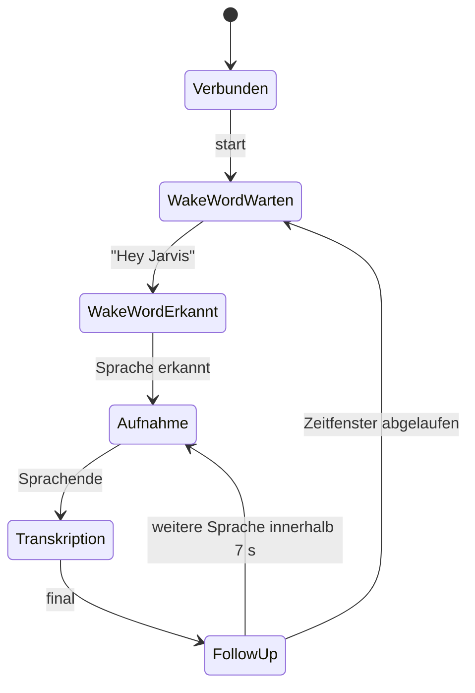

# Übergabespezifikation: VoiceSTT-Server für einen dauerhaften Desktop-Client

Diese Beschreibung kann als technische Grundlage direkt in das Desktop-Client-Projekt übernommen werden.

## 1. Ziel und Architektur

Der Desktop-Client soll dauerhaft im Hintergrund laufen, das lokale Mikrofon erfassen und Audio kontinuierlich an den zentralen VoiceSTT-Server übertragen.

Für Live-Audio wird ausschließlich der WebSocket-Endpunkt verwendet:

```text
wss://stt.voice.marcosudau.com/ws/transcribe
```

Der OpenAI-kompatible Endpunkt ist für vollständige Audiodateien beziehungsweise abgeschlossene Audiosegmente gedacht:

```text
POST https://stt.voice.marcosudau.com/v1/audio/transcriptions
```

Wichtig: `stream=true` am OpenAI-Endpunkt streamt Ergebnisse während der Verarbeitung einer bereits vollständig hochgeladenen Datei. Es ist kein bidirektionales Live-Mikrofonprotokoll. Für eine dauerhaft laufende Speech-to-Text-Lösung ist der WebSocket die richtige Schnittstelle.

`stt.voice.marcosudau.com` sollte als kanonischer Host verwendet werden. `voice.marcosudau.com` zeigt momentan ebenfalls auf das STT-UI, wird später aber als gemeinsame Oberfläche für STT und TTS dienen.

---

## 2. Aktueller Produktionsstand

| Eigenschaft | Aktueller Wert |
| --- | --- |
| Sprache | Deutsch, `de` |
| Betriebsmodus | ausschließlich CPU |
| Compute-Type | `int8` |
| Finale Engine | `kroko_onnx` |
| Finales Modell | `Kroko-DE-Community-64-L-Streaming-001.data` |
| Realtime-Engine | `kroko_onnx` |
| Realtime-Modell | dasselbe Kroko-Modell |
| Modellfreigabe | eine gemeinsam genutzte Modellinstanz |
| Wake-Word-Backend | OpenWakeWord |
| Wake Word | `hey_jarvis` |
| Wake-Word-Sensitivität | `0.5` |
| Wartezeit nach Wake Word | 7 Sekunden |
| Follow-up-Fenster | 7 Sekunden |
| Maximale WebSocket-Sitzungen | 8 |
| Gleichzeitig aktive Sprecher | 4 |
| Maximaler fortlaufender Audiopuffer | 30 Sekunden |
| Automatisches Modell-Entladen | nach 3600 Sekunden Inaktivität |
| Modell-Memory-Policy | aktiv |
| Zwei Medium-äquivalente Modelle | erlaubt |
| OpenAI-Dateilimit | 25 MiB |
| Serverversion | FastAPI-Anwendung `2.0.0` |

---

## 3. Öffentliche Endpunkte

### Ohne Authentifizierung

```text
GET /
GET /health
GET /api/config
GET /api/metrics
WS  /ws/transcribe
```

Bedeutung:

- `/` liefert die deutsche Browseroberfläche.
- `/health` liefert Bereitschaft, Sitzungszahlen, Scheduler- und Modellzustand.
- `/api/config` liefert öffentliche Konfiguration, Limits, Engines und Runtime-Vertrag.
- `/api/metrics` liefert Queue-, Latenz-, Drop- und Worker-Metriken.
- `/ws/transcribe` ist der Live-Audiokanal.

### OpenAI-API-Key erforderlich

```text
GET  /v1/models
POST /v1/audio/transcriptions
```

Header:

```http
Authorization: Bearer <VOICESTT_API_KEY>
```

### Admin-Key erforderlich

```text
PATCH /api/config

GET  /api/models
GET  /api/models/active
PUT  /api/models/active
GET  /api/models/lifecycle
PUT  /api/models/lifecycle
POST /api/models/load
POST /api/models/unload

GET  /api/language
PUT  /api/language

GET  /api/wake-word
PUT  /api/wake-word

GET  /api/logging
PUT  /api/logging

POST /api/config/validate
POST /api/config/reload
```

Bevorzugter Admin-Header:

```http
X-VoiceSTT-Admin-Key: <VOICESTT_ADMIN_API_KEY>
```

Alternativ akzeptiert die Admin-API:

```http
Authorization: Bearer <VOICESTT_ADMIN_API_KEY>
```

Der normale OpenAI-API-Key und der Admin-Key sind zwei unterschiedliche Secrets.

---

## 4. Wichtiger aktueller Sicherheitshinweis

Der WebSocket-Endpunkt besitzt momentan keine Authentifizierung. Eine Verbindung zu

```text
wss://stt.voice.marcosudau.com/ws/transcribe
```

kann aktuell ohne API-Key aufgebaut werden.

Die TLS-Verbindung ist verschlüsselt, aber die Nutzung des Live-STT-Endpunkts ist nicht durch einen Token geschützt. Die Kapazitätsgrenzen verhindern unbeschränkte Sitzungszahlen, ersetzen jedoch keine Authentifizierung.

Für einen persönlichen Desktop-Client funktioniert das bereits, vor einer breiteren Veröffentlichung sollte aber eine WebSocket-Authentifizierung ergänzt werden. Sinnvoll wäre eine Authentifizierungsnachricht unmittelbar nach dem Verbindungsaufbau oder ein kurzlebiges Session-Token. Ein dauerhafter Schlüssel sollte nicht als URL-Queryparameter übertragen werden, weil URLs häufig protokolliert werden.

Der Admin-Key sollte keinesfalls in einen gewöhnlichen Desktop-Build eingebettet werden. Administration und normale Transkription sollten getrennt bleiben.

---

## 5. WebSocket-Protokoll

### Verbindung aufbauen

```text
wss://stt.voice.marcosudau.com/ws/transcribe
```

Nach erfolgreicher Verbindung sendet der Server zunächst ein `hello`-Ereignis und anschließend ein `ready`-Ereignis.

Beispiel:

```json
{
  "type": "hello",
  "clientId": "966fc4a78c0c4000a3a8e61219656773",
  "sessionId": "966fc4a78c0c4000a3a8e61219656773",
  "settings": {},
  "limits": {},
  "supportedEngines": [],
  "runtimeSettings": {}
}
```

Danach:

```json
{
  "type": "ready",
  "sessionId": "966fc4a78c0c4000a3a8e61219656773",
  "ok": true,
  "models": {
    "state": "loaded",
    "loaded": true
  }
}
```

Jede Verbindung bekommt eine neue `sessionId`. Nach einem Reconnect darf die alte Sitzung nicht fortgesetzt oder mit der neuen Sitzung vermischt werden.

`ready` bedeutet, dass der Server die Sitzung bedienen kann. Falls die Modelle wegen Inaktivität entladen wurden, kann `ready` trotzdem erfolgreich sein und `models.loaded=false` enthalten. Das Modell wird dann bei der nächsten tatsächlichen Transkription automatisch geladen.

### Streaming starten

Vor dem ersten Audiopaket muss gesendet werden:

```json
{"type":"start"}
```

Mit aktivem Wake Word wechselt die Sitzung danach normalerweise in:

```json
{
  "type": "status",
  "state": "wakeword_wait"
}
```

Der Client muss danach weiterhin kontinuierlich Mikrofon-Audio senden. Die Wake-Word-Erkennung findet serverseitig im eingehenden Audiostrom statt.

### Streaming stoppen

```json
{"type":"stop"}
```

Dadurch wird die Sitzung in den Zustand `idle` versetzt und noch gepuffertes Audio verarbeitet beziehungsweise geleert. Anschließend werden neue Audiopakete abgelehnt, bis erneut `start` gesendet wird.

Die WebSocket-Verbindung kann dabei geöffnet bleiben.

### Sitzung zurücksetzen

```json
{"type":"clear"}
```

Das löscht nur den Transkriptionszustand der aktuellen Sitzung:

- aktuelle Segmente werden verworfen,
- ausstehende Sitzungsaufgaben werden abgebrochen,
- Segmentnummerierung wird zurückgesetzt,
- der Server antwortet mit einem `clear`-Ereignis.

Beispiel:

```json
{
  "type": "clear",
  "sessionId": "...",
  "nextSegmentId": 1
}
```

### Keepalive

Anwendungs-Ping:

```json
{"type":"ping"}
```

Antwort:

```json
{
  "type": "pong",
  "sessionId": "...",
  "serverTime": 1784527000.123
}
```

Zusätzlich können normale WebSocket-Ping/Pong-Frames verwendet werden.

Empfehlung:

- Anwendungs-Ping alle 20–30 Sekunden.
- Keine Verbindung allein wegen eines fehlenden Transkripts als defekt betrachten.
- Verbindungsabbruch anhand ausbleibender Pong-Antworten, WebSocket-Fehlern oder TCP/TLS-Abbruch erkennen.

Ein Ping hält die Netzwerkverbindung offen, verhindert aber nicht das automatische Entladen der Modelle.

### Sitzungsmetriken anfordern

```json
{"type":"metrics"}
```

Antwort:

```json
{
  "type": "metrics",
  "sessionId": "...",
  "metrics": {
    "streaming": true,
    "recording": false,
    "state": "wakeword_wait",
    "currentSegmentId": 1,
    "recordingSeconds": 0.0,
    "droppedAudioChunks": 0,
    "rejectedAudioChunks": 0,
    "coalescedRealtime": 0,
    "staleRealtimeDiscarded": 0
  }
}
```

---

## 6. Binäres Audioformat

Audiopakete werden als binäre WebSocket-Nachrichten gesendet.

Aufbau eines Pakets:

```text
4 Byte   Metadatenlänge als UInt32 Little Endian
N Byte   UTF-8-codiertes JSON
Rest     PCM-S16LE-Audiodaten
```

Metadaten:

```json
{
  "sampleRate": 16000,
  "channels": 1,
  "format": "pcm_s16le",
  "frames": 512
}
```

Felder:

- `sampleRate`: positive Ganzzahl.
- `channels`: positive Ganzzahl, maximal 8.
- `format`: momentan ausschließlich `pcm_s16le`.
- `frames`: Anzahl der Frames pro Kanal; muss zur Nutzdatenlänge passen.

Die PCM-Daten sind:

- signed 16-Bit Integer,
- Little Endian,
- interleaved, falls mehrere Kanäle vorhanden sind.

Der Server:

- akzeptiert unterschiedliche Eingangssampleraten,
- mischt Mehrkanal-Audio auf Mono herunter,
- resampelt intern auf 16 kHz,
- verarbeitet intern Mono-PCM.

Empfohlen wird dennoch direkt:

```text
16.000 Hz
Mono
16-Bit PCM Little Endian
```

Damit entfällt unnötiges Resampling.

### Empfohlene Paketgröße

Empfehlung für den Desktop-Client:

- 20–40 Millisekunden pro Audiopaket.
- Bei 16 kHz beispielsweise 512 Frames = 32 ms.
- Pakete ungefähr in Echtzeit senden, nicht minutenweise puffern und anschließend gesammelt übertragen.

Bei 16 kHz Mono PCM16:

```text
512 Frames × 2 Byte = 1024 Byte Audiodaten
```

Die maximale binäre Audio-Nutzlast ist aktuell 524.288 Byte. Kleine Echtzeitpakete sind wesentlich sinnvoller.

### Beispiel zur Paketerstellung

TypeScript-artiges Beispiel:

```ts
function buildAudioPacket(
  pcmBytes: Uint8Array,
  sampleRate: number,
  channels: number,
  frames: number
): ArrayBuffer {
  const metadata = {
    sampleRate,
    channels,
    format: "pcm_s16le",
    frames
  };

  const metadataBytes = new TextEncoder().encode(JSON.stringify(metadata));
  const packet = new ArrayBuffer(4 + metadataBytes.length + pcmBytes.length);
  const view = new DataView(packet);

  view.setUint32(0, metadataBytes.length, true);

  new Uint8Array(packet, 4, metadataBytes.length).set(metadataBytes);
  new Uint8Array(packet, 4 + metadataBytes.length).set(pcmBytes);

  return packet;
}
```

---

## 7. Serverereignisse

### `realtime`

Ein vorläufiges, veränderliches Transkript:

```json
{
  "type": "realtime",
  "sessionId": "...",
  "segmentId": 3,
  "text": "Dies ist ein deutscher",
  "timestamp": 1784527000.123,
  "timestampIso": "2026-07-20T06:21:40.123Z"
}
```

Wichtig:

- `text` ist normalerweise ein vollständiger aktueller Zwischenstand, kein reines Textdelta.
- Ein neueres `realtime`-Ereignis mit derselben `segmentId` ersetzt den vorherigen sichtbaren Text dieses Segments.
- Zwischenstände dürfen sich ändern.
- Realtime-Text sollte noch nicht dauerhaft als endgültiger Text eingefügt werden.

Je nach Stabilisierungskonfiguration können zusätzliche Felder vorkommen:

```text
rawText
displayText
stableText
stableDelta
unstableText
consensusText
consensusDisplayText
sequence
recordingId
timing
```

Der Client sollte unbekannte Felder tolerieren. Für die einfache Darstellung reichen `sessionId`, `segmentId` und `text`.

### `final`

Das verbindliche Endergebnis eines Segments:

```json
{
  "type": "final",
  "sessionId": "...",
  "segmentId": 3,
  "text": "Dies ist ein deutscher Test für die Spracherkennung.",
  "timestamp": 1784527002.456,
  "timestampIso": "2026-07-20T06:21:42.456Z"
}
```

Empfohlenes Clientverhalten:

1. Alle `realtime`-Ereignisse derselben `segmentId` nur als Vorschau anzeigen.
2. Bei `final` die Vorschau dieses Segments ersetzen.
3. Erst `final.text` dauerhaft speichern, in die Zwischenablage legen oder in eine Zielanwendung einfügen.
4. Segmente immer über `sessionId + segmentId` identifizieren.

### `status`

Beispiel:

```json
{
  "type": "status",
  "sessionId": "...",
  "state": "recording",
  "activeClientId": "...",
  "queueDepth": 1.25,
  "droppedChunks": 0,
  "coalescedRealtime": 2,
  "staleRealtimeDiscarded": 0,
  "activeSessions": 2,
  "activeSpeakers": 1,
  "wakeWordEnabled": true
}
```

Mögliche Zustände umfassen unter anderem:

```text
idle
listening
wakeword_wait
wakeword_detected
wakeword_timeout
voice
silence
recording
transcribing
closed
```

### `timeline`

Detaillierte Ablaufereignisse:

```json
{
  "type": "timeline",
  "sessionId": "...",
  "event": "recording_started",
  "segmentId": 3,
  "timestamp": 1784527000.0,
  "timestampIso": "2026-07-20T06:21:40.000Z",
  "segment": {}
}
```

Relevante Timeline-Ereignisse:

```text
wakeword_wait_started
wakeword_wait_ended
wakeword_detected
wakeword_timeout
wakeword_followup_started
wakeword_followup_timeout
recording_started
recording_ended
realtime_transcript
transcription_started
final_transcript
```

Diese Ereignisse sind für Statusanzeigen, Debugging und Latenzmessungen hilfreich. Die eigentliche Textverarbeitung sollte sich jedoch primär auf `realtime` und `final` stützen.

### `warning`

Ein behebbares Problem:

```json
{
  "type": "warning",
  "sessionId": "...",
  "message": "Die maximale Anzahl gleichzeitig sprechender Personen ist erreicht."
}
```

Warnungen können beispielsweise auftreten bei:

- ausgelasteter Realtime-Queue,
- verworfenen Zwischenständen,
- zu vielen gleichzeitig sprechenden Sitzungen,
- erzwungener Finalisierung eines langen Segments.

Die Verbindung muss deshalb nicht sofort getrennt werden.

### `error`

```json
{
  "type": "error",
  "sessionId": "...",
  "where": "audio_packet",
  "message": "Es werden nur pcm_s16le-Audiopakete unterstützt"
}
```

Mögliche Werte für `where`:

```text
admission
audio_packet
audio
command
scheduler
realtime
final
recorder
```

Fehler sollten protokolliert und anhand des Bereichs behandelt werden. Nicht jeder Fehler erfordert einen Reconnect.

---

## 8. Wake-Word-Verhalten

Wake Word ist derzeit global aktiviert:

```text
Backend: OpenWakeWord
Wake Word: hey_jarvis
Sensitivität: 0.5
```

Nach `start` muss der Client kontinuierlich Mikrofon-Audio übertragen.

Typischer Ablauf:



Nach erkanntem Wake Word wartet der Server bis zu sieben Sekunden auf Sprache. Nach einer abgeschlossenen Äußerung bleibt ein Follow-up-Fenster von sieben Sekunden geöffnet. Innerhalb dieses Zeitraums kann ohne erneutes „Hey Jarvis“ weitergesprochen werden.

Eine Änderung über `PUT /api/wake-word` ist global und gilt für neue Sitzungen. Sie ist keine private Einstellung einer einzelnen Desktop-Verbindung.

Wenn der Desktop-Client ohne Wake Word dauerhaft diktieren soll, gibt es momentan zwei Möglichkeiten:

- Wake Word global über die Admin-API deaktivieren und danach die WebSocket-Sitzung neu verbinden.
- Später eine per-session Wake-Word-Option in das WebSocket-Protokoll aufnehmen.

Die zweite Variante wäre langfristig sauberer, falls Browser, Desktop-Client und andere Benutzer unterschiedliche Verhaltensweisen benötigen.

---

## 9. Kapazitäten und Gleichzeitigkeit

Der Server erlaubt aktuell:

```text
8 gleichzeitig offene WebSocket-Sitzungen
4 gleichzeitig aktive Sprecher
```

Eine dauerhaft offene, aber schweigende Desktop-Verbindung belegt eine der acht Sitzungen. Sie zählt nicht dauerhaft als aktiver Sprecher.

Wenn das Sitzungslimit erreicht ist:

- Der WebSocket wird zunächst angenommen.
- Der Server sendet:

```json
{
  "type": "error",
  "where": "admission",
  "message": "Der Server hat das konfigurierte Sitzungslimit erreicht.",
  "limits": {}
}
```

- Danach schließt der Server mit WebSocket-Code `1013`.

Bei `1013` sollte der Desktop-Client nicht aggressiv reconnecten, sondern beispielsweise 30–60 Sekunden warten.

Wenn vier andere Sitzungen bereits aktiv sprechen, bleibt die Verbindung bestehen, aber Audio kann mit einer Warnung verworfen werden.

Realtime- und finale Transkription laufen über getrennte Scheduler-Aufgabentypen. Die Modelle werden serverweit geteilt und nicht pro Desktop-Client geladen.

---

## 10. Reconnect-Strategie für einen dauerhaften Client

Empfohlene Staffelung:

```text
1 s → 2 s → 4 s → 8 s → 15 s → 30 s
```

Dazu etwa ±20 % Zufallsabweichung, damit mehrere Clients nicht gleichzeitig reconnecten.

Nach einer längeren stabilen Verbindung sollte der Zähler wieder auf 1 Sekunde zurückgesetzt werden.

Sonderbehandlung:

- Close-Code `1013`: 30–60 Sekunden warten.
- DNS-/TLS-Fehler: exponentiell weiter versuchen.
- Netzwerkwechsel oder Windows-Resume: sofort einen neuen Versuch starten.
- Serverfehler während einer bestehenden Sitzung: Verbindung schließen und sauber neu aufbauen.
- Normales Programmende: `stop` senden und danach WebSocket schließen.

Nach jedem Reconnect:

1. Alte `sessionId` verwerfen.
2. Lokalen Realtime-Vorschautext der alten Sitzung abschließen oder entfernen.
3. Auf `hello` und möglichst `ready` warten.
4. `start` senden.
5. Neue Audiopakete übertragen.
6. Altes Audio nicht minutenlang nachsenden.

Der Client sollte während eines Verbindungsabbruchs höchstens einen sehr kleinen lokalen Ringpuffer behalten, beispielsweise 0,5–1 Sekunde. Größere alte Audiomengen sollten verworfen werden, weil sie nicht mehr zum aktuellen Live-Zeitpunkt passen.

Es existiert kein serverseitiges Session-Resume und keine Paket-ACK-Nummerierung.

---

## 11. Lokale Audiopufferung und Backpressure

Der Client sollte zusätzlich überwachen:

- Größe seiner lokalen ausgehenden WebSocket-Queue.
- `bufferedAmount` beziehungsweise das entsprechende Merkmal der verwendeten WebSocket-Bibliothek.
- `status.queueDepth`.
- `droppedChunks`.
- `coalescedRealtime`.
- `staleRealtimeDiscarded`.
- eingehende `warning`-Ereignisse.

Wenn die lokale Queue deutlich anwächst:

- nicht unbegrenzt Audio im RAM sammeln,
- vorzugsweise älteste noch nicht übertragene Live-Pakete verwerfen,
- sichtbaren Zustand „Verbindung zu langsam“ setzen,
- gegebenenfalls neu verbinden.

Der Server finalisiert ein fortlaufendes Segment spätestens nach ungefähr 30 Sekunden, um unbegrenzt wachsende Audiopuffer zu verhindern.

---

## 12. Modell-Entladen und Cold Start

Modelle werden nach 3600 Sekunden ohne Modellaktivität automatisch aus dem RAM entladen.

Wichtig für einen dauerhaft verbundenen Desktop-Client:

- Eine offene, schweigende WebSocket-Verbindung verhindert das Entladen nicht.
- `ping` verhindert das Entladen ebenfalls nicht.
- Laufende oder aktive Transkriptionen verhindern ein gleichzeitiges Entladen.
- Beim nächsten echten Transkriptionsauftrag werden die Modelle automatisch wieder geladen.
- Der erste Text nach einem Cold Start kann dadurch ungefähr 7–10 Sekunden länger dauern.

Der Zustand kann abgefragt werden über:

```text
GET /api/models/lifecycle
```

Dieser Endpunkt erfordert jedoch den Admin-Key.

Manuelles Laden:

```http
POST /api/models/load
X-VoiceSTT-Admin-Key: ...
```

Manuelles Entladen:

```http
POST /api/models/unload
X-VoiceSTT-Admin-Key: ...
```

Ein normaler Desktop-Client sollte nicht pauschal den Admin-Key enthalten. Wenn später ein „STT jetzt aufwecken“-Knopf ohne Admin-Rechte gewünscht ist, wäre ein eingeschränkter, separat authentifizierter Warmup-Endpunkt sinnvoll.

---

## 13. OpenAI-kompatibler Dateiendpunkt

### Request

```http
POST /v1/audio/transcriptions
Authorization: Bearer <VOICESTT_API_KEY>
Content-Type: multipart/form-data
```

Pflichtfelder:

```text
file
model
```

Unterstützte Audiodateien:

```text
flac
mp3
mp4
mpeg
mpga
m4a
ogg
wav
webm
```

Maximale Größe:

```text
26.214.400 Byte / 25 MiB
```

Unterstützte Parameter:

```text
model
language
prompt
response_format
temperature
timestamp_granularities
stream
include
threshold
known_speaker_names
known_speaker_references
```

Unterstützte `response_format`-Werte:

```text
json
text
srt
verbose_json
vtt
diarized_json
```

Zeitstempelgranularitäten:

```text
segment
word
```

Andere Granularitäten als der Standard `segment` erfordern `response_format=verbose_json`.

`include` unterstützt:

```text
logprobs
```

### Modellrouting

Standardkompatibilität:

```text
model=whisper-1
```

wird auf das geladene Final-Modell geroutet.

Aktuelle Aliasse:

```text
whisper-1 → final
fast      → realtime
```

Da final und realtime momentan dasselbe Kroko-Modell verwenden, führen beide aktuell zur gleichen physischen Modellinstanz.

Falls ein Fremdprogramm zwingend `model=whisper-1` sendet, kann das tatsächlich gewünschte Modell zusätzlich angegeben werden.

Über Header:

```http
X-VoiceSTT-Model: <Modellname oder Alias>
```

Oder als Multipart-Feld:

```text
voicestt_model=<Modellname oder Alias>
```

Ebenfalls akzeptiert:

```text
model_override=<Modellname oder Alias>
```

Eine Überschreibung ist absichtlich nur erlaubt, wenn das offizielle `model`-Feld `whisper-1` enthält.

Antwortheader informieren über das tatsächliche Routing:

```text
X-Request-ID
X-VoiceSTT-Requested-Model
X-VoiceSTT-Resolved-Model
X-VoiceSTT-Route
X-VoiceSTT-Override-Model
X-VoiceSTT-Override-Source
```

### Normale JSON-Antwort

```json
{
  "text": "Dies ist ein deutscher Test.",
  "usage": {
    "type": "duration",
    "seconds": 4
  }
}
```

### SSE mit `stream=true`

Mögliche Delta-Nachricht:

```text
data: {"type":"transcript.text.delta","delta":"Dies ist"}
```

Abschluss:

```text
data: {"type":"transcript.text.done","text":"Dies ist ein deutscher Test.","usage":{"type":"duration","seconds":4}}
```

Wichtig:

- Deltas sind optional.
- Kroko kann je nach Transkriptionsweg nur das abschließende `done` liefern.
- Der Client muss deshalb immer `transcript.text.done` auswerten.
- Der Server sendet momentan kein zusätzliches `data: [DONE]`.
- Das Ende wird durch das `done`-Ereignis und anschließend das Ende des HTTP-Streams signalisiert.

### Diarisierung

`diarized_json` wird aus Kompatibilitätsgründen angenommen. Die derzeit geladenen ASR-Modelle besitzen aber kein echtes Diarisierungsmodell. Die Antwort wird daher als Single-Speaker-Kompatibilitätsantwort gekennzeichnet.

Darauf sollte der Desktop-Client keine echte Sprechertrennung aufbauen.

---

## 14. Administrative Modellwechsel

Aktive Modelle:

```text
GET /api/models/active
```

Modell wechseln:

```text
PUT /api/models/active
```

Ein Modellwechsel ist nur möglich, wenn keine WebSocket-Sitzung aktiv ist. Ein dauerhaft verbundener Desktop-Client muss sich deshalb vor einem globalen Modellwechsel trennen.

Andernfalls antwortet der Server mit HTTP `409`.

Das ist absichtlich so, damit Recorder-Sitzungen und Modellworker nicht während einer laufenden Verbindung gegeneinander ausgetauscht werden.

Wake-Word- und Sprachänderungen gelten für neue Sitzungen beziehungsweise neue Anfragen. Nach solchen Änderungen sollte der Desktop-Client reconnecten.

---

## 15. Logging und Datenschutz

Aktueller Serverzustand:

- Request-Logging aktiv.
- Performance-Logging aktiv.
- Logs werden nach stdout geschrieben und sind in Dozzle sichtbar.
- Zusätzlich rotierende JSONL-Dateien im persistenten Data-Volume.
- Transkripttexte werden protokolliert.
- Audiodateien werden nicht dauerhaft gespeichert.
- `save_audio_files=false`.

Der Desktop-Client sollte daher davon ausgehen, dass erkannte Texte serverseitig in Betriebslogs auftauchen können, das rohe Mikrofon-Audio aber momentan nicht archiviert wird.

Für besonders sensible Inhalte könnte später ein Konfigurationsprofil mit deaktiviertem Transcript-Logging vorgesehen werden.

---

## 16. Empfohlene interne Desktop-Client-Komponenten

Eine robuste Implementierung sollte mindestens diese getrennten Bausteine haben:

1. **AudioCapture**

   Verwaltet Mikrofon, Gerätewechsel, Windows-Suspend/Resume und PCM-Konvertierung.

2. **AudioFramer**

   Erzeugt 20–40-ms-Pakete und baut das binäre Serverformat.

3. **ConnectionSupervisor**

   Verwaltet WebSocket, Keepalive, Reconnect und Zustandswechsel.

4. **SessionController**

   Sendet `start`, `stop`, `clear`, `ping` und `metrics`.

5. **TranscriptReducer**

   Verarbeitet `sessionId + segmentId`, ersetzt Realtime-Vorschauen und übernimmt finale Texte.

6. **BackpressureController**

   Überwacht lokale Sendepuffer und verwirft bei Bedarf veraltetes Live-Audio.

7. **HealthMonitor**

   Fragt `/health` ab und zeigt Modell-, Server- und Kapazitätszustände.

8. **SecureSecretStore**

   Speichert gegebenenfalls den normalen OpenAI-Key über Windows Credential Manager oder DPAPI. Der Admin-Key gehört nicht in den normalen Client.

9. **LocalAuditLog**

   Protokolliert Verbindungsabbrüche, Close-Codes, Warnungen und Latenzen, jedoch standardmäßig kein Roh-Audio.

---

## 17. Empfohlene Zustandslogik im Client

Der Client sollte ungefähr diese eigenen Zustände führen:

```text
disabled
connecting
connected
waiting_for_ready
wakeword_wait
listening
recording
transcribing
reconnecting
server_busy
microphone_error
offline
```

Die Oberfläche kann daraus beispielsweise ableiten:

- Grau: deaktiviert.
- Gelb: verbindet oder Modell lädt.
- Blau: wartet auf Wake Word.
- Rot: Aufnahme läuft.
- Violett: finale Transkription läuft.
- Grün: bereit.
- Orange: Server ausgelastet.
- Dunkelrot: Mikrofon-/Netzwerkfehler.

---

## 18. Mindesttests für das Desktop-Projekt

Vor einer Freigabe sollte der Client mindestens real testen:

- 30 Minuten kontinuierliche Mikrofonübertragung.
- Mehrere Wake-Word-Erkennungen hintereinander.
- Follow-up-Sprache ohne erneutes Wake Word.
- WLAN-Ausfall und automatischer Reconnect.
- Serverneustart während einer aktiven Verbindung.
- Windows-Standby und Resume.
- Mikrofonwechsel im laufenden Betrieb.
- Mikrofon wird entfernt und später wieder angeschlossen.
- WebSocket-Code `1013`.
- Vier gleichzeitig sprechende Testclients.
- Realtime und final für dieselbe `segmentId`.
- Cold Start nach entladenem Modell.
- Sehr lange Sprache über 30 Sekunden.
- Lokale Sendepufferung bei langsamer Verbindung.
- Keine Vermischung alter und neuer `sessionId`.
- Keine dauerhafte Speicherung unfertiger Realtime-Texte.
- OpenAI-Dateitranskription parallel zur WebSocket-Sitzung.

---

### Referenzimplementierung im Repository

Die maßgeblichen Stellen sind:

- [WebSocket- und API-Server](api_fastapi_server/server.py)
- [Binäres Audioprotokoll](api_fastapi_server/protocol.py)
- [OpenAI-Anfrage- und Antwortformat](VoiceSTT_server/openai_compat.py)
- [Dokumentation des FastAPI-Servers](docs/fastapi-server.md)
- [Realer Paralleltest](tools/validate_parallel_realtime.py)
- [Zentrale Konfiguration](config.yaml)

Der wichtigste Designpunkt für das Desktop-Projekt ist: eine einzige langlebige WebSocket-Sitzung, kontinuierliches kleines PCM-Audio, Realtime-Texte nur als ersetzbare Vorschau und ausschließlich `final` als dauerhaftes Ergebnis.
